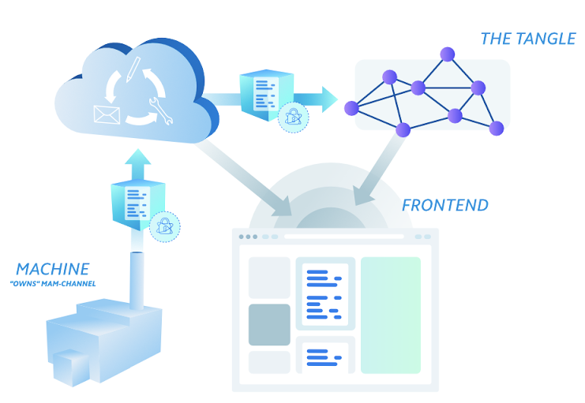

# アプリケーションアーキテクチャ
<!-- # Application architecture -->

**データマーケットプレイスアプリケーションは，センサー，クラウドバックエンド，および IOTA タングルを使用してデータを MAM チャネルに公開します．**
<!-- **The Data Marketplace application uses sensors, a cloud backend, and the IOTA Tangle to publish data to MAM channels.** -->

:::warning:免責事項
人間の努力のように，オープンソースプロジェクトを実行することは，不確実性とトレードオフを伴います．以下に説明するアーキテクチャが，同様のシステムを展開するのに役立つことを願っていますが，間違いが含まれている可能性があり，すべての状況に対処することはできません．あなたのプロジェクトについて何か質問があれば，IOTA 財団はあなたがあなた自身の研究をし，専門家を探し，そして IOTA コミュニティとそれらを話し合うことを奨励します．
:::
<!-- :::warning:Disclaimer -->
<!-- Running an open source project, like any human endeavor, involves uncertainty and trade-offs. We hope the architecture described below helps you to deploy similar systems, but it may include mistakes, and can’t address every situation. If you have any questions about your project, we encourage you to do your own research, seek out experts, and discuss them with the IOTA community. -->
<!-- ::: -->

この設計図では，センサーやクラウドバックエンドなどのデバイスがタングルを介して相互接続される次のアーキテクチャを使用しています．
<!-- This blueprint uses the following architecture whereby the devices such as sensors and the cloud backend are interconnected through the Tangle. -->

## 基本的要素
<!-- ## Building blocks -->

データマーケットプレイスへのセンサーデータの送信は，組み込みデバイスで実行できる軽量の操作を目的としています．センサーデータを送信するには，デバイスは MAM チャネルの作成と使用，Web API との通信などのタングル操作を実行する必要があります．アプリケーションのデータ消費部分はより複雑であり，デバイスのデータストリームへのアクセスと引き換えに IOTA トークンを転送する機能が必要です．そのため，アクセス権管理アドオンが実装されています．
<!-- Submitting sensor data to the Data Marketplace is intended to be a lightweight operation that can be done by embedded devices. To submit sensor data, a device needs to perform Tangle operations, such as producing and consuming MAM channels, and communicating with web APIs. The data consuming part of the application is more complex and needs the ability to transfer IOTA tokens in exchange for access to the device's data streams. Therefore, an access-rights management add-on is implemented. -->

以下の表には，アプリケーションの主要コンポーネントのリストが表示されます．
<!-- This table displays a list of the main components of the application: -->

| **コンポーネント** | **説明** |
| :----------------- | :------- |
| ユーザー認証 | Google アカウントでの OAuth，電子メール/パスワードなどの他の種類の認証を有効にできます． API 通信およびユーザー識別に使用される固有の API トークンおよびユーザー ID を提供します． |
| データーベース | NoSQL クラウドデータベースは，恒久的なストレージメカニズムを提供します． |
| クラウドファンクション | イベントまたは API 呼び出しによってトリガーされるクラウドファンクション（AWS の Lambda 関数）．壁付資金，デバイスストリーム購入のためのトークン転送などの IOTA タングル関連の操作を実行します．使用済みまたはデバイスの作成，デバイスストリーム購入の管理などのデータベース関連の操作も実行します． |
| ホスティング | Web ポータルのクラウドホスティング． |
| エラーログ | 問題の調査を簡単にするために，リクエストとレスポンスの詳細を含むエラーログへのアクセスを提供します． |
| Web ポータル | 簡単なデバイス管理とデータストリームの取得を可能にする Web UI． |
| API | スクリプトまたはコンソールからすべての主要機能を実行するための API のセット． |
| データ送信テンプレート | クラウドバックエンドへの事前に入力されたデバイス ID と API インターフェースを持つ小型 NodeJS プロジェクト．さまざまな手法を使用したセンサーデータ送信の例を示します． |

### クラウドバックエンド
<!-- ### Cloud backend -->

アプリケーションのクラウド部分は集中化されています．Google Cloud Platform で実行され，オプションで Amazon AWS または Microsoft Azure で実行できます．
<!-- The cloud part of the application is centralized. It runs on Google Cloud Platform, and can optionally run on Amazon AWS or Microsoft Azure. -->

このバックエンドには，デバイスを管理し，デバイスがデータを送信する MAM チャネルを監視できる [API](https://data.iota.org/static/docs) があります．
<!-- This backend has an [API](https://data.iota.org/static/docs) that allows you to manage devices and monitor the MAM channels to which devices send their data. -->

#### クラウドファンクション
<!-- #### Cloud functions -->

API はクラウドファンクションをトリガーします．これにより，以下を構成できます．
<!-- The API triggers cloud functions, which allow you to configure the following: -->

- [`depth`](root://getting-started/0.1/transactions/depth.md)
- [`minWeightMagnitude`](root://getting-started/0.1/network/minimum-weight-magnitude.md)
- ホワイトリストページ．事前定義された電子メールアドレスを持つ管理者ユーザーがデバイスを管理できます．
<!-- - Whitelist page, where administrator users with predefined email addresses are allowed to administer devices -->

### センサー MAM チャネル
<!-- ### Sensor MAM channel -->

データマーケットプレイスのデバイスは通常，MAM チャネルを通じてデータをタングルに公開するセンサーです．
<!-- The device in the Data Marketplace are usually sensors that publish their data to the Tangle through MAM channels. -->

#### データフィールド
<!-- #### Data fields -->

センサーごとに，正しいデータフィールドを定義する必要があります．これは，タングルに保存され，購入者のデータマーケットプレイス Web ポータルに表示されます．一般に，保存および販売するデータを説明するだけです．
<!-- For each of your sensors, you have to define the correct data fields, which will be stored on the Tangle, and displayed on the Data Marketplace web portal for the purchaser. In general, just be descriptive with the data that you want to store and sell. -->

#### センサー例
<!-- #### Example sensors -->

- [Netatmo Weather Station](https://www.netatmo.com/en-us/weather)
- [Bosch XDK](https://xdk.bosch-connectivity.com/)
- [Nordic Semiconductor Thingy:52](https://www.nordicsemi.com/Software-and-Tools/Development-Tools/Nordic-Thingy-52-App)
- [Raspberry Pi with a sensor kit](https://www.adafruit.com/product/2733)
