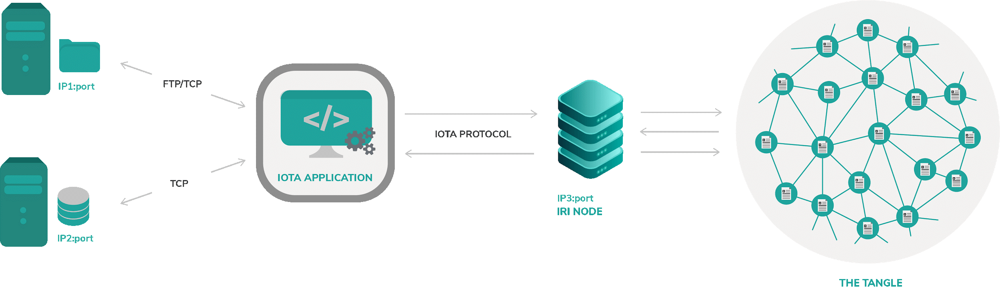

# アプリケーションアーキテクチャ
<!-- # Application architecture -->

**ドキュメントの不変性アプリケーションは、Reactで書かれたグラフィカルユーザーインターフェース（GUI）とNodeJSで書かれたバックエンドAPIの2つの部分から構成されています。**
<!-- **The Document immutability application consists of two parts: A graphical user interface (GUI), written in React and a back-end API, written in NodeJS.** -->

:::warning:免責事項
人間の努力のように、オープンソースプロジェクトを実行することは、不確実性とトレードオフを伴います。以下に説明するアーキテクチャが、同様のシステムを展開するのに役立つことを願っていますが、間違いが含まれている可能性があり、すべての状況に対処することはできません。あなたのプロジェクトについて何か質問があれば、IOTA財団はあなたがあなた自身の研究をし、専門家を探し、そしてIOTAコミュニティとそれらを話し合うことを奨励します。
:::
<!-- :::warning:Disclaimer -->
<!-- Running an open source project, like any human endeavor, involves uncertainty and trade-offs. We hope the architecture described below helps you to deploy similar systems, but it may include mistakes, and can’t address every situation. If you have any questions about your project, we encourage you to do your own research, seek out experts, and discuss them with the IOTA community. -->
<!-- ::: -->

## 説明書と技術的概念
<!-- ## Instructions and technical concepts -->

このプロジェクトはある程度のプログラミング知識を前提としています。
<!-- This projects assumes some level of programming knowledge. -->

- [PoCソースコード](https://github.com/iotaledger/poc-document-immutable-blueprint)
<!-- - [PoC source code](https://github.com/iotaledger/poc-document-immutable-blueprint) -->
- [存在証明ライブラリー](https://www.npmjs.com/package/@iota/poex-tool)
<!-- - [Proof of existence library](https://www.npmjs.com/package/@iota/poex-tool) -->

下の図はシステムコンポーネントの実例です：
<!-- Here is an illustration of the system components: -->



### ファイルストレージ
<!-- ### File storage -->

ドキュメントを保存するためのデータベースです。ユーザーやサードパーティが保守することができます（Googleドライブ、D2ropboxなど）。通常は拡張性と開発のスピードが速いため、サービスとして提供するほうがよいでしょう。
<!-- A database for storing documents, it can be either maintained by the user or a third party provided as a service like (Google drive, D2ropbox etc..), usually for scalability and faster development reasons, better to have it as a service. -->

### データーベース
<!-- ### Database -->

これはMariaDB、postgreSQLなどの一般的に使用されるDBです。主な役割は、保存されたファイルへの参照/リンクを永続化することです。これらの参照がないと、（実際のデータへのリンクが失われた場合）保存されたファイルは永久に失われます。
<!-- This can be a commonly used DB like MariaDB, postgreSQL etc. -->
<!-- The main role is to persist references/link to the stored file. Without these references the stored files are lost forever (in case of a lost link to the actual data). -->

### IOTAアプリケーション
<!-- ### IOTA Application -->

これが私たちのアプリケーションロジックが存在するところです。IOTAアプリケーションはすべてのアプリケーションコンポーネントと対話することに対して責任があるアプリを含みます。たとえば、ハッシュ値とドキュメントIDの生成、ドキュメントのファイルストレージへの格納、postgreSqlを使用したデータベース内のデータの永続化、そしてそれをタングルへの公開などです。アプリケーション層は、ドキュメントの不変性をチェックする役割も果たします。
<!-- This is where our application logic resides, it contains an app that is responsible for interacting with all application components. For example, Generating Hash and Document ID, storing the document in the file storage, persisting data in the Database using postgreSql then publishing it to the Tangle. -->
<!-- The application layer is also the one responsible for checking the document immutability. -->

### タングル
<!-- ### The Tangle -->

タングルはIOTAエコシステムの技術的実現の鍵です。このPoCの範囲では、タングルはすべてのドキュメント署名を保持して公開し、その不変性をチェックするための真の情報源として使用します。タングルを使用するには、IRIノードに接続する必要があります。IRIノードからデータが拡散され、他のノードに複製されます。
<!-- The Tangle is the technology enabler for IOTA ecosystem, in this PoC scope, we are going to use it as a source of truth to hold and expose all the document signatures to check their immutability. -->
In order to use the Tangle you have to connect an IRI node, from there your data is spread and duplicated into other nodes.

## 前提条件
<!-- ## Prerequisites -->

- ハードウェア
  <!-- - Hardware -->
    - このアプリをスムーズに実行できるプロセッサ。携帯電話も含まれます。
    <!-- - Any processor able to run this app smoothly, included mobile phones. -->
- ソフトウェア
  <!-- - Software -->
    - Node.js 8+
    - サポートしているブラウザ（Chrome、Firefox）
    <!-- - Any supported Browser (Chrome, Firefox) -->
    - IOTA.js
    - GoogleドライブやDropboxのようなストレージサービス
    <!-- - Storage service like Google Drive or Dropbox -->
    - データベース（ローカルPostgresまたはFirebaseのようなオンラインデータベース）
    <!-- - Database (either locally postgres or online like Firebase) -->
- 使用するプログラミング言語
  <!-- - Programming language(s) used: -->
    - Javascript
    - HTML/CSS
- 必要なサードパーティライセンス
  <!-- - Required 3rd party licenses -->
    - Apache 2.0、MIT。通常IOTA財団のライブラリIOTA.JSによって継承されます。
    <!-- - Apache 2.0, MIT, usually inherited by our libraries IOTA.JS -->
- IOTAの知識
  <!-- - IOTA knowledge -->
  - 中級程度のJavaScriptの知識
  <!-- - Intermediate Javascript knowledge -->
  - IOTA.JSを使用してメタデータを含むトランザクションを送信方法を理解する
  <!-- - Understanding how to send Transaction with Metadata using IOTA.JS -->
- パートナーの知識
  <!-- - Partner knowledge -->
  - 0トークントランザクションを送信する
  <!-- - Sending 0 value Transactions. -->
  - データベースの使い方（オプション）
  <!-- - How to use databases (optional) -->
  - GoogleドライブAPIの使い方（オプション）
  <!-- - How to use Google drive APIs (optional) -->

### デプロイ
<!-- ### Deployment -->

デプロイ方法に制限はありません。オンラインサービス（GoogleドライブやFirebaseなど）を使用して完全に実行することも、自身のサーバー上で完全に実行することもできます。
<!-- There is no restriction on the manner of deployment, you can run this completely using online services (e.g. Google drive and Firebase) or completely on your own server - depending on your needs you might choose one or another. -->

:::warning:免責事項
人間の努力のように、オープンソースプロジェクトを実行することは、不確実性とトレードオフを伴います。以下に説明するアーキテクチャが、同様のシステムを展開するのに役立つことを願っていますが、間違いが含まれている可能性があり、すべての状況に対処することはできません。あなたのプロジェクトについて何か質問があれば、IOTA財団はあなたがあなた自身の研究をし、専門家を探し、そしてIOTAコミュニティとそれらを話し合うことを奨励します。
:::
<!-- :::warning:Disclaimer -->
<!-- Running an open source project, like any human endeavor, involves uncertainty and trade-offs. We hope the architecture described below helps you to deploy similar systems, but it may include mistakes, and can’t address every situation. If you have any questions about your project, we encourage you to do your own research, seek out experts, and discuss them with the IOTA community. -->
<!-- ::: -->

## 一般図（ドキュメントハッシュ化）
<!-- ## Generic Diagram (Document hashing) -->

通常、ドキュメントストレージに関しては、外部ストレージサービスを使用するのが一般的なパターンです。これには、より簡単なインデックス作成、容易なスケーラビリティ、迅速な開発などの多くの利点があります。
<!-- Usually when it comes to document storage a common pattern is to use an external storage service, as this comes with a lot of benefits such as simpler indexing, easy scalability and faster development. -->

これらの外部ドキュメントストアは、ホストすることもサービスとして提供することもできます（例：Googleドライブ、dropboxなど）。
<!-- These external document stores can be hosted by you or provided as a service (e.g. Google drive, dropbox etc) -->

この図は、ドキュメントに署名する場合と、外部ドキュメントストレージとシステムの他の部分との対話がどのように行われるかを示しています。
<!-- This figure shows the case of document signing and how the interaction between the external document storage and the rest of the system is done. -->


### 1 - ドキュメントハッシュ化
<!-- ### 1 - Document hashing -->

ドキュメントハッシュ化はドキュメントのハッシュ値を生成する重要なステップです。このハッシュ値は永続化メタデータステップで使用されます。
<!-- Document hashing is a crucial step where we generate document Hash, this Hash will be used in the persistence metadata step. -->

### 2 - ストレージ
<!-- ### 2 - Storage -->

選択したサービスの1つにドキュメントを保存し、後で検証を行うときにドキュメントを再度取得するためのURLを取得したことを確認します。
<!-- We store the document in one of the chosen services and make sure we got a URL for it to get the document back again later when doing verification. -->

### 3 - ドキュメントIDを取得する
<!-- ### 3 - Get Document ID -->

通常、外部ファイルストレージを使用している場合、アップロード後に、後でファイルを取得するために、別の場所に保存できるドキュメントIDを取得します。
<!-- Usually when using an external file storage, after the upload we get a Document ID where we can save somewhere else to retrieve the file later. -->

### 4 - タングルにハッシュ値を公開する
<!-- ### 4 - Publish the Hash to the Tangle -->

トランザクションメタデータでタングルにドキュメントのハッシュ値を公開します。これにより、保存されたハッシュ値が危険にさらされたり、時間外に変更されたりすることはありません。
<!-- Publish the hash of the document in the Tangle in a Transaction metadata, this will ensure that the saved hash is not compromised nor changed overtime. -->

### 5 - データベース内のドキュメントメタデータの永続化
<!-- ### 5 - Persist document Metadata in the Database -->

新しいトランザクションの送信後、トランザクションハッシュを取得し、トランザクションハッシュと共に生成されたドキュメントID（URL）をデータベースに永続化します。それと共に、日付/時刻、サイズなどのメタデータを追加することもできます。これは、このPoCの範囲にとってはいかなる利点もないですが、より多くの要件が必要とされるときにはより有用です。
<!-- After the sending of new Transaction, we get a TX HASH then we Persist the generated Document ID (the URL) along with the TX HASH into the Database, we can also put more metadata along with it such as Date/time, size etc. -->
<!-- This will not have any benefits for the scope of this PoC, probably will be more useful when more requirements are needed. -->

## 一般図（ドキュメント検証）
<!-- ## Generic Diagram (Document verification) -->

ドキュメントハッシュ化ステップと同様に、ドキュメント検証は正確なシステムコンポーネントで構成されていますが、唯一の違いはステップの実行です。
<!-- In a similar manner to the Document hashing step, Document verification is composed with the exact system components, the only difference is that the steps execution. -->


### 1 - ID/ルート（トランザクションハッシュ）を取得する
<!-- ### 1 - Get ID/ROOT(TX Hash) -->

最初のステップは署名されたドキュメントの保存されたメタデータを問い合わせることです。それは本質的にトランザクションハッシュとドキュメントIDを含みます、レスポンスリターンは少なくともこれらのプロパティを含むべきです：
<!-- The first step would be that we query the saved metadata of the signed document, it contains essentially the TX Hash and the document ID, the response return should at least contain these properties: -->

<!-- The first step would be that we query the saved metadata of the signed document, it contains essentially the TX Hash and the document ID, the response return should at least contain these properties: -->

```json
{
    Url: http://my_document.pdf,
    txHash: AD9FE...YA99F9
}
```

### 2 - ドキュメントをダウンロードする
<!-- ### 2 - Download the Document -->

以前に問い合わせたURLから、ドキュメントストレージからファイルをダウンロードします。
<!-- From the previous queried URL we download the file from the document storage -->

### 3 - タングルからフェッチする
<!-- ### 3 - Fetch from Tangle -->

それからタングルからハッシュ値を取得します。レスポンスは以下に類似したものになるでしょう：
<!-- Then we fetch the Hash from the Tangle, the response will be something similar to this: -->

```json
{
    Hash: ac5e...f1f8
}
```

これは、最小限のデータをタングルに格納するように考慮した為です。必要に応じてさらに多くのデータを格納するのはユーザー次第です。
<!-- This is can be considered as minimal data can be stored in the tangle, but it's up to the user to store even more data if needed. -->

### 4 - 再びハッシュ値を計算する
<!-- ### 4 - Calculate the hash again -->

ドキュメントをダウンロードしたら、確定的な結果を保証するために、最初に行ったのとまったく同じ方法で（同じハッシュアルゴリズムを使用して）ドキュメントのハッシュ値を計算します。同じハッシュ方法を使用して同じハッシュ値が生成されるはずであるため、最初の保存以降にドキュメントが変更されていないと判断できます。
<!-- Once the document is downloaded we calculate the hash of it using the exact same way we did it the first time (using the same hashing algorithm) to ensure deterministic results. -->
<!-- Let’s suppose that our document hasn’t changed since our first storage, using the same hash method should produce the same hash: -->

```json
    Hash = ac5e...f1f8
```

### 5 - ハッシュ値を比較する
<!-- ### 5 - Compare hashes -->

両方のハッシュ（タングルから取得したハッシュ値と再度計算したハッシュ値）が一致するので、ドキュメントを有効なものとして安全にスタンプできます。
<!-- Since the both hashes (the one fetched from Tangle and the calculated one) matches we can safely stamp the document as valid. -->

## ハッシュアルゴリズム
<!-- ## Hashing algorithms -->

これを書いている時点では、少なくとも128ビットのハッシュアルゴリズムを使用することを強くお勧めします。
<!-- At the time of writing we highly recommend using at least 128 bits hashing algorithm. -->

:::warning:免責事項
128ビットのハッシュアルゴリズム（例：SHA256）を使用することをお勧めします。MD5やSHA1のようなハッシュアルゴリズムは、実際にはハイジャックされる可能性があるため、攻撃に対して脆弱です。
:::
<!-- :::warning:Disclaimer -->
<!-- It is recommended to use 128 bits hashing algorithm ( eg: SHA256 ), hashing algorithm like MD5 or SHA1 are vulnerable to attack as they are proven in practice that can be hijacked. -->
<!-- ::: -->


- SHA256 - 2<sup>128</sup>
- SHA512 - 2<sup>256</sup>
- SHA-3 - 2<sup>512</sup>まで
- BLAKE2s - 2<sup>128</sup>
- BLAKE2b - 2<sup>256</sup>

詳しくは[こちら](https://en.wikipedia.org/wiki/Hash_function_security_summary)
<!-- Read more [here](https://en.wikipedia.org/wiki/Hash_function_security_summary) -->

## シーケンス図
<!-- ## Sequence Diagram -->

このセクションでは、PoCを使用したときに発生する可能性があるいくつかのシナリオについて説明します。主に次の2つのシナリオがあります。
<!-- In this section we are going to describe some scenarios that can happen when using the PoC, there are mainly two main scenarios described below. -->

### ドキュメントの署名シナリオ
<!-- ### Signing the document Scenario -->

このシナリオでは、ユーザーまたは誰かが最初にドキュメントのアップロードを担当し、ドキュメントを可変性から保護したい場合を取り上げます。
<!-- In this scenario we cover the case where the user or whom is responsible for uploading the document the very first time wants to protect the document against mutability. -->

1. ドキュメントをハッシュ化する。
<!-- 1. Hashing the document -->
2. ドキュメントをアップロードする。
<!-- 2. Uploading the document -->
3. アップロード完了後、URLを取得する。
<!-- 3. Retrieving a URL after upload is complete -->
4. 計算したハッシュ値をタングルに公開する。
<!-- 4. Publish to the tangle the calculated hash -->
5. 生成したルート（トランザクションハッシュ）とURLを保持する。
<!-- 5. Persisting the Generated Root (TX Hash) and URL. -->


### ドキュメントの検証シナリオ
<!-- ### Verifying document Scenario -->

これは、誰かがドキュメントの署名をチェックすることに関心がある場合の2番目のケースです。次の図は、ドキュメントがどのように検証されているのかを説明しています。
<!-- This is the second case when anyone is concerned about checking the document signature, the following diagram will explain how the document is being verified. -->

1. データベースにドキュメントのメタデータ（この場合はURL/ROOT（トランザクションハッシュ））を問い合わせます。
<!-- 1. Query the database for the document metadata (URL/ROOT(TX Hash) in this case) -->
2. 問い合わせたURLを使って元のファイルをダウンロードする。
<!-- 2. Download the original file using the queried URL -->
3. タングルに保存されたハッシュ値を取得する。
<!-- 3. Fetch the saved hash in the tangle -->
4. ドキュメントのハッシュ値をもう一度計算する。
<!-- 4. Calculate the document hash again -->
5. 保存したハッシュ値と新しく計算したハッシ値ュを比較する。
<!-- 5. Compare the saved hash with the newly calculated one. -->


