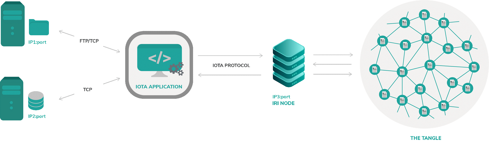

# ドキュメントの不変性の概要
<!-- # Document immutability overview -->

**ドキュメントは、当事者間で情報や契約を転送するための重要な手段です。ドキュメントが確立された状態から変更されていないことを確実に証明できることは、当事者を保護するだけでなく、当事者間の信頼を確保するのに役立ちます。この設計図は、IOTAタングルを使用して以前に署名された文書の署名を自動的にチェックするソリューションを説明しています。**
<!-- **Documents are an important means of transporting information and contracts between parties. Being able to reliably prove that a document has not been changed from an established state helps ensure trust between parties. As well as protect the parties. This blueprint describes a solution that automatically checks the signature of a previously signed document using the IOTA Tangle.** -->

## ビジネスケース
<!-- ## Business case -->

インターネットからバイナリファイルをダウンロードするのは危険なことです。そのため、ほとんどのWebサイトではそのドキュメントのMD5/SHA1文字列が表示されています。これは、ユーザーが自分のマシンでプログラムを実行する前に確認するドキュメントのハッシュ値です。面倒な作業なので、ほとんどの人はドキュメントのハッシュ値を確認しません。また、公式のWebサイトからダウンロードすれば十分だと考える傾向があります。そうではありません。
<!-- Downloading a binary file from the internet is a dangerous thing, that is why most websites show an MD5/SHA1 string of that document. That is the hash of the document for the user to check before running the program on his machine, most people don’t check the hash of the documents because it’s a tedious task. Also, people tend to think that downloading from official websites is enough. That is not the case. -->

### 課題
<!-- ### Challenge -->

たとえば、2016年に、ハッカーはMintと呼ばれるLinuxディストリビューション用のISOファイルに[バックドアをうまく挿入しました](https://blog.linuxmint.com/?p=2994)。また、これらの改ざんされたファイルにリンクするようにWebサイトを変更しました。さらに、ハッカーは新しく生成したファイルのハッシュ値をWebサイトに公開することにも成功しました。
<!-- For example, in 2016, hackers [successfully put a backdoor](https://blog.linuxmint.com/?p=2994) into an ISO file for a Linux distribution called Mint, they also changed the website to link to these tampered files. Additionally, they managed to publish newly generated hashes of the files on the website. -->

### 解決策
<!-- ### Solution -->

このユースケースでは、信頼できるソース（タングル）からダウンロードしたファイルを自動的にチェックし、ファイルが改ざんされている場合はユーザーに警告するツールの構築を検討しています。これにより、エンドユーザーがドキュメントの署名を簡単にテストできるソフトウェアを使用することに価値とインセンティブがもたらされます。
<!-- In this use case we are looking at building a tool that automatically checks the downloaded files from a trusted source (the Tangle) and alerts the user if the files have been tampered with. This provides value and incentive for the end user to use a software that makes it easy to test the document signature. -->

上記の解決策は、ドキュメントの不変性を検証するための信頼できる透過的な方法を提供することです。ドキュメントをプライベートデータベースまたはGoogleドライブなどのサードパーティのサービスに保存している場合は、ダウンロードするドキュメントが人間やウイルスによって変更されていないことを示すツール/証明書をユーザーに提供します。
<!-- The solution to the above is to provide a trusted and transparent way to verify document immutability. -->
<!-- If you have a document stored in your private database or in third party services like Google Drive, you want to provide tools/proofs for your users that the document they are going to download hasn’t been changed by human or a virus. -->

これを行う簡単な方法は、すべてのドキュメントが以前に署名されているIOTAタングルを使用して、ドキュメントの署名を自動的にチェックするツールをユーザーに提供することです。
<!-- An easy way to do this is to provide the users a tool that automatically checks the signature of the document using IOTA tangle where all the documents have been signed previously. -->

この署名情報は、許可なく全員に公開されています。基本的に、インターネットに接続している人なら誰でも実際に使用できます。
<!-- This signature information is publicly exposed to everyone without permission, basically, anyone with an internet connection can actually use it. -->

以下の図はシステムコンポーネントの実例です：
<!-- Here is an illustration of the system components: -->

## デモ
<!-- ## Demo -->

存在証明アプリケーションのデモンストレーションについては、[このWebサイト](https://iota-poex.dag.sh/)を参照してください。
<!-- See this website for a [demonstration of a proof of existence application](https://iota-poex.dag.sh/). -->

## 追加のリソース
<!-- ## Additional Resources -->

---------------
#### GitHubリポジトリ ####
[Link](https://github.com/iotaledger/poc-document-immutable-blueprint)

この設計図をテストするには、コードとクイックスタートの手順を読んでください。
<!-- Read the code and some quickstart instructions to test this blueprint. -->
---
#### 存在証明のnpmライブラリ ####
[Link](https://www.npmjs.com/package/@iota/poex-tool)

存在証明のシナリオに使用できるライブラリ。存在証明アプリケーションに使用されます。
<!-- A library that can be used for proof of existence scenarios. Used for the proof of existence application. -->
---
---------------
