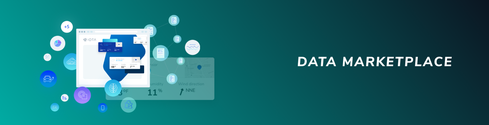
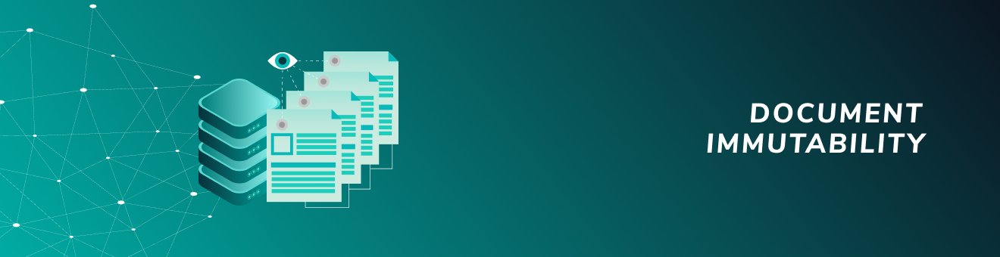
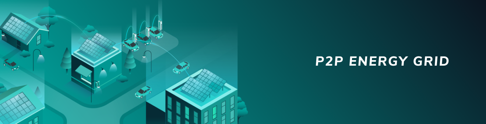
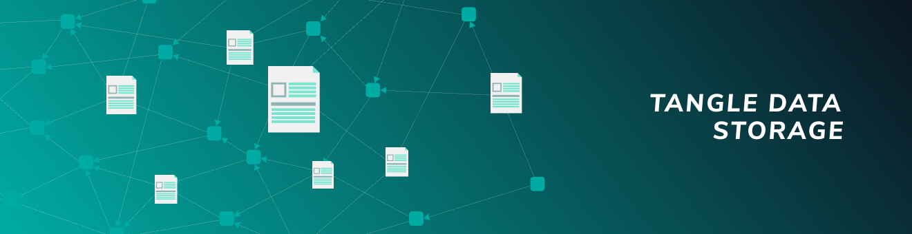

# アプリケーション設計図
<!-- # Application blueprints -->

**設計図は，IOTA テクノロジーを使用して実際の問題を解決し，明確に定義されたビジネスニーズをサポートする方法を説明するドキュメントです．同様のシステムでソリューションを複製およびデプロイし，異なるビジネスモデルをテストするためのガイドラインを提供します．**
<!-- **A blueprint is a document that explains how IOTA technology is used to solve real problems and to support well defined business needs. It provides guidelines for you to replicate and deploy the solution in similar systems and to test different business models.** -->

設計図は次のことを行うように設計されています．
<!-- Blueprints are designed to do the following: -->

- **概要：**問題と解決策を説明します．
<!-- - **Overview:** Describe a problem and a solution -->
- **アーキテクチャ：**IOTA を使用して問題を解決する方法を示すアーキテクチャーを提示します．
<!-- - **App architecture:** Present an architecture that shows you how to solve the problem with IOTA -->
- **デプロイとテスト：**設計図をテスト，編集，およびデプロイする方法を説明します（デモが利用可能な場合）．
<!-- - **Deploy and test:** Explain how you can test, edit, and deploy the blueprint (if a demo is available) -->

-------------------------

## [データマーケットプレイス](../data-marketplace/overview.md)
データサイロでは，異なるデータポイント間でデータを売買することは困難です．この課題を克服するために，データマーケットプレイスは IOTA MAM チャネルを使用してデータサイロを開き，ユーザーがデータと引き換えに IOTA トークンのマイクロペイメントをデータ所有者に支払うことを許可します．
-------------------------

-------------------------

## [ドキュメントの不変性](../doc-immutability/overview.md)
ドキュメントは，当事者間で情報や契約を転送するための重要な手段です．ドキュメントが確立された状態から変更されていないことを確実に証明できることは，当事者を保護するだけでなく，当事者間の信頼を確保するのに役立ちます．この設計図では，IOTA タングルを使って以前に署名された文書の署名を自動的にチェックするソリューションを説明しています．
-------------------------

-------------------------

## [P2P エネルギーグリッド](../p2p-energy/overview.md)
エネルギーの供給はしばしば自動化されていますが，支払いシステムは統合するのに費用がかかり，そしてしばしば手動の介入を必要としています．IOTA を使用して P2P エネルギーグリッドを作成することで，電力の転送とその電力に対する支払いを自動化できます．この自動化により，インフラストラクチャはより洗練され，更新が容易になります．
-------------------------

-------------------------

## [タングルデータストレージ](../tangle-data-storage/overview.md)
データは，官民組織のイノベーションを促進し，新たな収益源を生み出すために使用することができます．しかし，ベンダーに依存しないデータ検証方法がなければ，データを信頼することはできません．この設計図では，IOTA タングルをイミュータブルなデータ構造として使用して，サードパーティのストレージソリューション内のファイルの内容を検証しています．
-------------------------

-------------------------

## [トランク&トレース](../track-and-trace/overview.md)
デューデリジェンスとベンダーに依存しないデータソースの両方が欠如しているため，流通ネットワーク内の回収可能資産は多くの場合，元の所有者に返却されません．この設計図では，IOTA タングルおよび他の IOTA 技術を使用して，IBCS グループが回収可能資産の回収のためのトラック&トレースシステムをどのように実施したかを説明しています．
-------------------------
