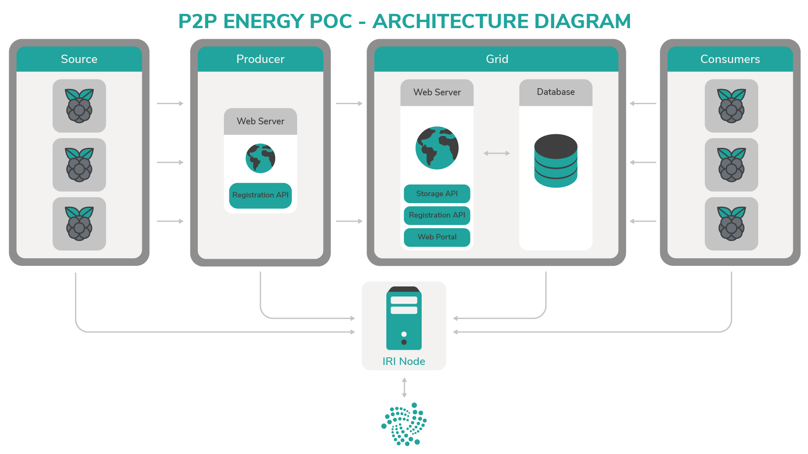
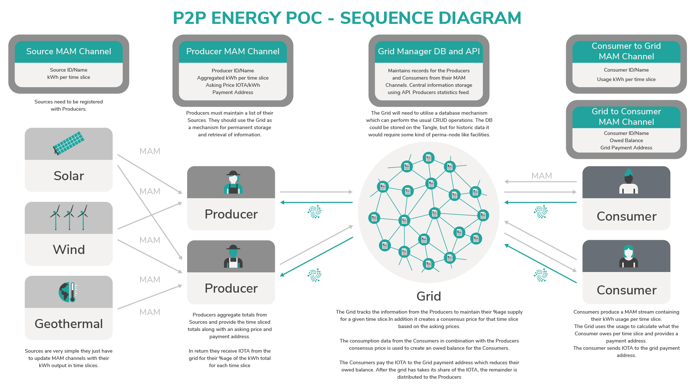
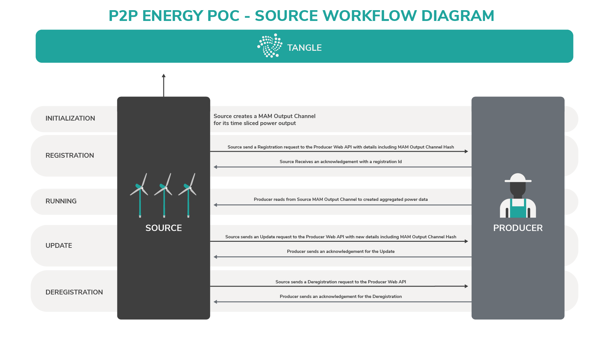
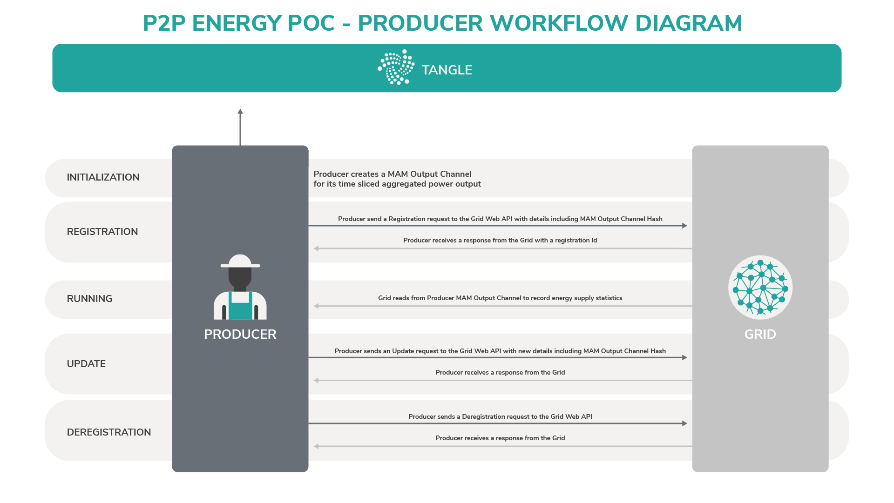
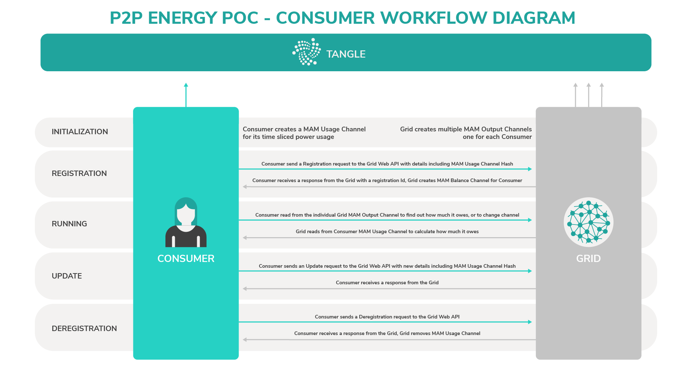
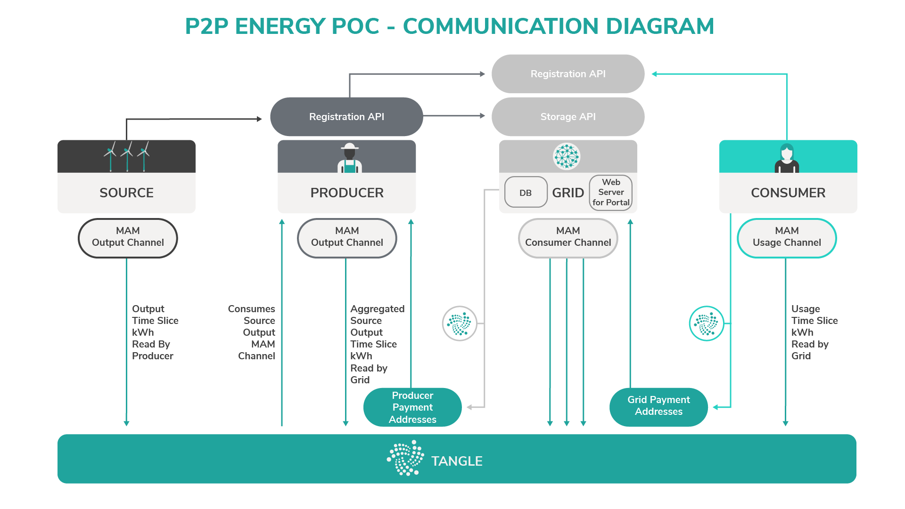

# アプリケーションアーキテクチャ
<!-- # Application architecture -->

** P2Pエネルギーグリッドアプリケーションは、IOTAネットワーク内のノードを通じて、電力源、生産者、消費者、およびグリッドからのデータをMAMチャネルに公開します。**
<!-- **The P2P energy grid application publishes data from sources, producers, consumers, and the grid to MAM channels through a node in an IOTA network.** -->

:::warning:免責事項
人間の努力のように、オープンソースプロジェクトを実行することは、不確実性とトレードオフを伴います。以下に説明するアーキテクチャが、同様のシステムを展開するのに役立つことを願っていますが、間違いが含まれている可能性があり、すべての状況に対処することはできません。あなたのプロジェクトについて何か質問があれば、IOTA財団はあなたがあなた自身の研究をし、専門家を探し、そしてIOTAコミュニティとそれらを話し合うことを奨励します。
:::
<!-- :::warning:Disclaimer -->
<!-- Running an open source project, like any human endeavor, involves uncertainty and trade-offs. We hope the architecture described below helps you to deploy similar systems, but it may include mistakes, and can’t address every situation. If you have any questions about your project, we encourage you to do your own research, seek out experts, and discuss them with the IOTA community. -->
<!-- ::: -->

このPoCのアーキテクチャは、電力源、生産者、消費者、およびグリッドがIOTAネットワークを介して相互接続されているというパターンに従います。
<!-- The architecture of our PoC follows a pattern, where the source, producer, consumer, and grid are interconnected through an IOTA network. -->

IOTAテクノロジーは、このようなアーキテクチャにおいて有利です。なぜなら、IOTAテクノロジーは、常にオンになっていたり、互いに接続している必要なしに、安全な方法でエンティティが互いに通信することを可能にするからです。
<!-- IOTA technologies are advantageous in an architecture such as this because they allow entities to communicate with one another in a secure manner without needing to always be on or connected to each other. -->



IOTAテクノロジーは、データをタングルに格納するエンティティ間の通信と支払いの両方のメカニズムとして採用されています。
<!-- IOTA technologies are employed as both the communication and payment mechanisms between entities that store the data on the Tangle. -->

電力源と消費者の実装は、組み込みデバイスで実行できる軽量の操作を目的としています。これらのエンティティは、MAMチャネルの作成と使用、Web APIとの通信などの操作を実行する必要があります。
<!-- The implementation of the source and the consumer is intended to be a lightweight operation that can be done by embedded devices. These entities need to perform operations such as producing and consuming MAM channels, and communicating with web APIs. -->

生産者はより複雑で、登録を受け付けるためにWeb APIをホストする必要がありますが、どのようなストレージニーズにもグリッドを使用できます。より厳しいプロセスやストレージ要件は、グリッドにオフロードされます。
<!-- The producer is more complex and needs to host a web API to accept registrations, but can use the grid for any storage needs. Any more intense processes or storage requirements are offloaded to the grid. -->

この表には、アプリケーションのすべての主要コンポーネントの一覧が表示されています。
<!-- This table displays a list of all the main components of the application: -->

| **コンポーネント** | **説明** |
| :----------------- | :------- |
| **Webサーバー：ストレージAPI** | システム内の任意のエンティティに任意のデータを格納/取得する機能を提供します。これにより、限られたストレージ機能を持つすべてのエンティティがより多くのデータを格納できます。タングルをストレージとして使用する代わりに従来のWeb APIを選択するのは、タングル上のデータをスナップショットで削除できるためです。 |
| **Webサーバー：登録API** | 電力源が生産者に登録し、消費者/生産者がグリッドに登録するメカニズム。 MAMチャネルハッシュは、チャネルデータへのキーと一緒に通信する必要があるため、この初期ハンドシェイクは従来のWeb APIを使用して実行する必要があります。 |
| **Webサーバー：Webポータル** | グリッドがシステム全体を監視できるようにするWeb UI。 |
| **データベース** | グリッドが自身のデータを使用するための永続的なストレージメカニズムを提供します。 |

電力源は、ある程度の冗長性を考慮して、生産者とは別のエンティティとして保持されています。生産者がオフラインの場合、電力源は数値を直接生産者にではなくタングルに記録し続けます。電力源はまだ生産者に登録されているため、生産者は後でデータをグリッドに伝達する前に統合することができます。
<!-- The sources are kept as separate entities from the producers to allow for some redundancy. If a producer is offline, the sources continue logging their readings to the Tangle instead of directly to the producer. The sources are still registered with the producers so that the producers can later consolidate the data before communicating it to the grid. -->

グリッドは通常、大部分の作業を行います。これは、マシン上でローカルに実行することも、クラウド内のより広いインフラストラクチャに外部委託することもできます。
<!-- The grid usually does the majority of the work, which could be performed locally on the machine or outsourced to a wider infrastructure in the cloud:: -->

* データベースを整備します。
<!-- * Maintaining a database -->
* ポータルでWebサーバーを実行します。
<!-- * Running a web server with a portal -->
* APIを提供します。
<!-- * Provisioning APIs -->
* バックグラウンドタスクを実行して情報を処理します。
<!-- * Running background tasks to process information -->

グリッドは自身のIRIノードを維持しているため、タングルが動作しているP2Pネットワーク内の近隣ノードと通信できます。グリッドが自身のIRIノードを実行することで、残りのエンティティはLANネットワーク内に存在でき、グリッドのみが同期のために残りのタングルへのWANアクセスを必要とします。代替手段は、すべてのエンティティがタングル上のIRIノードに直接WANアクセスできるようにすることです。
<!-- The grid maintains its own IRI node, which enables it to communicate with neighbours in the peer-to-peer network on which the Tangle operates. By running your own IRI node, the rest of the entities can live in a LAN network, with only the grid requiring WAN access to the rest of the Tangle for syncing. The alternative is for all entities to have WAN access directly to an IRI node on Tangle. -->

次の図は、通信チャネルとアーキテクチャで発生するイベントのシーケンスを示しています。
<!-- The following image shows the communication channels and the sequence of events that occur in the architecture. -->



## ワークフロー
<!-- ## Workflows -->

以下のワークフローは、さまざまなエンティティが互いにどのように対話するかを示しています。
<!-- The following workflows illustrate how the different entities interact with each other. -->

### 電力源と生産者
<!-- ### Source to producer -->

この画像は、電力源が生産者およびタングルと通信するときに発生する一連のイベントを示しています。
<!-- This image shows the sequence of events that occur when a source communicates with a producer and the Tangle. -->



### 生産者とグリッド
<!-- ### Producer to grid -->

この画像は、生産者がグリッドおよびタングルと通信するときに発生する一連のイベントを示しています。
<!-- This image shows the sequence of events that occur when a producer communicates with the grid and the Tangle. -->



### 消費者とグリッド
<!-- ### Consumer to grid -->

この画像は、消費者がグリッドおよびタングルと通信するときに発生する一連のイベントを示しています。
<!-- This image shows the sequence of events that occur when a consumer communicates with the grid and the Tangle. -->



## 通信

異なるエンティティ間の通信は、MAMチャネルとWeb API呼び出しの組み合わせで行われます。MAMは、エンティティのデータをタングルに公開することによって、システム内のエンティティが安全な方法で通信できるメカニズムを提供します。エンティティは常に直接の通信回線を必要としません。
<!-- The communication between the different entities is a combination of MAM channels and web API calls. MAM provides a mechanism by which the entities within the system can communicate in a secure fashion, also by publishing their data to the Tangle, the entities do not require a direct line of communication at all times. -->

消費者が請求書をグリッドに支払うとき、またはグリッドが生産者に支払うときはいつでも、タングルトランザクションが発行されます。
<!-- A tangle transaction is issued whenever a consumer pays its bill to the grid or whenever the grid pays a producer. -->



### 電力源のMAM出力チャネル
<!-- ### Source MAM output channel -->

電力源はMAMチャネルを作成して、一定期間にどれだけの貢献をしたかを生産者に伝えます。登録時に、ペイロードの値が生産者によって監視および記録されることが予想されます。
<!-- The source creates a MAM channel to tell the producer how much it has contributed over a period of time. It's expected that on registration, the values in the payload will be monitored and recorded by the producer. -->

#### ペイロード
<!-- #### Payloads -->

```json
{
   "command": "output",        /* The MAM command */
   "startTime": 1542267468229, /* ms since 1900 */
   "endTime": 1542267469229,   /* ms since 1900 */
   "output": 1.234             /* kWh */
}
```

チャネルを読んでいる生産者が正しいチャネルに登録していることを検証できるように、電力源はそのチャネルに最初の`hello`コマンドを発行する必要があります。
<!-- The source should publish an initial `hello` command to its channel so that the producer reading the channel can validate that it's subscribed to the correct channel. -->

```json
{
   "command": "hello"
}
```

登録解除のときには、電力源は、MAMチャネルがもう使用されていないことを知らせるために`goodbye`コマンドを送るべきです。
<!-- On deregistration, the source should send a `goodbye` command to signal that the MAM channel is no longer used. -->

```json
{
   "command": "goodbye"
}
```

### 生産者の登録API
<!-- ### Producer registration API -->

生産者が電力源のMAMチャネルから読み取ることができるように、電力源は生産者に登録/登録解除する必要があります。これは生産者側で軽量のWeb APIを使用することによって達成できます。
<!-- A source needs to be registered/deregistered with a producer so that the producer can read from the source's MAM channel. This can be achieved by using a lightweight web API on the producer. -->

#### 登録
<!-- #### Register -->

**PUT**

```
https://producer/registration/:registrationId
```

**リクエスト**
<!-- **Request** -->

```json
{
   "itemName"?: "My Solar Source",       /* free text */
   "itemType"?: "solar",                 /* free text */
   "root"?: "CCCCCC...DDDDDD",           /* Optional, MAM channel hash */
   "sideKey"?: "AAA....ZZZZZZ"           /* Optional, Side key to read MAM
                                            channel */
}
```

**レスポンス**
<!-- **Response** -->

```json
{
   "success": true,                    /* true or false */
   "message": "OK"                     /* Or error message if fail */
}
```

電力源が生産者に登録されると、電力源のエネルギー測定値のMAMチャネル詳細を使用して電力源のMAMチャネルのモニタリングを開始できます。
<!-- When a source registers with a producer, it can start monitoring the source's MAM channel using the MAM channel details for its energy readings. -->

#### 登録解除
<!-- #### Deregister -->

```
DELETE https://producer/registration/:registrationId/:sideKey
```

**レスポンス**
<!-- **Response** -->

```json
{
   "success": true,                   /* true or false */
   "message": "OK"                    /* Or error message if fail */
}
```

`sideKey`は認証の証として`DELETE`に渡されます。電力源が登録解除されると、生産者は電力源のMAMチャネルの視聴を停止する必要があります。
<!-- The `sideKey` is passed to the delete as a measure of authentication. When a source is deregistered, the producer should stop watching the source's MAM channel. -->

### 生産者のMAM出力チャネル
<!-- ### Producer MAM output channel -->

このMAMチャネルには、生産者の電力源からの総計出力に関する情報が期間として含まれています。さらに、供給された電力の提案価格と支払い先アドレスが記載されています。
<!-- This MAM channel contains information on the aggregated output from the producer's sources as a time period. Additionally, a proposed price for the power supplied and payment address is provided. -->

グリッドは、各生産者に支払う金額を計算するために、後で使用するすべての生産者のチャネルを監視および記録します。支払先アドレスと要求される価格は期間ごとに変わる可能性があり、生産者は異なる時に電力の変動価格を提供することができます。
<!-- The grid will monitor and record the channels for all producers to use later in order to calculate the amount to pay to each producer. The payment address and requested  price can change per time period to give the Producer the ability to provide variable price power at different times. -->

`producerPrice`フィールドがグリッドによって支払われることが保証されているのではなく、すべての生産者間の合意価格が支払われます。合意価格は、すべての`producerPrice`フィールドの通常の平均、または生産者がグリッドにどれだけ貢献したかに基づく加重平均です。 `paymentIdOrAddress`は、グリッドが支払いを行うことができるIOTAアドレス、またはグリッドが別の支払い方法を持つようにするための参照IDです。
<!-- The `producerPrice` field is not guaranteed to be met by the grid, instead a consensus price amongst all the producers will be paid. The consensus price could be a regular average of all the `producerPrice` fields or a weighted average based on how much the producer contributed to the grid. The `paymentIdOrAddress` can be an IOTA address that the grid can make payments to, or a reference ID so that the grid has another way of making payments. -->

**ペイロード**
<!-- **Payload** -->

```json
{
   "command": "output",                    /* The MAM command */
   "startTime": 1542267468229,             /* ms since 1900 */
   "endTime": 1542267469229,               /* ms since 1900 */
   "output": 1.234,                        /* kWh */
   "producerPrice": 56789,                 /* IOTA per kWh */
   "paymentIdOrAddress": "PPPPPP...QQQQQQ" /* address to receive payment */
}
```

生産者の支払いアドレスは、グリッドが支払いを送信するアドレスです。生産者の出力チャネル内の各期間は、各機関に関連付けられた異なるアドレスを持つことができるため、生産者は複数のアドレスを持つことができます。
<!-- The producer payment addresses are where the grid sends payments. A producer can have more than one address as each time period in the producer's output channel can have a different address associated with it. -->

### グリッドの登録API
<!-- ### Grid registration API -->

グリッドの登録APIは、Webサーバー上でホストされる通常のWeb APIの形式を取ります。生産者と消費者の両方が自身をグリッドに登録するために使用します。エンティティが登録されると、グリッドはエンティティのMAM出力チャネルの監視を開始します。登録が成功すると、IDが返されます。このIDは将来のリクエストで使用されます。
<!-- The grid registration API will take the form of a regular web API hosted on a web server. It is used by both the producers and consumers to register themselves with the grid. Once an entity is registered the grid will start monitoring their MAM output channels. On a successful registration an id is returned, this is then used in any future requests. -->

登録エンティティとグリッドの両方が、それぞれのチャネルに初期`hello`コマンドを発行して、チャネルを読み取っているエンティティが正しいチャネルに加入していることを検証できるようにする必要があります。
<!-- Both the registering entity and the grid should publish an initial `hello` command to their respective channels so that the entity reading the channel can validate that it's subscribed to the correct channel. -->

```json
{
   "command": "hello"
}
```

両方のエンティティの登録を解除すると、MAMチャネルが使用されなくなったことを知らせるために、`goodbye`コマンドを送信する必要があります。
<!-- On unregistering both entities should send a `goodbye` command to signal that the MAM channel is no longer used. -->

```json
{
   "command": "goodbye"
}
```

消費者の場合、レスポンスは、消費者がグリッドの所有量を監視する必要があるMAMチャネルハッシュも返します。
<!-- For a consumer, the response will also return a MAM channel hash that the consumer should monitor for how much it owes the grid. -->

APIの説明は以下になります。
<!-- A description of the APIs is provided below. -->

#### 登録セット
<!-- #### Registration set -->

```
PUT https://grid/registration/:registrationId
```

**リクエスト**
<!-- **Request** -->

```json
{
   "itemName": "My Solar Source",         /* free text */
   "itemType": "producer",                /* enum producer/consumer */
   "root"?: "CCCCCC...DDDDDD",            /* MAM root hash for the channel
                                             the grid should monitor,
                                             optional as you may just want a
                                             registration id */
   "sideKey"?: "CCC...DDDD"               /* side key for the channel,
                                             optional, as above */
}
```

**レスポンス**
<!-- **Response** -->

```json
{
   "success": true,                       /* true or false */
   "message": "OK",                       /* Or error message if fail */
   "root"?: "JJJJJJ...KKKKKK",            /* Optional, channel the
                                             registered item
                                             should monitor from the grid.
                                             for the consumer this contains
                                             the amount owed feed */
   "sideKey"?: "CCC...DDDD"               /* Optional, private key for the
                                             channel */
}
```

#### 登録削除
<!-- #### Registration remove -->

```
DELETE https://grid/registration/:registration-id/:sideKey
```

**レスポンス**
<!-- **Response** -->

```json
{
   "success": true,     /* true or false */
   "message": "OK"      /* Or error message if fail */
}
```

`sideKey`は認証の証として`DELETE`に渡されます。
<!-- The `sideKey` is passed to the delete as a measure of authentication. -->

### グリッドのストレージAPI
<!-- ### Grid storage API -->

グリッドのストレージAPIは、永続的に情報を格納する必要があるアーキテクチャのどの部分でも使用できます。APIは標準データベースのCRUD操作をサポートし、すべての呼び出しでエンティティ登録IDを必要とします。
<!-- The grid storage API is available to any part of the architecture that needs to store information on a permanent basis. The API will support the standard database CRUD operations and requires an entities registration id in all calls. -->

ストレージエンドポイントはパーミッションレスであるため、アイテムを非公開にしたいグリッド内のアイテムを格納するエンティティは、格納する前にアイテムを暗号化する必要があります。
<!-- As the storage endpoint is permissionless any entity storing items in the grid that wants them to be private should encrypt them before storing. -->

すべての呼び出しにおけるコンテキストパラメータは、それ自身の目的でデータを分割するために任意のエンティティによって使用されます。
<!-- The context parameter in all the calls is for use by any entity to partition data for its own purposes. -->

#### アイテムをセットする
<!-- #### Set item -->

```
PUT https://grid/storage/item/:registration-id/:context/:id
```

**リクエスト**
<!-- **Request** -->

```json
{
   ...    /* free-form JSON data */
}
```

**レスポンス**
<!-- **Response** -->

```json
{
   "success": true,                 /* true or false */
   "message": "OK"                  /* Or error message if fail */
}
```

#### アイテムを取得する
<!-- #### Get item -->

```
GET https://grid/storage/:registration-id/:context/:id
```

**レスポンス**
<!-- **Response** -->

```json
{
   "success": true,        /* true or false */
   "message": "OK",        /* Or error message if fail */
   "item": ...             /* free-form JSON data */
}
```

#### アイテムを削除する
<!-- #### Delete item -->

コンテキストまたはIDを省略すると、フォルダ構造全体を削除できます。
<!-- By omitting the context or ID, you can remove whole folder structures. -->

```
DELETE https://grid/storage/:registration-id/:context?/:id?
```

**レスポンス**
<!-- **Response** -->

```json
{
   "success": true,           /* true or false */
   "message": "OK"            /* Or error message if fail */
}
```

#### すべてを読み込む
<!-- #### Read all -->

ページング方式でストレージからアイテムを取得することができます。`page`と`page-size`はどちらもオプションであり、デフォルトはそれぞれ0と10です。
<!-- Allows you to get items from the storage in a paged manner. Both page and page-size are optional and will default to 0 and 10 respectively. -->

```
GET https://grid/storage/:registration-id/:context?page?&page-size?
```

**レスポンス**
<!-- **Response** -->

```json
{
   "success": true,          /* true or false */
   "message": "OK",          /* Or error message if fail */
   "ids": [...],             /* array of the ids */
   "items": [...],           /* array of the items */
   "totalPages": 6,          /* calculated from page-size and num items */
   "totalItems": 45,         /* total number of items available */
   "pageSize": 10            /* The page size used in calculations */
}
```

#### 例
<!-- #### Example -->

ABC123の登録IDを持つ生産者は、バックアップのためにローカルだけではなく安全な場所に、生産者の電力源の詳細を保存したいと思うかもしれません。
<!-- A producer with a registration ID of ABC123 might want to store the details of its sources in a safe place instead of just locally for backup. -->

https://grid/storage/ABC123/sources/XXX123 にPUTを付けてアイテムを作成または更新します。
<!-- It would create or update an item with a PUT to https://grid/storage/ABC123/sources/XXX123. -->

https://grid/storage/ABC123/sources/XXX123 へのGETでアイテムを取得できます。
<!-- The item could be retrieved with a GET to https://grid/storage/ABC123/sources/XXX123 -->

https://grid/storage/ABC123/sources/XXX123 へのDELETEでアイテムを削除できます。
<!-- The item could be deleted with a DELETE to https://grid/storage/ABC123/sources/XXX123 -->

またはABC123のすべてのアイテムは https://grid/storage/ABC123/ で削除できます。
<!-- Or all the items for ABC123 could be deleted with -->
<!-- https://grid/storage/ABC123/ -->

生産者は、https://grid/storage/ABC123/sources?page=5&pageSize=10 へのGET呼び出しを使用して、ページサイズ10のページ5のすべてのアイテムを取得できます。
<!-- The producer could get all its items on page 5 with a page size of 10 with a GET call to https://grid/storage/ABC123/sources?page=5&pageSize=10 -->

### グリッドのMAM消費者チャネル
<!-- ### Grid MAM consumer channels -->

消費者がグリッドに登録すると、グリッドは支払いリクエストで更新されるMAMチャネルを作成します。グリッドはこの情報を中央のDBでも追跡しますが、MAMチャネルを提供することで、消費者はすぐに借りているものを見ることができます。未払い残高は、生産者の出力チャネルからの価格設定とともに消費者使用チャネルから読み取られた情報を元に計算されます。
<!-- When a consumer registers with the grid the grid will create a MAM channel that is updated with the payment requests. The grid will also track this information in its central DB but by providing a MAM channel a consumer can immediately see what they owe. The outstanding balance is calculated from the information read from the consumers Usage Channel in conjunction with the pricing from the producer's output channels. -->

#### 支払いペイロード
<!-- #### Payment payload -->

```json
{
   "command": "payment-request",           /* the command */
   "owed": 345,                            /* amount in IOTA owed
                                              excludes pending transactions */
   "usage": 123,                           /* the amount of kWh the payment is for */
   "paymentIdOrAddress": "WWWWWW...XXXXXX" /* payment address for owed
                                              balance payment to grid */
}
```

### グリッドの支払いアドレス
<!-- ### Grid payment addresses -->

支払い先アドレスは、支払いを受け取るために消費者のチャネルに公開されたものです。`paymentIdOrAddress`は、実際のIOTAアドレス、または消費者が別の方法で支払いをするために使用できる参照です。グリッドがIOTAを削減した後、残りは中央プールに追加され、期間と価格の決定に基づいて生産者に割り当てられます。
<!-- The payment addresses are the ones published to the consumer's channels to receive payments. The `paymentIdOrAddress` can be the an actual IOTA address or a reference that the consumer can use to make payments with a different method. After the grid has taken its cut of the IOTAs the rest will be added to a central pool which will be allocated to the producers based on time periods and asking prices. -->

### 消費者のMAM使用量チャネル
<!-- ### Consumer MAM usage channel -->

消費者のMAM使用量チャネルは、期間に基づいて消費者の使用量で継続的に更新されます。グリッドはチャネルを監視して、消費者が借りている金額を計算します。
<!-- The consumer's MAM Usage Channel will be continuously updated with the consumer's usage based on time periods. The grid monitors the channel to calculate how much the consumer owes. -->

#### ペイロード
<!-- #### Payload -->

```json
{
   "startTime": 1542267468229,         /* ms since 1900 */
   "endTime": 1542267469229,           /* ms since 1900 */
   "usage": 1.234                      /* kWh */
}
```
