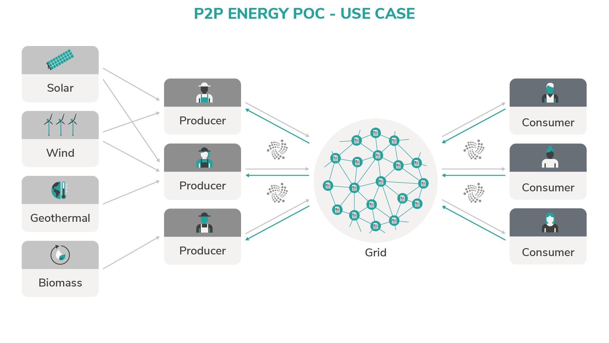

# P2Pエネルギーグリッド
<!-- # Peer-to-peer energy grid -->

**エネルギーの供給はしばしば自動化されていますが、支払いシステムは統合するのに費用がかかり、そしてしばしば手動の介入を必要とします。IOTAを使用してピアツーピア（P2P）エネルギーグリッドを作成することで、電力の転送とその電力に対する支払いを自動化できます。この自動化により、インフラストラクチャはより動的になり、更新が容易になります。**
<!-- **Although the supply of energy is often automated, the payment system is expensive to integrate and often requires manual intervention. By creating a peer-to-peer (P2P) energy grid with IOTA, you can automate the transfer of power and the payment for that power. This automation makes your infrastructure more dynamic and easier to update.** -->

この設計図は、P2Pエネルギーグリッド内のエンティティがどのようにエネルギーを交換できるかを示しています。P2Pエネルギーグリッドの分散型およびマシンベースの性質により、これはIOTAの理想的なユースケースになります。IOTAテクノロジを使用すると、低電力デバイスでも追跡可能で不変な方法でグリッドと通信できるインフラストラクチャを作成できます。
<!-- This blueprint demonstrates how entities in a P2P energy grid can trade energy. The distributed and machine-based nature of the P2P energy grid make this an ideal use case for IOTA. Using IOTA technologies, you can create an infrastructure where even low-powered devices can communicate with the grid in a traceable and immutable way. -->

P2Pエネルギーグリッドでのエネルギー取引には、4つの上位レベルのエンティティが関与します。
<!-- Trading energy on a P2P energy grid involves four high-level entities: -->

| **エンティティ** | **役割** |
| ---------------- | -------- |
| **電力源** | 生産者のために太陽や風などから電気を生成する |
| **生産者** | 複数の電力源を管理し、グリッドから支払いを受け取る |
| **消費者** | 支払いと引き換えにグリッドから供給される電力を使用する |
| **グリッド** | 生産者から消費者への配電を調整し、支払いを分配する |

:::info:
この設計図は、支払いの見返りにリソースが消費者に配布されるシナリオ、たとえば水道で複製することができます。
:::
<!-- :::info: -->
<!-- This blueprint can be replicated in any scenario where a resource is distributed to consumers in return for payment, for example water supply. -->
<!-- ::: -->

## 追加のリソース
<!-- ## Additional resources -->

---------------
#### iota.jsクライアントライブラリ ####
[Link](root://client-libraries/0.1/getting-started/js-quickstart.md)

iota.jsクライアントライブラリを使ってトランザクションを作成、送信、受信する方法を学びます。
---
#### MAMの説明 ####
[Link](https://blog.iota.org/introducing-masked-authenticated-messaging-e55c1822d50e)

マスクされた認証済みメッセージングは、タングルを介して暗号化されたデータストリームへのアクセスを公開および制御する機能を追加するセカンドレイヤーのデータ通信プロトコルです。MAMの機能の詳細についてはこちらをご覧ください。
---
#### MAMのGitHubリポジトリ ####
[Link](https://github.com/iotaledger/mam.client.js)

JavaScriptでMAMをテストするには、コードとクイックスタートの手順を読んでください。
---------------
