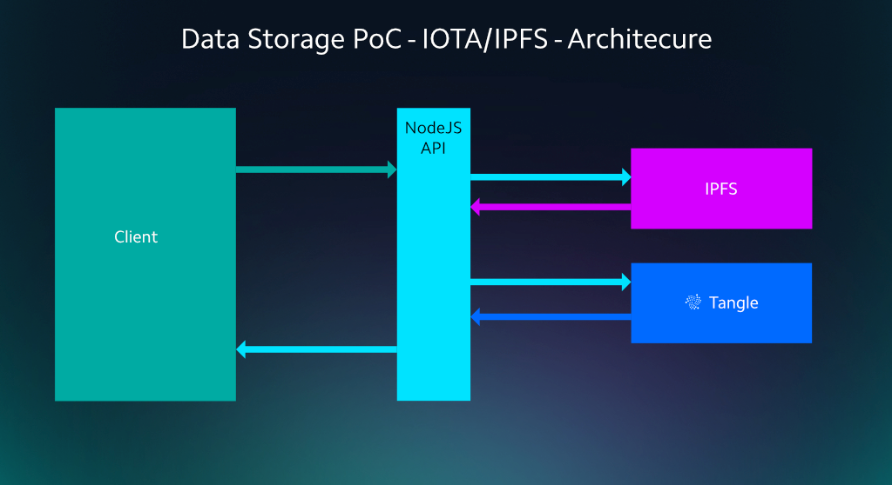
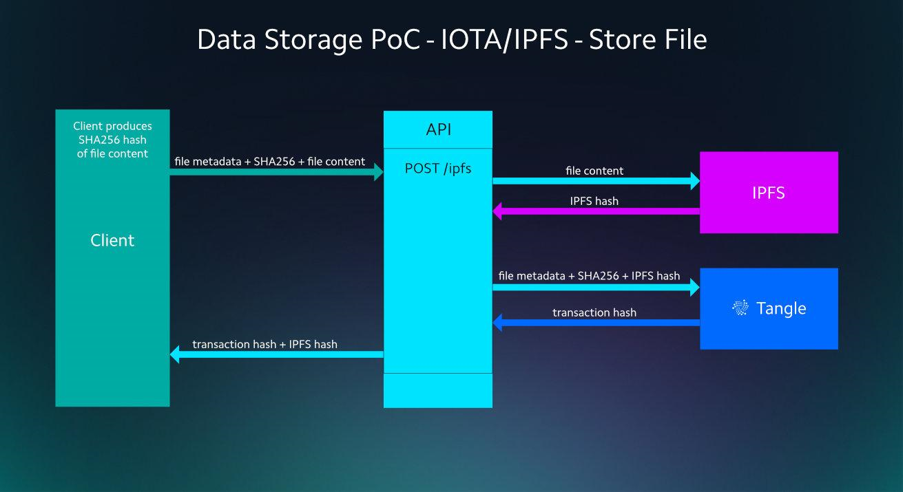
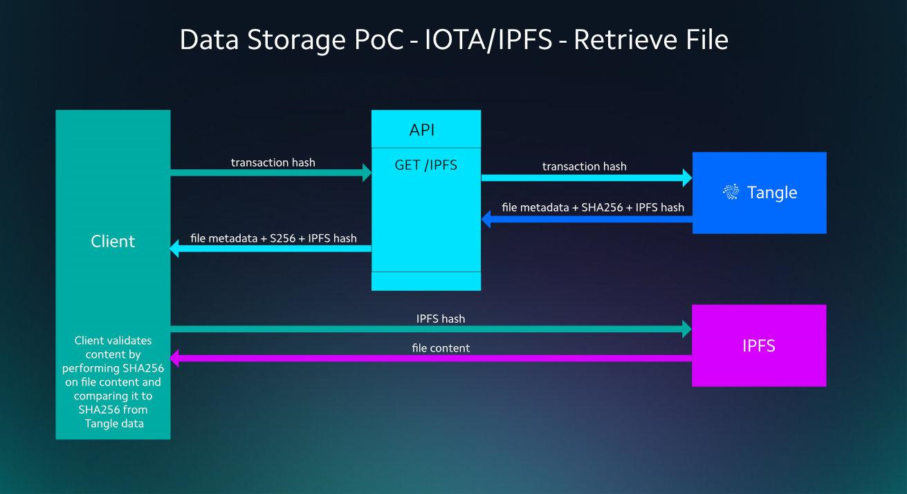

# アプリケーションアーキテクチャ
<!-- # Application architecture -->

**タングルデータストレージアプリケーションは、Reactで書かれたグラフィカルユーザーインターフェース（GUI）とNodeJSで書かれたバックエンドAPIの2つの部分から構成されています。**
<!-- **The Tangle data storage application consists of two parts: A graphical user interface (GUI), written in React and a back-end API, written in NodeJS.** -->

:::warning:免責事項
人間の努力のように、オープンソースプロジェクトを実行することは、不確実性とトレードオフを伴います。以下に説明するアーキテクチャが、同様のシステムを展開するのに役立つことを願っていますが、間違いが含まれている可能性があり、すべての状況に対処することはできません。あなたのプロジェクトについて何か質問があれば、IOTA財団はあなたがあなた自身の研究をし、専門家を探し、そしてIOTAコミュニティとそれらを話し合うことを奨励します。
:::
<!-- :::warning:Disclaimer -->
<!-- Running an open source project, like any human endeavor, involves uncertainty and trade-offs. We hope the architecture described below helps you to deploy similar systems, but it may include mistakes, and can’t address every situation. If you have any questions about your project, we encourage you to do your own research, seek out experts, and discuss them with the IOTA community. -->
<!-- ::: -->

## 前提条件
<!-- ## Prerequisites -->

このプロジェクトは、JavaScript、React、Node.jsなど、ある程度のプログラミング知識を前提としています。
<!-- This projects assumes some level of programming knowledge, specifically in: JavaScript, React and Node.js. -->

## 説明書と技術的概念
<!-- ## Instructions and technical concepts -->

- [PoCのソースコード](https://github.com/iotaledger/poc-ipfs/blob/master/README.md) - Reactで書かれたフロントエンドGUIとNode.js APIとして書かれたバックエンドの2つの部分から成ります。このPoCを再現するために、専用のハードウェアを配置する必要はありません。
<!-- - [PoC source code](https://github.com/iotaledger/poc-ipfs/blob/master/README.md) -  -->
<!-- Consists of two parts a front-end GUI written in React and a back-end written as a Node.js API. -->
<!-- In order to reproduce this PoC there is no requirement to deploy dedicated hardware. -->
- [フロントエンドのデプロイ方法](https://github.com/iotaledger/poc-ipfs/blob/master/client/DEPLOYMENT.md)
<!-- - [Front-end deployment instructions](https://github.com/iotaledger/poc-ipfs/blob/master/client/DEPLOYMENT.md) -->
- [Node.js APIのデプロイ方法](https://github.com/iotaledger/poc-ipfs/blob/master/api/DEPLOYMENT.md)
<!-- - [Node.js API deployment instructions](https://github.com/iotaledger/poc-ipfs/blob/master/api/DEPLOYMENT.md) -->

提示されたインフラストラクチャは、IOTAタングルと、あなたが実行している`InterPlanetary File System`（IPFS）ノードを利用します。次の図は、主要なアーキテクチャコンポーネントを示しています。
<!-- The presented infrastructure makes use of the IOTA Tangle and an `InterPlanetary File System` (IPFS) node that you run yourself. The following image shows the main architecture components. -->



:::warning:免責事項
人間の努力のように、オープンソースプロジェクトを実行することは、不確実性とトレードオフを伴います。以下に説明するアーキテクチャが、同様のシステムを展開するのに役立つことを願っていますが、間違いが含まれている可能性があり、すべての状況に対処することはできません。あなたのプロジェクトについて何か質問があれば、IOTA財団はあなたがあなた自身の研究をし、専門家を探し、そしてIOTAコミュニティとそれらを話し合うことを奨励します。
:::
<!-- :::warning:Disclaimer -->
<!-- Running an open source project, like any human endeavor, involves uncertainty and trade-offs. We hope the architecture described below helps you to deploy similar systems, but it may include mistakes, and can’t address every situation. If you have any questions about your project, we encourage you to do your own research, seek out experts, and discuss them with the IOTA community. -->
<!-- ::: -->

## 前提条件
<!-- ## Prerequisites -->

このアプリケーションをテスト、編集、およびデプロイするには、JavaScript、React、およびNodeJSのプログラミング知識が必要です。
<!-- To test, edit, and deploy this application, you need programming knowledge in JavaScript, React, and NodeJS. -->

## API

APIは2つのメソッドを実装します。
<!-- The API implements two methods: -->

- `storeFile()`
- `retrieveFile()`

### ファイルストレージ
<!-- ### File storage -->

APIを使用してファイルを保存するために、クライアントは次のことを行います。
<!-- To store a file using the API, the client does the following: -->

* アップロードするファイルを選択します。
<!-- * Select the file to upload -->
* ファイルの内容のSHA256ハッシュを生成します。
<!-- * Generate SHA256 hash of the file content -->
* 追加のファイルメタデータをキャプチャします。
<!-- * Capture additional file meta data -->
* メタデータ、SHA256ハッシュ、およびファイルの内容をIPFSノードに送信します（POST /ipfs）。
<!-- * Send the meta data, SHA256 hash, and file contents to the IPFS node (POST /ipfs) -->

舞台裏では、APIは次のことを行います。
<!-- Behind the scenes, the API does the following: -->

* ファイルの内容をIPFSにアップロードします。IPFSはIPFSハッシュを返します。
<!-- * Upload the file content to IPFS, which returns the IPFS hash -->
* メタデータ、SHA256、およびIPFSハッシュをタングルに保存します。これはトランザクションハッシュを返します。
<!-- * Store the metadata, SHA256 and IPFS hash on the Tangle, which returns a transaction hash -->
* タングルトランザクションハッシュをクライアントに返します。
<!-- * Return the Tangle transaction hash to the client -->



`storeFile()`メソッドは次の形式のJSONオブジェクトを取ります。
<!-- The `storeFile()` method takes a JSON object in the following format: -->

```javascript
IPFSStoreRequest {
   /**
    * The name of the file.
    */
   name: string;

   /**
    * The description of the file.
    */
   description: string;

   /**
    * The size of the file.
    */
   size: number;

   /**
    * The modified date of the file.
    */
   modified: Date;

   /**
    * The sha256 hash of the file.
    */
   sha256: string;

   /**
    * The file data encoded in base64.
    */
   data: string;
}
```

JSONオブジェクトを受信すると、ファイルはIPFSノードにアップロードされます。
<!-- On receipt of the JSON object, the file is uploaded to the IPFS node. -->

```javascript
import ipfsClient from "ipfs-http-client";

const buffer = Buffer.from(request.data, "base64");
const ipfs = ipfsClient(config.ipfs);
const addResponse = await ipfs.add(buffer);
```

`add()`メソッドからのレスポンスにはIPFSハッシュが含まれています。これは、タングルに添付される前にメタデータとSHA256ハッシュと組み合わされます。
<!-- The response from the `add()` method contains the IPFS hash, which is combined with the metadata and the SHA256 hash before being attached to the Tangle. -->

```javascript
const nextAddress = generateAddress(config.seed, 0, 2);

const tanglePayload = {
   name: request.name,
   description: request.description,
   size: request.size,
   modified: request.modified,
   sha256: request.sha256,
   ipfs: addResponse[0].hash
};

const iota = composeAPI({
        provider: config.provider
    });

const trytes = await iota.prepareTransfers(
   "9".repeat(81),
   [
       {
           address: nextAddress,
           value: 0,
           message: TrytesHelper.toTrytes(tanglePayload)
       }
   ]);

const bundle = await iota.sendTrytes(trytes, config.depth, config.mwm);
```

`sendTrytes()`メソッドから返されたバンドルにはトランザクションハッシュが含まれており、その後トランザクションハッシュはクライアントに返されます。
<!-- The bundle returned from the `sendTrytes()` method contains the transaction hash that's then returned to the client. -->

### ファイル検索
<!-- ### File retrieval -->

ファイルを取得してその内容を検証するために、クライアントは次のことを行います。
<!-- To retrieve a file and validate its contents the client does the following: -->

* API（GET /ipfs）からのトランザクションハッシュを使用してメタデータ、SHA256ハッシュおよびIPFSハッシュをリクエストします。
<!-- * Request the metadata, SHA256 and IPFS hash using the transaction hash from the API (GET /ipfs) -->
* IPFSハッシュを使ってIPFSからファイルの内容を取得します。
<!-- * Get the file contents from IPFS using the IPFS hash -->
* 取得したファイルの内容に対してSHA256を実行します。
<!-- * Perform a SHA256 on the retrieved file content -->
* 計算したSHA256ハッシュをAPIから返されたSHA256ハッシュと比較します。
<!-- * Compare the calculated SHA256 with the one returned from the API -->



ファイルを取得して検証するために、トランザクションハッシュがタングルから読み込まれます。
<!-- To retrieve and validate the file, the transaction hash is read from the Tangle. -->

```javascript
const iota = composeAPI({
        provider: config.provider
    });

const transactions = await iota.getTrytes([request.transactionHash]);
const txObject = asTransactionObject(transactions[0]);
const ascii = trytesToAscii(txObject.signatureMessageFragment);
const payload = JSON.parse(ascii)
```

次に、[Cloudflare](https://cloudflare-ipfs.com/ipfs/:hash)などのパブリックIPFSゲートウェイを使用して、トランザクションハッシュを使用してIPFSノードにファイルをリクエストします。
<!-- Then, the transaction hash is used to request the file from the IPFS node, using any public IPFS gateway such as [Cloudflare](https://cloudflare-ipfs.com/ipfs/:hash) -->

ファイルがバッファに返されたと仮定すると、ファイルはSHA256アルゴリズムを使用してハッシュされ、結果のハッシュ値はトランザクションのメッセージのハッシュ値と比較されます。
<!-- Assuming the file was returned into a buffer, the file is hashed using a SHA256 algorithm and the resulting hash is compared to the one from the transaction's message. -->

```javascript
const sha256 = crypto.createHash("sha256");
sha256.update(fileBuffer);
const ipfsSha256 = sha256.digest("hex");
if (ipfsSha256 === payload.sha256) {
   console.log("All Is Well");
} else {
   console.log("Oh no, hash does not match");
}
```

## データセキュリティ
<!-- ## Data security -->

IPFSは分散Webであるため、IPFSハッシュを持っている人なら誰でもファイルの内容をダウンロードして読むことができます。
<!-- Because the IPFS is a distributed web, anyone who has the IPFS hash can download and read the contents of the file. -->

許可されていないエンティティがデータを読み取らないようにするには、データをIPFSノードにアップロードする前に暗号化します。
<!-- To prevent unauthorized entities from reading the data, you could encrypt it before uploading it to the IPFS node. -->

## 代替データストレージソリューション
<!-- ## Alternative data storage solutions -->

このアプリケーションでは、データはIPFSノードにアップロードされますが、代替データストレージソリューションにアップロードする場合も同じ原則が適用されます。
<!-- In this application, data is uploaded to an IPFS node, however the same principles apply if you were to upload to an alternative data storage solution. -->

Amazon S3やAzure Storageなどの代替ストレージソリューションを使用するには、一意のハッシュ（たとえばファイルのSHA256ハッシュ）を使用してデータを代替ストレージソリューションにアップロードするだけです。
<!-- To use alternative storage solutions such as Amazon S3 or Azure Storage, you just need to upload the data to it with a unique hash (for example the SHA256 hash of the file). -->
