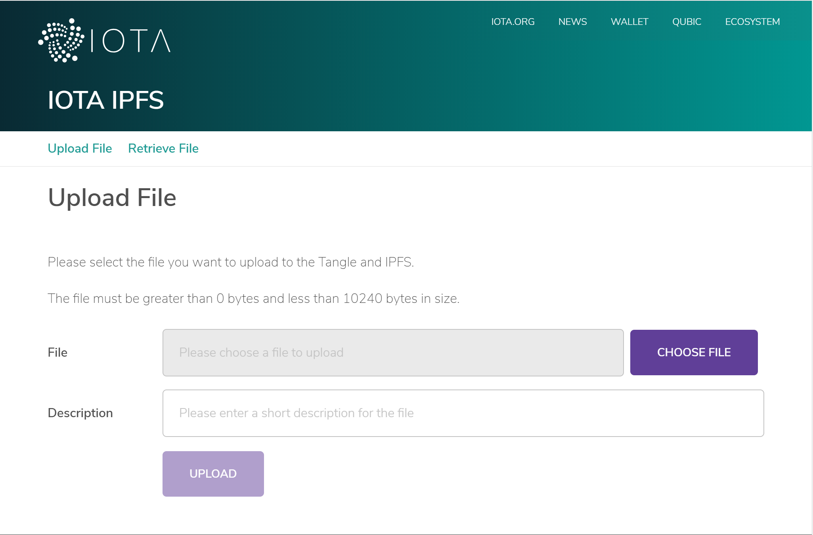
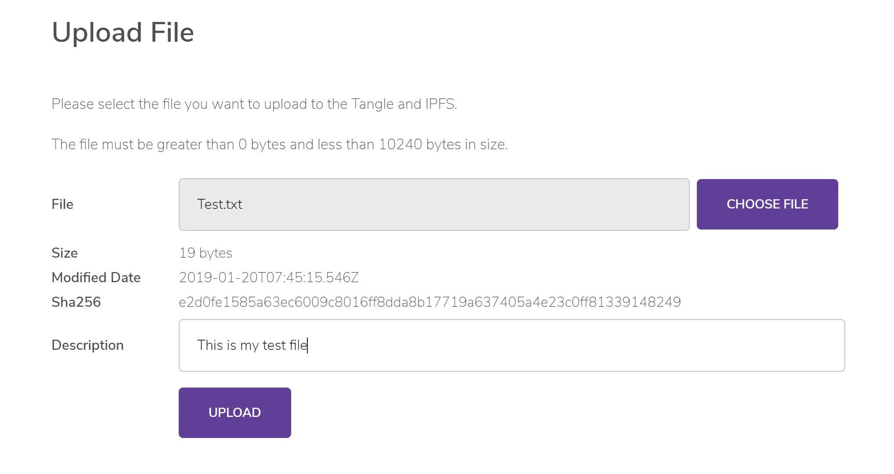
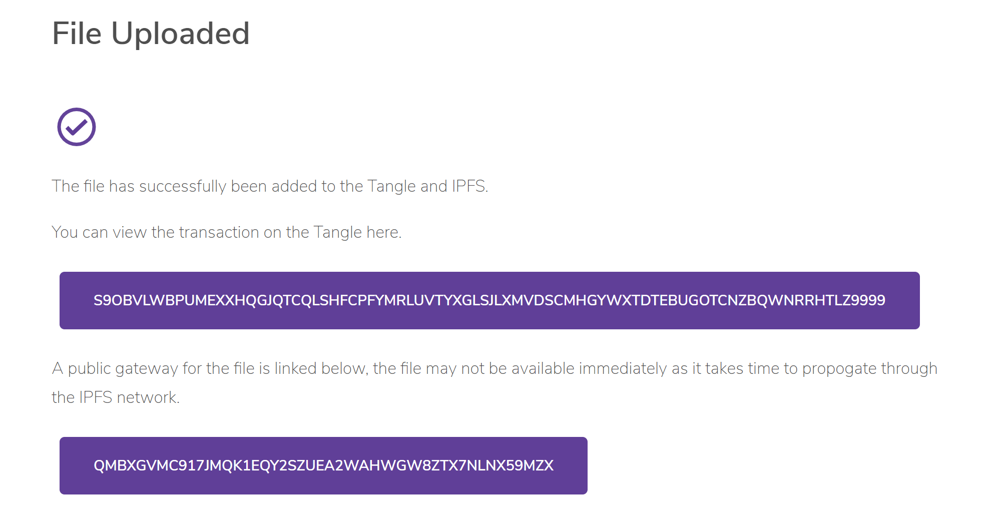
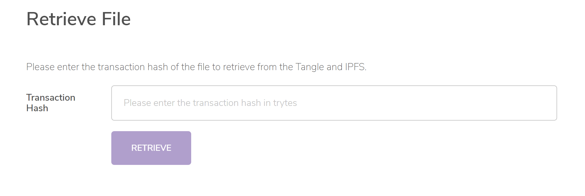
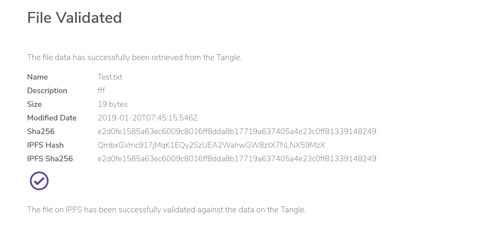

# デモのタングルデータストレージをデプロイしてテストする
<!-- # Deploy and test the Tangle data storage demo -->

**IPFSノードとタングルにデータの保存を開始するには，アプリケーションをデプロイし，IOTA財団のグラフィカルユーザーインターフェースを使用してファイルデータをアップロードし，ファイルデータを取得し，ハッシュを比較して内容を確認します．**
<!-- **To start storing data in the IPFS node and the Tangle, deploy the application and use our graphical user interface to upload file data, retrieve file data, and compare hashes to verify the contents.** -->

## 前提条件
<!-- ## Prerequisites -->

このアプリケーションをテストおよびデプロイするには，次のものが必要です．
<!-- To test and deploy this application, you need the following: -->

- デバイスにインストールされた Node.js
<!-- - Node.js installed on your device -->
- [Amazon DynamoDB](https://aws.amazon.com/dynamodb/) 上のデータベース
<!-- - A database on [Amazon DynamoDB](https://aws.amazon.com/dynamodb/) -->
- [IPSF ノード](https://docs.ipfs.io/introduction/overview/)
<!-- - An [IPFS node](https://docs.ipfs.io/introduction/overview/) -->

自分自身のニーズに合わせてこのアプリケーションを編集するには，JavaScript，Node.js，および React.js の知識が必要です．
<!-- To edit this application for your own needs, you need knowledge of JavaScript, Node.js, and React.js. -->

## タングルデータストレージアプリをデプロイする
<!-- ## Deploy the Tangle data storage app -->

このアプリケーションをローカルネットワークにデプロイするには，次の手順を実行します．これらのデプロイ手順は，[GitHub](https://github.com/iotaledger/poc-ipfs/blob/master/README.md) でもホストされています．
<!-- To deploy this application on your local network, complete the following instructions. These deployment instructions are also hosted on [GitHub](https://github.com/iotaledger/poc-ipfs/blob/master/README.md). -->

1. GitHub リポジトリをクローンします．
  <!-- 1. Clone the GitHub repository -->

    ```bash
    git clone https://github.com/iotaledger/poc-ipfs.git
    cd poc-ipfs
    ```

2. `api` ディレクトリに移動し，依存関係をインストールします．
  <!-- 2. Change into the `api` directory and install the dependencies -->

    ```bash
    cd api
    npm i
    ```

3. `src/data/config.template.json` ファイルを `dist/data` ディレクトリにコピーし，名前を `config.local.json` に変更します
  <!-- 3. Copy the `src/data/config.template.json` file to the `dist/data` directory and rename it to `config.local.json` -->

4. `config.local.json` ファイルを開き，API サーバーを設定します．
  <!-- 4. Open the `config.local.json` file and configure the API server -->

  |**構成オプション**|**説明**|**メモ**|
  |:-----------------|:-------|:-------|
  |`node` (必須)|`provider` フィールドを IOTA ノードの URL に設定します．`depth` フィールドを有効な [深度](root://getting-started/0.1/transactions/depth.md) に設定し，`mwm` フィールドを有効な [最小重量値](root://getting-started/0.1/network/minimum-weight-magnitude.md)に設定します．|ノードを選択するときは，使用する [IOTA ネットワーク](root://getting-started/0.1/network/iota-networks.md)を考慮してください．|
  |`ipfs` (必須)|`provider` フィールドを IPFS ノードの URL に設定します．IPFS ノードが認証トークンを必要とする場合，これを `token` フィールドに設定します．||
  |`dynamoDbConnection` (必須)|これらのフィールドを DynamoDB インスタンスの設定に設定します．|このデータベースは，スナップショット後にタングル上で失われないように，トランザクションデータを追跡するために必要です．|
  |`allowedDomains`|このフィールドに，API にアクセスする可能性のあるドメインを設定します．||

  <!-- |**Configuration option**|**Description**|**Notes**| -->
  <!-- |:---|:-----|:----| -->
  <!-- |`node` (required)|Set the `provider` field to the URL of an IOTA node. Set the `depth` field to a valid [depth](root://getting-started/0.1/transactions/depth.md), and the `mwm` field to a valid [minimum weight magnitude](root://getting-started/0.1/network/minimum-weight-magnitude.md).|When choosing a node, consider the [IOTA network](root://getting-started/0.1/network/iota-networks.md) that you want to use| -->
  <!-- |`ipfs` (required)|Set the `provider` field to the URL of your IPFS node. If your IPFS node requires an authentication token, set this in the `token` field.|| -->
  <!-- |`dynamoDbConnection` (required)| Set these fields to the settings for your DynamoDB instance|This database is needed to keep track of transaction data so that it is never lost on the Tangle after a snapshot| -->
  <!-- |`allowedDomains`| Set this field to the domains that may access the API.|| -->

5. `api` ディレクトリから，開発モードで API サーバーを起動します．
  <!-- 5. From the `api` directory, start the API server in development mode -->

    ```bash
    npm run start-dev
    ```

6. `client` ディレクトリに移動し，依存関係をインストールします．
  <!-- 6. Change into the `client` directory and install the dependencies -->

    ```bash
    cd ../client
    npm i
    ```

7. `public/data/config.template.json` ファイルの名前を `config.local.json` に変更します．
  <!-- 7. Rename the `public/data/config.template.json` file to `config.local.json` -->

8. `config.local.json` ファイルを開き，クライアントアプリケーションを設定します．
  <!-- 8. Open the `config.local.json` file and configure the client application -->

  |**構成オプション**|**説明**|**メモ**|
  |:-----------------|:-------|:-------|
  |`apiEndpoint` (必須)|このフィールドを，開始した API サーバーの URL に設定します．|デフォルトでは，API は次の URL でリッスンします： http://localhost:4000|
  |`ipfsGateway`|このフィールドを，IPFS ネットワークからファイルを取得するために使用する IPFS ゲートウェイに設定します．|デフォルトのゲートウェイは https://ipfs.io/ipfs/:hash です．|
  |`tangleExplorer`|これらのフィールドを，フロントエンドでトランザクションとバンドルの検索に使用するタングルエクスプローラーの URL に設定します．|デフォルトのタングルエクスプローラーは https://utils.iota.org です．|
  |`googleAnalyticsId`|クライアントに Google アナリティクスを設定している場合は，このフィールドを Google アナリティクス ID に設定します．||

  <!-- |**Configuration option**|**Description**|**Notes**| -->
  <!-- |:---|:-----|:----| -->
  <!-- |`apiEndpoint` (required)|Set this field to the URL of the API server that you just started|By default, the API listens on the following URL: `http:localhost:4000`| -->
  <!-- |`ipfsGateway`|Set this field to the IPFS gateway that you want to use to get files from the IPFS network|The default gateway is `https://ipfs.io/ipfs/:hash`| -->
  <!-- |`tangleExplorer`| Set these fields to the URL of the Tangle explorer that you want to use to search for transactions and bundles on the front end|The default Tangle explorer is `https://utils.iota.org`| -->
  <!-- |`googleAnalyticsId`| If you have Google Analytics set up for your client, set this field to your Google Analytics ID|| -->

9. クライアントアプリケーションを実行します．
  <!-- 9. Run the client application -->

    ```bash
    npm run start
    ```

クライアントが API に接続すると，次のページがデフォルトの Web ブラウザーで開きます．
<!-- When the client connects to the API, the following page will be opened in your default web browser: -->



:::info:
ファイルサイズの制限は，この設計図の目的のためだけです．この設計図を編集して，任意のファイルサイズを許可できます．
:::
<!-- :::info: -->
<!-- The file size limitation is only for the purposes of this blueprint. You can edit this blueprint to allow any file size. -->
<!-- ::: -->

このページは，アプリケーションのフロントエンドであり，テストに使用できます．
<!-- This page is the front end to the application, which you can use to test it. -->

## タングルデータストレージアプリをテストする
<!-- ## Test the Tangle data storage app -->

1. ファイルを選択し，他のフィールドにメタデータが自動的に入力されることを確認します．
  <!-- 1. Select a file, and see that the other fields are automatically populated with metadata -->

    

2. **Upload** をクリックして，IPFS ノードとタングルにメタデータを保存します．すべてがうまくいった場合，確認メッセージが表示されます．
  <!-- 2. Click **Upload** to store the metadata on the IPFS node and the Tangle. If everything went well, you should see a confirmation message. -->

    

3. ファイルを検証するには，ファイルの取得ページに移動します．
  <!-- 3. To validate a file, go to the Retrieve File page. -->

    

4. トランザクションハッシュを入力して，**RETRIEVE**をクリックします．トランザクションハッシュは API に渡され，API がトランザクションの `signatureMessageFragment` フィールドから IPFS ハッシュを取得します．このフィールドは，ファイルをダウンロードし，トランザクションに格納されているハッシュに対して SHA256 ハッシュを検証するために使用されます．
  <!-- 4. Enter a transaction hash and click **RETRIEVE**. The transaction hash will be passed to the API, which will get the IPFS hash from the transaction's `signatureMessageFragment` field, which is used to download the file and validate its SHA256 hash against the one stored in the transaction. -->

    

これにより，ファイルの保存，取得，および検証のライフサイクル全体が完了します．タングルのトランザクションに保存されるファイルメタデータ，SHA256 ハッシュ，および IPFS ハッシュはイミュータブルです．IPFS ノードから取得したファイルの内容がタングルの内容と一致しない場合，そのファイルの内容は信頼できなくなります．
<!-- This completes the full lifecycle for storing, retrieving, and validating a file. The file metadata, SHA256 hash and IPFS hash that are stored in a transaction on the Tangle are immutable. If the file contents that you retrieve from the IPFS node don't match the ones on the Tangle, then the contents of that file can no longer be trusted. -->

## 次のステップ
<!-- ## Next steps -->

[自分自身の IRI ノードを実行](root://node-software/0.1/iri/how-to-guides/quickstart.md)して，自分の IRI に接続するようにアプリケーションを構成してみてください．
<!-- Try [running your own IRI node](root://node-software/0.1/iri/how-to-guides/quickstart.md) and configuring the application to connect to it. -->
