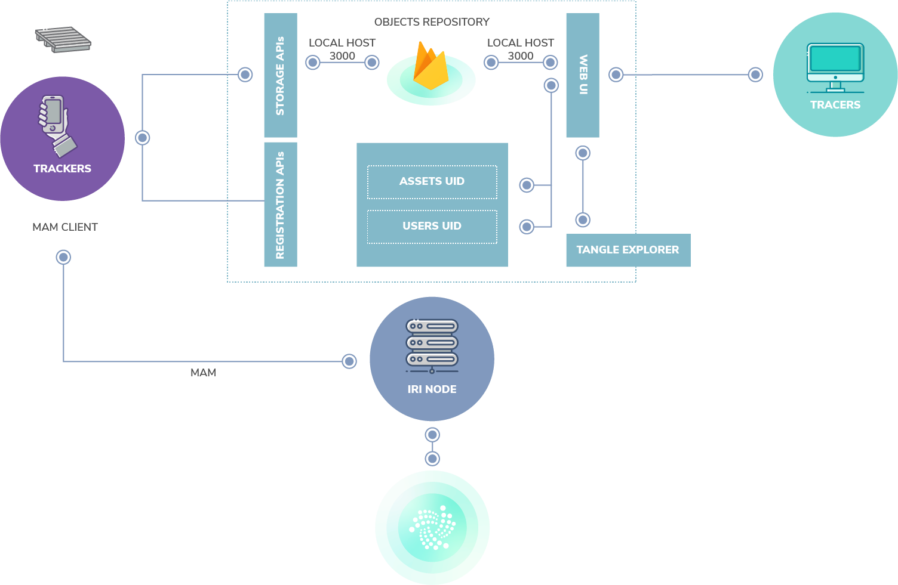
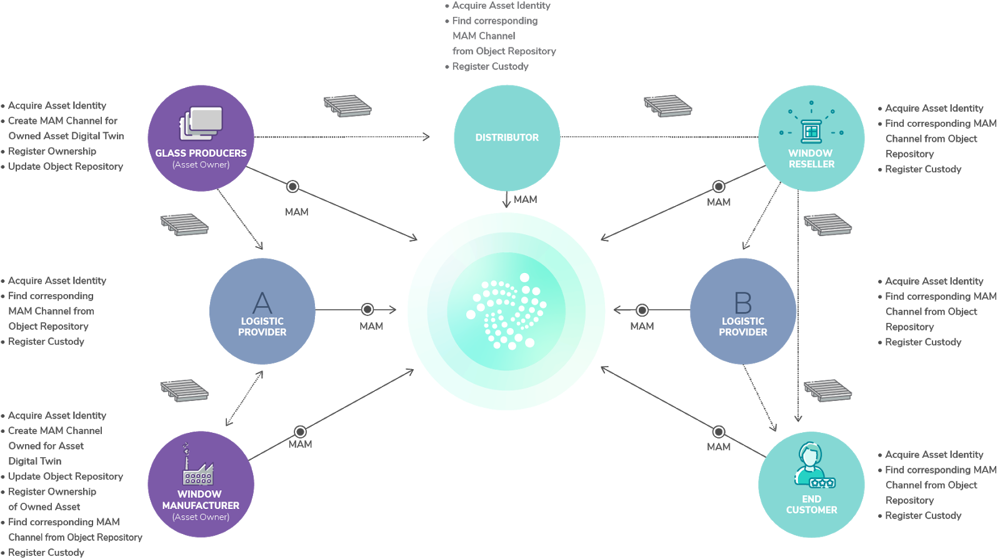
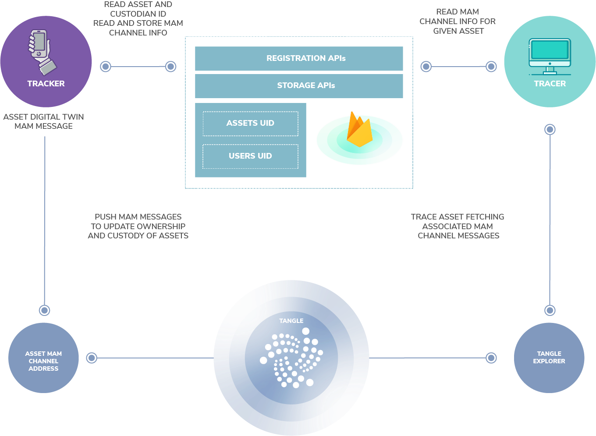

# アプリケーションアーキテクチャ
<!-- # Application architecture -->

**トラック&トレースアプリケーションはIOTA MAMプロトコルを使用して、回収可能資産にIDを付与し、MAMチャネルと呼ばれるトランザクションのストリームで回収可能資産を追跡します。**
<!-- **The track-and-trace application uses the IOTA MAM protocol to give returnable assets an ID and to track those assets in streams of transactions called MAM channels.** -->

:::warning:免責事項
人間の努力のように、オープンソースプロジェクトを実行することは、不確実性とトレードオフを伴います。以下に説明するアーキテクチャが、同様のシステムを展開するのに役立つことを願っていますが、間違いが含まれている可能性があり、すべての状況に対処することはできません。あなたのプロジェクトについて何か質問があれば、IOTA財団はあなたがあなた自身の研究をし、専門家を探し、そしてIOTAコミュニティとそれらを話し合うことを奨励します。
:::
<!-- :::warning:Disclaimer -->
<!-- Running an open source project, like any human endeavor, involves uncertainty and trade-offs. We hope the architecture described below helps you to deploy similar systems, but it may include mistakes, and can’t address every situation. If you have any questions about your project, we encourage you to do your own research, seek out experts, and discuss them with the IOTA community. -->
<!-- ::: -->

このアプリケーションは、IOTA MAM [JavaScriptライブラリ](https://github.com/iotaledger/mam.client.js)を使用して、回収可能資産にIDを付与し、すべての保管者を通じて回収可能資産を追跡します。
<!-- This application uses the IOTA MAM [JavaScript libraries](https://github.com/iotaledger/mam.client.js) to give a returnable asset an ID, and track that asset through every custodian. -->

## 前提条件
<!-- ## Prerequisites -->

このアプリケーションをテスト、編集、およびデプロイするには、JavaScript、React、NodeJS、およびデータベース管理システムに関するプログラミング知識が必要です。
<!-- To test, edit, and deploy this application, you need programming knowledge in JavaScript, React, NodeJS, and database management systems. -->

## マスク認証メッセージング
<!-- ## Masked authenticated messaging -->

ここでの回収可能資産のトラック&トレースは、一連のイベントで構成されています。このため、MAMチャネルを使用して特定の資産の保管の変更を登録すると、さまざまな保管担当者情報をIOTAタングルに保存し、同じチャネルのメッセージとして関連付けることが簡単になります。 MAMを使用すると、共有情報の暗号化と保護が可能になります。 MAMを使用しない場合は、代わりにIOTAタングルに独立したトランザクションを発行し、特定の資産に関連する保管の各変更に必要な情報を保存することでトランク&トレースを行うことができます。ただし、特定の資産に関連するすべての情報を調整してリンクするというアーキテクチャの複雑さは増します。 MAMが推奨ソリューション設計として選ばれたのはそのためです。
<!-- The track and trace of a given returnable asset consists of a series of events. Because of this, registering the change of custody of a given asset, through the use of MAM channels, makes it easy to store the different custodian information onto the IOTA Tangle and associate it as a message in the same channel. Using MAM allows for encryption and protection of the shared information. Without using MAM, this could alternatively be done by issuing independent transactions to the IOTA Tangle, storing the required information for each change of custody related to a given asset. However, the architecture complexity of reconciling and linking all the information associated to a given asset would increase. That's why MAM was chosen as preferred solution design. -->



トラッカーはアーキテクチャと対話して、資産の所有権と管理の変更を報告します。許可されたトレーサ（例：最後の保管者）はアーキテクチャに接続して、特定の資産に関する情報を取得します。
<!-- A tracker interacts with the architecture to report asset ownership and change of custody. Authorized tracers -->
<!-- connect to the architecture to fetch information about a given asset, e.g. its last custodian. -->

新しい回収可能資産がその所有者によって最初に登録されると、新しいIOTA MAMチャネルが作成されます。回収可能資産のデジタルツインは、以下の情報で作成されます。`&lt;assetUniqueID, assetOwnerID, assetCustodianID, location, time, status&gt;`
<!-- A new IOTA MAM channel is created once a new returnable asset is first registered by its owner. A digital twin for the returnable asset is created with the following information: `<assetUniqueID, assetOwnerID, assetCustodianID, location, time, status>`. -->

必要な情報は、モバイルアプリを通じて取得されます。
<!-- Required information is captured through a mobile app: -->

- `assetUniqueID`は、QRコードスキャンによって読み取られ、登録APIを通じてアクセスする`assetUniqueID`サーバー（例：GS1 SSCC）と照合されます。
<!-- - `assetUniqueID` is captured through QR-code scanning and matched against an `assetUniqueID` server (e.g., GS1 SSCC), accessed through Registration APIs; -->
- `assetOwnerID`に関する情報は、アプリを通じて挿入されるか、外部の情報源から取得されます（アプリを使用するための登録サーバーなど。この場合は会社のVAT登録番号が使用されます）。
<!-- - information about the `assetOwnerID` is either inserted through the app or fetched from an external source (e.g., a registration server for the use of the app; company VAT registration number is used in this case); -->
- `assetCustodianID`は最初は`assetOwnerID`と一致します。
<!-- - `assetCustodianID` initially match the `assetOwnerID`; -->
- `location`は携帯電話のGPSで取得できます（オプション）。
<!-- - location can be acquired by the mobile phone GPS (optional); -->
- `time`はトランザクションを開始したデバイス（携帯電話またはWebアプリケーション）によって取得されます。
<!-- - time it is acquired by the device initiating the transaction (mobile phone or webapp); -->
- `status`は使用中、返品または紛失のいずれかです。最初は使用中に設定されています。ただし、ステータスのさまざまなカスタムリストを定義できます。
<!-- - status can be either in-use, returned or lost. Initially it is set to in-use. However, any different custom list of statuses can be defined. -->

これらの情報は、JavaScript MAMクライアントライブラリを使用してIOTAタングルに保存されます。この機能は、アプリに埋め込むことも、外部サーバー（MAMサーバー）を介して実装することもできます。外部サーバー（MAMサーバー）との間で、セキュアなHTTPS REST APIを使用して情報を交換できます。この設計図のためにMAMライブラリは開発されたアプリに直接統合されています。
<!-- The information is stored on the IOTA Tangle using the javascript MAM client library. This can either be embedded into the app or implemented through an external server (MAM Server), to which the app can exchange information using secure HTTPS REST APIs. For this blueprint MAM libraries are integrated directly into the developed app. -->

**ヒント1：** 資産所有権は1回だけ作成および登録されます。資産の管理権は時間の経過とともに変化し、特定の資産の管理権の変化に関連する情報を集約するためにMAMチャネルを使用することは意味があります。MAMチャネルを使用することにより、実装の複雑さを制限でき、すべての異なる管理権の変更を適切な資産に簡単にリンクできます。さらに、MAMを使用することで、管理権の各変更に関連する関連情報へのアクセスも保護されます。
<!-- **Tip 1:** An asset ownership is created and registered only once. While the asset custody changes over time, it is meaningful to use a MAM channel for aggregating the information related to the change of custody of a given asset. This allows to easily link all the different change of custody to the right asset by limiting complexity of the implementation. Moreover use of MAM also protects access to the relevant information related to each change of custody. -->

各MAMチャネルの作成後、中央管理のバックエンドのオブジェクトリポジトリにデータが入力されます。オブジェクトリポジトリはFirebase NoSQLデータベースとして実装され、ポート3000を使用してデプロイされます。特定の資産IDに関連付けられたMAMチャネルに関連する情報をFirebase DBに追加して更新するためのストレージREST APIが提供されます。オブジェクトリポジトリに保存される情報には、IOTAタングル上でアクセス可能なチャネルのルートアドレスや制限付きMAMチャネルが使用されている場合、MAMチャネルに保存されている情報を復号化するために必要な暗号化キー（サイドキーと呼ばれます）が含まれます。次のタプルが作成され、オブジェクトリポジトリに保存されます。`&lt;assetUniqueID, channelRoot, channelSideKey&gt;`
<!-- After creation of each MAM channel, a central back-end Object Repository is populated. The Object Repository is implemented as Firebase NoSQL database and deployed using port 3000. Storage REST APIs are provided to populate and update the Firebase DB with information related to the MAM channel associated to a given asset ID. Information stored in the Object Repository includes the root address of the channel, e.g., where this can be accessed on the IOTA Tangle and the cryptographic key needed for decrypting the information stored in the channel (named side keys), in case restricted MAM channels are created. The following tuple is created and stored in the Object Repository: `<assetUniqueID, channelRoot, channelSideKey>`. -->

実装するモデルに応じて、オブジェクトリポジトリは、アプリまたはMAMサーバーのいずれかに実装されます。オブジェクトリポジトリへのアクセスは、特定の回収可能資産の所有者によって管理されるため、特定の回収可能資産に関連付けられている情報チェーンにアクセスして変更できるユーザーを確実に制御できます。
<!-- The Object repository is either populated by the app or the MAM Server, according to the implemented model. Access to the Object Repository is managed by the given returnable assets owner, thus guaranteeing control on who can access and modify the information chain associated to a given returnable asset. -->

**ヒント2：** 理想的には、すべての資産所有者は、外部のオブジェクトリポジトリを作成するのではなく、IOTAタングルおよびMAMチャネルへのアクセスに必要な情報を保存する機能を備えて、既存の資産リポジトリを管理システムの一部として拡張します。IBCSグループの場合、これは[IBCSトラッカーシステム](https://www.ibcstracker.com)に統合されています。
<!-- **Tip 2:** Ideally every asset owner will extend the existing assets repository as part of their management system with capability to store the required information for access to the IOTA Tangle and MAM channel, instead of creating an external Object Repository. In the case of IBCS Group this was integrated into [IBCS Tracker system](https://www.ibcstracker.com) -->

特定の回収可能資産の保管者が変更されると、新しい保管者に関する情報が既存のMAMチャネルに追加されます。そのために、新しいMAMメッセージが既存のチャネルに添付され、次の情報が更新されてタングルに保存されます。`&lt;assetCustodianID, location, time, status&gt;`
<!-- When the given returnable asset changes custodian, information about the new custodian is appended to the existing MAM channel. For that, a new MAM message is attached to the existing channel and the following information updated and stored on the Tangle: `<assetCustodianID, location, time, status>`. -->

これを実現するために、モバイルアプリまたは新しい保管者のMAMサーバーは、最初に、オブジェクトリポジトリから特定の資産に関連付けられているMAMチャネルのルートに関連する情報を取得する必要があります。これは、QRコードのスキャンから取得されるか、手動で挿入される`assetUniqueID`をプライマリーキーとして使用することによって行われます。これらの情報はそれぞれのMAMチャンネルに添付され、IOTAタングルにイミュータブルに保存されます。このために、以下の2つの：
<!-- In order to achieve this, the mobile app or the MAM Server of the new custodian needs to first retrieve the information related to the root of the MAM channel associated to the given asset from the Object Repository. This is done by using the `assetUniqueID`, as the primary key, which is obtained from the QR-code scanning or manually inserted. Information is then attached to the respective MAM channel and stored immutably onto the IOTA Tangle. For this, the two functions: -->

```javascript
createItem( eventBody, channel, secretKey, userId);
updateItem( eventBody, mam, newItemData, user);
```

既存のMAMチャネル情報にそれぞれアクセスして更新する（例えば、保存されているデジタルツインを更新するために新しいメッセージを追加する）関数が実装されています。Reactで書かれたWeb UI（WUI）は、MAMエクスプローラにアクセスして情報（例：特定の回収可能資産の現在の保管者と所在地）を取得するためのAPIを実装しています。タングル上の情報は、オブジェクトリポジトリから取得した必要なチャネルルートアドレスにアクセスすることによって取得できます。足りない資産は同じGUIから公言できます。足りない資産を処理する方法は、この設計図の範囲外です。
<!-- have been implemented in order to respectively access and update existing MAM channel information (e.g. adding new messages to update the stored digital twin).  -->
<!-- A Web UI (WUI) written in React implements APIs to access to the MAM explorer and to retrieve information, e.g. current custodian and location for a given returnable asset. Information on the Tangle are retrieved by accessing the required channel root address obtained from the Object Repository. A missing asset can be declared from the same  -->
<!-- GUI. How to handle missing assets is out of the scope of this blueprint. -->

以下のシーケンス図は、特定の回収可能資産を追跡するために必要なすべての手順をまとめたものです。
<!-- The sequence diagram below recaps all the steps needed to track a given returnable asset. -->



以下の通信図は、上記のアーキテクチャコンポーネント間で交換されるさまざまなメッセージを示しています。
<!-- The communication diagram below shows the different messages exchanged across the architecture components presented above. -->



さまざまなコンポーネントの実装に関する詳細は、コードの抜粋とともに以下に説明されています。
<!-- Details on the different components implementation is provided below, alongside with code snippets. -->

## デジタルツインのデータモデル
<!-- ## Data model of a digital twin -->

回収可能資産のデジタルツインには、以下のフィールドが含まれます。
<!-- A returnable asset digital twin contains the following fields: -->

```javascript
{
    "data": [{
        "assetUniqueID": "string",
        "assetOwnerID": "string",
        "assetUserID": "string",
        "location": ["latitude", "longitude"],
            "time": "date",
        "status": "string"
    }]
}
```

## IOTA構成要素
<!-- ## IOTA building blocks -->

トラッカーアプリは追跡を可能にするための資産デジタルツイン（MAMチャネルとメッセージ）の作成と更新を担当します。
<!-- The tracker app will be responsible of creating and updating assets digital twins as MAM Channels and messages in order to allow tracking. -->

```javascript
import Mam from 'mam.client.js';
import { isEmpty, uniqBy, pick, find, last } from 'lodash'; import { asciiToTrytes, trytesToAscii } from '@iota/converter'
import { createItem, updateItem } from './firebase';
import config from '../config.json';
```

まず、`mam.client.js`ライブラリをインポートする必要があります。
<!-- First, we need to import the `mam.client.js` library. -->

次にMAMチャネルを作成する前に、トランザクションが保存されるIOTAネットワーク（プロバイダ）を選択する必要があります。これは、メインのIOTAネットワーク、または`https://nodes.devnet.thetangle.org:443`のような開発用ネットワークのいずれかです。
<!-- Then before creating a MAM channels, we need to select the current IOTA network where transactions will be stored (provider). This could be the main IOTA Network or any dev network, such as: `https://nodes.devnet.thetangle.org:443` -->

```javascript
// Initialise MAM State with IOTA provider
let mamState = Mam.init(config.provider);
```

取得した新しい資産ごとに、最初に回収可能資産のデジタルツイン（`createItemChannel`）を作成する必要があります。
<!-- For each new assets acquired, we need first to create the returnable asset digital twin `(createItemChannel)`. -->

```javascript
// create a new Item (Asset)
export const createItemChannel = (project, itemId, request, userId) => {
…

const messageBody = {
        ...request,
        ...eventBody,
        time: null,
        location: null,
        assetUniqueID: null,
        assetOwnerID: null,
        assetUserID: null
    };
```

チャネルを設定する前に、チャネルモードを「制限付き」に設定することをお勧めします。これは、そのチャネルに関連する各MAMメッセージのペイロード（例えば、デジタルツインに含まれる情報）を暗号化すること、および選択された当事者だけにアクセスを保証することを可能にします（`Mam.changeMode()`）。
<!-- Before setting up the channel, it is recommended to set the channel mode to ‘restricted’. This allows to encrypt the payload (e.g., the information contained in the digital twin) of each MAM message associated to that channel and to guarantee access only to selected parties `(Mam.changeMode())`. -->

```javascript
// create a new restricted channel
const createNewChannel = async (payload, secretKey) => {
// Set channel mode for default state
  const defaultMamState = Mam.changeMode(mamState, 'restricted', secretKey);
  updateMamState(defaultMamState);
  const mamData = await publish(payload);
  return mamData;
};
```

これらの情報をIOTAタングルに公開します（`Mam.attach()`）。IOTAはトライトを使用しているので、MAMペイロードをタングルに送信する前にトライトに変換して（`asciiToTrytes(JSON.stringify(data))`）MAMメッセージを作成する（`Mam.create()`）必要があります。
<!-- We can then publish the information to the IOTA Tangle `(Mam.attach())`. Remember that IOTA uses Trytes so our MAM payload needs to be converted before sending it to the Tangle `(asciiToTrytes(JSON.stringify(data)))` and to create a MAM message `(Mam.create())`. -->

```javascript
// store new messages for each new asset and for each change of custody
// Publish to tangle
const publish = async data => {
  try {
    // Create MAM Payload - STRING OF TRYTES
    const trytes = asciiToTrytes(JSON.stringify(data));
    const message = Mam.create(mamState, trytes);

    // Save new mamState
    updateMamState(message.state);

    // Attach the payload.
    await Mam.attach(message.payload, message.address);
    return { root: message.root, state: message.state };
  } catch (error) {
    console.log('MAM publish error', error);
    return null;
  }
};
```

新しいMAMチャネルが作成されるか既存のMAMチャネルが更新されたら、オブジェクトリポジトリを更新する必要があります。これは、上で紹介した`createItem()`および`updateItem()`関数を介して実行できます。
<!-- Once a new MAM channel is created or an existing one is updated, we need to update the object repository. This can be done through the `createItem()` and `updateItem()` functions introduced above and described below. -->

```javascript
export const createItem = (eventBody, channel, secretKey, userId) => {
  // Create item reference
  const itemsRef = getItemReference(eventBody.itemId);
  appendItemToNewUser(userId, eventBody.itemId);

  itemsRef.set({
      ...eventBody,
      mam: {
          root: channel.root,
          seed: channel.state.seed,
          next: channel.state.channel.next_root,
          start: channel.state.channel.start,
          secretKey,
    },
  });
};
```

```javascript
export const updateItem = (eventBody, mam, newItemData, user) => {
  // Create reference
  const itemsRef = getItemReference(eventBody.itemId);

   itemsRef.update({
       ...eventBody,
       mam: {
           root: mam.root,
           secretKey: mam.secretKey,
           seed: newItemData.state.seed,
           next: newItemData.state.channel.next_root,
           start: newItemData.state.channel.start,
    },
  });
};
```

`updateItem()`関数では、まずFirebaseオブジェクトリポジトリで`itemId`フィールドによって既存の資産が検索され、次にそのオブジェクトに関するすべての情報が新しいMAMチャネルまたはメッセージの詳細で更新されます。
<!-- In the `updateItem()` function, first the Firebase Object Repository is searched for an existing asset by the 'itemId' field, then any information for that object is updated with the new MAM channel or message details. -->
