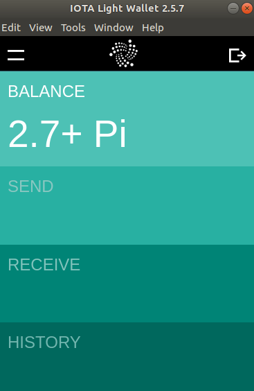

# プライベートタングルを設定する
<!-- # Set up a private Tangle -->

**プライベートタングルは運用者がコントロールするもので、運用者が知っているノードだけを含みます。MainnetやDevnetなどのパブリックIOTAネットワークを使用せずにアプリケーションをテストしたい場合は、プライベートタングルを設定することをお勧めします。そのためには、コンパスを実行して、コンパスをIRIノードに接続します。**
<!-- **A private Tangle is one that you control and that contains only nodes that you know. You may want to set up a private Tangle if you want to test an application without using a public IOTA network such as the Mainnet or the Devnet. To do so, you can run Compass and connect it to an IRI node.** -->

この基本設定では、[Devnet](root://getting-started/0.1/references/iota-networks.md)と同じ構成設定を使用して、IRIノードとコンパスを同じサーバーまたは仮想マシンにインストールします。
<!-- For this basic setup, you'll install an IRI node and Compass on the same server or virtual machine with the same configuration settings as the [Devnet](root://getting-started/0.1/references/iota-networks.md). -->


## 前提条件
<!-- ## Prerequisites -->

以下の最小要件を満たすLinuxサーバー。WindowsまたはmacOSオペレーティングシステムを使用している場合は、[仮想マシンにLinuxサーバーを作成](root://general/0.1/how-to-guides/set-up-virtual-machine.md)できます。
<!-- A Linux server with the following minimum requirements. If you are on a Windows or macOS operating system, you can [create a Linux server in a virtual machine](root://general/0.1/how-to-guides/set-up-virtual-machine.md). -->

* Ubuntu 18.04サーバー/仮想マシンの新規インストール
<!-- * A new installation of an Ubuntu 18.04 Server / Virtual Machine -->
* 最低8GBのRAM
<!-- * At least 8GB RAM -->
* できれば4 CPUコア。コアが多いほど、マークル木の生成が速くなります。
<!-- * Preferably 4+ CPU cores, the more cores the faster the Merkle tree will be generated. -->
* 10GB以上のSSD
<!-- * At least a 10GB SSD -->

## 手順1. 依存関係をインストールする
<!-- ## Step 1. Install the dependencies -->

コンパスは[Bazel](https://bazel.build/)を使ってビルドし、[Docker](https://www.docker.com/)で実行するので、両方がインストールされていることを確認する必要があります。
<!-- Compass uses [Bazel](https://bazel.build/) to build and [Docker](https://www.docker.com/) to run, so we need to make sure both are installed. -->

1. Bazel用の依存関係をインストールします。
  <!-- 1. Install the dependencies for Bazel -->

    ```bash
    sudo apt-get install pkg-config zip g++ zlib1g-dev unzip python
    ```

2. 最新のBazelインストーラをダウンロードします。
  <!-- 2. Download the latest Bazel installer -->

    ```bash
    wget https://github.com/bazelbuild/bazel/releases/download/0.18.0/bazel-0.18.0-installer-linux-x86_64.sh
    ```

3. スクリプトを実行する前に実行できることを確認します。
  <!-- 3. Check that you can execute the script before you run it -->

    ```bash
    chmod +x bazel-0.18.0-installer-linux-x86_64.sh
    ```

4. `--user`フラグを使用して、アクティブユーザーの下にBazelをインストールします。
  <!-- 4. Install Bazel under your active user, using the `--user` flag -->

    ```bash
    ./bazel-0.18.0-installer-linux-x86_64.sh --user
    ```
    Bazelをインストールした後にコンピュータを再起動する必要があるかもしれません。
    <!-- You may need to restart your computer after you install Bazel. -->

5. 必要なパッケージをインストールします。
  <!-- 5. Install the necessary packages -->

    ```bash
    sudo apt install apt-transport-https ca-certificates curl software-properties-common
    ```

6. Dockerをインストールします。
  <!-- 6. Install Docker -->

    ```bash
    curl -fsSL https://download.docker.com/linux/ubuntu/gpg | sudo apt-key add -
    sudo add-apt-repository "deb [arch=amd64] https://download.docker.com/linux/ubuntu bionic stable"
    sudo apt update
    sudo apt install docker-ce
    ```

7. JSONデータをフォーマットするための`jq`ツールをインストールします。
  <!-- 7. Install the `jq` tool for formatting JSON data -->

    ```bash
    sudo add-apt-repository universe
    sudo apt install jq
    ```

## 手順2. マークル木を計算する
<!-- ## Step 2. Compute the Merkle tree -->

このガイドでは、[depth](../references/compass-configuration-options.md)16の[マークル木](root://the-tangle/0.1/concepts/the-coordinator.md#milestones)を使用します。これにより、コンパスはマイルストーン送信の間隔に応じて、約45日間マイルストーンを送信できます。
<!-- For this guide, we use a [Merkle tree](root://the-tangle/0.1/concepts/the-coordinator.md#milestones) with a [depth](../references/compass-configuration-options.md) of 16, which allows Compass to send milestones for around 45 days, depending on the interval between them. -->

:::info:
`depth`パラメータがマークル木を計算するのにかかる時間と総ネットワーク稼働時間の両方にどのように影響するかを示す[サンプルのマークル木計算時間]をご覧ください。
:::
<!-- :::info: -->
<!-- [See our example Merkle tree compute times](../references/merkle-tree-compute-times.md) that show how the `depth` parameter affects both the time it takes to compute the Merkle tree and the total network uptime. -->
<!-- ::: -->

コンパスリポジトリには、後で使用するためにマークル木を作成して`data`ディレクトリに保存するためのツールが含まれています。
<!-- The Compass repository includes a tool to compute a Merkle tree and save it in a `data` directory for Compass to use later on.  -->

1. コンパスのGitHubリポジトリをクローンします。
  <!-- 1. Clone the Compass GitHub repository -->

    ```bash
    git clone https://github.com/iotaledger/compass.git
    cd compass
    ```

2. マークル木を計算する`layers_calculator`ツールをビルドします。
  <!-- 2. Build the `layers_calculator` tool that will compute the Merkle tree -->

    ```bash
    bazel run //docker:layers_calculator
    ```

    このプロセスには少し時間がかかります。標準出力に次のように表示されます。
    <!-- This process can take some time. You should see the following in the output: -->

    ```
    INFO: SHA256 (https://github.com/grpc/grpc-java/archive/fe7f043504d66e1b3f674c0514ce794c8a56884e.zip) = 19c51698d4837d1978a10ed7a01f4e45a0b15bcbd3db44de2a2a1c3bdd1cf234
    Analyzing: target //docker:layers_calculator (8 packages loaded)
    ```

3. コンパス用のシードを作成します。コンパスはバンドルに署名するための公開鍵/秘密鍵を導出するためにこのシードを使用します。
  <!-- 3. Create a seed for Compass. Compass will use this seed to derive public/private keys for signing bundles. -->

    ```bash
    cat /dev/urandom |LC_ALL=C tr -dc 'A-Z9' | fold -w 81 | head -n 1 
    ```

4. シードのバックアップを作成します。
  <!-- 4. Create a backup of the seed -->

    :::danger:Keep your seed safe
    An attacker with the seed could send fraudulent milestones and disrupt the operation of the network.
    :::

5. コンパスをセットアップして実行するためのスクリプトを含むディレクトリに移動します。
  <!-- 5. Change into the directory that contains the scripts for setting up and running Compass -->

    ```bash
    cd docs/private_tangle
    ```

6. サンプル設定ファイルをコピーします。
  <!-- 6. Copy the example configuration file -->

    ```bash
    cp config.example.json config.json
    ```

7. `config.json`ファイルを開き、`seed`フィールドの値を手順3で作成したシードに置き換えます。
  <!-- 7. Open the `config.json` file and replace the value of the `seed` field with the seed you created in step 3 -->

    ```bash
    nano config.json
    ```

8. `depth`フィールドの値を`16`に変更します。
  <!-- 8. Change the value of the `depth` field to `16` -->

    完成した`config.json`ファイルは次のようになります。
    <!-- The finished `config.json` file should look like this: -->

    ```json
    {
        "seed": "MYSEEDHEREPLEASEREPLACEMEIMMEDIATELYWITHSOMETHINGSECURE99999999999999999999999999",
        "powMode": "CURLP81",
        "sigMode": "CURLP27",
        "security": 1,
        "depth": 16,
        "milestoneStart": 0,
        "mwm": 9,
        "tick": 60000,
        "host": "http://localhost:14265"
    }
    ```

    :::info:
    独自のプライベートタングルのための[コンパスの設定をカスタマイズする方法](../references/compass-configuration-options.md)を調べる。
    :::
    <!-- :::info: -->
    <!-- Find out how to [customize the configuration of Compass](../references/compass-configuration-options.md) for your own private Tangle. -->
    <!-- ::: -->

9. `docs/private_tangle`ディレクトリのスクリプトを実行してマークル木を計算します。
  <!-- 9. Compute the Merkle tree by executing the script in the `docs/private_tangle` directory -->

    ```bash
    sudo ./01_calculate_layers.sh
    ```

このプロセスにはしばらく時間がかかります（4コアの仮想マシンでは約15分かかります）。プロセスが終了すると、マークル木のルートが標準出力に表示されます。
<!-- This process will take a while (with a 4 core virtual machine it takes around 15 minutes). After the process finishes, the root of the Merkle tree is displayed in the output: -->

```shell
[main] INFO org.iota.compass.LayersCalculator - Calculating 65536 addresses.
...
[main] INFO org.iota.compass.LayersCalculator - Successfully wrote Merkle Tree with root: JMRTYHMGNZGNOLPSSBVLWRPMGIAMOXPLURNDIBKXIFTCJCLOYKH9FMVNKPBVFVMGSUFEYVUUIEARFQXAK
```

マークル木は`data`ディレクトリに格納されているため、コンパスは実行開始時に秘密鍵を使用できます。
<!-- The Merkle tree is stored in the data directory, so Compass can use the private keys when it starts running. -->

## 手順3. IRIノードを実行する
<!-- ## Step 3. Run an IRI node -->

コンパスはマイルストーンをIRIノードに送信する必要があります。コンパスは、HTTP RPC APIを介してマイルストーンをIRIノードに送信します。
<!-- Compass must send milestones to an IRI node. Compass sends milestones to an IRI node through an HTTP RPC API. -->

IRIノードにコンパストランザクションを信頼できるマイルストーンとして認識させるために、デフォルトのIRI Dockerコンテナをいくつかの追加パラメータと共に使用するスクリプトを作成しています。
<!-- To make the IRI node recognize Compass transactions as trusted milestones, we created a script that uses the default IRI Docker container with some additional parameters. -->

IRIノードは、`snapshot.txt`ファイルを使用して台帳の初期状態を設定する必要があります。
<!-- The IRI node must use a snapshot.txt file to set the initial state of the ledger. -->

`snapshot.example.txt`ファイルは、次のシードから派生した最初のアドレスに2.7PiのIOTAトークン総供給量を入れます。
<!-- The `snapshot.example.txt` file puts the total IOTA supply of 2.7Pi in the first address that's derived from the following seed: -->
```bash
SEED99999999999999999999999999999999999999999999999999999999999999999999999999999
```

このシードの最初のアドレス（インデックス0）は以下で、チェックサムはありません。
```bash
FJHSSHBZTAKQNDTIKJYCZBOZDGSZANCZSWCNWUOCZXFADNOQSYAHEJPXRLOVPNOQFQXXGEGVDGICLMOXX
```
<!-- The first address (index 0) of this seed is  `FJHSSHBZTAKQNDTIKJYCZBOZDGSZANCZSWCNWUOCZXFADNOQSYAHEJPXRLOVPNOQFQXXGEGVDGICLMOXX` (excluding the checksum). -->

1. `snapshot.txt`ファイルを作成します。
  <!-- 1. Create a `snapshot.txt` file -->

    ```bash
    touch snapshot.txt
    nano snapshot.txt
    ```

2. `snapshot.txt`ファイルに次の行を追加します。
  <!-- 2. Add the following line to the `snapshot.txt` file: -->

    ```shell
    FJHSSHBZTAKQNDTIKJYCZBOZDGSZANCZSWCNWUOCZXFADNOQSYAHEJPXRLOVPNOQFQXXGEGVDGICLMOXX;2779530283277761
    ```

    :::warning:
    2.7PiのIOTAトークンの総供給量を超えないでください。
    :::
    <!-- :::warning: -->
    <!-- Do not exceed the maximum supply of 2.7Pi -->
    <!-- ::: -->

3. IRIを実行します。
  <!-- 3. Run the IRI -->

    ```bash
    sudo ./02_run_iri.sh
    ```

    :::info:
    隣接ノードがあなたのノードに自動的に接続することを許可する場合は、`02_run_iri.sh`ファイルを編集して`--auto-tethering-enabled true`フラグを他のフラグのリストに追加します。

    独自のプライベートタングルに合わせてIRIをカスタマイズするために変更できる[他のフラグ](root://iri/0.1/references/iri-configuration-options.md)を調べる。
    :::

    <!-- :::info: -->
    <!-- If you want to allow neighbors to automatically connect to your node, edit the `02_run_iri.sh` file and add the `--auto-tethering-enabled true` flag to the list of other flags. -->
    <!--  -->
    <!-- Find out which [other flags](root://iri/0.1/references/iri-configuration-options.md) you can change to customize the IRI for your own private Tangle. -->
    <!-- ::: -->

    :::info:
    `malformed snapshot state file`エラーが発生した場合は、`snapshot.txt`ファイルを調べて、行の先頭に改行が含まれていないことを確認してください。

    `NumberFormatException`エラーまたは`IllegalArgumentException`エラーが発生した場合は、セミコロンの前後にスペース文字がないことを確認してください。
    :::
    <!-- :::info: -->
    <!-- If you see a `malformed snapshot state file` error, check the snapshot.txt file and make sure that you didn't include a line break at the en of the line. -->
    <!--  -->
    <!-- If you see a `NumberFormatException` error or an `IllegalArgumentException` error, check that no space characters are either side of the semicolon. -->
    <!-- ::: -->

4. コマンドプロンプトで**Ctrl** + **C**を押します。IRIはバックグラウンドで実行を続けます。
  <!-- 4. Press **Ctrl** + **C** in the command prompt. IRI will continue to run in the background. -->

:::danger:重要
コンパスが接続しているIRIノードが危険にさらされると、攻撃者はコンパスを操作して自身に有利なように操作する可能性があります。考えられるシナリオは次のとおりです。
- 通常のチップ選択アルゴリズムよりも攻撃者のトランザクションを優先するチップトランザクションを返します。
- 台帳状態と矛盾するチップトランザクション（IOTAトークンの二重支出）を返し、コンパスはこの矛盾するトランザクションを確定するマイルストーンを送信します。すると他のIRIノードはこのマイルストーンを受け入れず、これ以上トランザクションは確定されません。
- マイルストーントランザクションの残りのネットワークへの伝達を停止し、それ以上トランザクションが確定されないようにします。
:::
<!-- :::danger:Important -->
<!-- If the IRI node to which Compass is connected becomes compromised, an attacker could manipulate Compass to receive favorable treatment. Possible scenarios include the following: -->
<!-- - Return tip transactions that prioritize the attackers transactions over the regular tip selection algorithm. -->
<!-- - Return tip transactions that conflict with the ledger state (double spend IOTA tokens) causing Compass to send an inconsistent milestone. IRI nodes will not accept this milestone and no more transactions will be confirmed. -->
<!-- - Stop propagating milestone transactions to the rest of the network, causing no more transactions to be confirmed. -->
<!-- ::: -->

## 手順4. コンパスを実行する
<!-- ## Step 4. Run Compass -->

マークル木を作成してIRIノードを実行したら、コンパスを実行できます。
<!-- After you've created the Merkle tree and you're running an IRI node, you can run Compass. -->

1. `compass`ディレクトリに戻り、Bazelを実行します。
  <!-- 1. Go back to your `compass` directory and run Bazel -->

    ```bash
    cd ~/compass/
    bazel run //docker:coordinator
    ```

2. コンパスをセットアップして実行するためのスクリプトを含むディレクトリに移動します。
  <!-- 2. Change into the directory that contains the scripts for setting up and running Compass -->

    ```bash
    cd docs/private_tangle
    ```

3. コンパスを実行します。
  <!-- 3. Run Compass -->

    ```bash
    sudo ./03_run_coordinator.sh -bootstrap -broadcast
    ```

    :::info:
    コンパスは不定の`while`ループに入り、マイルストーンの送信を開始します。

    セットアップ中に`-bootstrap`フラグが渡されると、コンパスは前のマイルストーンを順番に参照する一連の4つのマイルストーンを作成します。

    その後、コンパスは次の手順でマイルストーンを送信します。
    - IRIノードにチップトランザクションを依頼します（[チップ選択](root://the-tangle/0.1/concepts/tip-selection.md)）。
    - マイルストーンをブロードキャストするようにIRIノードに依頼します。
    - 次の`tick`間隔までスリープします。
    :::
    <!-- :::info: -->
    <!-- Compass enters an indefinite `while` loop and starts sending milestones. -->
    <!--  -->
    <!-- When the `-bootstrap` flag is passed during setup, Compass creates a chain of four milestones that sequentially reference the previous milestone. -->
    <!--  -->
    <!-- Then, Compass sends milestones by doing the following: -->
    <!-- * Ask the IRI node for tip transactions ([tip selection](root://the-tangle/0.1/concepts/tip-selection.md)) -->
    <!-- * Ask the IRI node to broadcast the milestone -->
    <!-- * Sleep until the next tick interval -->
    <!-- ::: -->

:::success:コンパスはあなた自身のIOTAネットワークでマイルストーンを送っています！:tada:
コンパスを再起動した場合、`-bootstrap`フラグを渡す必要はありません（フラグを渡してもコンパスは起動しません）。ただし、コンパスがマイルストーンをIRIノードにブロードキャストするように、セキュリティ対策として`-broadcast`フラグを渡す必要があります。
:::
<!-- :::success:Compass is sending milestones in your own IOTA network! :tada: -->
<!-- If you restart Compass, you don't need to pass it the `-bootstrap` flag (Compass won't start if you do). But, you should pass it the `-broadcast` flag as a security measure so that Compass broadcasts its milestones to the IRI node. -->
<!-- ::: -->

## 手順5. ネットワークをテストする
<!-- ## Step 5. Test your network -->

アプリケーションが実行されているときは、アドレス`http://localhost:14265`にあるIRIノードのAPIポートを介してネットワークと対話できます。
<!-- When the application is running, you can interact with the network through the IRI node's API port at the following address http://localhost:14265. -->

APIエンドポイントの一覧については、[IRI APIリファレンス](root://iri/0.1/references/api-reference.md)を参照してください。
<!-- For a list of API endpoints see the [IRI API reference](root://iri/0.1/references/api-reference.md). -->

--------------------
### getBalances
シード`SEED9999999999999999999999999999999999999999999999999999999999999999999999999999999`の合計残高を取得するには、[`getBalances`](root://iri/0.1/references/api-reference.md#getbalances)エンドポイントを呼び出します。これまでにIOTAクライアントライブラリを使用したことがない場合は、[このチュートリアル](root://getting-started/0.1/tutorials/send-a-zero-value-transaction-with-nodejs.md)を完了することをお勧めします。

 ```js
 var request = require('request');

 const iota = require('@iota/core');

 Iota = iota.composeAPI({
     provider: 'http://localhost:14265'
 });

 var address = iota.generateAddress('SEED99999999999999999999999999999999999999999999999999999999999999999999999999999',0);

 getBalance(address);

 function getBalance(address) {

     var command = {
     'command': 'getBalances',
     'addresses': [
     address
     ],
     'threshold':100
     }

     var options = {
     url: 'http://localhost:14265',
     method: 'POST',
     headers: {
     'Content-Type': 'application/json',
     'X-IOTA-API-Version': '1',
     'Content-Length': Buffer.byteLength(JSON.stringify(command))
     },
     json: command
     };

     request(options, function (error, response, data) {
         if (!error && response.statusCode == 200) {
         console.log(JSON.stringify(data,null,1));
         }
     });
 }
 ```
---
### レスポンス例

このスレポンス例は、2.7Piの残高があることを示しています。

```json
{
 "balances": [
  "2779530283277761"
 ],
 "references": [
  "BDZPAONKWQTVCXFFO9GBTJ9GGWPRLITXZ9BMYALTCVWNOLFYPNHFJHPDWICRPGCZWUNDQHV9UDEXGW999"
 ],
 "milestoneIndex": 7,
 "duration": 1
}
```
--------------------

## 手順6. ウォレットを介してネットワークに接続する
<!-- ## Step 6. Connect to the network through a wallet -->

ユーザーインターフェイスを介してネットワーク上でトランザクションを送受信したい場合は、[IOTA Light Wallet](https://github.com/iotaledger/wallet/releases)を使用できます。
<!-- If you want to send and receive transactions on the network through a user interface, you can use the [IOTA Light Wallet](https://github.com/iotaledger/wallet/releases). -->



1. ウォレットを開き、以下のシードでログインします
  <!-- 1. Open the wallet and log in with your seed -->

    `SEED99999999999999999999999999999999999999999999999999999999999999999999999999999`

2. ノードに接続するには、**ツール** > **ノード設定の編集**の順に選択して、ノードのURL`http://localhost:14265`を入力します。
  <!-- 1. To connect to your node, go to **Tools** > **Edit Node Configuration**, and enter the URL of your node (http://localhost:14265). -->

    

3. 完全な残高を見るためには、**受信** > **タングルへアタッチ**を行います。
  <!-- 3. Go to **RECEIVE** > **ATTACH TO TANGLE** to see your full balance -->

4. テストトランザクションを送信して、コンパスのマイルストーンによって確定されたトランザクションを確認します。
  <!-- 4. Send test transactions and see them confirmed by Compass milestones -->

## 次のステップ
<!-- ## Next steps -->

* [ノードのイベントを購読し](root://iri/0.1/how-to-guides/subscribe-to-events-in-an-iri-node.md)、確定されたトランザクションに関する情報を受け取ります。
<!-- * [Subscribe to events on your node](root://iri/0.1/how-to-guides/subscribe-to-events-in-an-iri-node.md) and receive information about confirmed transactions. -->

* [Devnet](root://getting-started/0.1/references/iota-networks.md)に似たアーキテクチャを作るために独自のネットワークに複数のノードを追加してみてください。
<!-- * Try adding multiple nodes to your network to make a similar architecture to the [Devnet](root://getting-started/0.1/references/iota-networks.md) -->


