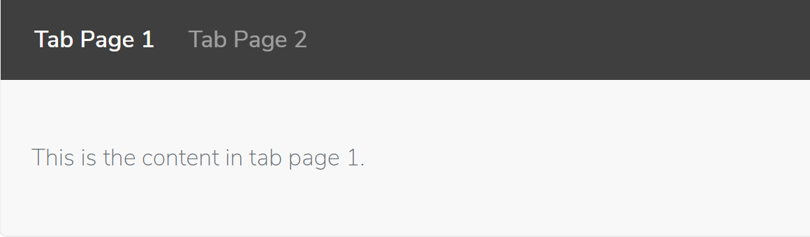
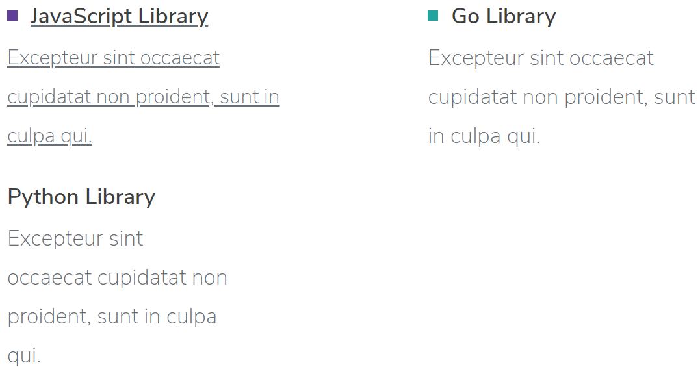
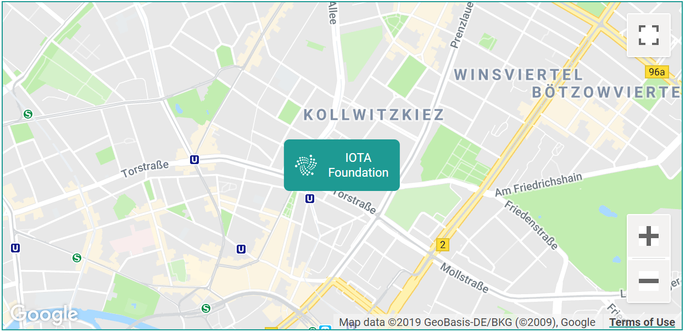
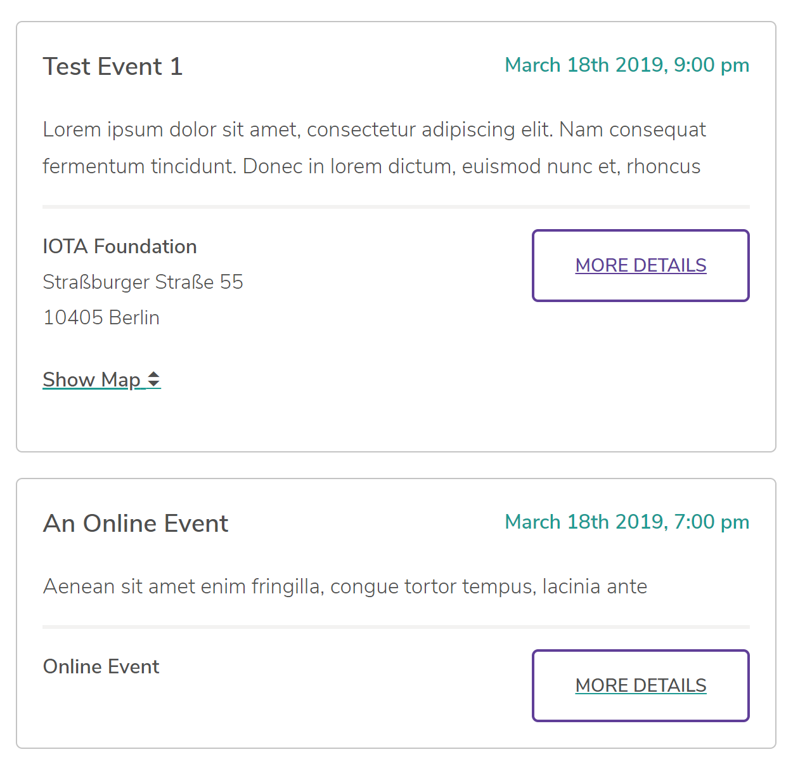
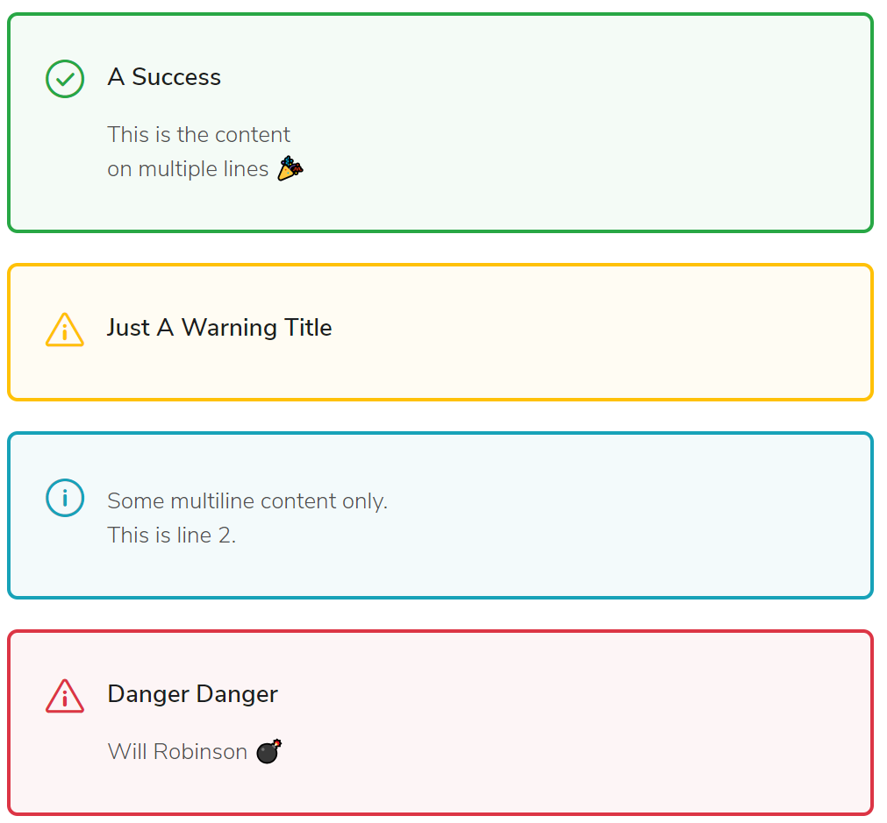

# スタイルガイド
<!-- # Style guide -->

記事を作成または編集する場合は，スタイルガイドに従って次のことを行ってください．
<!-- If you are creating or editing an article, please follow our style guide to help us do the following: -->

- 一貫した声のトーンで作成し，維持する．
<!-- - Create and maintain a consistent tone of voice -->
- 標準形式のドキュメントを提供する．
<!-- - Offer documentation in a standard format -->
- ネイティブでない英語の読者向けに読みやすいようにドキュメントを作成する．
<!-- - Make our documentation straightforward to read for non-native English readers -->
- ドキュメントが読者を教育していることを確認する．
<!-- - Make sure that our documentation educates our readers -->

このガイドでは説明していない記述について質問がある場合は，[Googleスタイルガイド](https://developers.google.com/style/)を使用してください．
<!-- If you have a question about writing that we don't cover in this guide, use the [Google style guide](https://developers.google.com/style/). -->

## マークダウン
<!-- ## Markdown -->

ドキュメントにはマークダウンの拡張バージョンを使用しています．以前にマークダウンを使用したことがない場合は，これらの[ヒント](https://github.com/adam-p/markdown-here/wiki/Markdown-Cheatsheet)を参照してください．
<!-- We use an enhanced version of markdown for our documentation. Please refer to these [tips](https://github.com/adam-p/markdown-here/wiki/Markdown-Cheatsheet) if you haven't used markdown before. -->

### タブ付きコントロール
<!-- ### Tabbed controls -->

タブ付きコントロールは，さまざまなユーザー向けのコンテンツを作成したり，複数のコードサンプルなどのユースケースを作成するのに役立ちます．
<!-- Tabbed controls are useful for creating content for different users or use cases such as multiple code samples. -->

タブ付きコードサンプルを作成するには，次の構文を使用します．
<!-- To create tabbed code samples, use the following syntax: -->

```markdown
--------------------
### タブページ1
ここは，タブページ1のコンテンツです．
---
### タブページ2
ここは，タブページ2のコンテンツです．
--------------------
```

:::info:
h3見出しはタブラベルです．
:::
<!-- :::info: -->
<!-- The h3 heading is the tab label. -->
<!-- ::: -->



### カード
<!-- ### Cards -->

カードは，複数のタイプまたはカテゴリをリストする必要があるプロジェクトのランディングページに役立ちます．
<!-- Cards are useful for project landing pages, where you need to list more than one type or category. -->

カードを作成するには，次の構文を使用します．
<!-- To create a card, use the following syntax: -->

```markdown
-------------------------
Image
## ファイルへのリンクを含むタイトル
データサイロにより，異なるデータポイント間でデータを売買することが難しくなります．この課題を克服するために，データマーケットプレイスはIOTA MAMチャネルを使用してデータサイロを開き，ユーザーがデータと引き換えにIOTAトークンでのマイクロペイメントをデータ所有者に行えるようにします．
-------------------------
```


### 色付きの見出し
<!-- ### Colored headings -->

色付きの見出しは，異なる見出しをより明確に区別するのに役立ちます．
<!-- Colored headings are useful for showing a clearer distinction between to different headings. -->

色付きの見出しを作成するには，次の構文を使用します．
<!-- To create a colored heading, use the following syntax: -->

```markdown
### **公式サポート** ###

### __コミュニティサポート__ ###
```


### 色付きのバレット
<!-- ### Colored bullets -->

色付きの箇条書きは，色付きの見出しの下にコンテンツをリストするのに役立ちます．
<!-- Colored bullets are useful for listing content under colored headings. -->

色付きの箇条書きを作成するには，次の構文を使用します．
<!-- To create a colored bullet, use the following syntax: -->

```markdown
---------------
#### **JavaScriptライブラリ** ####
Link to file

Excepteur sint occaecat cupidatat non proident, sunt in culpa qui.
---
#### __Goライブラリ__ ####
Excepteur sint occaecat cupidatat non proident, sunt in culpa qui.
---
#### Pythonライブラリ ####
Excepteur sint occaecat cupidatat non proident, sunt in culpa qui.
---------------
```



### 絵文字
<!-- ### Emoji -->

コンテンツで絵文字を使用すると，読者を引き付けるのに役立ちます．
<!-- Using an emoji in your content can help to engage the reader. -->

:::warning:
特定の絵文字には，異なる文化で異なる意味があります．たとえば，ブラジルではOKシンボル:ok_hand:は失礼であると見なされ，中東ではサムズアップシンボル:+1:も同様です．
:::
<!-- :::warning: -->
<!-- Certain emoji have different meanings in different cultures. For example, in Brazil the OK symbol :ok_hand: is considered rude, and in the Middle East, so is the thumbs-up symbol :+1:. -->
<!-- ::: -->

絵文字を作成するには，次の構文を使用します．
<!-- To create an emoji, use the following syntax: -->

```markdown
:smile:
:laughing:
```


使用可能な絵文字のリストについては，このJSONファイルを参照してください：[https://github.com/muan/emojilib/blob/master/emojis.json](https://github.com/muan/emojilib/blob/master/emojis.json)
<!-- For a list of available emoji, see this JSON file: [https://github.com/muan/emojilib/blob/master/emojis.json](https://github.com/muan/emojilib/blob/master/emojis.json) -->

### Googleマップ
<!-- ### Google maps -->

Googleマップは，`¬¬¬`フェンシングで囲むことにより，コンテンツに埋め込むことができます．次に，タイプを`[map]`として指定し，次のようにオブジェクトのJSON構成を提供できます．
<!-- A Google map can be embedded in your content by surrounding it with `¬¬¬` fencing. You can then specify the type as `[map]` and provide the JSON configuration for the object as follows: -->

```markdown
¬¬¬
[map]
{
    "zoom":14,
    "center": {
        "lat": 52.5294498,
        "lng": 13.412903
    },
    "markers": [
        {
            "name": "IOTA Foundation",
            "lat": 52.5294498,
            "lng": 13.412903
        }
    ]
}
¬¬¬
```



### データフィード
<!-- ### Data feeds -->

フィードを`¬¬¬`フェンシングで囲むことにより，コンテンツに埋め込むことができます．次に，タイプを `[feed]`として指定し，次のようにオブジェクトのJSON構成を提供できます．
<!-- A feed can be embedded in your content by surrounding it with `¬¬¬` fencing. You can then specify the type as `[feed]` and provide the JSON configuration for the object as follows: -->

```markdown
¬¬¬
[feed]
{
    "displayType": "event",
    "context": "training"
}
¬¬¬
```

`displayType`フィールドはコンテンツがページ上でどのようにレンダリングされるかを指定し，`context`フィールドはドキュメントAPIを使用してデータを取得する場所を決定するために使用されます．例：`https://docs-api.iota.org/feed/training`．フィードリストはページングをサポートし，必要に応じて表示します．ページの目次は，レンダリングされたアイテムのh2ヘッダーから動的に生成されます．
<!-- The `displayType` field specifies how the content will be rendered on the page and the `context` field is used to determine where the data is retrieved from using the documentation api e.g. `https://docs-api.iota.org/feed/training`. The feeds list supports paging and will show it when necessary. The table of contents for the page is dynamically generated from any h2 headers in the rendered items. -->



### メッセージボックス
<!-- ### Message boxes -->

メッセージボックスは，特定の情報に注意を引くのに役立ちます．
<!-- Message boxes are useful for bringing attention to certain information. -->

メッセージボックスを作成するには，次の構文を使用します．
<!-- To create a message box, use the following syntax: -->

```markdown
:::success:A Success
This is the content,
on multiple lines :tada:
:::

:::warning:Just A Warning Title:::

:::info:
Some multiline content only.
This is line 2.
:::

:::danger:Danger Danger
Will Robinson :bomb:
:::
```



:::info:
情報に注意を引くには，`info`ボックスを使用します．たとえば，読者にヒントを与えることができます．`info`ボックスがないと，ユーザーは貴重な時間を失い，何かが機能しない理由を理解しようとするときにイライラすることがあります．
:::
<!-- :::info: -->
<!-- Use an `info` box to bring attention to informations. For example, you may want to give the reader a hint. Without an `info` box, a user may lose precious time and become frustrated while trying to understand why something is not working. -->
<!-- ::: -->

:::success:
タスクの最後に`success`ボックスを使用して，読者に完了したことを知らせます．
:::
<!-- :::success: -->
<!-- Use a `success` box at the end of a task to let the reader know that they've completed it. -->
<!-- ::: -->

:::warning:
読者に重要な情報を知らせるには，`info`ボックスよりも深刻な情報である`warning`ボックスを使用します．
:::
<!-- :::warning: -->
<!-- Use a `warning` box more serious information than an `info` box to let the reader know important information. -->
<!-- ::: -->

:::danger:
`danger`ボックスを使用して，アクションが資金の損失またはシステム障害につながる可能性があることを読者に警告します．
:::
<!-- :::danger: -->
<!-- Use a `danger` box to warn the reader that an action may lead to lost funds or system failure. -->
<!-- ::: -->

## ライティングツール
<!-- ## Writing tools -->

[Visual Studio Code](https://code.visualstudio.com/)と[markdown Lint extension](https://github.com/DavidAnson/vscode-markdownlint)などのマークダウンファイルをサポートするコードエディターを使用することをお勧めします．
<!-- We recommend using a code editor that supports markdown files, for example [Visual Studio Code](https://code.visualstudio.com/) with the [markdown Lint extension](https://github.com/DavidAnson/vscode-markdownlint). -->

## 一般的な規則
<!-- ## General rules -->

以下の一般的な規則により，情報の理解と翻訳が容易になります．
<!-- These general rules make information easier to understand and translate. -->

| **規則** | **例** |
| :------- | :----- |
| 短い言葉がするような長い言葉を使わない | 「~~活用~~ **使用**短い単語」 |
| 単語を削除できる場合は，常に削除します | 「このメソッドは，~~正確に~~前のものと同じです」 |
| 可能な場合は常にアクティブな音声を使用します | 「~~アクティブな音声は可能な限り常に使用する必要があります~~．」 「可能な場合は常にアクティブな音声を使用する必要があります」 |
| 日常の英語の同等物を考えることができる場合は，外国語のフレーズ，科学用語，または専門用語を使用しないでください． | ~~ E.g ~~ たとえば |
| 1ワードの修飾子'only'と'not'を，変更対象の直前に配置します | 「セキュリティ上の理由から，IOTAアドレスは~~only~~は**only**から一度だけ撤回する必要があります」 |
| 複数の名詞を形成するために（s）を使用しない | 「削除したい~~item(s)~~ **items ** を選択してください」 |

<!-- | **Rule** | **Example** | -->
<!-- | :----| :-------| -->
<!-- | Never use a long word where a short one will do| '~~Utilize~~ **Use** short words'| -->
<!-- |If it's possible to remove a word, always remove it | 'This method is ~~exactly~~ the same as the previous one' -->
<!-- | Always use the active voice where possible | '~~The active voice must always be used where possible~~.' 'You must always use the active voice where possible' -->
<!-- | Never use a foreign phrase, a scientific word or a jargon word if you can think of an everyday English equivalent | ~~E.g~~ For example | -->
<!-- | Place the one-word modifiers 'only' and 'not' immediately in front of whatever they're modifying| 'For security reasons, IOTA addresses should ~~only~~ be withdrawn from **only** once'| -->
<!-- |Don't use (s) to form plural nouns| 'Select the ~~item(s)~~ **items** that you want to remove'| -->

調査によれば，非常に技術的な聴衆に対しても上記は当てはまることがわかります．例については，[GOV.UKスタイルガイド](https://www.gov.uk/guidance/content-design/writing-for-gov-uk)を参照してください．
<!-- Research shows that the above holds true even for very technical audience. See the [GOV.UK style guide](https://www.gov.uk/guidance/content-design/writing-for-gov-uk) for examples. -->

## イギリス英語かアメリカ英語か？
<!-- ## UK English or US English? -->

私たちは常にアメリカ英語で書きます．
<!-- We always write in US English. -->

## 句読点
<!-- ## Punctuation -->

- 常にコロンの後は大文字を使用します．
- 常にオックスフォードコンマを使用します（「The Mainnet, Devnet, およびSpamnet」など，リストの前およびリスト内のコンマ）．
- 単一の文のリストの最後にピリオドを使用しないでください．リスト項目が複数の文で構成されている場合にのみピリオドを使用します
<!-- - Always use a capital letter after colons -->
<!-- - Always use an oxford comma (comma before and in a list, for example 'The Mainnet, Devnet, and Spamnet') -->
<!-- - Don't use periods at the end of single sentence lists. Use periods only when list items consists of more than one sentence -->

## 記事のタイトル
<!-- ## Article titles -->

| **規則** | **例** |
| :------- | :----- |
| タイトルには大文字と小文字を使用します．タイトルケースを使用しないでください． | 'The Distributed Ledger'ではなく'The distributed ledger' |
| 'Concepts'セクションの記事タイトルは常に名詞でなければなりません | 'What is tip selection?'または'Understanding tip selection'ではなく'Tip selection' |
| 'How-to guides'セクションの記事タイトルは，常に不定詞で始まる必要があります | 'Running the IRI'ではなく'Run the IRI'|
| 'References'セクションの記事タイトルは常に複数名詞でなければなりません | 'IRI configuration'または'Configuring the IRI'ではなく'IRI configuration options' |

<!-- | **Rule** | **Example** | -->
<!-- | :----| :-------| -->
<!-- |Use sentence case for titles. Do not use title case.|'The distributed ledger', not 'The Distributed Ledger'| -->
<!-- |Article titles in the 'Concepts' sections should always be nouns|'Tip selection' not 'What is tip selection?' or 'Understanding tip selection'| -->
<!-- |Article titles in the 'How-to guides' section should always start with an infinitive| 'Run the IRI' not 'Running the IRI'| -->
<!-- |Article titles in the 'References' section should always be plural nouns| 'IRI configuration options' not 'IRI configuration' or 'Configuring the IRI'| -->

## 第一段落
<!-- ## First paragraph -->

常に記事の最初の段落を盛り上げます．この段落では，記事の主な目的またはポイントをできるだけ少ない言葉で説明する必要があります．
<!-- Always embolden the first paragraph of an article. This paragraph should explain the main purpose or point of the article in as few words as possible. -->

次の質問に必ず回答してください．
<!-- Make sure you answer the following questions: -->
- 記事の内容はなんですか？
<!-- - What is the article about? -->
- なぜユーザーは記事の情報を気にするか，必要とするのですか？
<!-- - Why do users care about or need the information in the article? -->

## ハウツーガイド
<!-- ## How-to guides -->

ハウツーガイドは，ユーザーがタスクを達成するのに役立つ記事です．
<!-- A how-to guide is an article that helps users achieve a task. -->

ハウツーガイドを作成するときは，次の一般的なガイドラインに従ってください．
<!-- When you write how-to guides, follow these general guidelines: -->

- [記事ごとに1つのタスクを書く](#write-one-task-per-article)．
<!-- - [Write one task per article](#write-one-task-per-article) -->
- [長いハウツーガイドを整理するためのサブタスクを作成する](#create-subtasks-to-organize-long-how-to-guides)．
<!-- - [Create subtasks to organize long how-to guides](#create-subtasks-to-organize-long-how-to-guides) -->

各ハウツーガイドでは，シナリオを実行する方法だけでなく，ユーザーがシナリオを実行する理由も説明します．何を達成するか？なぜ必要なのか？
<!-- Each how-to guide should explain not only **how** to perform the scenario, but also **why** a user would want to perform the scenario. What does it achieve? Why is it needed? -->

**what **の形での簡単な紹介は，シナリオです．シナリオを他のシナリオのコンテキストに配置する **when **セクション．たとえば，**IRI の実行**のシナリオでは，最初に **IRI をダウンロードしてインストールする**ということに言及する必要があります．
<!-- A brief introduction in the form of a **what** is the scenario about. A **when** section to put the scenario in context with other scenarios. For example, a scenario on **Running IRI** should mention that you need to **Download and install IRI** first. -->

ハウツーガイドの一般的なフローは次のとおりです．
<!-- The general flow of a how-to guide would be: -->

1. 簡単な説明（タスクの概要，タスクの利点と重要性，簡単な概念情報，および必要に応じてより長い概念情報へのリンク）
<!-- 1. A short description (overview of the task, benefits and importance of the task, brief conceptual information, and links to longer conceptual information, if necessary) -->
2. 前提条件（ユーザーがタスクを完了する前に持っている，またはしなければならないこと）
<!-- 3. Prerequisites (things that the user must have or do before they can complete the task) -->
3. 手順（タスクの実行方法）
<!-- 4. Steps (how to do the task) -->
4. ユーザーが達成したことの概要
<!-- 5. Summary of what the user has accomplished -->

<a name="write-one-task-per-article"></a>
### 記事ごとに1つのタスクを書く
<!-- ### Write one task per article -->

ハウツーガイドに1つのタスクが含まれていると，管理，整理，再利用が簡単になり，ユーザーが必要なときに特定のタスクを見つけやすくなります．
<!-- When a how-to guide contains one task, it's easier to manage, organize, and reuse to help users find specific tasks when they need them. -->

たとえば，ソフトウェアのインストールとアンインストールのタスクを1つの記事にまとめないでください．通常，ユーザーはこれらのタスクを同時に必要としません．
<!-- For example, don't combine the tasks for installing and uninstalling software in a single article. Users typically won't need these tasks at the same time. -->

<a name="create-subtasks-to-organize-long-how-to-guides"></a>
### 長いハウツーガイドを整理するためのサブタスクを作成する
<!-- ### Create subtasks to organize long how-to guides -->

10ステップを超えるタスクは，特に複雑でサブステップが含まれている場合は，従うのが難しい場合があります．
<!-- Tasks that are more than 10 steps can be difficult to follow, especially if they're complicated and include substeps. -->

10を超えるステップを含むタスクの作成を開始する場合は，見出しを使用してそれらをサブタスクに分けます．
<!-- If you start writing a task that contains more than 10 steps, separate them into subtasks by using headings. -->

## コンセプト記事
<!-- ## Concept articles -->

コンセプト記事は，次のいずれかを行うために作成できます．
<!-- Concept articles can be written to do any of the following: -->

- システム，製品，またはソリューションの説明
<!-- - Describe a system, product, or solution -->
- ツールとテクノロジーの紹介
<!-- - Introduce tools and technology -->
- 機能，コンポーネント，特性，制限，機能を説明する
<!-- - Explain features, components, characteristics, restrictions, and capabilities -->
- 用語集で見つけるよりも詳細に用語を定義する
<!-- - Define terms in more details than you would find in a glossary -->
- メリットを説明するか，ユーザーがオプションを選択できるようにする
<!-- - Describe benefits or help users to make choices between options -->

タスクとユーザーの目標をサポートするためのコンセプト記事を書く必要があります．
<!-- You should write concept articles to support tasks and user goals. -->

コンセプト記事には，タスク情報または参照情報を含めることはできません．
<!-- Concept articles must not include task information or reference information. -->

## コードのフォーマット
<!-- ## Code formatting -->

コード例とスニペットを記事に追加するときは，適切にフォーマットし，適切なコードの強調表示のために言語識別子を追加してください．詳細については，[コードブロックの作成と強調表示](https://help.github.com/articles/creating-and-highlighting-code-blocks/)を参照してください．
<!-- When adding code examples and snippets into an article, make sure you format it accordingly and add language identifiers for correct code highlighting. See [Creating and highlighting code blocks](https://help.github.com/articles/creating-and-highlighting-code-blocks/) for more information. -->

### バッシュ
<!-- ### Bash -->

バッシュコードブロックにはパスを含めないでください．
<!-- Bash code blocks shall not contain the path. -->

以下の代わりに：
<!-- Instead of: -->

```bash
user@hostname:~/tmp$ mkdir whatever
```

以下のようにスタンドアロンステートメントを使用します．
<!-- Use a standalone statement: -->

```bash
mkdir whatever
```
