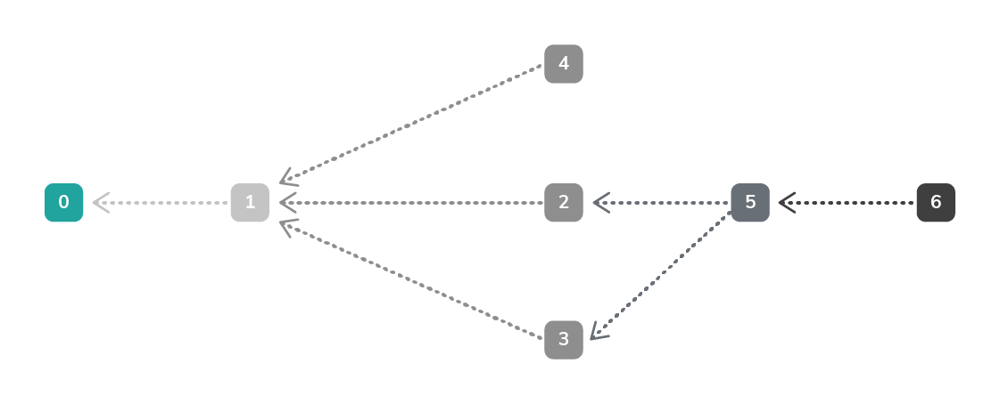
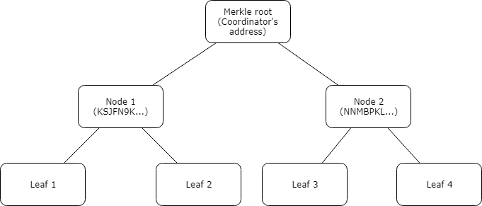

# タングル
<!-- # The Tangle -->

**タングルは、IOTAトランザクションを含むイミュータブルなデータ構造です。IOTAネットワーク内のすべてのノードは、タングルのコピーを台帳に保存し、台帳から読み取り、新しいトランザクションを添付し、トランザクション内容について合意に達します。**
<!-- **The Tangle is the immutable data structure that contains IOTA transactions. All nodes in an IOTA network store a copy of the Tangle in their ledgers, read from it, attach new transactions to it, and reach a consensus on its contents.** -->

タングル内のトランザクションは、トランザクション内で他の2つのトランザクションの履歴を暗号的に参照するため、イミュータブルです。そのため、その履歴中のいずれかのトランザクションが変更されると、すべての参照が破損します。
<!-- Transactions on the Tangle are immutable because their contents are cryptographically referenced to the history of two other transactions. So, if any transaction were to change in that history, all the references would be broken. -->

:::info:
これらの暗号化参照は、トランザクションハッシュです。各トランザクションには、そのコンテンツから派生した一意のトランザクションハッシュがあります。その結果、トランザクションの内容はイミュータブルです。
:::
<!-- :::info: -->
<!-- These cryptographic references are transaction hashes. Each transaction has a unique transaction hash that's derived from its contents. As a result, the contents of a transaction are immutable. -->
<!-- ::: -->

トランザクション間の参照は、[有向非巡回グラフ](https://en.wikipedia.org/wiki/Directed_acyclic_graph)（DAG）の型を形成します。これは、すべての辺がシーケンス内の前の点から後の点へ向かう頂点のシーケンスです。
<!-- The references among transactions form a type of [directed acyclic graph](https://en.wikipedia.org/wiki/Directed_acyclic_graph) (DAG), which is a sequence of vertices where every edge is directed from an earlier point to a later one in the sequence. -->

タングルでは、頂点はトランザクションであり、辺は参照です。
<!-- In the Tangle, vertices are transactions, and edges are references. -->

下図では、番号付きのボックスはトランザクションを表します。左側のトランザクションがシーケンスの先頭になり、右側のトランザクションが後になります。
<!-- In this diagram, the numbered boxes represent transactions. The transactions on the left come first in the sequence, and the transactions on the right come after. -->

## 親トランザクションと子トランザクション
<!-- ## Parents and children -->

ノードが新しいトランザクションをタングルに添付すると、そのトランザクションは上図の左側にある2つの既存のトランザクションを直接参照します。
<!-- When a node attaches a new transaction to the Tangle, that transaction directly references two existing ones to the left of it. -->

:::info:
ノードは、[チップ選択](root://node-software/0.1/iri/concepts/tip-selection.md)を実行して、新しいトランザクションを添付するトランザクションを決定します。
:::
<!-- :::info: -->
<!-- Nodes decide which transactions to attach a new one to by doing [tip selection](root://node-software/0.1/iri/concepts/tip-selection.md). -->
<!-- ::: -->

参照は家系図を形成します。これにより、新しいトランザクションが**子トランザクション**の場合、[ブランチおよびトランクトランザクションフィールド](../references/structure-of-a-transaction.md)のトランザクションハッシュは**親トランザクション**になります。
<!-- References form a family tree, whereby if a new transaction is a **child**, the transactions hashes in its [branch and trunk transaction fields](../references/structure-of-a-transaction.md) are its **parents**. -->

上図では、トランザクション6はトランザクション5を直接参照しているため、トランザクション5はトランザクション6の**親トランザクション**です。同様に、トランザクション6はトランザクション3を間接的に参照しているため、トランザクション3はトランザクション6の**祖父母トランザクション**です。
<!-- In the diagram, transaction 6 directly references transaction 5, so transaction 5 is a **parent** of transaction 6. Similarly, transaction 6 indirectly references transaction 3, so transaction 3 is a **grandparent** of transaction 6. -->

これらの直接および間接的な参照はトランザクションの履歴を構成します。
<!-- These direct and indirect references make up a transaction's history. -->

トランザクションが有効になるのは、履歴が自分のトランザクション内容と競合しない他の2つのトランザクションを参照している場合だけです。
<!-- A transaction can be valid only if it references two other transaction's whose history does not conflict with it. -->

たとえば、トランザクション6があるアドレスから10Miを取り出すようにノードに指示した場合、トランザクション6の親トランザクションの履歴がトランザクション6のアドレスに少なくとも10Miが送られているポイントに繋がっている必要があります。
<!-- For example, if transaction 6 instructs the node to withdraw 10 Mi from an address, the history of its parents must lead to a point where that address is sent at least 10 Mi. -->

## コンセンサス
<!-- ## Consensus -->

ノードは、トランザクションとその履歴を検証して、競合しないことを確認する責任があります。トランザクションを検証するには、ノードはそのトランザクションの履歴を台帳に保持する必要があります。
<!-- Nodes are responsible for validating transactions and their histories to make sure that they don't conflict. To validate a transaction, a node needs to have that transaction's history in its ledger. -->

タングルはIOTAネットワーク内のすべてのノードに分散されているため、ノードの一部は、台帳内で他のノードよりも多いまたは少ないトランザクションを持つことができます。任意のノードの台帳のトランザクションは、**タングルの概観**を構成します。
<!-- Because the Tangle is distributed among all nodes in an IOTA network, some of them can have more or fewer transactions in their ledgers than other nodes. The transactions in any node's ledger make up its **view of the Tangle**. -->

したがって、すべてのノードが最終的にタングルの同じ概観を持つようにするために、受信したすべての新しいトランザクションを隣接ノードに転送します。
<!-- So, to make sure that all nodes eventually have the same view of the Tangle, they forward any new transactions that they receive to their neighbors. -->

ノードにトランザクションの全履歴がある場合、トランザクションは凝固であると見なされます。つまり、確定したと考えることができるということです。
<!-- When a node has a transaction's entire history, the transaction is considered solid, which means that it can be considered for confirmation. -->

:::info:
ノードはトランザクションの全履歴を必要としません。トランザクションの履歴は、トランザクションを凝固と考えるための最初のトランザクションから始まります。

代わりに、ノードには、エントリポイントと呼ばれる事前定義されたポイントまでのトランザクションの履歴が必要です。トランザクションの履歴がエントリポイントを参照するまでさかのぼると、ノードはトランザクションを凝固するのをやめます。

定義済みエントリポイントの例は、[ローカルスナップショット](root://node-software/0.1/iri/concepts/local-snapshot.md)です。
:::
<!-- :::info: -->
<!-- Nodes don't need the entire history of a transaction, starting from the first ever transaction to consider it solid. -->
<!--  -->
<!-- Instead, nodes need the history of a transaction up to a predefined one, which is called an entry point. When the transaction's history goes far back enough to reference an entry point, the node stops solidifying it. -->
<!--  -->
<!-- An example of a predefined entry point is a [local snapshot](root://node-software/0.1/iri/concepts/local-snapshot.md). -->
<!-- ::: -->

トランザクションが確定済みと見なされるためには、ノードは、アドレスの残高を更新する前に、いつ最終的なものと見なすべきかについて合意に達する必要があります。
<!-- For a transaction to be considered confirmed, nodes must reach a consensus on when to consider it final before they can update the balances of addresses. -->

トランザクションが、凝固しており、かつコーディネーターによって送信および署名されたトランザクションによって直接または間接的に参照された場合に、確定済みと見なされます。
<!-- A transaction is considered confirmed when it's solid and it's directly or indirectly referenced by a transaction that's sent and signed by the Coordinator. -->

:::info:
これは、コーディネーターが新しいマイルストーンを作成している間に、チップ選択でトランザクションを選択する必要があることを意味します。
:::
<!-- :::info: -->
<!-- This means that the transaction must be selected during tip selection when the Coordinator is creating a new milestone. -->
<!-- ::: -->

### コーディネーター
<!-- ### The Coordinator -->

コーディネーターは、同じアドレスから定期的にトランザクションのバンドルを作成、署名、および送信するアプリケーションです。これらの各バンドルには、ノードが合意に達するために使用するマイルストーンと呼ばれるトランザクションが含まれています。マイルストーンがタングル内のあるトランザクションを直接または間接的に参照した場合、ノードはそのトランザクションの状態とその履歴全体を確定済みとしてマークします。
<!-- The Coordinator is an application that creates, signs, and sends bundles of transactions from the same address at regular intervals. Each of these bundles contains transactions called milestones that nodes use to reach a consensus. When milestones directly or indirectly reference a transaction in the Tangle, nodes mark the state of that transaction and its entire history as confirmed. -->

:::info:コーディサイド
現時点では、コーディネーターの削除を提案する[コーディサイド](https://coordicide.iota.org/)というプロジェクトに注目しています。これが起こるとき、ノードはマイルストーンなしで合意に達することができます。
:::
<!-- :::info:Coordicide -->
<!-- At the moment, we are focused on a project called [Coordicide](https://coordicide.iota.org/), which is a proposal for the removal of the Coordinator. When this happens, nodes will be able to reach a consensus without milestones. -->
<!-- ::: -->

### マイルストーン
<!-- ### Milestones -->

コーディネーターはマイルストーンを定期的にノードに送信し、ノードはこれらのマイルストーンを使用して合意に達します。
<!-- The Coordinator sends milestones to nodes at regular intervals, and nodes use these milestones to reach a consensus. -->

ノードがコーディネーターのアドレスから送信されたトランザクションを確認したら、次の手順を実行して検証します。
<!-- When nodes see a transaction that's been sent from the Coordinator's address, they validate it by doing the following: -->

* マイルストーンが二重支払いにつながらないことを確かめる。
<!-- * Make sure that it doesn't lead to a double-spend -->
* マイルストーンの署名を確認する。
<!-- * Verify its signature -->

IOTAはWinternitzワンタイム署名方式（W-OTS）を使用するため、アドレスから2回以上取り出しを行うことはできません。コーディネーターが複数のバンドルに署名しつつ、かつそれらすべての署名が1つのアドレスに対して検証できるようにするために、コーディネーターのアドレスはコーディネーターのマークル木から導出されます。
<!-- Because IOTA uses the Winternitz one-time signature scheme (W-OTS), addresses must not be withdrawn from more than once. To allow the Coordinator to sign multiple bundles whose signatures can still be verified against one address, that address is derived from the Coordinator's Merkle tree. -->

### コーディネーターのマークル木
<!-- ### The Coordinator's Merkle tree -->

マークル木は、リーフでデータをハッシュ化することから始まり、マークルルート（コーディネーターのアドレス）で終わるデータ構造です。
<!-- A Merkle tree is a data structure that starts by hashing data at the leaves and ends at the Merkle root (the Coordinator's address). -->

コーディネーターは、自身のマークル木の各リーフに対して1つの署名付きバンドルを署名して送信できます。
<!-- The Coordinator can sign and send one signed bundle for each leaf in its Merkle tree. -->

この例では、4つのリーフがあり、それぞれがコーディネーターの公開鍵と秘密鍵のペアの1つを表します。これらの鍵ペアは事前に作成され、コーディネーターのアドレスを計算するために使用されます。マークル木内の鍵ペアの総数は、公式`2depth`の`depth`によって異なります。この例では、マークル木の`depth`は2です。
<!-- In this example, we have four leaves, which each represent one of the Coordinator's public/private key pairs. These key pairs are created in advance and used to compute the the Coordinator's address. The total number of key pairs in a Merkle tree depends on its depth in this formula: 2depth. In this example, the Merkle tree's depth is 2. -->

:::info:
Mainnetでは、コーディネーターのマークル木の`depth`は23です。したがって、コーディネーターは`8,388,608`の公開鍵と秘密鍵のペアを持ち、同じ数のマイルストーンを送信できます。
:::
<!-- :::info: -->
<!-- On the Mainnet, the Coordinator's Merkle tree has a depth of 23. So, the Coordinator has 8,388,608 public/private key pairs and can send the same number of milestones. -->
<!-- ::: -->

コーディネーターのアドレスを計算するために、公開鍵はペアでハッシュ化されます。
<!-- To compute the Coordinator's address, the public keys are hashed in pairs: -->

* **ノード1：** Hash(Hash(リーフ1の公開鍵) Hash(リーフ2の公開鍵))
<!-- * **Node 1:** Hash(Hash(public key of leaf 1) Hash(public key of leaf 2)) -->
* **ノード2：** Hash(Hash(リーフ3の公開鍵) Hash(リーフ4の公開鍵))
<!-- * **Node 2:** Hash(Hash(public key of leaf 3) Hash(public key of leaf 4)) -->
* **コーディネーターのアドレス：** Hash(Hash(ノード1) Hash(ノード2))
<!-- * **Coordinator's address:** Hash(Hash(node 1) Hash(node 2)) -->

ノード1は、リーフ1の公開鍵とリーフ2の公開鍵の両方をハッシュ化した結果のハッシュ値です。ノード2は、リーフ3の公開鍵とリーフ4の公開鍵の両方をハッシュ化した結果のハッシュ値です。コーディネーターのアドレスは、ノード1とノード2のハッシュ値をハッシュ化した結果のハッシュ値です。
<!-- Node 1 is a hash of the result of hashing both the public key of leaf 1 and the public key of leaf 2. Node 2 is a hash of the result of hashing both the public key of leaf 3 and the public key of leaf 4. The Coordinator's address is a hash of the result of hashing the hash of node 1 and node 2. -->

:::info:
コーディネーターの秘密鍵は、シード、インデックス、およびセキュリティレベルから導出します。

Mainnetでは、コーディネーターの秘密鍵はセキュリティレベル2です。結果として、マイルストーンの署名は1つのトランザクションに収まるには大きすぎるため、2つに分割する必要があります。

[秘密鍵の導出方法の詳細を学ぶ](root://dev-essentials/0.1/concepts/addresses-and-signatures.md)。
:::
<!-- :::info: -->
<!-- The Coordinator's private keys are derived from a seed, an index, and a security level. -->
<!--  -->
<!-- On the Mainnet, these private keys are security level 2. As a result, the milestone signature is too large to fit in one transaction and must be fragmented across two. -->
<!--  -->
<!-- [Learn more about how private keys are derived](root://dev-essentials/0.1/concepts/addresses-and-signatures.md). -->
<!-- ::: -->

### ノードがマイルストーンを検証する方法
<!-- ### How nodes verify milestones -->

マイルストーンを検証するには、ノードはマークル木を再構築してマークルルートを見つける必要があります。再構築されたマークルルートがコーディネーターのアドレスと同じ場合、ノードはマイルストーンがコーディネーターによって送信されたことを認識します。
<!-- To verify milestones, nodes must rebuild the Merkle tree to find the Merkle root. If the rebuilt Merkle root is the same as the Coordinator's address, nodes know the milestone was sent by the Coordinator. -->

ノードがマークル木を再構築できるようにするために、コーディネーターはバンドル内に次のマイルストーンを送信します。
<!-- To allow nodes to rebuild the Merkle tree, the Coordinator sends the following milestones in the bundle: -->

* 断片化された署名を含む2つのトランザクション
<!-- * Two transactions that contain the fragmented signature -->
* [`signatureMessageFragment`](root://dev-essentials/0.1/references/structure-of-a-transaction.md)フィールドにマークル木を再構築することができるのに十分なマークル木からの足りないデータを含む1つのトランザクション。
<!-- * One transaction whose [`signatureMessageFragment`](root://dev-essentials/0.1/references/structure-of-a-transaction.md) field contains enough missing data from the Merkle tree to be able to rebuild it -->

たとえば、ノードとして、リーフ1の秘密鍵で署名されたバンドルを見たとします。
<!-- For example, as a node, we have seen a bundle that was signed with the private key of leaf 1. -->

まず、署名を検証してリーフ1の公開鍵を見つけます。
<!-- First, we verify the signature to find out the public key of leaf 1. -->

:::info:
[ノードが署名を検証する方法を学ぶ](root://dev-essentials/0.1/concepts/addresses-and-signatures.md#how-nodes-verify-signatures)。
:::
<!-- :::info: -->
<!-- [Learn how nodes verify signatures](root://dev-essentials/0.1/concepts/addresses-and-signatures.md#how-nodes-verify-signatures) -->
<!-- ::: -->

マークルルートを計算するために、バンドルの3番目のマイルストーンには次のものが含まれます。
<!-- To help us calculate the Merkle root, the third milestone in the bundle contains the following: -->

* リーフ2の公開鍵
<!-- * The public key of leaf 2 -->
* ノード2のハッシュ値
<!-- * The hash of node 2 -->

ここで、リーフ1とリーフ2の公開鍵をハッシュ化してノード1のハッシュ値を見つけます。次に、ノード1とノード2のハッシュ値をハッシュ化してマークルルートを見つけます。
<!-- Now, we hash the public keys of leaves 1 and 2 to find the hash of node 1. Then we hash the hash of nodes 1 and 2 to find the Merkle root. -->

マークルルートがコーディネーターのアドレスと同じ場合、バンドルはコーディネーターのマークル木の秘密鍵の1つで署名されています。
<!-- If the Merkle root is the same as the Coordinator's address, the bundle was signed with one of the private keys in the Coordinator's Merkle tree. -->

:::info:独自のコーディネーターを実行したいですか？
コンパスを使用して、独自のプライベートタングルでマイルストーンを作成、署名、および送信します。
:::
<!-- :::info:Want to run your own Coordinator? -->
<!-- Use Compass to create, sign, and send milestones in your own private Tangle. -->
<!-- ::: -->

## 参考文献
<!-- ## Further research -->

IOTA財団はタングルとそれに関連するプロトコルの開発に焦点を当てている活発な研究部を持っています。
<!-- We have an active research department that focuses on developing the Tangle and its related protocols. -->

* [学術論文](https://www.iota.org/research/academic-papers)
<!-- * [Academic Papers](https://www.iota.org/research/academic-papers) -->
* [ロードマップ](https://www.iota.org/research/roadmap)
<!-- * [Roadmap](https://www.iota.org/research/roadmap) -->
