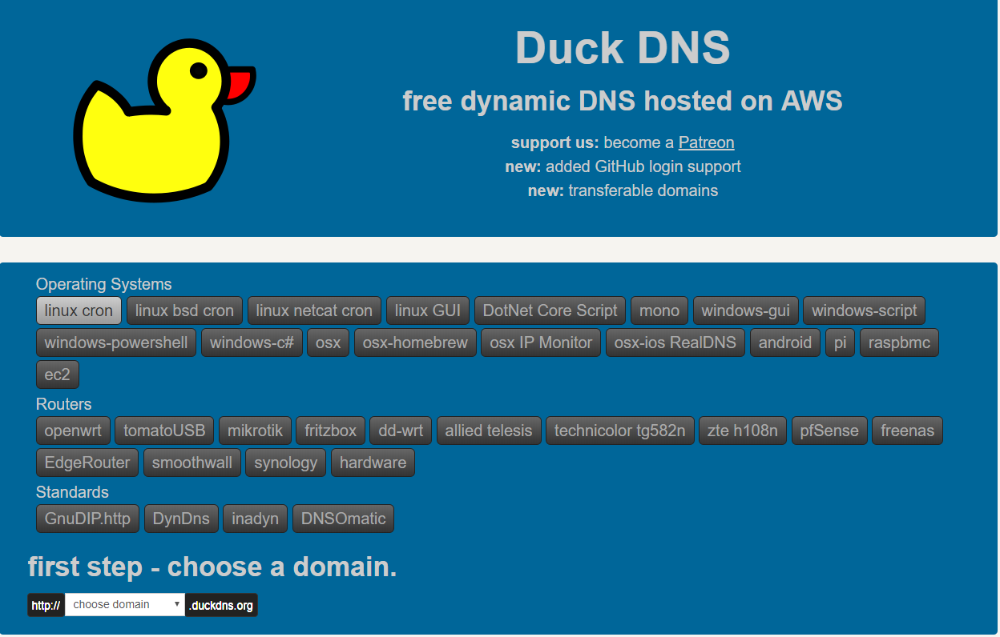
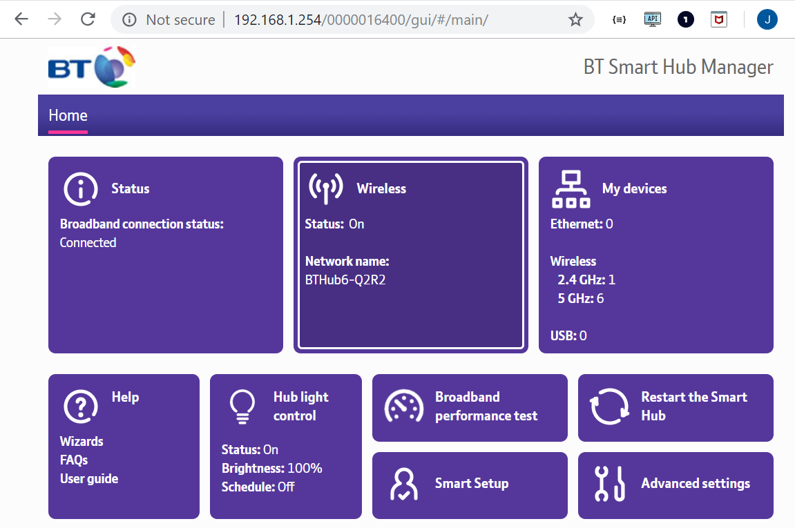
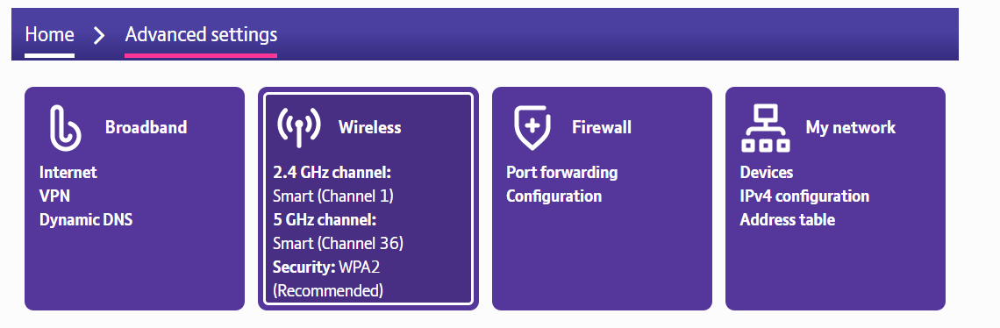
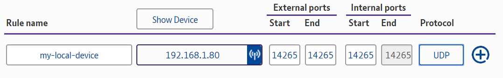

# ローカルデバイスをインターネットに公開する
<!-- # Expose your local device to the Internet -->

**デバイスをローカルネットワークの外部に接続するには、デバイスをインターネットに公開する必要があります。ローカルデバイスをインターネットに公開する一般的な理由は、IOTAノードを隣接ノードに接続することです。**
<!-- **To connect a device to those outside of your local network, you need to expose it to the Internet. A common reason to expose your local device to the Internet is to connect an IOTA node to neighbors.** -->

ローカルデバイスをインターネットに公開するには、ルーターからデバイスにポートを転送する必要があります。そうすることで、それらのポートのルーターのIPアドレスへのどんな接続もデバイスに転送されます。
<!-- To expose your local device to the Internet, you must forward ports from your router to your device. By doing so, any connections to your router's IP address on those ports will be forwarded to your device. -->

ポート転送ルールを作成する前に、ローカルネットワークとインターネットの両方に静的IPアドレスが必要です。これらが既にある場合は、[ポート転送に直接進んでください](#create-a-port-forwarding-rule)。
<!-- Before you can create port forwarding rules, you need a static IP address both on your local network and the Internet. If you already have these, [go straight to port forwarding](#create-a-port-forwarding-rule). -->

## ローカルネットワークの静的IPアドレスを取得する
<!-- ## Get a static IP address on your local network -->

多くのプライベートネットワークでは、新しいデバイスが接続されるたびに、そのデバイスにはDHCP（動的ホスト構成プロトコル）サーバ（通常はルーター）から新しい内部IPアドレスが割り当てられます。
<!-- On many private networks, whenever a new device connects to it, the device is assigned a new internal IP address from a DHCP (dynamic host configuration protocol) server, which is usually a router. -->

ポート転送ルールが変更されないようにするには、ローカルデバイスの内部IPアドレスを変化させないようにする必要があります。それ以外の場合は、IPアドレスを変更するたびにポート転送ルールを更新する必要があります。
<!-- To avoid changing port forwarding rules, you need the internal IP address of your local device to stay the same. Otherwise, you'd need to update your port forwarding rules every time your IP address were to change. -->

### 前提条件
<!-- ### Prerequisites -->

このガイドを完了するには、Linux Ubuntu 18.04サーバーが必要です。Linuxサーバーがなく、WindowsまたはMacオペレーティングシステムを実行している場合は、[仮想マシンで実行する](../how-to-guides/set-up-virtual-machine.md)ことができます。
<!-- To complete this guide, you must have a Linux Ubuntu 18.04 server. If you don't have a Linux server and you're running a Windows or Mac operating system, you can [run one in a virtual machine](../how-to-guides/set-up-virtual-machine.md). -->

---

:::info:
ローカルネットワークで静的IPを取得するには、さまざまな方法があります。このガイドは、そのための1つの方法にすぎません。
:::
<!-- :::info: -->
<!-- You can get a static IP on your local network in many ways. This guide is just one way of doing so. -->
<!-- ::: -->

1. ゲートウェイのIPアドレス（ルーターのIPアドレス）を見つけてメモします。
  <!-- 1. Find your gateway IP address (router's IP address) and make a note of it -->

    ```bash
    route -n
    ```

2. Linuxサーバの現在の内部IPアドレスとネットマスクの長さの両方を見つけて、それらをメモしておきます。
  <!-- 2. Find both the current internal IP address of your Linux server and the netmask length, and make a note of them -->

    ```bash
    ifconfig | grep netmask
    ```

    :::info:
    出力では、内部IPアドレスは`inet`の隣にあります。`127.0.0.1`のIPアドレスは無視します。`127.0.0.1`はあなたのローカルホストです。ネットマスクの場合、255は8ビットを表します。したがって、この例のネットマスク長は`3*8`で、長さは24になります。
    :::
    <!-- :::info: -->
    <!-- In the output, the internal IP address is next to `inet`. Ignore the 127.0.0.1 IP address, this is your localhost. For the netmask, 255 represents 8 bits. Therefore the netmask length in this example is 3*8, which results in a length of 24. -->
    <!-- ::: -->

3. ネットワーク設定ファイルを開きます。
  <!-- 3. Open the network configuration file -->

    ```bash
    sudo nano /etc/netplan/01-netcfg.yaml
    ```

4. 以下をコピーしてファイルにペーストします。`gateway4`フィールドの値をあなたのゲートウェイIPアドレスに置き換えます。`アドレス`フィールドで、スラッシュ（/）の左側の値をあなたのLinuxサーバの内部IPアドレスに置き換え、右側の値をネットマスクの長さに置き換えます。
  <!-- 4. Copy and paste the following into the file. Replace the value of the `gateway4` field to your gateway IP address. In the `addresses` field, replace the value on the left of the forward slash (/) with the internal IP address of your Linux server and replace the value on the right with the netmask length. -->

    ```yaml
    # This file describes the network interfaces available on your system
    # For more information, see netplan(5).
    network:
    version: 2
    renderer: networkd
    ethernets:
        ens33:
        dhcp4: no
        dhcp6: no
        addresses: [192.168.1.77/24]
        gateway4: 192.168.1.1
        nameservers:
            addresses: [1.1.1.1,8.8.8.8]
    ```

5. 変更を適用します。
  <!-- 5. Apply your changes -->

    ```bash
    sudo netplan apply
    ```

    :::warning:
    ルーターを変更するなど、ネットワーク設定が変わると、デバイスへの接続が失われる可能性があります。この場合、デバイスに物理的に接続して、`01-netcfg.yaml`ファイルを新しい静的IPアドレスで更新する必要があります。
    :::
    <!-- :::warning: -->
    <!-- If your network configuration changes, for example you change your router, you may lose connection to your device. In this case, you should physically connect to your device and update the 01-netcfg.yaml file with a new static IP address. -->
    <!-- ::: -->

<a name="get-a-domain-name-for-your-router"></a>
## ルーターのドメイン名を取得する
<!-- ## Get a domain name for your router -->

外部デバイスがインターネット経由で自分の機器に接続できるようにするには、ルーターにインターネット上の静的IPアドレスが必要です。不幸なことに、インターネットサービスプロバイダはあなたのルーターに動的IPアドレスを与えることが多く、それは定期的に変わります。その結果、デバイスのIPアドレスが変わると、デバイスへの接続はすべて失われます。したがって、動的IPアドレスにリンクされているパブリックドメイン名を取得するには、動的DNS（DDNS）サービスを使用する必要があります。DDNSを使用すると、デバイスは実際のパブリックIPを数分ごとにDDNSサーバに報告するため、ドメイン名のレコードを更新できます。
<!-- To allow external devices to connect to your device through the Internet, your router needs a static IP address on the Internet. Unfortunately, Internet service providers often give your router a dynamic IP address, which changes at regular intervals. As a result, any connections to your device will be lost when its IP address changes. Therefore, you need to use a dynamic DNS (DDNS) service to get a public domain name that is linked to your dynamic IP address. With a DDNS, your device will report the actual public IP to the DDNS server every few minutes, so it can update its records for your domain name. -->

:::info:
このタスクでは、Duck DNSを使用しますが、他のDDNSサービスを使用することもできます。
:::
<!-- :::info: -->
<!-- In this task, we use Duck DNS, but you can choose to use any other DDNS services. -->
<!-- ::: -->

1. [Duck DNSアカウントを作成し](https://www.duckdns.org/)、サブドメインを追加します。
  <!-- 1. [Create a Duck DNS account](https://www.duckdns.org/) and add a subdomain -->

    

2. 定期的にIPアドレスをDuck DNSに送信する[スクリプトをインストールします](https://www.duckdns.org/install.jsp)。デバイスに適したオペレーティングシステムを選択し、ドロップダウンからサブドメインを選択します。その後、指示に従います。
  <!-- 2. [Install the scripts](https://www.duckdns.org/install.jsp) that will send your IP address to Duck DNS at regular intervals. Make sure you select the correct operating system for your device and select your subdomain from the dropdown. Then, follow the instructions. -->

    

ルーターに静的IPアドレスが割り当てられたので、接続をデバイスに転送するためのポート転送ルールを作成できます。
<!-- Now that your router has a static IP address, you can create port forwarding rules to forward connections to your device. -->

<a name="create-a-port-forwarding-rule"></a>
## ポート転送ルールを作成する
<!-- ## Create a port forwarding rule -->

ローカルデバイスをインターネットに公開するには、ルーターのIPアドレスの特定のポートからローカルデバイスの内部IPアドレスにリクエストを転送するポート転送ルールを作成する必要があります。
<!-- To expose a local device to the Internet, you must create port forwarding rules, which forward requests from certain ports of your router's IP address to your local device's internal IP address. -->

### Prerequisites

To complete this guide, you need the following:

* Administrator access to your router
* A [static IP address on your local network](#get-a-static-ip-address-on-your-local-network).
* A static IP address for your router, or if it has a dynamic IP address, a [domain name from a dynamic DNS service](#get-a-domain-name-for-your-router)

---

すべてのルーターは異なります。このガイドでは、ルーターは`BT Hub 6`であるため、このガイドの手順はルーターによって異なる場合がありますが、概念は同じです。
<!-- All routers are different. In this guide, the router is a BT Hub 6, as a result the steps in this guide may be different for your router, but the concepts are the same. -->

1. Webブラウザで、ルーターのIPアドレスを入力します。このIPアドレスはルーターに表示されているはずです。表示されない場合は、コマンドプロンプトで見つけます。あなたのルーターのIPアドレスは`Gateway`カラムの下に現れます。
  <!-- 1. In a web browser, enter the IP address of your router. This IP address should be displayed on your router. If you can't see it, find it in the command prompt. You'll see your router's IP address under the `Gateway` column. -->

    ```bash
    route -n
    ```

2. **Advanced settings**に進みます。
  <!-- 2. Go to **Advanced settings** -->

    

3. **Firewall**をクリックします。
  <!-- 3. Click **Firewall** -->

    

4. 以下を実行して、新しい規則を作成します。
  <!-- 4. Create a new rule by doing the following: -->

    * ルールの名前を入力します。
    <!-- * Enter any name for your rule -->
    * ドロップダウンからローカルデバイスを選択します。
    <!-- * Select your local device from the dropdown -->
    * インターネットからローカルデバイスに接続するために使用するポートを入力します。
    <!-- * Enter a port that you want to use to connect to your local device from the Internet -->
    * ルーターが監視するプロトコルを選択します。
    <!-- * Select a protocol that the router should listen to -->

    

5. ルールを有効にするために、ルーターを再起動する必要があります。
  <!-- 5. You may need to restart your router for the rules to take effect -->

6. パブリックIPアドレスでポートが開いていることを確認して、ルールをテストします。ルールをテストするには、[yougetsignal.com](https://www.yougetsignal.com/tools/open-ports/)などのオンラインツールを使用できます。
  <!-- 6. Test your rules by checking that the port is open on your public IP address. To test your rules, you could use an online tool such as [yougetsignal.com](https://www.yougetsignal.com/tools/open-ports/). -->
