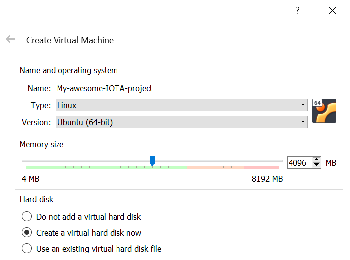
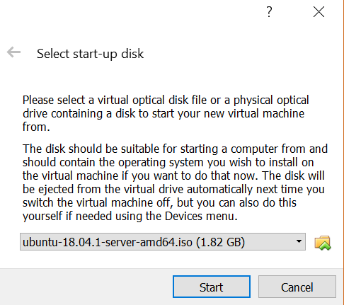
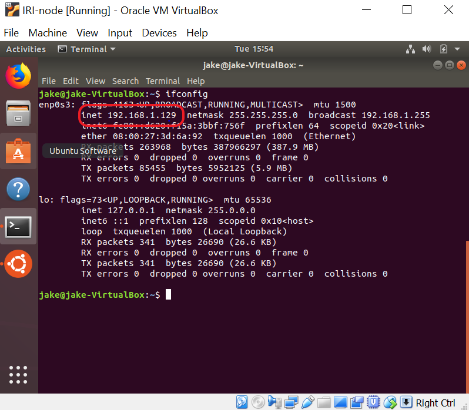
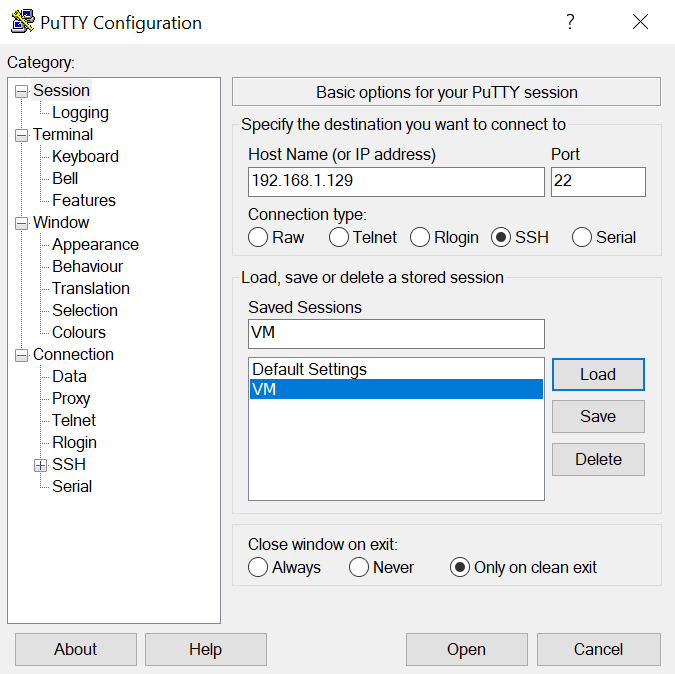

# 仮想マシン上にLinuxサーバーをセットアップする
<!-- # Set up a Linux server on a virtual machine -->

**多くのガイドにはLinuxオペレーティングシステムが必要です。デバイスで別のオペレーティングシステムを実行している場合、仮想マシン内でLinuxを使用できます。**
<!-- **Many guides require a Linux operating system. If your device is running a different operating system, you can use Linux inside a virtual machine.** -->

Linuxはオープンソースのオペレーティングシステムで、ディストリビューションと呼ばれるパッケージで提供されています。各Linuxディストリビューションには、さまざまな目的のためにさまざまな組み込みソフトウェアが含まれています。
<!-- Linux is an open-source operating system, which can come in packages called distributions. Each Linux distribution includes different built-in software for different goals. -->

最も人気のあるLinuxディストリビューションの1つがUbuntuです。Ubuntuは、この例で使用しているディストリビューションです。
<!-- One of the most popular Linux distributions is Ubuntu, which is the distribution that we use in our examples. -->

Linuxは以下の理由で有益です。
<!-- Linux is beneficial for the following reasons: -->
- Linuxは多くのハードウェアプラットフォームで動作します
<!-- - Linux runs on many hardware platforms -->
- Linuxディストリビューションはオープンソースであり、Linuxディストリビューションのほとんどすべては無料で使用できます。
<!-- - Linux distributions are open-source and almost all of them are free to use -->
- Linuxは安全で信頼性があり、軽量です。
<!-- - Linux is secure, reliable, and lightweight -->

:::info:
自分のコンピュータでLinux仮想マシンを実行したくない場合は、Amazonなどの会社からクラウドコンピュータの使用を借りることができます。この方法を使うことで、ポート転送やメモリ不足を心配する必要はありません。Amazon AWSには、[クラウド上でLinux仮想マシンを起動する](https://aws.amazon.com/getting-started/tutorials/launch-a-virtual-machine/)ためのセットアップガイドがあります。
:::
<!-- :::info: -->
<!-- If you don't want to run a Linux virtual machine on your own computer, you can rent the use of a cloud computer from a company such as Amazon. By using this approach, you don't need to worry about port forwarding or running out of memory. Amazon AWS has a setup guide for [launching a Linux virtual machine on their cloud](https://aws.amazon.com/getting-started/how-to-guides/launch-a-virtual-machine/). -->
<!-- ::: -->

## Linuxサーバーをセットアップする
<!-- ## Set up a Linux server -->

WindowsまたはMacオペレーティングシステムでLinuxサーバーを実行するには、仮想マシンをインストールして、仮想マシンでLinuxを実行する必要があります。
<!-- To run a Linux server on a Windows or Mac operating system, you must install a virtual machine and run Linux on it. -->

1. [WindowsまたはMac用のVirtualBoxをダウンロードしてインストールします](https://www.virtualbox.org/wiki/Downloads)。
  <!-- 1. [Download and install VirtualBox for Windows or Mac](https://www.virtualbox.org/wiki/Downloads) -->

2. Windowsを使用している場合は、[7 Zipの最新バージョンをダウンロードしてインストールします](https://www.7-zip.org/)。Macを使用している場合は、[Unarchiverアプリケーション](https://itunes.apple.com/us/app/the-unarchiver/id425424353)をダウンロードしてインストールします。
  <!-- 2. If you're on a Windows, [download and install the latest version of 7 Zip](https://www.7-zip.org/). If you're on a Mac, download and install the [Unarchiver application](https://itunes.apple.com/us/app/the-unarchiver/id425424353). -->

3. [Ubuntu Serverファイル（18.04 LTS）をダウンロードします](https://www.ubuntu.com/download/server)。
  <!-- 3. [Download the Ubuntu Server file (18.04 LTS)](https://www.ubuntu.com/download/server) -->

4. ファイルを保存したフォルダに移動します。Windowsを使用している場合は、ファイルを右クリックして**ここで解凍**をクリックします。Macを使用している場合は、ファイルをダブルクリックして解凍します。
  <!-- 4. Go to the folder where you saved the file. If you're on a Windows, right-click the file and click **Extract here**. If you're on a Mac, double-click the file to extract it. -->

5. VirtualBoxを開き、**新規**をクリックします。
  <!-- 5. Open VirtualBox, and click **New** -->

6. サーバーの名前を入力し、スライダーを使って専用のRAMメモリの量を選択します。
  <!-- 6. Enter a name for your server, and use the slider to select the amount of RAM memory you'd like to dedicate to it -->

    

7. 画面の指示に従ってデフォルト設定を選択します。
  <!-- 7. Follow the on-screen instructions and choose the default settings -->

8. リストからサーバーを選択して**開始**をクリックします。
  <!-- 8. Select your server from the list and click **Start** -->

9. ウィンドウでファイルエクスプローラを開き、手順3でダウンロードしたUbuntu Serverファイルを選択します。
  <!-- 9. In the window, open the file explorer and select the Ubuntu Server file that you downloaded in step 3 -->

    

おめでとうございます:tada: コンピュータ上でLinuxサーバーが動いています！
<!-- Congratulations :tada: You've got a Linux server running on your computer! -->

ガイドでは常にコマンドラインインターフェイスを使用する必要があるため、ターミナルアプリケーションに移動して開きます。
<!-- Our guides always require the use of a command-line interface, so navigate to the Terminal application and open it. -->

## Linuxサーバーに接続する
<!-- ## Connect to your Linux server -->

Linuxが仮想マシンで実行されている場合、仮想マシンはホストオペレーティングシステムの仮想マシンではない部分から切り離されています。その結果、仮想マシンの外部からコマンドをコピーして貼り付けることはできません。
<!-- When Linux is running in a virtual machine, it's separated from the rest of your host operating system. As a result, you can't copy commands from outside the virtual machine and paste them into it. -->

同じネットワーク上で稼働しているLinuxサーバーに接続するには、[セキュアシェル](https://www.ssh.com/ssh/)（SSH）クライアントを使用できます。
<!-- To connect to your Linux server that's running on the same network, you can use a [secure shell](https://www.ssh.com/ssh/) (SSH) client. -->

### SSHサーバーとしてLinuxサーバーを構成する
<!-- ### Configure your Linux server as an SSH server -->

LinuxサーバーがSSHプロトコルを使用したメッセージを理解する前に、LinuxサーバーをSSHサーバーとして構成する必要があります。
<!-- Before your Linux server can understand messages that use the SSH protocol, you must configure it as an SSH server. -->

1. Linuxサーバーのターミナルで、ソフトウェアパッケージをアップグレードします。
  <!-- 1. In the terminal of your Linux server, upgrade your software packages -->

    ```bash
    sudo apt-get upgrade
    ```

2. ネットワークツールをインストールします。
  <!-- 2. Install the network tools -->

    ```bash
    sudo apt install net-tools
    ```

3. SSHサーバーをインストールします。
  <!-- 3. Install an SSH server -->

    ```bash
    sudo apt-get install openssh-server
    ```

4. Linuxサーバーを閉じ、リストからLinuxサーバーを選択して、**設定** > **ネットワーク**に進みます。
  <!-- 4. Close your Linux server, select your server from the list, and go to **Settings** > **Network** -->

5. アダプタ1タブで、**接続先**フィールドを**ブリッジアダプタ**に変更します。
  <!-- 5. In the Adapter 1 tab, change the **Attached to** field to **Bridged Adapter** -->

6. Linuxサーバーを起動し、ターミナルを開いて、LinuxサーバーのIPアドレスを調べます。
  <!-- 6. Start your Linux server, open the terminal and find out the IP address of your Linux server -->

    ```bash
    ifconfig
    ```

7. `inet`IPアドレスを書き留めます。
  <!-- 7. Make a note of the `inet` IP address -->

    

### LinuxサーバーへのSSH接続を確立する
<!-- ### Establish an SSH connection to your Linux server -->

LinuxサーバーがSSHサーバーとして構成されている場合は、ホストオペレーティングシステムから接続できます。
<!-- When your Linux server is configured as an SSH server, you can connect to it from your host operating system. -->

**Mac**上のLinuxサーバーへのSSH接続を確立するには、以下の手順に従います。
<!-- To establish an SSH connection to your Linux server on a **Mac**, do the following: -->

1. ターミナルアプリケーションを開きます。ターミナルアプリケーションに到達するための最速の方法は、`CMD+スペースバー`を押して、検索バーに`terminal`を入力することです。
  <!-- 1. Open the Terminal application. The fastest way to get there is by pressing `CMD+spacebar` and entering `terminal` in the search bar. -->

2. SSH接続を確立します。`IP_ADDRESS_FROM_STEP_7`プレースホルダーをLinuxサーバーのIPアドレスに変更します。
  <!-- 2. Establish an ssh connection. Change the IP_ADDRESS_FROM_STEP_7 placeholder with the IP address of your Linux server. -->

    ```bash
    ssh $IP_ADDRESS_FROM_STEP_7
    ```

**Windows**上のLinuxサーバーへのSSH接続を確立するには、以下のようにします。
<!-- To establish an SSH connection to your Linux server on a **Windows**, do the following: -->

1. [PuTTyをダウンロードしてインストールします](https://www.ssh.com/ssh/putty/download#sec-Download-PuTTY-installation-package-for-Windows)。
  <!-- 1. [Download and install PuTTy](https://www.ssh.com/ssh/putty/download#sec-Download-PuTTY-installation-package-for-Windows) -->

2. PuTTyを開きます。
  <!-- 2. Open PuTTy -->

3. LinuxサーバーのIPアドレスを入力して**開く**をクリックします。
  <!-- 3. Enter the IP address of your Linux server and click **Open** -->

    

これでSSH経由でLinuxサーバーに接続しました。PuTTyまたはホストデバイスにLinuxコマンドを入力して、Linuxサーバー上でLinuxコマンドを実行します。
<!-- You're now connected to your Linux server over SSH. Enter Linux commands in the PuTTy or host terminal to run them on your Linux server. -->
