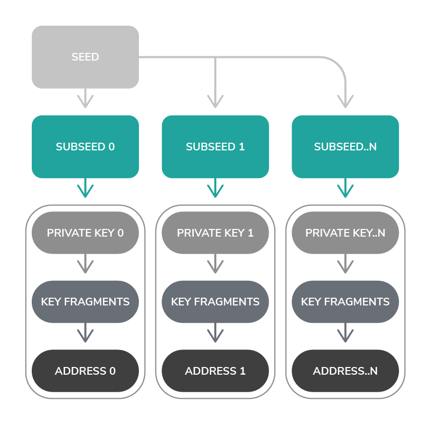

# アドレス
<!-- # Addresses -->

**アドレスは、[シード](../clients/seeds.md)に属し、[IOTAトークン](../clients/token.md)の残高が0以上のアカウントのようなものです。アドレスは、[公開/秘密鍵ペア](https://en.wikipedia.org/wiki/Public-key_cryptography)の公開半分です。IOTAトークンをあるアドレスから別のアドレスに転送するには、秘密鍵でトランザクションに署名し、所有していることを[ノード](../network/nodes.md)に証明します。そのため、シード所有者のみが秘密鍵を知っているため、誰とでもアドレスを共有できます。**
<!-- **An address is like an account that belongs to a [seed](../clients/seeds.md) and that has a 0 or greater balance of [IOTA tokens](../clients/token.md). Addresses are the public half of a [public/private key pair](https://en.wikipedia.org/wiki/Public-key_cryptography). To transfer IOTA tokens from one address to another, you sign a transaction with the private key to prove to [nodes](../network/nodes.md) that you own it. As such you can share addresses with anyone because only the seed owner knows the private key.** -->

## アドレスの形式
<!-- ## Address format -->

アドレスは、81[トライト](../introduction/ternary.md)（または[チェックサム](../clients/checksums.md)を含む90トライト）の一意の文字列です。
<!-- An address is a unique string of 81 [trytes](../introduction/ternary.md) (or 90 trytes with a [checksum](../clients/checksums.md)). -->

```bash
OGMMQJUDMNNYSOAXMJWAMNAJPHWMGVAY9UWBXRGTXXVEDIEWSNYRNDQY99NDJQB9QQBPCRRNFAIUPGPLZ
```

## アドレスの最大数
<!-- ## Maximum number of addresses -->

シードは、ほぼ無制限の数のアドレス（9<sup>57</sup>）を持つことができ、各アドレスには一意のインデックスと[セキュリティレベル](../clients/security-levels.md)があります。
<!-- A seed can have an almost unlimited number of addresses (9<sup>57</sup>), which each have a unique index and a [security level](../clients/security-levels.md): -->

- **インデックス：**0から9,007,199,254,740,991までの数字
<!-- * **Index:** Number between 0 and 9,007,199,254,740,991 -->
- **セキュリティレベル：** 1から3までの数字
<!-- * **Security level:** Number between 1 and 3 -->

同じシード、インデックス、セキュリティレベルを用いると常に同じアドレスになります。
<!-- The same seed, index, and security level, will always result in the same address. -->

同様に、同じシードでも異なるインデックスや異なるセキュリティレベルを用いると、異なるアドレスになります。
<!-- Likewise, the same seed with a different index and/or a different security level will result in a different address. -->

たとえば、すべてのセキュリティレベルでインデックス0およびインデックス1のアドレスを生成する場合、それらはすべて一意です。
<!-- For example, when you generate addresses for index 0 and index 1 of all security levels, they are all unique: -->

| **インデックス** | **セキュリティレベル** | **アドレス**                                                                      |
|:-----------------|:-----------------------|:----------------------------------------------------------------------------------|
| 0                | 1                      | OGMMQJUDMNNYSOAXMJWAMNAJPHWMGVAY9UWBXRGTXXVEDIEWSNYRNDQY99NDJQB9QQBPCRRNFAIUPGPLZ |
| 0                | 2                      | BYNZSDZTNJOUMWLILVKUIWAFTCWTNYCDEI9ZNSRSAMLKURUWYANEGLVHUKWMZQCAMBTDSXKEFVOUYLDSW |
| 0                | 3                      | CACHUSACNWAFFIGUAXVBUMZNSAGFPCFXVMYOBQ9IMD9ELZMOYOJAHWPFMOTRJMPISXIF9JEKNDZMQMZEY |
| 1                | 1                      | CAZURLTWLREHEPODAQGFEKCVFJMUB9BFGBVWBGRSCWSKYD9UJIARRTPZJH9VUGQIQNJRBKIOATOJCSYJY |
| 1                | 2                      | XIUPEDJXBADNCMWAZEGY9HPEASAMLFMIAAXIMLHVRDSADOORPPBFAQDCXGGZQQZLKCERW9J9CKVLASMTZ |
| 1                | 3                      | FLXGZSXUJJLQFYYPTKYJRLWOCQSEXTTKVQMGOFPPYYZCLTAIEPKFXDNHHFGNJOASALAD9MJHNCCX9OUVZ |

## 使用済みアドレス
<!-- ## Spent addresses -->

IOTAプロトコルは[ワンタイム署名](../clients/signatures.md)を使用するため、IOTAトークンがアドレスから取り出された後、アドレスは使用済みになり、再び使用することはできません。
<!-- Because the IOTA protocol uses [one-time signatures](../clients/signatures.md), after IOTA tokens have been withdrawn from an address, it is spent and must never be used again. -->

使用済みアドレスにさらにIOTAトークンをデポジットしてしまうと、秘密鍵の[総当たり攻撃](https://en.wikipedia.org/wiki/Brute-force_attack)で盗まれる危険があります。
<!-- If more IOTA tokens are later deposited into a spent address, they are at risk of being stolen in a [brute-force attack](https://en.wikipedia.org/wiki/Brute-force_attack) on the private key. -->

## アドレスの生成方法
<!-- ## How addresses are generated -->

すべてのアドレスは、[Kerl](https://github.com/iotaledger/kerl)[ハッシュ関数](https://en.wikipedia.org/wiki/Hash_function)を使用して生成されます。これは、シード、インデックス、およびセキュリティレベルから秘密鍵を生成することから始まります。
<!-- All addresses are generated using the [Kerl](https://github.com/iotaledger/kerl) [hash function](https://en.wikipedia.org/wiki/Hash_function), which starts by generating a private key from a seed, an index, and a security level. -->

まず、シードとインデックスがトリットに変換され、次にそれらが組み合わされてハッシュされて、243トリットのサブシードが生成されます。
<!-- First, the seed and index are converted to trits, then they're combined and hashed to generate a 243-trit subseed: -->

```bash
Kerl(seed + index)
```

サブシードは、各セキュリティレベルに応じて[スポンジ関数](https://keccak.team/sponge_duplex.html)で27回吸収および撹拌されます。
<!-- The subseed is then absorbed and squeezed in a [sponge function](https://keccak.team/sponge_duplex.html) 27 times for each security level. -->

スポンジ機能の結果は、セキュリティレベルに応じて長さが変化する秘密鍵です。
<!-- The result of the sponge function is a private key whose length varies, depending on the security level. -->

アドレスを生成するために、秘密鍵は81トライトの複数のセグメントに分割されます。次に、各セグメントが26回ハッシュされます。
<!-- To generate an address, the private key is split into 81-tryte segments. Then, each segment is hashed 26 times. -->

:::info:
27個のハッシュセグメントのグループはキーフラグメントと呼ばれ、秘密鍵にはセキュリティレベルごとに1つのキーフラグメントが存在します。たとえば、セキュリティレベル1の秘密鍵は、2,187個のトライトで構成されます。これは、`27 x 81`トライトセグメントまたは1つのキーフラグメントです。
:::
<!-- :::info: -->
<!-- A group of 27 hashed segments is called a key fragment, and a private key has one key fragment for each security level. For example, a private key with security level 1 consists of 2,187 trytes, which is 27 x 81-tryte segments or one key fragment. -->
<!-- ::: -->

各キーフラグメントは1回ハッシュされ、セキュリティレベルごとに1つのキーダイジェストが生成されます。次に、キーダイジェストが結合され、1回ハッシュされて、81トライトのアドレスが生成されます。
<!-- Each key fragment is hashed once to generate one key digest for each security level. Then, the key digests are combined and hashed once to generate an 81-tryte address. -->



## ユーティリティ
<!-- ## Utilities -->

次のIOTA Tangleユーティリティをアドレスで使用できます。
<!-- You can use the following IOTA Tangle Utilities with addresses: -->

- [アドレスをQRコードに変換する](https://utils.iota.org/qr-create)
<!-- * [Convert an address into a QR code](https://utils.iota.org/qr-create) -->

- [QRコードからアドレスを読む](https://utils.iota.org/qr-scan)
<!-- * [Read an address from a QR code](https://utils.iota.org/qr-scan) -->

- [アドレスを含むトランザクションを検索する](https://utils.iota.org/)
<!-- * [Search for transactions that include an address](https://utils.iota.org/) -->

## 関連ガイド
<!-- ## Related guides -->

[JavaScriptでアドレスを生成する](root://client-libraries/0.1/how-to-guides/js/generate-an-address.md)
<!-- [Generate an address in JavaScript](root://client-libraries/0.1/how-to-guides/js/generate-an-address.md). -->

[トリニティでアドレスを生成する](root://wallets/0.1/trinity/how-to-guides/receive-a-transaction.md)
<!-- [Generate an address in Trinity](root://wallets/0.1/trinity/how-to-guides/receive-a-transaction.md). -->

[JavaScriptで秘密鍵からアドレスを導出する](root://client-libraries/0.1/how-to-guides/js/derive-addresses-from-private-keys.md)
<!-- [Derive addresses from private keys in JavaScript](root://client-libraries/0.1/how-to-guides/js/derive-addresses-from-private-keys.md) -->
