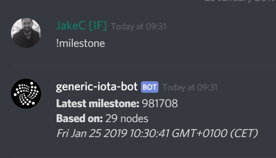

# 開発入門
<!-- # Get started -->

**IOTAをアプリまたはWebサイトに統合するには、3つの簡単な手順を完了する必要があります。[シード](../clients/seeds.md)を作成し、[クライアントライブラリ](root://client-libraries/0.1/introduction/overview.md)、[node](../network/nodes.md)に接続します。**
<!-- **To start integrating IOTA into your app or website you need complete three simple steps: Create a [seed](../clients/seeds.md), install a [client library](root://client-libraries/0.1/introduction/overview.md), and connect to a [node](../network/nodes.md).** -->

:::info:開発者ではありませんか？
コードを記述せずにIOTAを使用する場合は、[公式のトリニティウォレット](root://wallets/0.1/trinity/introduction/overview.md)を使用できます。
:::
<!-- :::info:Not a developer? -->
<!-- If you want to use IOTA without having to write code, you can use the [official Trinity wallet](root://wallets/0.1/trinity/introduction/overview.md). -->
<!-- ::: -->

<a name="step-1-create-a-seed"></a>
## 手順1. シードを作成する
<!-- ## Step 1. Create a seed -->

シードとは、メッセージおよび/または[アドレス](../clients/addresses.md)に保持されているすべての[IOTAトークン](../clients/token.md)の所有権を証明できる一意のパスワードです。
<!-- A seed is a unique password that gives you the ability to prove your ownership of either messages and/or any [IOTA tokens](../clients/token.md) that are held on your [addresses](../clients/addresses.md). -->

:::warning:
シードは安全に保ちバックアップしなければなりません。シードを失うとIOTAトークンを回復することはできません。
:::
<!-- :::warning: -->
<!-- You must keep your seed safe and back it up. If you lose your seed, you can't recover it. -->
<!-- ::: -->

--------------------
### Linux
1\. コマンドラインインターフェイスで次の操作を行います。

```bash
cat /dev/urandom |tr -dc A-Z9|head -c${1:-81}
```

2\. シードをファイルにコピー＆ペーストし、バックアップします。
---
### macOS
1\. コマンドラインインターフェイスで次の操作を行います。

```bash
cat /dev/urandom |LC_ALL=C tr -dc 'A-Z9' | fold -w 81 | head -n 1
```

2\. シードをファイルにコピー＆ペーストし、バックアップします。
---
### Windows
1\. [KeePassインストーラをダウンロードする](https://keepass.info/)。

KeePassは、1つのマスターパスワードまたはキーファイルでロック解除できる暗号化されたデータベースに複数のパスワードを保存するパスワードマネージャです。

2\. インストーラを開き、画面上の指示に従います。

3\. KeePassを開き、**New**をクリックします。


4\. 指示に従い、KeePassファイルをコンピュータに保存したら、空白の部分を右クリックして**Add entry**をクリックします。


5\. **Generate a password**をクリックします。


6\. 以下のオプションのみを選択して、**OK**をクリックします。

- Length of generated password: 81
- Upper-case (A, B, C, ...)
- Also include the following characters: 9

7\. **OK**をクリックして、シードを保存します。
--------------------

<a name="step-2-install-a-client-library"></a>
## 手順2. クライアントライブラリをインストールする
<!-- ## Step 2. Install a client library -->

IOTA財団は、[Go、Java、およびJavaScriptクライアントライブラリ](root://client-libraries/0.1/introduction/overview.md)を維持しています。

別のプログラミング言語を使用する場合、IOTAコミュニティはいくつかの[コミュニティクライアントライブラリ](root://client-libraries/0.1/introduction/overview.md)を維持しています。

--------------------
### Node.js
JavaScriptライブラリを使用するには、以下のNode.jsのサポートされているバージョンのいずれかが必要です。

- Node.js 10 以上。[最新のLTS](https://nodejs.org/en/download/)をお勧めします。
- Node.js 8

ライブラリパッケージをインストールするには、次のいずれかのパッケージマネージャが必要です。

- [npm](https://www.npmjs.com/)（Node.jsのダウンロードに含まれています。）
- [Yarn](https://yarnpkg.com/)

npmを使って`core`パッケージをインストールします。

```bash
npm install @iota/core
```

Yarnを使って`core`パッケージをインストールします。

```bash
yarn add @iota/core
```

これで、`package.json`ファイルと、`core`パッケージとその依存関係を含む`node_modules`ディレクトリが作成されました。

利用可能なすべてのパッケージについては、[JavaScript GitHubリポジトリ](https://github.com/iotaledger/iota.js/tree/next/packages)を参照してください。
---
### Java
Gradleを使ってライブラリをダウンロードします。

次のリポジトリを**root**`build.gradle`ファイル（モジュールファイルではありません）に追加します。

```java
allprojects {
    repositories {
        maven { url 'https://jitpack.io' }
    }
}
```

[最新リリース](https://github.com/iotaledger/iota-java/releases)を見つけて、それを依存関係として**module**`build.gradle`ファイルに追加します。

```java
dependencies {
    compile 'com.github.iotaledger:iota-java:1.0.0-beta7'
}
```

これで、すべてのクライアントライブラリ関数とその依存関係ができました。

詳細については、[Java GitHubリポジトリ](https://github.com/iotaledger/iota-java)を参照してください。
---
### Go
Goクライアントライブラリとその依存関係をダウンロードするには、[Go modules](https://github.com/golang/go/wiki/Modules)（バージョン1.11以降で使用可能）を使用してプロジェクトの依存関係を管理することをお勧めします。

GOPATH以外のディレクトリで、プロジェクトを開始します。プレースホルダーを、`github.com/me/awesome-project`などの選択したパスに変更します。

```bash
go mod init <your-module-path>
```

`api`ライブラリとその依存関係をダウンロードします。

```bash
go get github.com/iotaledger/iota.go/api
```

このコマンドはIOTA Goクライアントライブラリの最新バージョンをダウンロードし、そのバージョンを`go.mod`ファイルに書き込みます。

その他のライブラリについては、[Go GitHubリポジトリ](https://github.com/iotaledger/iota.go)をご覧ください。
--------------------

<a name="step-3-make-a-test-api-request"></a>
## 手順3. ノードに接続する
<!-- ## Step 3. Connect to a node -->

リクエストの送信を開始する前に、[同期済みノード](../network/nodes.md#synchronized-nodes)に接続していることを確認するのがベストプラクティスです。このようにして、[タングル](../network/the-tangle.md)の最新のビューがあることがわかります。
<!-- It's best practice to make sure that you're connected to a [synchronized node](../network/nodes.md#synchronized-nodes) before you start sending requests to it. This way, you know that it has an up-to-date view of [the Tangle](../network/the-tangle.md). -->

1. IOTA財団の[Discord](https://discord.iota.org)にアクセスし、いずれかのチャネルに**!milestone**を入力します。
  <!-- 1. Go to the IOTA Foundation [Discord](https://discord.iota.org) and enter **!milestone** in one of the channels -->

    

    Discordボットは、[ノードクォーラム](../network/nodes.md#node-quorum)から現在の`latestMilestoneIndex`フィールドを返します。
    <!-- The Discord bot should return the current `latestMilestoneIndex` field from a [node quorum](../network/nodes.md#node-quorum). -->

2. ノードが同期されているかどうかを確認するには、`getNodeInfo()`メソッドを呼び出します。
  <!-- 2. To check if your node is synchronized, call the `getNodeInfo()` method -->

    :::info:
    ここでは、[Devnet](../network/iota-networks.md#devnet)上のノードに接続します。これは、テストに使用できるIOTAネットワークの1つです。
    :::
    <!-- :::info: -->
    <!-- Here, we connect to a node on the [Devnet](../network/iota-networks.md#devnet), which is one of the IOTA networks that you can use for testing. -->
    <!-- ::: -->

--------------------
### JavaScript
```js
// core パッケージを require します。
const Iota = require('@iota/core');

// IOTA API オブジェクトの新しいインスタンスを作成します。
// `provider`フィールドを使用して、接続するノードを指定します。
const iota = Iota.composeAPI({
    provider: 'https://nodes.devnet.iota.org:443'
});

// ノードとタングルについての情報を得るために`getNodeInfo()`メソッドを呼び出します。
iota.getNodeInfo()
// 返されたオブジェクトを JSON に変換して、出力を読みやすくします。
.then(info => console.log(JSON.stringify(info, null, 1)))
.catch(err => {
    // エラーを処理します。
    console.log(err);
});
```
---
### Java
```java
// IOTA API オブジェクトの新しいインスタンスを作成します。
IotaAPI api = new IotaAPI.Builder().build();
IotaAPI api = new IotaAPI.Builder()
        .protocol("https")
        .host("nodes.devnet.iota.org")
        .port("443")
        .build();
// ノードとタングルについての情報を得るために`getNodeInfo()`メソッドを呼び出します。
GetNodeInfoResponse response = api.getNodeInfo();
// レスポンスをコンソールに出力します。
System.out.println(response);
```
---
### Go
```golang
package main

import (
	. "github.com/iotaledger/iota.go/api"
	"fmt"
)

var endpoint = "https://nodes.devnet.iota.org:443"

func main() {
	// IOTA API オブジェクトの新しいインスタンスを作成します。
	api, err := ComposeAPI(HTTPClientSettings{URI: endpoint})
	handleErr(err)

	// ノードとタングルについての情報を得るために`getNodeInfo()`メソッドを呼び出します。
	nodeInfo, err := api.GetNodeInfo()
	handleErr(err)

	// レスポンスをコンソールに出力します。
	fmt.Println(nodeInfo)
}

func handleErr(err error) {
	if err != nil {
		panic(err)
	}
}
```
--------------------

ノードは[レスポンスオブジェクト](root://node-software/0.1/iri/references/api-reference.md#getNodeInfo)を返します。

```json
{
    "appName": "IRI Testnet",
    "appVersion": "1.5.6-RELEASE",
    "jreAvailableProcessors": 8,
    "jreFreeMemory": 12052395632,
    "jreVersion": "1.8.0_181",
    "jreMaxMemory": 22906667008,
    "jreTotalMemory": 16952328192,
    "latestMilestone": "FPRSBTMKOP9JTTQSHWRGMPT9PBKYWFCCFLZLNWQDFRCXDDHZEFIEDXRIJYIMVGCXYQRHSZQYCTWXJM999",
    "latestMilestoneIndex": 1102841,
    "latestSolidSubtangleMilestone": "FPRSBTMKOP9JTTQSHWRGMPT9PBKYWFCCFLZLNWQDFRCXDDHZEFIEDXRIJYIMVGCXYQRHSZQYCTWXJM999",
    "latestSolidSubtangleMilestoneIndex": 1102841,
    "milestoneStartIndex": 434525,
    "neighbors": 3,
    "packetsQueueSize": 0,
    "time": 1549482118137,
    "tips": 153,
    "transactionsToRequest": 0,
    "features": ["snapshotPruning", "dnsRefresher", "testnet", "zeroMessageQueue", "tipSolidification", "RemotePOW"],
    "coordinatorAddress": "EQQFCZBIHRHWPXKMTOLMYUYPCN9XLMJPYZVFJSAY9FQHCCLWTOLLUGKKMXYFDBOOYFBLBI9WUEILGECYM",
    "duration": 0
}
```

`latestMilestoneIndex`フィールドがDiscordから取得した`latestMilestoneIndex`フィールドと`latestSolidSubtangleMilestoneIndex`フィールドに等しい場合、ノードは同期しています。
<!-- If the `latestMilestoneIndex` field is equal to the one you got from Discord and the `latestSolidSubtangleMilestoneIndex` field, the node is synchronized. -->

レスポンスオブジェクトが返ってこない場合は、別のノードに接続してみてください。[iota.dance Webサイト](https://iota.dance/)には、Mainnetノードの一覧があります。または、[独自のノードを実行](../how-to-guides/run-your-own-iri-node.md)を実行できます。
<!-- If not, try connecting to a different node. The [iota.dance website](https://iota.dance/) includes a list of Mainnet nodes. Or, you can [run your own node](../how-to-guides/run-your-own-iri-node.md). -->

:::success:おめでとうございます:tada:
同期済みノードへの接続を確認しました。
:::
<!-- :::success: Congratulations :tada: -->
<!-- You've confirmed your connection to a synchronized node. -->
<!-- ::: -->

## サンプルコード
<!-- ## Sample code -->

[REPL.itツール](https://repl.it)を使用して、ブラウザの[JavaScriptクライアントライブラリ](root://iota-js/0.1/introduction/overview.md)からサンプルコードを実行できるようにします。
<!-- We use the [REPL.it tool](https://repl.it) to allow you to run sample code from the [JavaScript client library](root://iota-js/0.1/introduction/overview.md) in the browser. -->

緑色のボタンをクリックしてコードを実行し、ウィンドウで結果を確認します。
<!-- Click the green button to run the code and see the results in the window. -->

<iframe height="600px" width="100%" src="https://repl.it/@jake91/Connect-to-a-node?lite=true" scrolling="no" frameborder="no" allowtransparency="true" allowfullscreen="true" sandbox="allow-forms allow-pointer-lock allow-popups allow-same-origin allow-scripts allow-modals"></iframe>

## コミュニティに参加する
<!-- ## Get involved -->

次のことができる[Discordチャンネル](https://discord.iota.org)に参加してください。
<!-- [Join our Discord channel](https://discord.iota.org) where you can: -->

- IOTA開発者やコミュニティとの議論に参加する。
- 助けを求める。
- 他の人を助けるためにあなたの知識を共有する。
<!-- - Take part in discussions with IOTA developers and the community -->
<!-- - Ask for help -->
<!-- - Share your knowledge to help others -->

次のような多くのチャンネルがあります。
<!-- We have many channels, including the following: -->

- `-dev`：これらのチャンネルは読み取り専用で、開発者同士がトピックについて話し合ったり、GitHubからのコードの更新を見ることができる場所です。
<!-- - `-dev`: These channels are read-only and are where developers discuss topics with each other and where you can see any code updates from GitHub. -->

- `-discussion`：これらのチャンネルはあなたが参加できる場所です。
<!-- - `-discussion`: These channels are where you can participate. -->

## 次のステップ
<!-- ## Next steps -->

Now you're connected to a synchronized node, continue learning by completing our beginner's walkthrough in one of the following client libraries to learn the basics: 

- [JavaScript](root://iota-js/0.1/workshop/overview.md)

If you've got an idea for building an application on IOTA, [read our developer's handbook](../references/quickstart-dev-handbook.md) for guidance on whether you should run your own node, whether you need a private IOTA network, and what you need to consider for both.

**Non-developers:** Use the [official Trinity wallet](root://wallets/0.1/trinity/introduction/overview.md) to create and store your seed, send and receive transactions, and more.

**Exchanges:** Use the [official Hub wallet](root://wallets/0.1/hub/introduction/overview.md) to integrate IOTA into your exchange.
