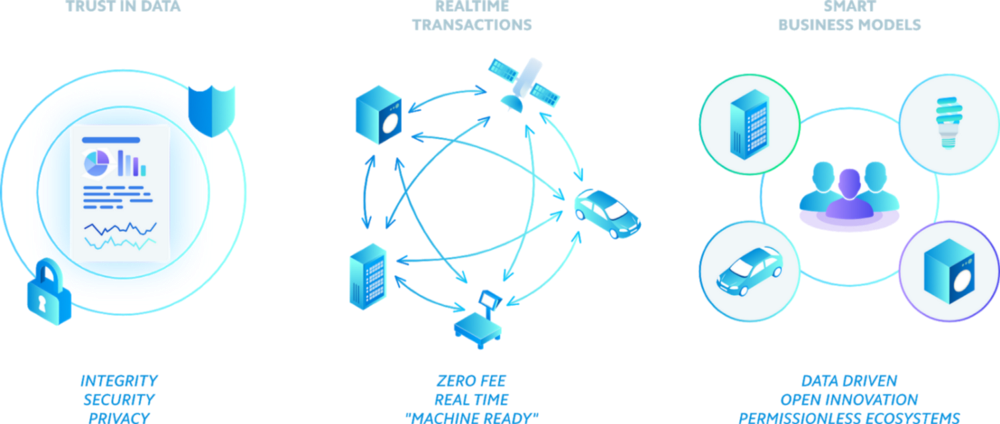

# IOTA 概要
<!-- # IOTA overview -->

**IOTA は、[接続されたデバイス](https://en.wikipedia.org/wiki/Connected_Devices)が無料でデータと [IOTA トークン](../clients/token.md)を相互に転送できるようにするオープンソースの分散型台帳技術です。**
<!-- **IOTA is an open-source distributed ledger technology that allows [connected devices](https://en.wikipedia.org/wiki/Connected_Devices) to transfer data and [IOTA tokens](../clients/token.md) among each other for zero fees.** -->

<iframe src="https://www.youtube.com/embed/Gr-LstcDcAw" frameborder="0" width="560" height="315" style="max-width: 100%;"></iframe>

## IOTA を使うメリット
<!-- ## Why should I use IOTA? -->

IOTA を使用することにより、次のメリットを享受するアプリケーションを構築できます。
<!-- By using IOTA, you can build applications that benefit from the following: -->

- **信頼性：**データを送信したことや、IOTA トークンの所有権を証明できます。
<!-- - **Authenticity:** Prove that you sent data and/or own IOTA tokens -->
- **整合性：**データが変更されていないことを証明できます。
<!-- - **Integrity:** Prove that your data is unchanged -->
- **機密性：**暗号化によりデータにアクセスできるユーザーを制御できます。
<!-- - **Confidentiality:** Control who has access to your data through encryption -->
- **マイクロペイメント：**手数料を支払うことなく、少量の IOTA トークンを送信できます。
<!-- - **Micropayments:** Send small amounts of IOTA tokens without paying any fees -->

### データの信頼性
<!-- ### Trust in data -->

[IOTA ネットワーク](../network/iota-networks.md)内の各[ノード](../network/nodes.md)は、[トランザクション](../transactions/transactions.md)を検証し、同じことを行う他のノードにトランザクションを送信します。その結果、すべての有効なトランザクションはすべてのノードによって合意され、ネットワーク内の単一のトランザクションを信頼する必要がなくなります。
<!-- Each [node](../network/nodes.md) in an [IOTA network](../network/iota-networks.md) validates [transactions](../transactions/transactions.md), then sends them to other nodes that do the same. As a result, all valid transactions are agreed on by all nodes, removing the need to trust a single one in the network. -->

自分自身のノードを実行して、ネットワーク内のトランザクションの検証を開始することもできます。
<!-- You can even run your own node to start validating transaction in the network. -->

#### 整合性
<!-- #### Integrity -->

[タングル](../network/the-tangle.md)内のすべてのトランザクションはイミュータブルで透過的です。
<!-- All transactions in the [Tangle](../network/the-tangle.md) are immutable and transparent. -->

各トランザクションは、前の2つのトランザクションハッシュを参照します。そのため、任意のトランザクションの内容が変更されると、ハッシュが無効になり、トランザクションが無効になります。
<!-- Each transaction references the transaction hashes of two previous ones. So, if the contents of any transaction were to change, the hashes would be invalid, making the transactions invalid. -->

#### 安全性とプライバシー
<!-- #### Security and privacy -->

IOTA は、量子ロバストなワンタイム[署名](../clients/signatures.md)を使用して、攻撃者が IOTA トークンを盗むのを防ぎます。
<!-- IOTA uses quantum-robust one-time [signatures](../clients/signatures.md) to stop attackers from stealing IOTA tokens. -->

IOTA ネットワークは、中央当局がタングルを制御しないP2Pネットワークです。代わりに、すべてのノードがタングルのコピーを保持し、その内容について合意に達します。
<!-- IOTA networks are peer-to-peer networks where no central authority controls the Tangle. Instead, all nodes hold a copy of it and reach a consensus on its contents. -->

### 経費節約
<!-- ### Cost saving -->

IOTA は無料で使用できます。サブスクリプションを支払う必要も、契約に署名する必要もありません。トランザクションも無料です。
<!-- IOTA is free to use. You don't need to pay a subscription, or sign a contract. Even transactions are feeless. -->

制限なしでタングルにデータを保存できます。必要なのは、トランザクションを送信できるノードだけです。
<!-- You can store data on the Tangle with no restrictions. All you need is a node to which you can send transactions. -->

### スケーラビリティ
<!-- ### Scalability -->

タングルにアタッチされる各トランザクションごとに、2つの以前のトランザクションが検証されます。このプロセスにより、IOTA が非常にスケーラブルになります。これは、より多くの新しいトランザクションが検証の高速化につながるためです。
<!-- For each transaction that's attached to the Tangle, two previous transactions are validated. This process makes IOTA incredibly scalable because more new transactions lead to faster validations. -->

## IOTA はどのように機能するか？
<!-- ## How does IOTA work? -->

IOTA ネットワークはノードとクライアントで構成され、誰でもパブリック IOTA ネットワークのいずれかとして自由に行動できます。
<!-- An IOTA network consists of nodes and clients, and anyone is free to act as either in the public IOTA networks. -->

### ノード
<!-- ### Nodes -->

ノードは、タングルと呼ばれるトランザクションのイミュータブルなレコードへの読み取りおよび書き込みアクセスを持つ唯一のデバイスであるため、IOTA ネットワークのバックボーンです。
<!-- Nodes are the backbone of an IOTA network as they are the only devices that have read and write access to the immutable record of transactions called the Tangle. -->

相互接続されたノードは、同じ[ノードソフトウェア](root://node-software/0.1/introduction/overview.md)を実行することで IOTA ネットワークを形成し、トランザクションを検証してタングルに接続できるようにします。
<!-- Interconnected nodes form an IOTA network by running the same [node software](root://node-software/0.1/introduction/overview.md), allowing them to validate transactions and attach them to the Tangle. -->

### クライアント
<!-- ### Clients -->

クライアントは、ノードに接続してタングル上でデータを取引またはタングル上にデータを保存するデバイスです。
<!-- Clients are the devices that connect to nodes to transact or store data on the Tangle. -->

IOTA ネットワーク内のすべてのクライアントには、[シード](../clients/seeds.md)と呼ばれる秘密のパスワードがあり、これが ID として機能します。シードはクライアントに[アドレス](../clients/addresses.md)へのアクセスを提供します。これは、IOTA トークンの残高を持つアカウントのようなものです。
<!-- All clients in an IOTA network have a secret password called a [seed](../clients/seeds.md), which acts as their identity. Seeds give clients access to [addresses](../clients/addresses.md), which are like accounts with a balance of IOTA tokens. -->

IOTA トークンを転送したり、データのみを送信したりするために、クライアントは転送命令をトランザクションと呼ばれるオブジェクトにパッケージ化し、ノードに送信してタングルにアタッチします。
<!-- To transfer IOTA tokens or even to send only data, clients package the transfer instructions into objects called transactions and send them to a node to attach to the Tangle. -->

## ユースケース
<!-- ## What are some example use cases? -->

IOTA は、単一の真実のソースを使用して、データを共有およびアクセスするための安全なプラットフォームです。そのため、IOTA は、効率性の向上、生産性の向上、データの整合性の確保により、多くの業界に利益をもたらします。
<!-- IOTA is a secure platform for sharing and accessing data, using a single source of truth. As such, IOTA can benefit many industries by improving efficiency, increasing production, and ensuring data integrity. -->

- [モビリティ](https://www.iota.org/verticals/mobility-automotive)
<!-- - [Mobility](https://www.iota.org/verticals/mobility-automotive) -->
- [グローバル貿易とサプライチェーン](https://www.iota.org/verticals/global-trade-supply-chains)
<!-- - [Global trade and supply chains](https://www.iota.org/verticals/global-trade-supply-chains) -->
- [工業用IoT](https://www.iota.org/verticals/industrial-iot)
<!-- - [Industrial IoT](https://www.iota.org/verticals/industrial-iot) -->
- [ヘルスケア](https://www.iota.org/verticals/ehealth)
<!-- - [Healthcare](https://www.iota.org/verticals/ehealth) -->
- [エネルギー](https://www.iota.org/verticals/smart-energy)
<!-- - [Energy](https://www.iota.org/verticals/smart-energy) -->

IOTA のいくつかのアプリケーションは次のとおりです。
<!-- These are some applications of IOTA: -->

| **会社** | **説明** | **リファレンス** |
| :------: | :------: | :--------------: |
| bIOTAsphere | bIOTAsphere はテスラ車を IOTA ネットワークに接続しました。自動車は IOTA トークンで動的保険を購入します。 | [ユースケースを紹介するYouTubeビデオ](https://www.youtube.com/watch?v=2zvrA5KqeYw) |
| iampass | iampassは、手のひらを暗号化してスキャンし、IOTA ネットワークのタングルでそのデータを確認することにより、ユーザーを認証するIDおよびアクセス管理システムです。 | [iampassのウェブサイト](https://iampass.io/) |
| +CityxChange consortium | CityxChangeコンソーシアムは、安全なデータ転送レイヤーとして IOTA を使用するスマートシティを構築するプロジェクトです。 | [+CityxChangeのウェブサイト](http://cityxchange.eu/) |
| eCl@ss | eCl@ssは IOTA と協力して、ISO/IEC準拠の製品分類と製品説明の共有と保存を行っています。 | [eCl@ssのウェブサイト](https://www.eclass.eu/en/association/cooperation.html) |
| Elaadnl | Elaadnlは IOTA トークンでの支払いを受け入れる電気自動車充電器を作成しています。 | [Elaadnlのウェブサイト](https://www.elaad.nl/news/worlds-first-iota-charging-station-released/) |

## IOTA を使う出発点
<!-- ## Where do I start? -->

**非開発者：**[公式トリニティウォレット](root://wallets/0.1/trinity/introduction/overview.md)を使用して、シードの作成と保存、トランザクションの送受信などを行う。
<!-- **Non-developers:** Use the [official Trinity wallet](root://wallets/0.1/trinity/introduction/overview.md) to create and store your seed, send and receive transactions, and more. -->

**開発者：**[クライアントライブラリの1つを使用する](root://client-libraries/0.1/getting-started/quickstart.md)か[自分自身のノードを実行して IOTA ネットワークに参加する](root://node-software/0.1/iri/how-to-guides/quickstart.md)。
<!-- **Developers:** [Get started with one of the client libraries](root://client-libraries/0.1/getting-started/quickstart.md) or [join an IOTA network by running your own node](root://node-software/0.1/iri/how-to-guides/quickstart.md) -->

**取引所：**[公式ハブウォレット](root://wallets/0.1/hub/introduction/overview.md)を使用して、IOTA を取引所に統合する。
<!-- **Exchanges:** Use the [official Hub wallet](root://wallets/0.1/hub/introduction/overview.md) to integrate IOTA into your exchange. -->
