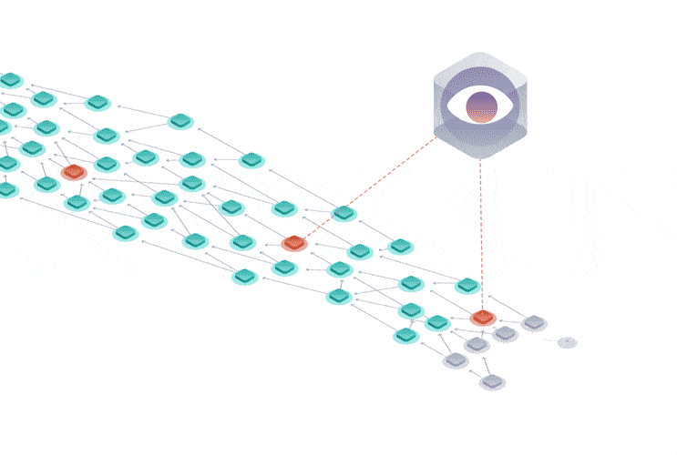

# コーディネーター
<!-- # The Coordinator -->

**コーディネーターは、IOTA 財団によって実行されるアプリケーションであり、その目的は[タングル](../network/the-tangle.md)を[パラサイトチェーン](https://blog.iota.org/attack-analysis-the-simple-parasite-chain-42a34bfeaf23)などの攻撃から保護することです。[ノード](../network/nodes.md)は、コーディネーターを使用して、トランザクションが確定されるコンセンサスに到達します。**
<!-- **The Coordinator is an application that's run by the IOTA Foundation and whose purpose is protect the [Tangle](../network/the-tangle.md) from attacks such as [parasite chains](https://blog.iota.org/attack-analysis-the-simple-parasite-chain-42a34bfeaf23). [Nodes](../network/nodes.md) use the Coordinator to reach a consensus on which transactions are confirmed.** -->

[転送バンドル](../transactions/bundles.md#transfer-bundles)を送信すると、その中のすべてのトランザクションが確定されるまで残高は更新されません。
<!-- When you send a [transfer bundle](../transactions/bundles.md#transfer-bundles), your balance isn't updated until all the transactions in it are confirmed. -->

トランザクションをペンディング中から確定済みに変更できるのはコーディネーターだけです。
<!-- It's the Coordinator that allows your transactions to go from pending to confirmed. -->

コーディネーターは、台帳内の2つの新しいランダムトランザクションを参照および承認するバンドルを定期的に送信するプログラムです。バンドル内の署名済みテールトランザクションは、マイルストーンと呼ばれます。
<!-- The Coordinator is a program that regularly sends bundles that reference and approve two new random transactions in the ledger. The signed tail transaction in the bundle is called a milestone. -->

## マイルストーン
<!-- ## Milestones -->

同じ [IOTA ネットワーク](../network/iota-networks.md)のすべてのノードは、コーディネーターの[アドレス](../clients/addresses.md)でハードコーディングされています。そのため、ノードはマイルストーンを見るたびに、次のような多くのチェックを行うことにより、マイルストーンが有効であることを確認します。
<!-- Every node in the same [IOTA network](../network/iota-networks.md) is hard-coded with the [address](../clients/addresses.md) of a Coordinator. So, whenever nodes see a milestone, they make sure it's valid by doing a number of checks, including: -->

- マイルストーンがコーディネーターのアドレスから来ていること．
<!-- * The milestone came from the Coordinator's address -->
- マイルストーンが全ての無効なトランザクションを参照していないこと．
<!-- * The milestone doesn't reference any invalid transactions -->

結果として、コーディネーターが偽造トランザクションを参照するような無効なマイルストーンを送信した場合、残りのノードはマイルストーンを受け入れません。
<!-- As a result, if the Coordinator were to ever send an invalid milestone such as one that references counterfeit transactions, the rest of the nodes would not accept it. -->

:::info:
コーディネーターはトークンを失ったり、トランザクションをリバースしたりすることはできません。
:::
<!-- :::info: -->
<!-- The Coordinator can't lose tokens or reverse transactions. -->
<!-- ::: -->

有効なマイルストーンのトランザクションがタングル上の既存のトランザクションを参照する場合、ノード群はその既存のトランザクションのステートとその履歴全体を確定済みとしてマークします。
<!-- When a transaction in a valid milestone references an existing transaction in the Tangle, nodes mark the state of that existing transaction and its entire history as confirmed. -->

## コーディネーターのマークル木
<!-- ## The Coordinator's Merkle tree -->

[署名](../clients/signatures.md)はアドレスの所有権を証明し、かつ IOTA はワンタイム署名を使用しているため、コーディネーターは毎回同じ秘密鍵でバンドルに署名することなく、多数のアドレスを所有していることをノードに証明する必要が有ります。
<!-- Because [signatures](../clients/signatures.md) prove ownership of an address and IOTA uses one-time signatures, the Coordinator needs a way to prove to nodes that it owns an address without signing bundles with the same private key every time. -->

そのために、コーディネーターのアドレスは[マークル木](https://en.wikipedia.org/wiki/Merkle_tree)から導出されます。アドレスはマークル木のルートであり、秘密鍵はマークル木のリーフです。
<!-- To do so, the Coordinator's address is derived from a [Merkle tree](https://en.wikipedia.org/wiki/Merkle_tree), where the address is the root, and the private keys are the leaves. -->

## マークル木の生成方法
<!-- ## How the Merkle tree is generated -->

マークル木を生成するには、まず、コーディネーターのシードから多数のアドレスと秘密鍵を生成します。
<!-- To generate the Merkle tree, first a number of addresses and private keys are generated from the Coordinator's seed. -->

アドレスの総数は、次の式のマークル木の深さ（`depth`）に依存します。
<!-- The total number of addresses depends on the depth of the Merkle tree in this formula: -->

2depth

### マークル木の例
<!-- ### Example Merkle tree -->

この例では、4つのリーフがあり、それぞれがアドレスを表すため、マークル木の深さは2です。
<!-- In this example, the Merkle tree's depth is 2 because we have 4 leaves, which each represent an address. -->

:::info:
メインネットでは、コーディネーターのマークル木の深さは23です。したがって、コーディネーターは8,388,608個の秘密鍵を持ち、各鍵を使用してバンドルに署名できます。
:::
<!-- :::info: -->
<!-- On the Mainnet, the Coordinator's Merkle tree has a depth of 23. So, the Coordinator has 8,388,608 private keys and can use each one to sign a bundle. -->
<!-- ::: -->

コーディネーターのアドレスを生成するために、リーフはペアでハッシュされます。
<!-- To generate the Coordinator's address, the leaves are hashed in pairs: -->

- **ノード 1：**Hash(Hash(リーフ 1) Hash(リーフ 2))
- **ノード 1：**Hash(Hash(リーフ 1) Hash(リーフ 2))
- **ノード 2：**Hash(Hash(リーフ 3) Hash(リーフ 4))
- **コーディネーターのアドレス：**Hash(Hash(ノード 1) Hash(ノード 2))

ノード1は、リーフ1とリーフ2のハッシュ結果のハッシュ値です。ノード2は、リーフ3とリーフ4のハッシュ結果のハッシュ値です。コーディネーターのアドレスは、ノード1のハッシュ値とノード2のハッシュ値のハッシュ結果のハッシュ値です。
<!-- Node 1 is a hash of the result of hashing leaf 1 and leaf 2. Node 2 is a hash of the result of hashing leaf 3 and leaf 4. The Coordinator's address is a hash of the result of hashing the hash of node 1 and node 2. -->

## ノードによるマイルストーンの検証方法
<!-- ## How nodes validate milestones -->

アドレスを所有していることをノードに証明するために、コーディネーターのバンドルには次のものが含まれています。
<!-- To prove to nodes that it owns the address, the Coordinator's bundles contain the following: -->

- 分断化された署名を含めるのに十分なゼロトークントランザクション
<!-- - Enough zero-value transactions to contain the fragmented signature -->
- ノードが欠損データを再構築できるように、マークル木からの十分な欠損データが[`signatureMessageFragment` フィールド]に含まれている1つのトランザクション
<!-- - One transaction whose [`signatureMessageFragment` field](../transactions/transactions.md#signatureMessageFragment) contains enough missing data from the Merkle tree to allow the node to rebuild it -->

ノードは、コーディネーターのアドレスから送信されたトランザクションを見ると、次のことを実行してコーディネーターのアドレスから送信されたトランザクションを検証します。
<!-- When nodes see a transaction that's been sent from the Coordinator's address, they validate it by doing the following: -->

- トランザクションが二重支払いにつながらないことを確認する
<!-- - Make sure that it doesn't lead to a double-spend -->
- トランザクションの署名を検証する
<!-- - Verify its signature -->

署名を検証するために、ノードはマイルストーンの情報を使用してマークル木を再構築し、マークルルートを見つけます。再構築されたマークルルートがコーディネーターのアドレスと同じ場合、ノードはマイルストーンがコーディネーターによって送信されたことを認識します。
<!-- To verify the signature, nodes use the information in the milestones to rebuild the Merkle tree and find the Merkle root. If the rebuilt Merkle root is the same as the Coordinator's address, nodes know the milestone was sent by the Coordinator. -->

### マイルストーン検証の例
<!-- ### Example milestone validation -->

たとえば、ノードとして、リーフ1の秘密鍵で署名されたバンドルを見たとします。
<!-- For example, as a node, we have seen a bundle that was signed with the private key of leaf 1. -->

最初に、リーフ1のアドレスを見つけるために[署名を検証](../clients/signatures.md#how-nodes-validate-signatures)します。
<!-- First, we [validate the signature](../clients/signatures.md#how-nodes-validate-signatures) to find out the address in leaf 1. -->

マークルルートを計算しやすくするために、バンドルのマイルストーンの1つトランザクションに次のものが含まれています。
<!-- To help us calculate the Merkle root, one of the milestones in the bundle contains the following: -->

- リーフ2のアドレス
<!-- - The address in leaf 2 -->
- ノード2のハッシュ値
<!-- - The hash in node 2 -->

次に、リーフ1のアドレスとリーフ2のアドレスをハッシュしてノード1のハッシュ値を見つけます。次に、ノード1のハッシュ値とノード2のハッシュ値をハッシュしてマークルルートを見つけます。
<!-- Now, we hash the addresses in leaves 1 and 2 to find the hash in node 1. Then, we hash the hash in nodes 1 and 2 to find the Merkle root. -->

この導き出したマークルルートがコーディネーターのアドレスと同じである場合、バンドルはコーディネーターのマークル木の秘密鍵のいずれかで署名されています。
<!-- If the Merkle root is the same as the Coordinator's address, the bundle was signed with one of the private keys in the Coordinator's Merkle tree. -->

## コーディサイド
<!-- ## Coordicide -->

IOTA 財団の研究部門は、コーディネーターの削除の提案である[コーディサイド](https://coordicide.iota.org/)と呼ばれるプロジェクトに焦点を当てています。コーディサイドが発生すると、ノードはマイルストーンなしで合意に達することができ，IOTA ネットワークが分散化されます．
<!-- The Research Department at the IOTA Foundation are working on a project called [Coordicide](https://coordicide.iota.org/), which is a proposal for the removal of the Coordinator. When this happens, nodes will be able to reach a consensus without milestones, making IOTA networks decentralized. -->

## 関連ガイド
<!-- ## Related guides -->

[JavaScript でトランザクションが確定されたかどうかを調べる](root://client-libraries/0.1/how-to-guides/js/check-transaction-confirmation.md)。
<!-- [Find out if a transaction is confirmed in JavaScript](root://client-libraries/0.1/how-to-guides/js/check-transaction-confirmation.md). -->
