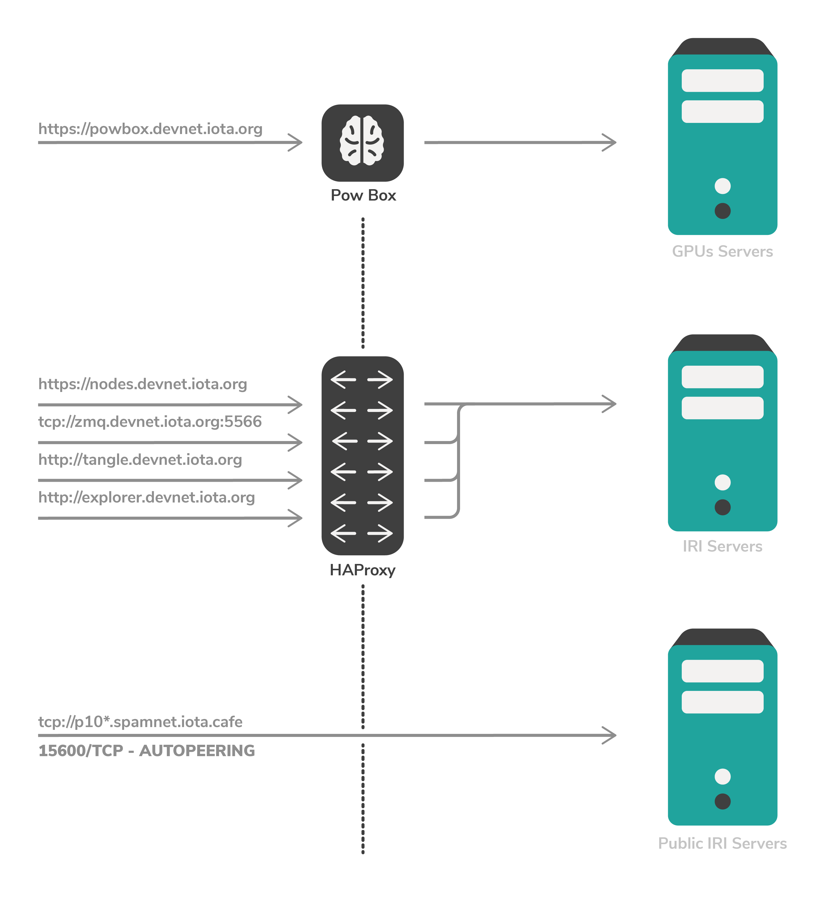
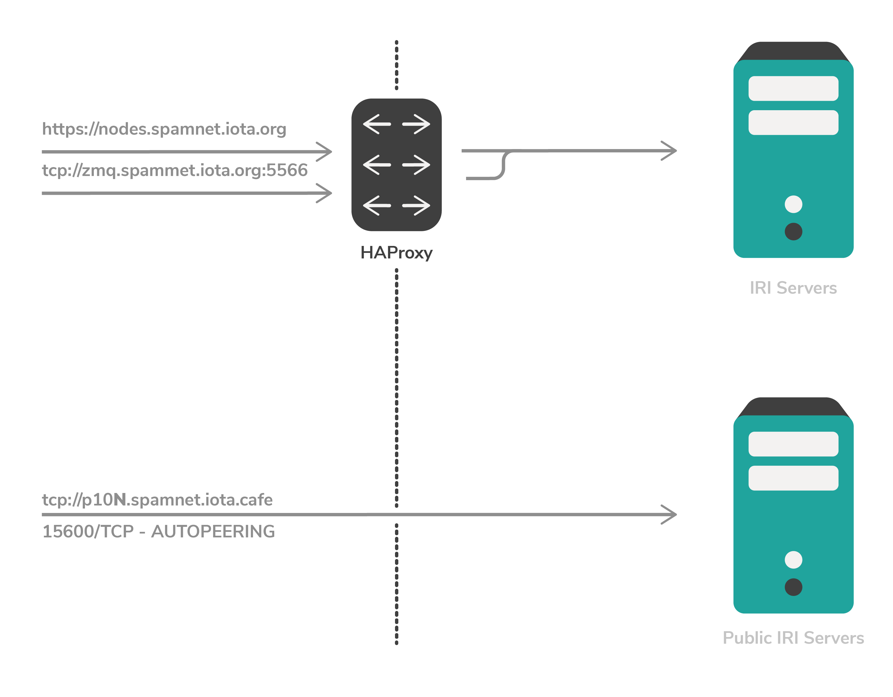

# IOTAネットワーク
<!-- # IOTA networks -->

**IOTAでは、トランザクションのバンドルを[ノード](../introduction/what-is-a-node.md)に送信する必要があります。IOTAには、3つの[パブリックノードネットワーク](../references/iota-networks.md)があります。各ネットワークには、ノードがトランザクションを追加できるそれぞれ独自の分散台帳（タングル）があります。どのパブリックネットワーク上のノードにバンドルを接続して送信するかを選べます。**
<!-- **In IOTA, bundles of transactions must be sent to [nodes](../introduction/what-is-a-node.md). IOTA has three [public networks](../references/iota-networks.md) of nodes. Each network has its own unique distributed ledger (the Tangle) that the nodes can append transactions to. You can choose to connect and send bundles to nodes on any public network.** -->

IOTAには、以下の[無許可型（パブリック）ネットワーク](../introduction/what-is-dlt.md)があります。
IOTA has the following [permissionless (public) networks](../introduction/what-is-dlt.md):
* **Mainnet:** IOTAトークン
* **Devnet:** Devnetトークン（無料）
* **Spamnet:** Spamnetトークン（無料）
<!-- * **Mainnet:** IOTA token -->
<!-- * **Devnet:** Devnet token (free) -->
<!-- * **Spamnet:** Spamnet token (free) -->

すべての無許可型ネットワークは、ノード、クライアント、およびコーディネーターで構成されています。
<!-- All permissionless networks consist of nodes, clients, and the Coordinator. -->

:::info:
許可制（プライベート）ネットワーク上でアプリケーションを作成してテストしたい場合は、[コンパス](root://compass/0.1/introduction/overview.md)と呼ばれるオープンソースのコーディネーターコードのインスタンスを実行することで行うことができます。
:::
<!-- :::info: -->
<!-- If you want to create and test an application on a permissioned (private) network, you can do so by running an instance of the open-source Coordinator code called [Compass](root://compass/0.1/introduction/overview.md). -->
<!-- ::: -->

## Mainnet

暗号通貨交換からIOTAトークンを購入すると、購入したIOTAトークンはメインネットで有効になります。
<!-- When you buy IOTA tokens from a cryptocurrency exchange, those tokens are valid on the Mainnet. -->

:::info:
暗号通貨取引所では、IOTAトークンをメガIOTA（1,000,000）単位で販売しています。これはMIOTAまたはMiとも呼ばれます。

[IOTAトークンの単位](root://iota-basics/0.1/references/units-of-iota-tokens.md)について詳しく学んでみましょう。
:::
<!-- :::info: -->
<!-- Cryptocurrency exchanges sell IOTA tokens in denominations of Mega IOTA (1,000,000), which is also written as MIOTA or Mi. -->
<!--  -->
<!-- Learn more about [units of IOTA tokens](root://iota-basics/0.1/references/units-of-iota-tokens.md). -->
<!-- ::: -->

### Minimum weight magnitude

Mainnet上のトランザクションが有効であるためには、14の[minimum weight magnitude](root://iota-basics/0.1/concepts/minimum-weight-magnitude.md)（MWM）を使用しなければなりません。
<!-- Transactions on the Mainnet must use a [minimum weight magnitude](root://iota-basics/0.1/concepts/minimum-weight-magnitude.md) (MWM) of 14 to be valid. -->

## Devnet

Devnetは、トークンが無料であること以外はMainnetとほとんど同じです。
<!-- The Devnet is similar to the Mainnet, except the tokens are free. -->

Devnetネットワークでは、アプリケーションをテストして、無料のDevnetトークンを使用するPOCを構築できます。
<!-- On this network, you can test your applications and build proofs of concept that use free Devnet tokens. -->

:::info:
[Devnetトークンを受け取る](../tutorials/receive-test-tokens.md)。
:::
<!-- :::info: -->
<!-- [Receive free Devnet tokens](../tutorials/receive-test-tokens.md) -->
<!-- ::: -->

### Minimum weight magnitude

Devnet上のトランザクションが有効になるには、9の[minimum weight magnitude](root://iota-basics/0.1/concepts/minimum-weight-magnitude.md)（MWM）を使用する必要があります。
<!-- Transactions on the Devnet must use a [minimum weight magnitude](root://iota-basics/0.1/concepts/minimum-weight-magnitude.md) (MWM) of 9 to be valid. -->

Mainnetと比較して、9のMWMは[プルーフオブワーク](root://the-tangle/0.1/concepts/proof-of-work.md)（PoW）が完了するのにかかる時間を短縮します。そのため、トランザクションを作成して送信するのにかかる時間と計算能力が少なく済みます。
<!-- Compared to the Mainnet, this MWM reduces the time it takes for [proof of work](root://the-tangle/0.1/concepts/proof-of-work.md) (PoW) to be completed. So, it takes less time and computational power to create and send a transaction. -->

### IRIノード

IOTA財団はDevnet上で以下のパブリックIRIノードをホストしています。
<!-- We host the following public IRI nodes on the Devnet: -->

#### ロードバランサノード
<!-- #### Load balancer node -->

このエンドポイントを使用すると、Devnet上でIRIノードを実行している高可用性プロキシサーバーにアクセスできます。
<!-- This endpoint gives you access to a high-availability proxy server, which is running an IRI node on the Devnet. -->

ロードバランサを使用してトランザクションを送信し、IRIノードから台帳に関する情報をリクエストします。
<!-- Use the load balancer for sending transactions and requesting information about the ledger from the IRI node. -->

**URL:** https://nodes.devnet.iota.org:443

#### ZMQノード
<!-- #### ZMQ node -->

このエンドポイントを使用すると、Devnet上のIRIノードの[ZMQ](root://iri/0.1/concepts/zero-message-queue.md)にアクセスできます。
<!-- This endpoint gives you access to the [zero message queue](root://iri/0.1/concepts/zero-message-queue.md) of an IRI node on the Devnet. -->

ZMQノードを使用して、IRIノード内のイベントをサブスクライブします。
<!-- Use the ZMQ node to subscribe to events in an IRI node. -->

**URL:** tcp://zmq.testnet.iota.org:5556

#### PoWノード
<!-- #### PoW node -->

このエンドポイントを使用すると、リモートでプルーフオブワークを実行できるIRIノードにアクセスできます。
<!-- This endpoint gives you access to an IRI node that can do remote proof of work. -->

PoWノードを使用して小型デバイスの電力を節約します。
<!-- Use the PoW node to save power on small devices. -->

**URL:** https://powbox.devnet.iota.org

## Spamnet

スパムネットは、トランザクションをスパムするアプリケーション用です。
<!-- The Spamnet is for applications that send spam transactions. -->

このネットワークでは、アプリケーションをテストして、無料のSpamnetトークンを使用するPOCを構築できます。
<!-- On this network, you can test your applications and build proof of concepts that use free Spamnet tokens. -->

:::info:無料のSpamnetトークンを受け取る
[蛇口ウェブサイト](https://faucet.spamnet.iota.org)は指定されたアドレスに1Ki（1000）のSpamnetトークンを送ります。
:::
<!-- :::info:Receive free Spamnet tokens -->
<!-- The [faucet website](https://faucet.spamnet.iota.org) sends 1Ki (1000) Spamnet tokens to your specified address. -->
<!-- ::: -->

### Minimum weight magnitude

Spamnet上のトランザクションが有効になるには、7の[minimum weight magnitude](root://iota-basics/0.1/concepts/minimum-weight-magnitude.md)（MWM）を使用する必要があります。 Mainnetと比較して、このMWMは[プルーフオブワーク](root://the-tangle/0.1/concepts/proof-of-work.md)（PoW）が完了するのにかかる時間を短縮します。そのため、トランザクションを作成して送信するのにかかる時間と計算能力が少なく済みます。
<!-- Transactions on the Spamnet must use a [minimum weight magnitude](root://iota-basics/0.1/concepts/minimum-weight-magnitude.md) (MWM) of 7 to be valid. Compared to the Mainnet, this MWM reduces the time it takes for [proof of work](root://the-tangle/0.1/concepts/proof-of-work.md) (PoW) to be completed. So, it takes less time and computational power to create and send a transaction. -->

### IRIノード
<!-- ### IRI nodes -->

IOTA財団はSpamnet上で以下のパブリックIRIノードをホストしています。
<!-- We host the following public IRI nodes on the Spamnet: -->

#### ロードバランサノード
<!-- #### Load balancer node -->

このエンドポイントにより、Spamnet上でIRIノードを実行している高可用性プロキシサーバーにアクセスできます。
<!-- This endpoint gives you access to a high-availability proxy server, which is running an IRI node on the Spamnet. -->

ロードバランサを使用してトランザクションを送信し、IRIノードから台帳に関する情報をリクエストします。
<!-- Use the load balancer for sending transactions and requesting information about the ledger from the IRI node. -->

**URL:** https://nodes.spamnet.iota.org:443

#### ZMQノード
<!-- #### ZMQ node -->

このエンドポイントを使用すると、Spamnet上のIRIノードの[ZMQ](root://iri/0.1/concepts/zero-message-queue.md)にアクセスできます。
<!-- This endpoint gives you access to the [zero message queue](root://iri/0.1/concepts/zero-message-queue.md) of an IRI node on the Spamnet. -->

ZMQノードを使用して、IRIノード内のイベントをサブスクライブします。
<!-- Use the ZMQ node to subscribe to events in an IRI node. -->

**URL:** tcp://zmq.spamnet.iota.org:5556
