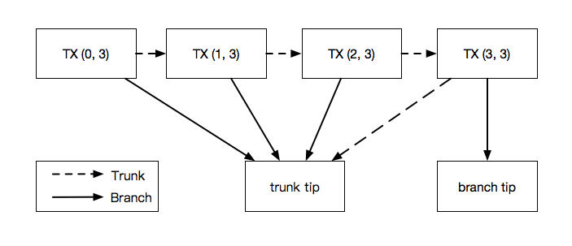

# バンドル
<!-- # Bundles -->

**バンドルは、互いの有効性に依存する[トランザクション](../transactions/transactions.md)のグループです。たとえば、[IOTA トークン](../clients/token.md)を[アドレス](../clients/addresses.md) A へデポジットするトランザクションは、アドレス B から IOTA トークンを取り出すトランザクションに依存しています。したがって、これらのトランザクションは同じバンドル内にある必要があります。**
<!-- **A bundle is a group of [transactions](../transactions/transactions.md) that rely on each other's validity. For example, a transaction that deposits [IOTA tokens](../clients/token.md) into an [address](../clients/addresses.md) relies on another transaction to withdraw those IOTA tokens from another address. Therefore, those transactions must be in the same bundle.** -->

## バンドルの構造
<!-- ## Structure of a bundle -->

バンドルは、先頭トランザクション、ボディトランザクション、末尾トランザクションで構成されます。末尾トランザクションは、`currentIndex` フィールドに0を持つトランザクション（バンドル内の最初のトランザクション）であり、先頭トランザクションは`lastIndex` フィールドに最大値を持つトランザクション（バンドル内の最後のトランザクション）です。。
<!-- A bundle consists of a head, a body, and a tail, where the tail transaction is the one with a 0 in the `currentIndex` field (the first transaction in the bundle), and the head transaction is the one with the largest value in the `lastIndex` field (the last transaction in the bundle). -->

先頭トランザクションを除くバンドル内のすべてのトランザクションは、`trunkTransaction` フィールドを介して相互に接続されます。これらの接続により、[ノード](../network/nodes.md)は同じバンドル内のすべてのトランザクションを検索して検証できます。
<!-- All transactions in a bundle, except the head, are connected to each other through their `trunkTransaction` fields. These connections allow [nodes](../network/nodes.md) to find all transactions in the same bundle and validate them. -->

全トランザクションの `branchTransaction` フィールドおよび先頭トランザクションの `trunkTransaction` フィールドは、[タングル](../network/the-tangle.md)内の2つの既存のバンドルの末尾トランザクションを参照します。
<!-- The other `branchTransaction` and `trunkTransaction` fields reference the tail transactions of two existing bundles in the [Tangle](../network/the-tangle.md). -->



| **現在のインデックス**|**トランクトランザクション**| **ブランチトランザクション**| **説明** |
| :----------------------------- | :------ |:---|:---|
|0| このバンドルのトランザクションインデックス1| タングル内の既存のトランザクションのトランザクションハッシュ|このトランザクションは**末尾トランザクション**と呼ばれます |
|1 | このバンドルのトランザクションインデックス2| トランザクションインデックス0と同じブランチトランザクションハッシュ| このトランザクションは、`trunkTransaction` フィールドを介してトランザクションインデックス0および2にリンクされます|
|2 | このバンドルのトランザクションインデックス3| トランザクションインデックス0, 1と同じブランチトランザクションハッシュ|このトランザクションは、`trunkTransaction` フィールドを介してトランザクションインデックス1および3にリンクされます|
|3 | このバンドル内の他のすべてのトランザクションと同じブランチトランザクションハッシュ| タングル内の既存のトランザクションのトランザクションハッシュ| このトランザクションは**先頭トランザクション**と呼ばれます |

<!-- | **Current index**|**Trunk transaction**| **Branch transaction**| **Description**   | -->
<!-- | :----------------------------- | :------ |:---|:---| -->
<!-- | 0| Transaction index 1 in this bundle| Transaction hash of an existing transaction in the Tangle|This transaction is called the **tail transaction** | -->
<!-- |1 | Transaction index 2 in this bundle| The same branch transaction hash as transaction index 0|This transaction is linked to transaction index 0 and 2 through the `trunkTransaction` field | -->
<!-- |2 | Transaction index 3 in this bundle| The same branch transaction hash as transaction index 0 and 1|This transaction is linked to transaction index 1 and 3 through the `trunkTransaction` field | -->
<!-- |3 | The same branch transaction hash as all other transactions in this bundle| Transaction hash of an existing transaction in the Tangle| This transaction is called the **head transaction** | -->

## バンドルエッセンス
<!-- ## Bundle essence -->

同じバンドル内のすべてのトランザクションは、`バンドル`フィールドに同じバンドルハッシュを持ち、バンドル内のトランザクションをすべて結び付けます。
<!-- All transactions in the same bundle have the same bundle hash in their `bundle` field to tie them all together. -->

このハッシュは、次のトランザクションフィールドの値のハッシュである**バンドルエッセンス**から導出されます。
<!-- This hash is derived from the **bundle essence**, which is a hash of the values of the following transaction fields: -->

- `address`
- `value`
- `obsoleteTag`
- `currentIndex`
- `lastIndex`
- `timestamp`

その結果、バンドルエッセンスの値が変更されると、バンドルハッシュが変更され、バンドル内のすべてのトランザクションが無効になります。
<!-- As a result, if any values of the bundle essence were to change, the bundle hash would change, invalidating all transactions in the bundle. -->

## バンドルとライト
<!-- ## Bundle types -->

バンドルは、次のタイプのいずれかです。
<!-- Bundles can be one of the following types: -->

- 転送バンドル
<!-- - Transfer bundles -->

- ゼロトークンバンドル
<!-- - Zero-value bundles -->

### 転送バンドル
<!-- ### Transfer bundles -->

転送バンドルには、少なくとも1つの入力トランザクションと1つの出力トランザクションが含まれ、ゼロトークントランザクションも含まれる場合があります。
<!-- Transfer bundles contain at least one input transaction and one output transaction, and can also contain zero-value transactions. -->

:::warning:
IOTAトークンが使用済みアドレスに残らないようにするには、常に入力トランザクション内のアドレスの合計残高を取り出す必要があります。

残高全体を1つのアドレスにデポジットしたくない場合は、2つ以上の出力トランザクションを作成して、残高を分けてデポジットできます。
:::
<!-- :::warning: -->
<!-- To avoid leaving IOTA tokens in a spent address, you should always withdraw the total balance of the address in the input transaction. -->

<!-- If you don't want to deposit the entire balance into a single address, you can create one or more output transactions to deposit the remaining amount. -->
<!-- ::: -->

転送バンドルの合計値は常に0に等しくなければなりません。
<!-- The total value of a transfer bundle must always be equal to 0. -->

たとえば、以下のバンドルは、セキュリティレベル2のアドレスから1 i を転送します。
<!-- For example, this bundle transfers 1 i from an address with a security level of 2. -->

--------------------
### 末尾トランザクション

このトランザクションはアドレスに1 i をデポジットします。

```json
{
 "hash": "QBQJSWUNGCVKD9ITQ9ZFHVVPGLULOOTG9JQMUOSYHEWAFQPFUIYFCRFSRYKQUXSEVPFSPONEYQQMA9999",
 "signatureMessageFragment": "999999999999999999999999999999999999999999999999999999999999999999999999999999999999999999999999999999999999999999999999999999999999999999999999999999999999999999999999999999999999999999999999999999999999999999999999999999999999999999999999999999999999999999999999999999999999999999999999999999999999999999999999999999999999999999999999999999999999999999999999999999999999999999999999999999999999999999999999999999999999999999999999999999999999999999999999999999999999999999999999999999999999999999999999999999999999999999999999999999999999999999999999999999999999999999999999999999999999999999999999999999999999999999999999999999999999999999999999999999999999999999999999999999999999999999999999999999999999999999999999999999999999999999999999999999999999999999999999999999999999999999999999999999999999999999999999999999999999999999999999999999999999999999999999999999999999999999999999999999999999999999999999999999999999999999999999999999999999999999999999999999999999999999999999999999999999999999999999999999999999999999999999999999999999999999999999999999999999999999999999999999999999999999999999999999999999999999999999999999999999999999999999999999999999999999999999999999999999999999999999999999999999999999999999999999999999999999999999999999999999999999999999999999999999999999999999999999999999999999999999999999999999999999999999999999999999999999999999999999999999999999999999999999999999999999999999999999999999999999999999999999999999999999999999999999999999999999999999999999999999999999999999999999999999999999999999999999999999999999999999999999999999999999999999999999999999999999999999999999999999999999999999999999999999999999999999999999999999999999999999999999999999999999999999999999999999999999999999999999999999999999999999999999999999999999999999999999999999999999999999999999999999999999999999999999999999999999999999999999999999999999999999999999999999999999999999999999999999999999999999999999999999999999999999999999999999999999999999999999999999999999999999999999999999999999999999999999999999999999999999999999999999999999999999999999999999999999999999999999999999999999999999999999999999999999999999999999999999999999999999999999999999999999999999999",
 "address": "AABKJZWQQHGMWGMPNVLHNSFBIGZWGVXPBJORIDDRKQH99J9BEQODRHUHPAXQUUPNTHYETKJYBSKBOKLQD",
 "value": 1,
 "obsoleteTag": "GANGLE9BEAT9999999999999999",
 "timestamp": 1572432012,
 "currentIndex": 0,
 "lastIndex": 2,
 "bundle": "VYWGQWFTIJZTGPBVVG9BPJLRA9ESUJAZEKRJDCJJLILLSKBKJIABORSOECNPDDNAQHBRFFEXIIY9SWFJX",
 "trunkTransaction": "BSFIPSKZEJINFBLSLOHJEXWUDTQPKBEYWKYCHZCTDTWHRZLPQUFBBQKTAUGICALTIQIYSDFTUMRG99999",
 "branchTransaction": "TXLAUYNHYMAEVHCMEHOBDFIGDXBTIKRVLOOKSTXQPPCFOMLLPTYAAR9AKSJXLAEYNEJGUEPAHIPTZ9999",
 "tag": "TANGLE9BEAT9999999999999999",
 "attachmentTimestamp": 1572432013094,
 "attachmentTimestampLowerBound": 0,
 "attachmentTimestampUpperBound": 11,
 "nonce": "POWSRVIO9VMIJ99FPKVVGGPNNNP"
}
```
---
### トランザクションインデックス1

このトランザクションは、アドレスから1 i を取り出し、その秘密鍵の所有権を証明するための署名を含みます。

このアドレスのセキュリティレベルは2であるため、署名の最初のフラグメントのみが `signatureMessageFragment` フィールドに収まります。

```json
{
 "hash": "BSFIPSKZEJINFBLSLOHJEXWUDTQPKBEYWKYCHZCTDTWHRZLPQUFBBQKTAUGICALTIQIYSDFTUMRG99999",
 "signatureMessageFragment": "TLDYVKXEHWBBZYXCCRPSZAMDHQYRRAND9VP9ICUJBRTWGOUPMUZRK9HZ9MCQBWCUCJHPGUPKWBGEBOAEZWGMALNE9GYIVF9VWIZYTJTBYCKOAVUYJKVHZ9KGMKIXSIDVS9AKTFHIL9YXSKJUWIOAU9WIWCEQRKOZGYQKVWRJWDHQJXXDMFXCMUEZDCBNBRUQPJQKCURAOCIJKIUMSAKSTGOFGUZEIUXNDTJPRD9YRZJALKKNCLYLCOORXYSNXXAESFUUQTIJXBR9CWSXXDMIRKNSGQGEXCPZAFRCLLGKMNSDEKRWCLIOGXRGCWCGCUOWLT9YSTFDYKFDCDMSOGDVRDKCBITJPAUTRPM99QGPBBJKBYJHDSIXURZLLEBN9BIBFUJDCUTBETFECQPSJYIZXYKGXSMPLJRGPONDFL9T9SROJKXDIVJCD9ISBKXUELPPJLHLQRGHFCLSFUTGZWELQJUIEZIIHEBOEQRBMAPVZKDZJSMHRPZSUMASJDKRKDLUFMUQIYBYXUXIEBQVRXDKS9MHSMPVVKDEKPQBXAUXNFBZTIYP9XU9BWBDCOEWZHWIMSYY9EWZ9EE9OMPDVO9BENBPNDODRGJMWZKYNSLPNENUACPFWYBTGFLWU9UOQQMFTZVRHGBZKYELEBYUIBZXAFTEVVGQLLPVKMCEKRMAJBQMLMGWSUPAUPCAHFM9GHLH9YMMBZKZYITELSFEZBNRIQGHCROVBMZXTKVNJCLCTDLQMZNXKRGKDLBWXRBZUBRKITPZFXFKCMENKSZNVCAHZBRGHGBKBUGIOWVEFUCZZWCOTJBJUVOEJOJSJVNUODUEESEDAYHNRXOKOPUJXOBSNHNFGTGBNQFCUNIPHJZXDIOMPLYHWJBRXGEO9HZJBWCIDL9IWGXZRHRKLRETMGIQRGVJGMRXRZGJFGPGCLGVCOLVKRQAKRGRBFPJKQTHDKWMBWQPPDVXASGWEAW99ZVZIBJ9ASLYJPPBOLPZYMUXQQWSTASBWB9FDXNXXE9GZPMJFLTCYWFPZVNZTFIDQBSXTGBWDBPECSGLHJPPNFIVOVHLVJQ9FBHLHGKMKTARKISQKNBQIXZIYEUSOMZIWIXCKIWBEZZKESDDKJJVOVMQEMPBFZNWUFCYL9FGHANRE9LJMTNBIPCLCMUUENPYLHSMYUMTXCMEAPL9IVAARGTYOHOYVNPXIETBB9JXRUGEYK9BOOXRWNQISCXV9MPFHUTGIHAITHKNO9VSK9YHJIQFUZIHDLKYBZNLTYNXTERQDTEXZMQUFEQGGNRGEFPXXIXWCSIDUFMYTGCVGHIMEMRZYOMEQDVRJUWVWOZRZDVB9SIRFZUQYVLBDWBQHUTFNS9AUJFZEANLALSMWBJBGJUKMPVDIKVSRDCMFHBDRCHQCCTWCONU9CKJJS9XYBMLAUKDPBBPYYXRWGRXQCTHZIWOCCMOUIURCDYMZCWVYUWCSDHNWDCNDHRCWCA9PZWD9ESURWBMR9PEVHZCEHMBVRZZSAPEVRKWQWKGMNCCSTSQ9UW9HDXFAOYGPYA9JYKRVHTOILERYMEAHCFXBRYML9EH9CFENIHCBRCKBTRFGFKEHODLESCR9UATCWC9JTHWOYOZTE9TPEDS9ZLHAMZBSBGRWTUABIWYTXQJFTWLSODO9ECJZ9PVPMNCHIXWCYN9TWMZELZKIQXHXXWZNZDS9UBJBUFPOXWZSEEIFIWRFNEIENGMPYNPGTLHOYADFPUYMOYPISNJC9FJPODDSDPIP9HJTMXM9KOR9GXIICBLCWCMULRCP9SYLLBDPRQQDJIOMBIIYROPLHHNNZSUHTB9XJGXVBSY999DGUEG9BOCQPDNYOYPFAVEFOXSDXDIBRJPFTCQAGZZBHBGUWAXGPOTPMMSVJVMICQZGUKVQOJNUR9EEFCEON99TJMATEIBJJ9KJFLPGKYCHNZJCHTFRXVSNGEPMLEKIMV9TFHKQYPRZXEXJZUMESOUFKGZHLDKEJZJVEAWEWACQXEJGNUPUA9JKWWBCSEBLSGMMSFQJKTTOTETOMLTKCAQMCRWEPM9HRWNWLZWLBRZJHGKSKJQSNBHECKAMZ9LHHNZNOUDPIFBBYYZNWGYLIS9ACYOKBJQMPYYSRLUZMIIQDDRAIWHNIXARO9AFCNCEMKA9GIJTCMMQVXVVJMDAFLHVOAVBS9",
 "address": "UIHPDAKXUFWHZEGBKLDPNGQCEQ9XR9PHNVFBFNCYCFQHLUSGRSMXKGTCUPEBLWFKFPIORAUZXPUAOQOLC",
 "value": -1,
 "obsoleteTag": "999999999999999999999999999",
 "timestamp": 1572432012,
 "currentIndex": 1,
 "lastIndex": 2,
 "bundle": "VYWGQWFTIJZTGPBVVG9BPJLRA9ESUJAZEKRJDCJJLILLSKBKJIABORSOECNPDDNAQHBRFFEXIIY9SWFJX",
 "trunkTransaction": "S9JXORYFIWNHBZKEFGDXYOELOLAQKJSDGUULPX9F9WFFLFIBVSFCGRJWPKQQJGEYQZQMGALODVNM99999",
 "branchTransaction": "TXLAUYNHYMAEVHCMEHOBDFIGDXBTIKRVLOOKSTXQPPCFOMLLPTYAAR9AKSJXLAEYNEJGUEPAHIPTZ9999",
 "tag": "999999999999999999999999999",
 "attachmentTimestamp": 1572432012848,
 "attachmentTimestampLowerBound": 0,
 "attachmentTimestampUpperBound": 11,
 "nonce": "POWSRVIO9VMIJ99UTEKETKNNNNT"
}
```
---
### 先頭トランザクション

このトランザクションには、トランザクションインデックス1のアドレスの署名の残りが含まれます。

```json
{
 "hash": "S9JXORYFIWNHBZKEFGDXYOELOLAQKJSDGUULPX9F9WFFLFIBVSFCGRJWPKQQJGEYQZQMGALODVNM99999",
 "signatureMessageFragment": "TYQCGCSOWVWETUUBA9ECSYGZVQCCRFNHRSRYQ9MCKAXUUWFKMCTSUHXZJYKJHCJVUSDBNMCFH9YMTZYACJAQRYWHCIYVPUZTXRGBABICPAXKYJBAERHLLMWLOUEFUTLZPIPF9DQHLUEWFQX9ZRBGOFLCVUPYSFAPFWPCOYXAKFTDTOSMORXU9CWDZZPMAPSTIDZDLKXSHZDEAZSEBOPSLFFNUVCLNWCXBVYVIZUNZAAFTMNFSIWMRGMEVOMAOCPRCNUVNIVEODJLKFNLJMURTOLJGFPWRCBQGPRUNQUWFQOFHWOWPMGNAESHRDBYUBF9EARZKAFEHX9WOOUYKVEXSXUYEYYLVLRTYCUEBNRHJAXHL9OTPF9QEQLPOPJOSTLZZIPPXZLS9IYKDEGCCBOPDBNKGZKYQLHHVJOUIYU9BLRWKJIJZQMIPZHYXHPNDXSCIZQFBQ9GHBYGDRSQGHHPQJHDPIDCRCKWFDNKKZOWKWFKHMZSVPTDVITEKM9BWPWFZMSXUGQUVEOOQOCUDLWATDAMQOGGRZKQUSON9ZYWURBZEXYHMMTXRPXFVPYAYS9EEOBPWQNGQODILVKJMDRUULIPSEDSZWGDDLXJINVRKCNCMFIANSRVTAGPOGFMTVOHOIUKNBDAN9TU9HINKQMMBWMIDXRUCZREVCAHSCG9WTKYNDSBZUSHQQCXLRSPFMOUEFDPXHFTGYYGEHXKSTMVMMKCZONOTNHPPDSEQVGKMYFTRAFLMKKQQHARFNQM9QFIFUUVMAZR9TQUBVGCBKDPZ9JUERHFPLXXMOXFCVJBOXB9KCDMWHQRFETBJOTEHMPBFGGLPTCHKGHYTDWHTVGTMGJTJPTHLDRAIVYGXZHOAAHRAGDMYUNMPRICFW9EVHCLLVUUP9DKACZUS9XCZIWCGUAIIOVTILBREZJLFPTFOOMQDJDJM9BQYTMQFAOIJPDT9VGSFYXDBMBW9CHDDECHPGQOAIWCLBTRBIEMAWK9JJQOQQQFGEZOLXOIPHBUUKSABXHUUGZLCDZDYSGWLVEPVDAARE9IXKQAOPWDF9KUJSHWBIIMVPPJHNYSAXADEGJAWJLCTXYICLOJC9MVNWIIBRLAJAXNTLJCFWXEYBRMNKUPV9UKD9EJMYOPPXGSHPYJNHGBYCTUHLXOHUROZNOLTHTGUQKXRIWQISXOIOCBTVLEEDMIUXIVRCNJDHBCRZ9RNHOOBRHQ9XNDVTMWDAFVVNAGKXYTBWJIQDOSZSCUQYBGJZSZCGYCAAN9BYNISGJFJTDRBAAIVNICOHIBLPKPJEIHLMNZJANCQHNFPOBYXNIXXZU9RSUOCKPWYYHFMB9AK9QPQCPP9THMFXJMUCGHYBWPQRBIGFCGDGFLBAZUZSLDHQFMBQWWWZWNMOEOFQSYCJJGAPPAYEIGCEMPUQJDFMPZWMQW9LSDXHEPHTHHHUHHLZDBOYHUJVOPIPMKQGKIPOXTCBJQQFDKRNPNUNVQXMXWVXUNMTALCGVJWVQGC99JQUVVTQJWCOBLWECJQHIBVQDGLECVSCTTWAUVUSKRMUIMWEWTRFFBWYENUWVIMACBAETDFLDHQUIAZWWLDD9HQUAZJTTFBVLQNLKRJM9ZQLNPJLNXDESSNKHOIZWWB9ZHPUD9BGV9WPAVQOQCESJJXDQQKOFSSGARHNTUEPDHHZEFFFVRD9DVNXEQZZNPEAAFWMQAOOQ9EKKPHQJNYLHNVMOFZFESRUCCQCTFMEPENG9BUUSDDWUENOEFGZHQUWBVLJAJYVTZOXVQDWVKOS9KZYWIBAEJMX9C9MDCVUGVYFODV9OYEECMJ9DTISVZOCPJYHCHLTBMBXPIWJKPWLWJBBRTHVDMQJ9RUDCSVBVB9SRYNCHBIOHJVOIOYCKTSXMAFNHBBDVFPRAVIRFIIRMLLKRJQFJD999TPOLVESEHTDVBPPLQBDMAOELDKMNHGWEHZI9CQNEASTNDDYYSZP9IYYSXWXALVDUMNQAMLMJTTBEOYXPOMBPYQDSVABEWDOPEZVHCTFJWNZLODWCMBIOUTWIPMHYQBPN9VADEAFRWQSWAVJDBJSFZRKDRIWDVASUVUROCKHBU9JYWUYCAAUNTTJRMRCXPU9KFFPYVMBDQELORDKQJFLHYELAXWNJTVEZIPPUSUUWWLODPCLQSQAVTEPUMEPFNUZX",
 "address": "UIHPDAKXUFWHZEGBKLDPNGQCEQ9XR9PHNVFBFNCYCFQHLUSGRSMXKGTCUPEBLWFKFPIORAUZXPUAOQOLC",
 "value": 0,
 "obsoleteTag": "999999999999999999999999999",
 "timestamp": 1572432012,
 "currentIndex": 2,
 "lastIndex": 2,
 "bundle": "VYWGQWFTIJZTGPBVVG9BPJLRA9ESUJAZEKRJDCJJLILLSKBKJIABORSOECNPDDNAQHBRFFEXIIY9SWFJX",
 "trunkTransaction": "TXLAUYNHYMAEVHCMEHOBDFIGDXBTIKRVLOOKSTXQPPCFOMLLPTYAAR9AKSJXLAEYNEJGUEPAHIPTZ9999",
 "branchTransaction": "HKYJHPJBCDFNMKBABLCCBDZWYDDNTLCHOPFMBXDIRCMJQCKUJ9BSHNPD9WMSMSMI9KJFWYDZAOHCZ9999",
 "tag": "999999999999999999999999999",
 "attachmentTimestamp": 1572432012650,
 "attachmentTimestampLowerBound": 0,
 "attachmentTimestampUpperBound": 11,
 "nonce": "POWSRVIO9VMIJ99OKTVPNGPNNNV"
}
```
--------------------

### ゼロトークンバンドル
<!-- ### Zero-value bundle -->

ゼロトークンバンドルは、メッセージ、署名、またはその両方を含むゼロトークントランザクションで構成されます。
<!-- A zero-value bundle consists of zero-value transactions that contain either messages, signatures or both. -->

たとえば、以下のバンドルには、`signatureMessageFragment` フィールドにトライトエンコードされたメッセージがある1つのトランザクションが含まれています。
<!-- For example, this bundle contains one transaction that has a tryte-encoded message in its `signatureMessageFragment` field. -->

```json
{
 "hash": "ZSOH9CJJUKADSXM9EDYHGBNDQZ9NHCZVRMLRDQAENHIJDFBITQBYWXOWUFTYMFQN9WPVQMSFYVNLZ9999",
 "signatureMessageFragment": "CCPCBDVC9DTCWBXCLDTCFDEAXCGDEACDBD9DXCBDTCFAEACCPCBDVC9DTCEAQCPCGDTCSCEARCCDXCBDRAADXCLDXCBDVCEAGDTCFDJDXCRCTCEARAEAWCHDHDDDGDDBTATAVCXCHDWCIDQCSARCCDADTAHDPCBDVC9DTCADXCLDTCFDTAHDPCBDVC9DTCADXCLDTCFD9999999999999999999999999999999999999999999999999999999999999999999999999999999999999999999999999999999999999999999999999999999999999999999999999999999999999999999999999999999999999999999999999999999999999999999999999999999999999999999999999999999999999999999999999999999999999999999999999999999999999999999999999999999999999999999999999999999999999999999999999999999999999999999999999999999999999999999999999999999999999999999999999999999999999999999999999999999999999999999999999999999999999999999999999999999999999999999999999999999999999999999999999999999999999999999999999999999999999999999999999999999999999999999999999999999999999999999999999999999999999999999999999999999999999999999999999999999999999999999999999999999999999999999999999999999999999999999999999999999999999999999999999999999999999999999999999999999999999999999999999999999999999999999999999999999999999999999999999999999999999999999999999999999999999999999999999999999999999999999999999999999999999999999999999999999999999999999999999999999999999999999999999999999999999999999999999999999999999999999999999999999999999999999999999999999999999999999999999999999999999999999999999999999999999999999999999999999999999999999999999999999999999999999999999999999999999999999999999999999999999999999999999999999999999999999999999999999999999999999999999999999999999999999999999999999999999999999999999999999999999999999999999999999999999999999999999999999999999999999999999999999999999999999999999999999999999999999999999999999999999999999999999999999999999999999999999999999999999999999999999999999999999999999999999999999999999999999999999999999999999999999999999999999999999999999999999999999999999999999999999999999999999999999999999999999999999999999999999999999999999999999999999999999999999999999999999999999999999999999999999999999999999999999999999999999999999999999999999999999999999999999999999999999999999999999999999999999999999999999999999999999999999999999999999999999999999999999999999999999999999999999",
 "address": "TANGLEMIXER9TANGLEMIXER9TANGLEMIXER9TANGLEMIXER9TANGLEMIXER9TANGLEMIXER9999999999",
 "value": 0,
 "obsoleteTag": "RBA999999999999999999999999",
 "timestamp": 1572432821,
 "currentIndex": 0,
 "lastIndex": 0,
 "bundle": "TDZWKNLIRTJJVYHCBERTYOQJRZJVPBSIVLHDLGCEODKBCTCJAVBNHIJMEN9JTFDIDOGABLLJDNDDZZKKC",
 "trunkTransaction": "YZQQVDWREFIBNQSSGXWEIK9FXEFPQWX9YOIAF9GBKBSWEQNMFWNNYPNZMLWCHIDLSRBHV9YZE9WR99999",
 "branchTransaction": "LMHBWUMPXQLTAMJFURAFCHTUNVZLIDLXASZMDJB9BFCVB9YWEBKTECNJMGSODHRMDNIAVHZRPDAAA9999",
 "tag": "RBA999999999999999999999999",
 "attachmentTimestamp": 1572432821659,
 "attachmentTimestampLowerBound": 0,
 "attachmentTimestampUpperBound": 3812798742493,
 "nonce": "DHODVTZTMKJTVALTJBMDUANZOOQ"
}
```

## ユーティリティ
<!-- ## Utilities -->

次のIOTA タングルユーティリティをバンドルで使用できます。
<!-- You can use the following IOTA Tangle Utilities with bundles: -->

バンドルハッシュから[指定されたバンドル内のトランザクションを検索するユーティリティ](https://utils.iota.org/)。
<!-- [Search for transactions in a given bundle](https://utils.iota.org/) by their bundle hash. -->

## 関連ガイド
<!-- ## Related guides -->

[JavaScript で "hello world" トランザクションを送信する](root://client-libraries/0.1/how-to-guides/js/send-your-first-bundle.md)。
<!-- [Send a "hello world" transaction in JavaScript](root://client-libraries/0.1/how-to-guides/js/send-your-first-bundle.md). -->

[JavaScript で IOTA トークンを転送する](root://client-libraries/0.1/how-to-guides/js/transfer-iota-tokens.md)。
<!-- [Transfer IOTA tokens in JavaScript](root://client-libraries/0.1/how-to-guides/js/transfer-iota-tokens.md). -->

[トリニティでトランザクションを送信する](root://wallets/0.1/trinity/how-to-guides/send-a-transaction.md)。
<!-- [Send a transaction in Trinity](root://wallets/0.1/trinity/how-to-guides/send-a-transaction.md). -->
