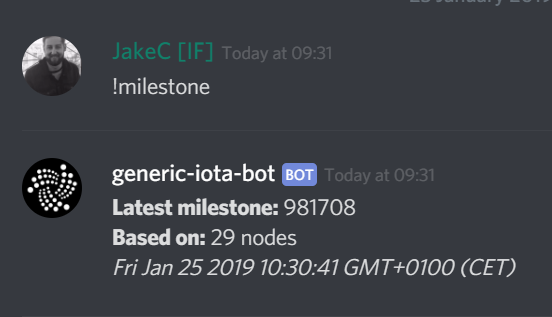

# はじめに
<!-- # Get started -->

**IOTAは、イミュータブルなデータや値をIOTAトークンの形式で転送できる軽量のプロトコルです。**
<!-- **IOTA is a lightweight protocol that allows you to transfer immutable data and/or value in the form of IOTA tokens.** -->

IOTAをアプリやWebサイトに統合するには、次の3つの手順を完了する必要があります。
<!-- To start integrating IOTA into your app or website you need complete these three steps: -->

1. IOTAトークンを保持できるアドレスにアクセスできるように[シードを作成する](#step-1-create-a-seed)。
<!-- 1. [Create a seed](#step-1-create-a-seed) so you can have access to addresses that can hold IOTA tokens -->

2. ノードを介してIOTAネットワークと対話できるように[クライアントライブラリをインストールする](#step-2-install-a-client-library)。
<!-- 2. [Install a client library](#step-2-install-a-client-library) so that you can interact with an IOTA network through a node -->

3. [テストAPIリクエストを送信](#step-3-make-a-test-api-request)して、自分が同期済みノードに接続できていることを確認します。
<!-- 3. [Make a test API request](#step-3-make-a-test-api-request) to confirm that you're connected to a synchronized node -->

:::info:開発者ではありませんか？
コードを記述しなくてもIOTAがどのように機能するかを知りたい場合は、[トリニティを使用してシードを作成し、初めてのデータトランザクションを送信する](../tutorials/send-a-zero-value-transaction-with-the-trinity-wallet.md)こともできます。
:::
<!-- :::info:Not a developer? -->
<!-- If you want to see how IOTA works without having to write code, you can [use Trinity to create a seed and send your first data transaction](../tutorials/send-a-zero-value-transaction-with-the-trinity-wallet.md). -->
<!-- ::: -->

<a name="step-1-create-a-seed"></a>
## 手順1. シードを作成する
<!-- ## Step 1. Create a seed -->

[シード](../introduction/what-is-a-seed.md)はそのシードから派生したすべてのアドレスにアクセスするための一意のパスワードです。これらのアドレスはIOTAトークンを保持しているので残高を持っています。IOTAトークンを転送するには、シードを使って、アドレスの所有権を証明する必要があります。シードには数字9と大文字のA〜Zのみを使うことができます。
<!-- A [seed](../introduction/what-is-a-seed.md) is a unique password that gives you access to all your addresses. These addresses hold your IOTA tokens and as such have a balance. To transfer IOTA tokens, you must use your seed to prove that you own the address that holds them. Seeds can include only the number 9 and the uppercase letters A-Z. -->

:::warning:
シードは安全に保ちバックアップしなければなりません。シードを失うとIOTAトークンを回復することはできません。
:::
<!-- :::warning: -->
<!-- You must keep your seed safe and back it up. If you lose your seed, you can't recover it. -->
<!-- ::: -->

--------------------
### Linux
1\. コマンドプロンプトで次の操作を行います。

```bash
cat /dev/urandom |tr -dc A-Z9|head -c${1:-81}
```
2\. 81文字の出力をコピーしてどこかにペーストします。後でシードが必要になります。今すぐシードをバックアップするのは良い考えです。
---
### macOS
1\. コマンドプロンプトで次の操作を行います。

```bash
cat /dev/urandom |LC_ALL=C tr -dc 'A-Z9' | fold -w 81 | head -n 1
```

2\. 81文字の出力をコピーしてどこかにペーストします。後でシードが必要になります。今すぐシードをバックアップするのは良い考えです。
---
### Windows
1\. [KeePassインストーラをダウンロードする](https://keepass.info/)。

KeePassは、1つのマスターパスワードまたはキーファイルでロック解除できる暗号化されたデータベースに複数のパスワードを保存するパスワードマネージャです。

2\. インストーラを開き、画面上の指示に従います。

3\. KeePassを開き、**New**をクリックします。


4\. 指示に従い、KeePassファイルをコンピュータに保存したら、空白の部分を右クリックして**Add entry**をクリックします。


5\. **Generate a password**をクリックします。


6\. 以下のオプションのみを選択して、**OK**をクリックします。

* Length of generated password: 81
* Upper-case (A, B, C, ...)
* Also include the following characters: 9

7\. **OK**をクリックして、シードを保存します。
--------------------

<a name="step-2-install-a-client-library"></a>
## 手順2. クライアントライブラリをインストールする
<!-- ## Step 2. Install a client library -->

[3つの公式ライブラリ](root://client-libraries/0.1/introduction/overview.md)があります。これらのライブラリと同様に、IOTAコミュニティが[コミュニティライブラリ](root://client-libraries/0.1/introduction/overview.md)をいくつか作成しています。公式にサポートしていないこれらのライブラリを使うこともできます。
<!-- We have [three official libraries](root://client-libraries/0.1/introduction/overview.md). As well as these libraries, the IOTA community has created some [community ones](root://client-libraries/0.1/introduction/overview.md) so you can use a language that we don't officially support. -->

--------------------
### Node.js
このライブラリを使用するには、コンピュータにNode.jsの次のサポート対象のバージョンのいずれかがインストールされている必要があります。

* Node.js 10 以上。[最新のLTS](https://nodejs.org/en/download/)をお勧めします。
* Node.js 8

ライブラリパッケージをインストールするには、次のいずれかのパッケージマネージャが必要です。

* [npm](https://www.npmjs.com/)（Node.jsのダウンロードに含まれています。）
* [Yarn](https://yarnpkg.com/)

npmを使ってライブラリをインストールします。

```bash
npm install @iota/core
```

Yarnを使ってライブラリをインストールします。

```bash
yarn add @iota/core
```

[JavaScriptドキュメントを参照してください](root://iota-js/0.1/README.md)。
---
### Java
Gradleでライブラリをダウンロードします。
モジュールファイルではなく、**root**の`build.gradle`ファイルに次のリポジトリを追加してください。

```java
allprojects {
    repositories {
        maven { url 'https://jitpack.io' }
    }
}
```

**module**の`build.gradle`ファイルに次の依存関係を追加してください。

```java
dependencies {
    compile 'com.github.iotaledger:iota-java:1.0.0-beta5'
}
```
[Javaドキュメントを参照してください](root://iota-java/0.1/README.md)。
---
### Go
IOTA Goクライアントライブラリとその依存関係をダウンロードするには、[Goモジュール](https://github.com/golang/go/wiki/Modules)（バージョン1.11以降で利用可能）を使用してプロジェクト内の依存関係を管理することをお勧めします。

GOPATH以外のディレクトリで、プロジェクトを開始してください。プレースホルダをgithub.com/me/awesome-projectなどのパスに変更します。

```bash
go mod init <your-module-path>
```

ライブラリとその依存関係をダウンロードしてください。

```bash
$ go get github.com/iotaledger/iota.go/api
```
上記のコマンドは、最新バージョンのIOTA Goクライアントライブラリをダウンロードし、そのバージョンを`go.mod`ファイルに書き込みます。

[Goドキュメントを参照してください](root://iota-go/0.1/README.md)。
--------------------

<a name="step-3-make-a-test-api-request"></a>
## 手順.3 テストAPIリクエストを送信する
<!-- ## Step 3. Make a test API request -->

ノードを使用する前に、ノードがIOTAネットワークの残りの部分と同期していることを確認する必要があります。そうすることで、最新の[タングルの概観](root://dev-essentials/0.1/concepts/the-tangle.md)になります。
<!-- Before you use a node, you should make sure that it's synchronized with the rest of the network. This way, you know that it has an up-to-date [view of the Tangle](root://dev-essentials/0.1/concepts/the-tangle.md). -->

`latestMilestoneIndex`フィールドが`latestSolidSubtangleMilestoneIndex`フィールドと等しい場合、ノードは同期していると見なされます。
<!-- A node is considered synchronized when the `latestMilestoneIndex` field is equal to the `latestSolidSubtangleMilestoneIndex` field. -->

`latestMilestoneIndex`フィールドは、ノードが隣接ノードから受信した最新のマイルストーンのインデックスです。
<!-- The `latestMilestoneIndex` field is the index of the latest milestone that the node has received from its neighbors. -->

`latestSolidSubtangleMilestoneIndex`フィールドは、ノードの台帳にマイルストーンが直接および間接的に参照したすべてのトランザクションがある最新のマイルストーンのインデックスです。
<!-- The `latestSolidSubtangleMilestoneIndex` field is the index of the latest milestone for which the node's ledger has all the transactions that the milestone directly and indirectly references. -->

:::info:
`latestMilestoneIndex`と`latestSolidSubtangleMilestoneIndex`フィールドは、IRIノードが同期済み隣接ノードに接続されている場合にのみ正確です。
:::
<!-- :::info: -->
<!-- The `latestMilestoneIndex` and `latestSolidSubtangleMilestoneIndex` fields are accurate only when the IRI node is connected to synchronized neighbors. -->
<!-- ::: -->

1. 現在の`latestMilestoneIndex`フィールドを確認するには、[Discord](https://discord.iota.org)に移動し、いずれかのチャンネルに**!milestone**を入力します。
  <!-- 1. To check the current `latestMilestoneIndex` field, go to our [Discord](https://discord.iota.org) and enter **!milestone** in one of the channels -->

    

2. ノードが同期されているかどうかを確認するには、`getNodeInfo()`メソッドを呼び出します。
  <!-- 2. To check if your node is synchronized, call the `getNodeInfo()` method -->

    :::info:
    ここでは、テストに使用できる[IOTAネットワーク](../references/iota-networks.md)の1つであるDevnetのノードに接続します。Devnetは、トークンが無料であること以外はMainnetにほとんど同じです。
    :::
    <!-- :::info: -->
    <!-- Here, we connect to a node on the Devnet, which is one of the [IOTA networks](../references/iota-networks.md) that you can use for testing. The Devnet is similar to the Mainnet, except the tokens are free. -->
    <!-- ::: -->

--------------------
### JavaScript
```js
// Require the IOTA library
const Iota = require('@iota/core');

// Create a new instance of the IOTA API object
// Use the `provider` field to specify which node to connect to
const iota = Iota.composeAPI({
  provider: 'https://nodes.devnet.iota.org:443'
});

// Call the `getNodeInfo()` method for information about the node and the Tangle
iota.getNodeInfo()
// Convert the returned object to JSON to make the output more readable
.then(info => console.log(JSON.stringify(info, null, 1)))
.catch(err => {
    // Catch any errors
    console.log(err);
});
```
---
### Java
```java
// Create a new instance of the IOTA API object
IotaAPI api = new IotaAPI.Builder().build();
IotaAPI api = new IotaAPI.Builder()
        .protocol("https")
        .host("nodes.devnet.iota.org")
        .port("443")
        .build();
// Call the `getNodeInfo()` method for information about the node and the Tangle
GetNodeInfoResponse response = api.getNodeInfo();
// Print the response to the console
System.out.println(response);
```
---
### Go
```golang
package main

import (
    . "github.com/iotaledger/iota.go/api"
    "fmt"
)

var endpoint = "https://nodes.devnet.iota.org:443"

func main() {
	// Create a new instance of the IOTA API object
	api, err := ComposeAPI(HTTPClientSettings{URI: endpoint})
	handleErr(err)

    // Call the `getNodeInfo()` method for information about the node and the Tangle
	nodeInfo, err := api.GetNodeInfo()
    handleErr(err)

    // Print the response to the console
	fmt.Println(nodeInfo)
}

func handleErr(err error) {
	if err != nil {
		panic(err)
	}
}
```
--------------------

ノードは応答オブジェクトを返します。
<!-- The node returns a response object: -->

```json
{
    "appName": "IRI Testnet",
    "appVersion": "1.5.6-RELEASE",
    "jreAvailableProcessors": 8,
    "jreFreeMemory": 12052395632,
    "jreVersion": "1.8.0_181",
    "jreMaxMemory": 22906667008,
    "jreTotalMemory": 16952328192,
    "latestMilestone": "FPRSBTMKOP9JTTQSHWRGMPT9PBKYWFCCFLZLNWQDFRCXDDHZEFIEDXRIJYIMVGCXYQRHSZQYCTWXJM999",
    "latestMilestoneIndex": 1102841,
    "latestSolidSubtangleMilestone": "FPRSBTMKOP9JTTQSHWRGMPT9PBKYWFCCFLZLNWQDFRCXDDHZEFIEDXRIJYIMVGCXYQRHSZQYCTWXJM999",
    "latestSolidSubtangleMilestoneIndex": 1102841,
    "milestoneStartIndex": 434525,
    "neighbors": 3,
    "packetsQueueSize": 0,
    "time": 1549482118137,
    "tips": 153,
    "transactionsToRequest": 0,
    "features": ["snapshotPruning", "dnsRefresher", "testnet", "zeroMessageQueue", "tipSolidification", "RemotePOW"],
    "coordinatorAddress": "EQQFCZBIHRHWPXKMTOLMYUYPCN9XLMJPYZVFJSAY9FQHCCLWTOLLUGKKMXYFDBOOYFBLBI9WUEILGECYM",
    "duration": 0
}
```

`latestMilestoneIndex`フィールドがDiscordから取得した`latestMilestoneIndex`フィールドと`latestSolidSubtangleMilestoneIndex`フィールドに等しい場合、ノードは同期しています。
<!-- If the `latestMilestoneIndex` field is equal to the one you got from Discord and the `latestSolidSubtangleMilestoneIndex` field, the node is synchronized. -->

そうでない場合は、別のノードに接続してみてください。[iota.dance Webサイト](https://iota.dance/)には、Mainnetノードのリストがあります。
<!-- If not, try connecting to a different node. The [iota.dance website](https://iota.dance/) includes a list of Mainnet nodes. -->

:::success: おめでとうございます:tada:
同期済みノードへの接続を確認できました。これで、[トランザクションを送信する](../tutorials/send-a-zero-value-transaction-with-nodejs.md)準備が整いました。
:::
<!-- :::success: Congratulations :tada: -->
<!-- You've confirmed your connection to a synchronized node. Now, you're ready to [send a transaction to it](../tutorials/send-a-zero-value-transaction-with-nodejs.md). -->
<!-- ::: -->

:::info:
返答オブジェクトの各フィールドの意味については、[APIリファレンス](root://node-software/0.1/iri/references/api-reference.md#getNodeInfo)を参照してください。
:::
<!-- :::info: -->
<!-- To learn what these fields mean, [see the API reference](root://node-software/0.1/iri/references/api-reference.md#getNodeInfo). -->
<!-- ::: -->

# コードを実行する
<!-- ## Run the code -->

<iframe height="600px" width="100%" src="https://repl.it/@jake91/Connect-to-a-node?lite=true" scrolling="no" frameborder="no" allowtransparency="true" allowfullscreen="true" sandbox="allow-forms allow-pointer-lock allow-popups allow-same-origin allow-scripts allow-modals"></iframe>

## コミュニティに参加する
<!-- ## Get involved -->

次のことができる[Discordチャンネル](https://discord.iota.org)に参加してください。
<!-- [Join our Discord channel](https://discord.iota.org) where you can: -->

* IOTA開発者やコミュニティとの議論に参加する。
* 助けを求める。
* 他の人を助けるためにあなたの知識を共有する。
<!-- * Take part in discussions with IOTA developers and the community -->
<!-- * Ask for help -->
<!-- * Share your knowledge to help others -->

次のような多くのチャンネルがあります。
<!-- We have many channels, including the following: -->

* `-dev`：これらのチャンネルは読み取り専用で、開発者同士がトピックについて話し合ったり、GitHubからのコードの更新を見ることができる場所です。
<!-- * `-dev`: These channels are read-only and are where developers discuss topics with each other and where you can see any code updates from GitHub. -->

* `-discussion`：これらのチャンネルはあなたが参加できる場所です。
<!-- * `-discussion`: These channels are where you can participate. -->

## 次のステップ
<!-- ## Next steps -->

[Node.jsを使って初めてのデータトランザクションを送信する](../tutorials/send-a-zero-value-transaction-with-nodejs.md)。
<!-- [Send your first data transaction with Node.js](../tutorials/send-a-zero-value-transaction-with-nodejs.md). -->

[いくつかの無料のIOTAテストトークンを取得](../tutorials/receive-test-tokens.md)し、テストトランザクションでIOTAテストトークンを転送する。
<!-- [Get some free test tokens](../tutorials/receive-test-tokens.md) and start transferring them in test transactions. -->
