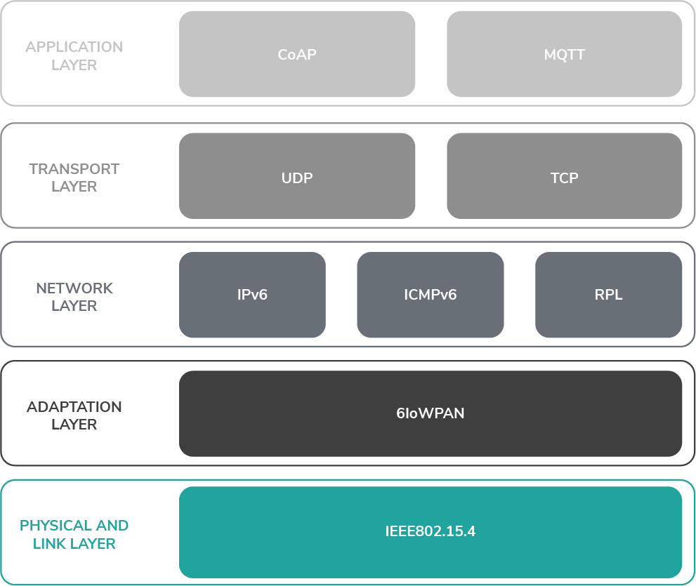
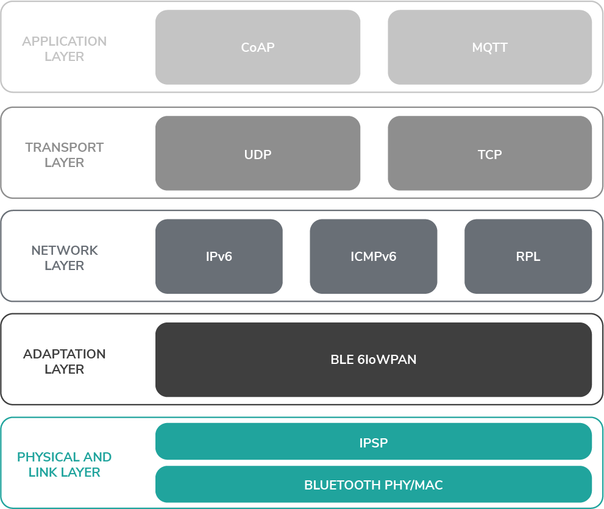
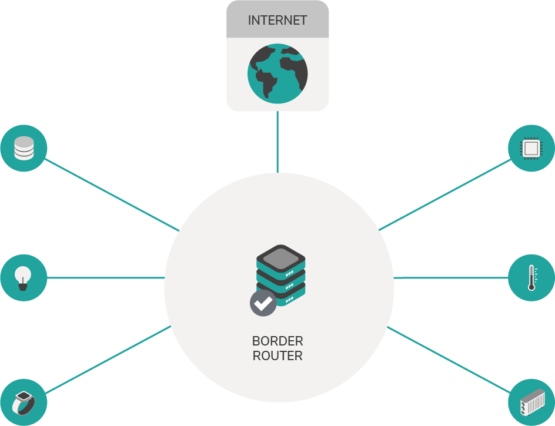
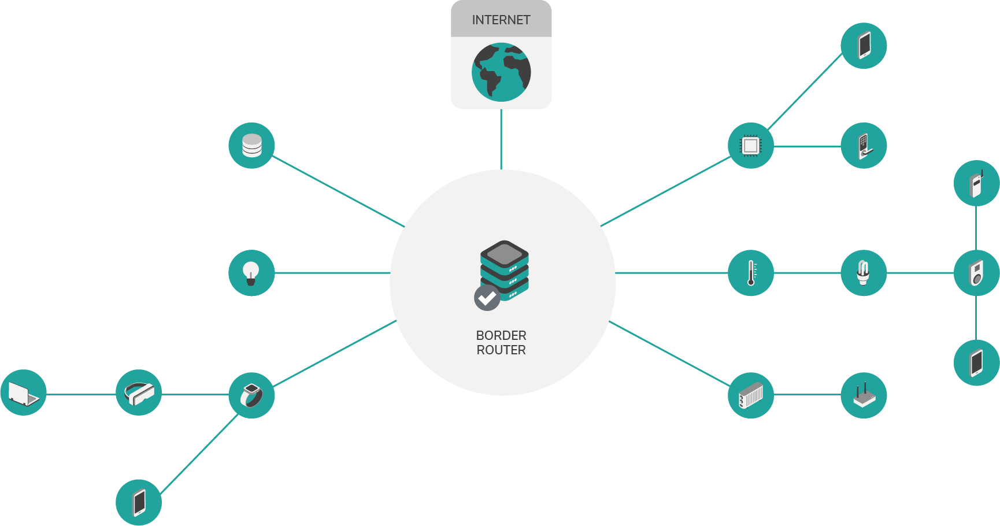

# 6LoWPAN

**6LoWPANは、最新バージョンのインターネットプロトコル（IPv6）と低電力ワイヤレスパーソナルエリアネットワーク（LoWPAN）を組み合わせたネットワークシステムです。6LoWPANを使用すると、処理能力に制限のある小さなデバイスで、ワイヤレスセンサーネットワークを含むさまざまなアプリケーションのインターネットプロトコルを使用してワイヤレスで情報を送信できます。**
<!-- **6LoWPAN is a networking system that combines the latest version of the Internet Protocol (IPv6) and Low-power Wireless Personal Area Networks (LoWPAN). 6LoWPAN, allows small devices with limited processing ability to transmit information wirelessly using an internet protocol for a variety of applications including wireless sensor networks.** -->

All devices in the Internet of Things must be uniquely identifiable, so that other devices can communicate with them.

With 6LoWPAN, each IoT device can directly communicate with other devices, using their IPv6 address. In addition, all applications can use standard protocols such as MQTT, CoAP, and HTTP to communicate, which means that wired and wireless devices can communicate in a common language.

### 6LoWPAN

To conform to the IEEE 802.15.4 protocol, which allows for a packet size of up to 127 bytes, 6LoWPAN uses header compression to reduce the size of local IPv6 addresses from 1280 bytes.

The 6LoWPAN layer uses transparent packet fragmentation to combine the IEEE 802.15.4 packets.

[IEEE 802.15.4](https://standards.ieee.org/standard/802_15_4-2015.html) is the PHY and MAC layer for the 6LoWPAN network.

The Direct Sequence Spread Spectrum modulation used in IEEE 802.15.4
interferes less with other protocol on the same frequency.

The standard is defined in the following documents:
[RFC 8025](https://datatracker.ietf.org/doc/rfc8025/),
[RFC 6775](https://datatracker.ietf.org/doc/rfc6775/),
[RFC 6282](https://datatracker.ietf.org/doc/rfc6282/),
[RFC 8066](https://datatracker.ietf.org/doc/rfc8066/)

### 6LoWPAN over Bluetooth Low Energy

The 6LoWPAN over Bluetooth Low Energy protocol uses 6LoWPAN techniques to enable IPv6 packets over Bluetooth Low Energy. The standard is described in [RFC7668](https://datatracker.ietf.org/doc/rfc7668/), which uses the [IPSP characteristics](https://www.bluetooth.org/docman/handlers/DownloadDoc.ashx?doc_id=296307) in Bluetooth >= 4.1.

The complete IP standard for Bluetooth is defined in the [Bluetooth 4.2 specification](https://www.bluetooth.org/DocMan/handlers/DownloadDoc.ashx?doc_id=286439).

## Network topologies

6LoWPANには、スターツリーとメッシュツリーの2種類のネットワークトポロジが含まれています。
<!-- 6LoWPAN includes two types of network topologies: Star and mesh tree. -->

### スター型
<!-- ### Star -->

スタートポロジーは、ネットワークトポロジーの最も単純な形式です。スター型トポロジーでは、すべてのデバイスが境界ルーターと直接通信し、境界ルーターはメッセージを渡すスイッチとして機能します。
<!-- The star topology is the simplest form of network topology. In the star topology,all devices directly communicate with the border router, which acts as a switch to pass on their messages. -->

| **利点** | **欠点** |
| :--- | :--- |
| 単一のデバイス障害がネットワーク全体に影響することはありません。 | 各コンピューターは境界ルーターに接続するため、より多くのケーブルが必要です。 |
| 拡張が簡単 | 境界ルーターが単一障害点です。 |
| 高速データ転送 |

<!-- |**Advantages**|**Disadvantages**| -->
<!-- |:---------|:------------| -->
<!-- |A single device failure does not affect the entire network|More cables are required because each computer connects to the border router| -->
<!-- |Easy to extend|The border router is a single point of failure| -->
<!-- |Fast data transfer| -->

### メッシュツリー
<!-- ### Mesh tree -->

メッシュツリートポロジーは、すべてのネットワークノードが他のほとんどのノードに接続されているネットワークトポロジーです。このトポロジーでは、メッセージを渡すための通信の中心点として機能するスイッチはありません。代わりに、メッセージはネットワーク経由でルーティングされます。
<!-- A mesh tree topology is a network topology in which all the network nodes are connected to most of the other nodes. In this topology, no switch acts as a central point of communication to pass on the messages. Instead, messages are routed through the network. -->

| **利点** | **欠点** |
| :--- | :--- |
| 故障したデバイスの診断が簡単 | ネットワークにデバイスを追加するのが難しい場合があります。 |
| 安全でプライベートな接続 |

<!-- |**Advantages**|**Disadvantages**| -->
<!-- |:---------|:------------| -->
<!-- |Easy to diagnose a faulty device|Can be difficult to add more devices to the network| -->
<!-- |Secure and private connections| -->

## 命名規則
<!-- ## Naming conventions -->

6LoWPANネットワークを記述するために、次の命名規則が使用されます。
<!-- The following naming conventions are used to describe 6LoWPAN networks. -->

### LLN
LLNは、`low power and lossy networks`（低電力で損失の多いネットワーク）の略です。
<!-- LLN stands for low power and lossy networks. -->

In this type of network, devices may not always be available. For example, some devices may be set up to be available only during certain intervals.

### ホスト
<!-- ### Host -->

ホストは、ルーターではないデバイスを表します。メッシュツリーでは、ホストはリーフノードです。
<!-- Host describes a device which is not a router. In a mesh tree the host is a leaf node. -->

### ノード
<!-- ### Node -->

ノードは、ネットワーク構造内の任意のデバイスを指します。ノードは、ホストまたはルーターのいずれかです。
<!-- Node refers to any device in the network structure. This can either be a host or a router. -->

### IEEE 802.15.4

[IEEE 802.15.4](https://standards.ieee.org/standard/802_15_4-2015.html)は、6LoWPANネットワークのPHYおよびMACレイヤーです。
<!-- [IEEE 802.15.4](https://standards.ieee.org/standard/802_15_4-2015.html) is the PHY and MAC layer for the 6LoWPAN network. -->

IEEE 802.15.4で使用されるダイレクトシーケンススペクトラム拡散変調は、同じ周波数の他のプロトコルとの干渉が少なくなります。
<!-- The Direct Sequence Spread Spectrum modulation used in IEEE 802.15.4  -->
<!-- interferes less with other protocol on the same frequency. -->

### 6LoWPAN

6LoWPANは、最新バージョンのインターネットプロトコル（IPv6）と低電力ワイヤレスパーソナルエリアネットワーク（Low-power Wireless Personal Area Networks, LoWPAN）を組み合わせたシステムです。6LoWPANを使用すると、処理能力に制限のある小さなデバイスで、ワイヤレスセンサーネットワークを含むさまざまなアプリケーションのインターネットプロトコルを使用してワイヤレスで情報を送信できます。
<!-- 6LoWPAN is a system that combines the latest version of the Internet Protocol (IPv6) and Low-power Wireless Personal Area Networks (LoWPAN). 6LoWPAN, allows small devices with limited processing ability to transmit information wirelessly using an internet protocol for a variety of applications including wireless sensor networks. -->

ヘッダー圧縮を使用してローカルIPv6アドレスのサイズを縮小し、IEEE 802.15.4プロトコルに準拠します。これにより、最大127バイトのパケットサイズが可能になります。
<!-- It uses header compression to reduce the size of local IPv6 addresses to conform to the IEEE 802.15.4 protocol, which allows for a packet size of up to 127 bytes. -->

6LoWPANレイヤーは、透過パケットフラグメンテーションを使用してIEEE 802.15.4パケットを結合します。
<!-- The 6LoWPAN layer uses transparent packet fragmentation to combine the IEEE 802.15.4 packets. -->

標準は次のドキュメントで定義されています。
[RFC 8025](https://datatracker.ietf.org/doc/rfc8025/)、
[RFC 6775](https://datatracker.ietf.org/doc/rfc6775/)、
[RFC 6282](https://datatracker.ietf.org/doc/rfc6282/)、
[RFC 8066](https://datatracker.ietf.org/doc/rfc8066/)。
<!-- The standard is defined in the following documents: -->
<!-- [RFC 8025](https://datatracker.ietf.org/doc/rfc8025/),  -->
<!-- [RFC 6775](https://datatracker.ietf.org/doc/rfc6775/),  -->
<!-- [RFC 6282](https://datatracker.ietf.org/doc/rfc6282/),  -->
<!-- [RFC 8066](https://datatracker.ietf.org/doc/rfc8066/)  -->

### IPv6 over Bluetooth Low Energy

IPv6 over Bluetooth Low Energyプロトコルは、6LoWPAN技術を使用して、Bluetooth Low Energyを介したIPv6パケットを有効にします。標準は[RFC7668](https://datatracker.ietf.org/doc/rfc7668/)で説明されており、Bluetooth >= 4.1で[IPSP特性](https://www.bluetooth.org/docman/handlers/DownloadDoc.ashx?doc_id=296307)を使用しています。
<!-- The IPv6 over Bluetooth Low Energy protocol uses 6LoWPAN techniques to enable IPv6 packets over Bluetooth Low Energy. The standard is described in [RFC7668](https://datatracker.ietf.org/doc/rfc7668/), which uses the [IPSP characteristics](https://www.bluetooth.org/docman/handlers/DownloadDoc.ashx?doc_id=296307) in Bluetooth >= 4.1. -->

Bluetoothの完全なIP標準は、[Bluetooth 4.2仕様](https://www.bluetooth.org/DocMan/handlers/DownloadDoc.ashx?doc_id=286439)で定義されています。
<!-- The complete IP standard for Bluetooth is defined in the [Bluetooth 4.2 specification](https://www.bluetooth.org/DocMan/handlers/DownloadDoc.ashx?doc_id=286439). -->

### RPL（LLN用のIPv6ルーティングプロトコル）
<!-- ### RPL (IPv6 Routing Protocol for Low-Power and Lossy Networks) -->

RPLは、6LoWPANに使用されるルーティングプロトコルです。
<!-- RPL is the routing protocol that's used for 6LoWPAN. -->

標準は[RFC 6550](https://datatracker.ietf.org/doc/rfc6550/)で定義されています。
<!-- The standard is defined in [RFC 6550](https://datatracker.ietf.org/doc/rfc6550/). -->

[このビデオシリーズ](https://www.youtube.com/watch?v=6AP7p0sbBro&t=45s)は、このプロトコルの詳細を理解するための優れたリソースです。
<!-- [This video series](https://www.youtube.com/watch?v=6AP7p0sbBro&t=45s) is a good resource for understanding the details of this protocol. -->

#### ルーターのタイプ
<!-- #### Types of router -->

6LoWPANネットワークには2種類のルーターがあります。
<!-- A 6LoWPAN network can have two types of router. -->

#### 6LoWPAN境界ルーター
<!-- #### 6LoWPAN border router -->

境界ルーター（エッジルーターとも呼ばれます）は、6LoWPANをIPv6ネットワークに接続します。
<!-- Border routers (sometimes known as edge routers) connect the 6LoWPAN with an IPv6 network. -->

境界ルーターは、ネットワークをインターネットまたはプライベートネットワークに接続します。
<!-- The border router connects the network to either the Internet or a private network. -->

#### 6LoWPANルーター
<!-- #### 6LoWPAN router -->

6LoWPANルーターは、パケットをホストまたは他のルーターにルーティングします。ルーターと境界ルーターの唯一の違いは、境界ルーターがインターネットに接続されていることです。
<!-- A 6LoWPAN router routes the packets to hosts or other routers. The only difference between a router and a border router is that the border router is connected to the Internet. -->
