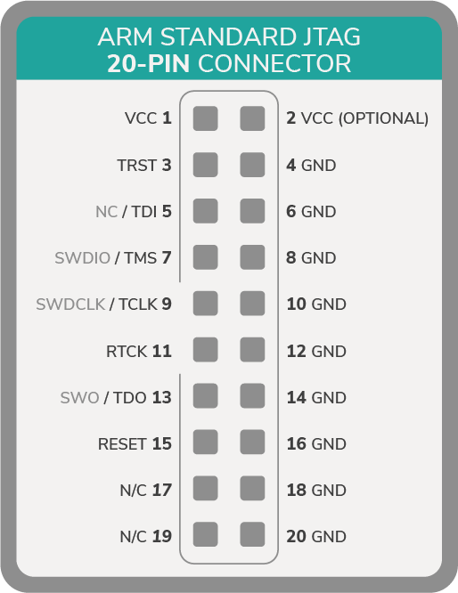

# 外部のプログラマーに接続する
<!-- # Connect to an external programmer -->

** nRF52シリーズマイクロコントローラーに何かをフラッシュするには、プログラマーが必要です。一部のマイクロコントローラーには統合プログラマーがありません。その場合、外部のプログラマーを接続する必要があります。**
<!-- **To flash anything to your nRF52 series microcontroller, you need a programmer. Some microcontrollers don't have an integrated programmer, in which case, you need to connect an external one.** -->

## 前提条件
<!-- ## Prerequisites -->

このガイドを完了するには、次のものが必要です。
<!-- To complete this guide, you need the following: -->

- プログラマーを接続するLinuxベースのPC
<!-- - Linux-based PC to which to connect the programmer -->
- プログラマー（J-Link、J-Link OBクローン、またはDAPLink）
<!-- - A programmer (J-Link, J-Link OB clone, or DAPLink) -->
- nRF52シリーズマイクロコントローラー
<!-- - An nRF52 series microcontroller -->

:::info:
nRF52シリーズマイクロコントローラーをフラッシュするための安価なオプションが必要な場合は、J-Linkオンボード（OB）クローンの購入を検討してください。

標準のJリンクプログラマは、マイクロプロセッサーでも使用できるため、より高価です。
:::
<!-- :::info: -->
<!-- If you want a cheap option for flashing an nRF52 series microcontroller, consider buying a J-Link on-board (OB) clone. -->

<!-- The standard J-link programmers are more expensive because they can also be used on microprocessors. -->
<!-- ::: -->

---

1. プログラマーを開発ボードに接続します。
  <!-- 1. Connect the programmer to your development board -->

    **オプション1：** J-Link
    <!-- **Option 1:** J-Link -->

    | **nRF52** | **J-Link (ピン)** |
    | :-------- | :---------------- |
    |    VCC     |    VCC (1)       |
    |    GND     |    GND (4)       |
    |    SWD     |    SWDIO (7)     |
    |    SCLK    |    SWDCLK (9)    |

    J-Linkは標準の20ピンJTAGを使用します。
    <!-- The J-Link uses a standard 20 pin JTAG. -->

    

    

    **オプション2：**J-Link OB
    <!-- **Option 2:** J-Link OB -->

    | **nRF5x** | **J-Link OB** |
    | :-------- | :------------ |
    |    VCC    |    VCC        |
    |    GND    |    GND        |
    |    SWD    |    SWDIO      |
    |    SCLK   |    SWDCLK     |

    

    

    **オプション3：** DAPLink
    <!-- **Option 3:** DAPLink -->

    ほとんどのDAPLinkプログラマーは開発ボードに統合されており、マイクロUSBポートを公開しています。そのため、正しいUSBケーブルを使用して、マイクロコントローラーボードをPCに接続するだけで済みます。
    <!-- Most DAPLink programmers are integrated on the development board and expose a micro-USB port. So, you need only to connect the microcontroller board to your PC with the correct USB cable. -->

2. J-LinkまたはJ-Link OBを使用する場合は、USBケーブルでPCに接続します。
<!-- 2. If you use a J-Link or J-Link OB, connect it to your PC through a USB cable -->
