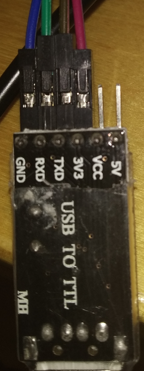

# マイクロコントローラーのシリアルインターフェースに接続する
<!-- # Connect to the microcontroller's serial interface -->

**マイクロコントローラーの出力を読み取るには、シリアルポートでデータを送受信できる必要があります。マイクロコントローラーのシリアルポートにアクセスするには、PCのUSBポートに接続できるUSB-UARTコネクター（USB-TTLシリアルコネクターとも呼ばれる）が必要です。一部のマイクロコントローラー開発ボードには、統合されたUSB-UARTコネクターが含まれていますが、含まれていないものもあります。含まれていない場合、外部のUSB-UARTコネクターをマイクロコントローラーに接続し、外部のUSB-UARTコネクターをPCに接続してマイクロコントローラーと通信できるようにする必要があります。**
<!-- **To read the output of your microcontroller, you need to be able to receive and transmit data on its serial port. To access the serial port on the microcontroller, you need a USB-to-UART connector (sometimes called a USB to TTL serial connector) that can plug into the USB port of your PC. Some microcontroller development boards include an integrated USB-to-UART connector, but others do not. In this case, you need to connect an external USB-to-UART connector to your microcontroller, then plug it into your PC to be able to communicate with the microcontroller.** -->

## 前提条件
<!-- ## Prerequisites -->

このガイドを完了するには、次のものが必要です。
<!-- To complete this guide, you need the following: -->

- USB-UARTコネクター
<!-- - A USB-to-UART connector -->
- USB-to-UARTコネクターをマイクロコントローラーに接続するDuPontケーブル
<!-- - DuPont cables to connect the USB-to-UART connector to your microcontroller -->

## USB-to-UARTアダプターに接続する
<!-- ## Connect to the USB-to-UART adapter -->

1. UART-USBドングルをピンP0.6およびP0.8でマイクロコントローラーに接続します。
  <!-- 1. Connect the UART-to-USB dongle to your microcontroller on pins P0.6 and P0.8 -->

    | **nRF52 (ピン)** | **USB-to-UART** |
    | :--------------- | :-------------- |
    |    TX (P0.6)     |    RX           |
    |    RX (P0.8)     |    TX           |
    |    VCC           |    VCC          |
    |    GND           |    GND          |

    **USB-to-UART**

    

    :::info:
    GNDには黒のケーブルを使用し、VCCには赤のケーブルを使用します。
    :::
    <!-- :::info: -->
    <!-- Use a black cable for GND and a red one for VCC -->
    <!-- ::: -->

2. UART-USBドングルをPCに接続します。
<!-- 2. Plug the UART-to-USB dongle into your PC -->

マイクロコントローラーのピン配置は、使用する開発ボードによって異なります。このガイドでは、nRF52832モジュールとnRF52832最小テストボードを使用します。
<!-- The microcontroller's pinout depends on the development board you use. In this guide, we use an nRF52832 module and an nrf52832 minimum test board. -->

:::info:
このブレイクアウトボードは、nRF51822およびnRF52832との互換性もあります。ブレイクアウトボードを使用する場合は、マイクロコントローラーのピッチが1.27mmであることを確認してください。
:::
<!-- :::info: -->
<!-- This breakout board is also compatible with the nRF51822 and nRF52832. If you are going to use the breakout board, make sure your microcontroller has 1.27mm pitch. -->
<!-- ::: -->
