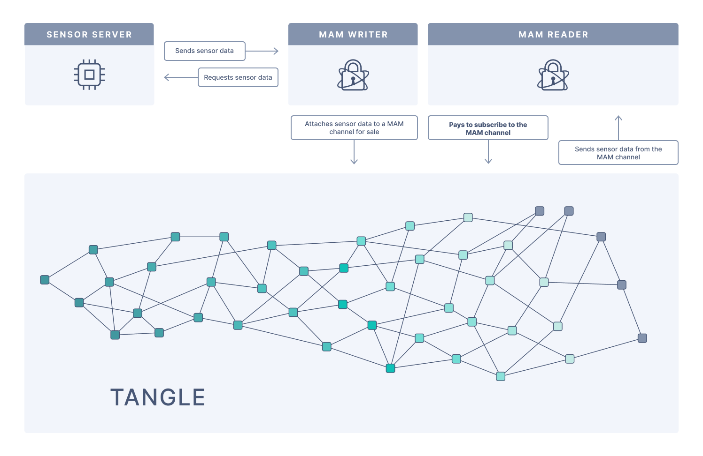

# センサーデータをタングルに添付する
<!-- # Attach sensor data to the Tangle -->

**このガイドでは、環境センサーデータを収集し、マスクされた認証済みメッセージング（Masked Authenticated Messaging, MAM）を使用してタングルに添付するアプリケーションを実行します。**
<!-- **In this guide, you run an application that collects environment sensor data and attaches it to the Tangle using Masked Authenticated Messaging (MAM).** -->

## 前提条件
<!-- ## Prerequisites -->

このガイドを完了するには、次のものが必要です。
<!-- To complete this guide, you need the following: -->

- [Bluetoothスターネットワークのセットアップする](../how-to-guides/set-up-a-bluetooth-star-network.md)
<!-- - [Set up a Bluetooth star network](../how-to-guides/set-up-a-bluetooth-star-network.md) -->
- [シングルボードコンピューター（SBC）またはPCにBazelをインストールする](https://docs.bazel.build/versions/master/install.html)
<!-- - [Install Bazel on your single-board computer (SBC) or PC](https://docs.bazel.build/versions/master/install.html) -->

## アーキテクチャ
<!-- ## Architecture -->

境界ルーターはセンサーサーバーに情報をリクエストし、その情報をノードに送信して、タングルに添付できるようにします。
<!-- The border router asks the sensor server for information, then sends that information to a node so that it can attach it to the Tangle. -->



## アプリケーションを実行する
<!-- ## Run the application -->

1. マイクロコントローラーでサーバーを起動します。
  <!-- 1. Start the server on your microcontroller -->

    :::info:
    マイクロコントローラーのシリアルコンソールで次のコマンドを実行する必要があります。マイクロコントローラーのシリアルコンソールは、`make flash term`を実行したターミナルで開きます。
    :::
    <!-- :::info: -->
    <!-- You need to execute the following command in the serial console of your microcontroller. -->
    <!-- The serial console of your microcontroller is opened in the terminal where you executed `make flash term`. -->
    <!-- ::: -->

    ```bash
    server start
    ```

2. 環境センサークライアントとMAMライターをSBCにクローンします。
  <!-- 2. Clone the environment sensor client and MAM writer onto your SBC -->

    ```bash
    git clone https://github.com/iota-community/env-sensor-mam-writer.git
    ```

3. `app/server-client.c`ファイルの設定変数を変更します。
  <!-- 3. Change the configuration variables in the `app/server-client.c` file -->

    ```bash
    sudo nano env-sensor-mam-writer/app/server-client.c
    ```

    | **変数** | **説明** | **メモ** |
    | :------- | :------- | :------- |
    | `IOTA_SEED` | MAMメッセージに署名するために使用するシード | このデフォルトのシードは、IOTAトークンを含むアドレスを含まない独自のものに変更する必要があります。 |
    | `CLIENT_ADDRESS` | 16進配列としてのIPv6クライアントアドレス | たとえば、`fe80::f2d5:bfff:fe10:f1b1`アドレスは`{ 0xfe, 0x80, 0x00, 0x00, 0x00, 0x00, 0x00, 0x00, 0xf2, 0xd5, 0xbf, 0xff, 0xfe, 0x10, 0xf1, 0xb1 }`になります。アイオワ大学には、[IPv6アドレス指定の仕組みに関する適切な説明](https://its.uiowa.edu/support/article/1209)があります。 |
    |`SENSOR_ADDRESS`| センサーノードのIPv6アドレス | センサーノードのシェルでコマンド`ifconfig`を実行して、このアドレスを見つけます。 |

    <!-- |**Variable**|**Description**|**Notes**| -->
    <!-- |:-------|:----------|:----| -->
    <!-- |`IOTA_SEED`| The seed that you want to use to sign MAM messages|You should change this default seed to your own, which does not contain any addresses that contain IOTA tokens| -->
    <!-- |`CLIENT_ADDRESS`| The IPv6 client address as a hex array|For example, the`fe80::f2d5:bfff:fe10:f1b1` address becomes `{ 0xfe, 0x80, 0x00, 0x00, 0x00, 0x00, 0x00, 0x00, 0xf2, 0xd5, 0xbf, 0xff, 0xfe, 0x10, 0xf1, 0xb1 }`. The university of Iowa has a [good explanation how the IPv6 addressing works](https://its.uiowa.edu/support/article/1209).| -->
    <!-- |`SENSOR_ADDRESS`|The IPv6 address of the sensor node|Execute the command `ifconfig` in the shell of your sensor node to find this address| -->

4. MAMライターアプリケーションを実行します。
  <!-- 4. Run the MAM writer application -->

    ```bash
    cd env-sensor-mam-writer &&  bazel run -c opt //app
    ```

    アプリケーションはセンサーから環境データをリクエストし、そのデータをMAMチャネルに発行します。
    <!-- The application requests the environment data from the sensor, then publishes that data to a MAM channel. -->

    手順6で使用できるように、コンソールにログされるアドレスとバンドルハッシュの両方をメモします。
    <!-- Make a note of both the address and the bundle hash that are logged to the console so that you can use them in step 6. -->

5. 新しいターミナルウィンドウを開き、MAMリーダーアプリケーションをSBCにクローンします。
  <!-- 5. Open a new terminal window, and clone the MAM reader application onto your SBC -->

    ```bash
    git clone https://github.com/iota-community/env-sensor-mam-reader.git
    ```

6. `app/sensor_receiver.c`ファイルの設定変数を変更します。
  <!-- 6. Change the configuration variables in the `app/sensor_receiver.c` file -->

    ```bash
    sudo nano env-sensor-mam-reader/app/sensor_receiver.c
    ```

    | **変数** | **説明** |
    | :------- | :------- |
    | `IOTA_ADDRESS` | ライターアプリケーションによって返されたアドレス |
    | `IOTA_BUNDLE` | ライターアプリケーションによって返されたバンドルハッシュ |

    <!-- |**Variable**|**Description**| -->
    <!-- |:-------|:----------| -->
    <!-- |`IOTA_ADDRESS`|The address that was returned by the writer application| -->
    <!-- |`IOTA_BUNDLE`|The bundle hash that was returned by the writer application| -->

7. MAMリーダーアプリケーションを実行します。
  <!-- 7. Run the MAM reader application -->

    ```bash
    cd env-sensor-mam-reader && bazel run -c opt //app
    ```

アプリケーションは、タングルのMAMチャネルから読み取った温度データを表示します。
<!-- The application displays the temperature data it read from the MAM channel on the Tangle. -->
