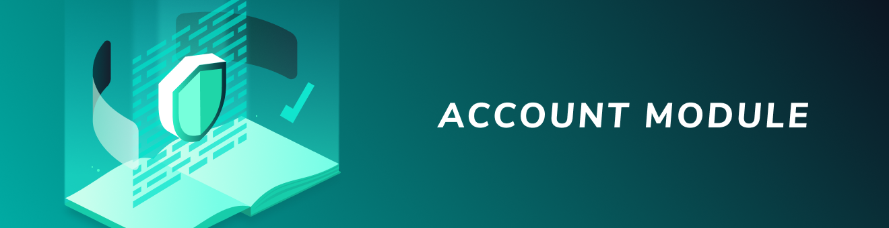

# Goクライアントライブラリ
<!-- # Go client library -->

**Goクライアントライブラリを使用すると、サポートされているパッケージを使用して、タングルと対話するクライアントまたはサーバーとして機能するアプリケーションを作成できます。**
<!-- **The Go client library allows you to use any of the supported packages to write applications that act as a client or a server to interact with the Tangle.** -->

-------------------------

## [コア](../core/introduction/overview.md)
Goコアクライアントライブラリには、タングルと対話するための低レベルのメソッドが含まれています。このライブラリを使用して、コアIOTAプロトコルを使用できます。たとえば、ノードに接続し、バンドルを作成し、ペンディング中のトランザクションを促進および再添付できます。
<!-- The Go core client library includes low-level methods for interacting with the Tangle. You can use this library to use the core IOTA protocol. For example, you can connect to nodes, create bundles, and promote and reattach pending transactions. -->
-------------------------

-------------------------

## [アカウントモジュール](../account-module/introduction/overview.md)
アカウントは、トランザクションの送受信を容易にするオブジェクトです。アカウントは、アドレスやペンディング中のバンドルハッシュなどのデータをローカルデータベースに保存します。このデータを使用すると、使用済みアドレスからの取り出しやペンディング中のトランザクションの促進と再添付を心配することなく、IOTAネットワークとやり取りできます。この機能はすべて、舞台裏で処理されます。
<!-- An account is an object that makes it easier to send and receive transactions. Accounts store data such as addresses and pending bundle hashes in a local database. This data allows you to interact with an IOTA network without worrying about withdrawing from spent addresses or promoting and reattaching pending transactions. All of this functionality is handled for you behind the scenes. -->
-------------------------
>>>>>>> upstream/develop
