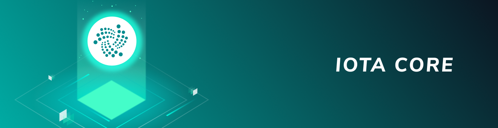

# JavaScriptクライアントライブラリ
<!-- # JavaScript client library -->

**JavaScriptクライアントライブラリを使用すると、サポートされているパッケージを使用して、タングルと対話するクライアントまたはサーバーとして機能するアプリケーションを作成できます。**
<!-- **The JavaScript client library allows you to use any of the supported packages to write applications that act as a client or a server to interact with the Tangle.** -->

-------------------------

## [コア](../core/introduction/overview.md)
JavaScriptコアクライアントライブラリには、タングルと対話するための低レベルのメソッドが含まれています。このライブラリを使用して、コアIOTAプロトコルを使用できます。たとえば、ノードに接続し、バンドルを作成し、ペンディング中のトランザクションを促進および再添付できます。
-------------------------

-------------------------

## [アカウントモジュール](../account-module/introduction/overview.md)
アカウントは、トランザクションの送受信を容易にするオブジェクトです。アカウントは、アドレスやペンディング中のバンドルハッシュなどのデータをローカルデータベースに保存します。このデータを使用すると、使用済みアドレスからの取り出しやペンディング中のトランザクションの促進と再添付を心配することなく、IOTAネットワークとやり取りができます。この機能はすべて、舞台裏で処理されます。
-------------------------

-------------------------

## [マスクされた認証済みメッセージング](../mam/introduction/overview.md)
マスクされた認証済みメッセージング（Masked Authenticated Messaging, MAM）は、タングルでチャネルと呼ばれる暗号化されたデータストリームでメッセージを発行および取得できるデータ通信プロトコルです。MAMパッケージを使用して、暗号化および認証されたメッセージをチャネルに公開できます。
-------------------------
