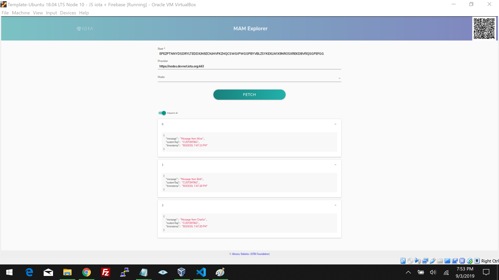

# カスタムタグで公開する
<!-- # Publishing with a custom tag -->

**この例を使用すると、カスタムタグでメッセージを公開できます。**
<!-- **Using this example you can publish a message with a custom tag** -->

MAMクライアントライブラリとASCIIからトライトへのコンバーター（`asciiToTrytes`）とトライトからASCIIへのコンバーター（`trytesToAscii`）をインポートします。
<!-- Import the MAM client library and the ascii to tryte and tryte to ascii converters -->
```js
const Mam = require('../lib/mam.client.js')
const { asciiToTrytes, trytesToAscii } = require('@iota/converter')
```

プライバシーモードをパブリックモードに設定します。プロバイダーを構成します。この例では、`Devnet`と呼ばれるIOTAテストネットを使用します。mamExplorerLinkを構成します。この例では、IOTA MAMエクスプローラーを使用します。
<!-- Set the privacy mode to public.  Configure the provider.  This example uses the IOTA testbed, called "Devnet".  Configure the mamExplorerLink.  This example uses the IOTA MAM explorer. -->

```js
const mode = 'public'
const provider = 'https://nodes.devnet.iota.org'

const mamExplorerLink = `https://mam-explorer.firebaseapp.com/?provider=${encodeURIComponent(provider)}&mode=${mode}&root=`
```

MAMにプロバイダーを使用するように指示します。
<!-- Tell MAM to use the provider -->

```js
// Initialise MAM State
let mamState = Mam.init(provider)
```

ASCIIデータをトライトに変換し、jsonに保存します。MAMメッセージを作成します。
<!-- Convert the ascii data to trytes and store it in json.  Create your MAM message -->

```js
// Publish to tangle
const publish = async packet => {
    // Create MAM Payload - STRING OF TRYTES
    const trytes = asciiToTrytes(JSON.stringify(packet))
    const message = Mam.create(mamState, trytes)

    // Save new mamState
    mamState = message.state
```

タングルにメッセージを送信するときに、タグを「CUSTOMTAG」に設定します。このMAMストリームのMAMチャネルIDであるメッセージルートを取得します。
<!-- Set the tag to 'CUSTOMTAG' when you send the message to the Tangle.  You will get the message root which is the MAM channel ID for this MAM stream -->

```js
    // Attach the payload
    await Mam.attach(message.payload, message.address, 3, 9, 'CUSTOMTAG')

    console.log('Published', packet, '\n');
    return message.root
}
```

3つのメッセージを公開します。
<!-- Publish three messages -->

```js
const publishAll = async () => {
  const root = await publish({
    message: 'Message from Alice',
    customTag: 'CUSTOMTAG',
    timestamp: (new Date()).toLocaleString()
  })

  await publish({
    message: 'Message from Bob',
    customTag: 'CUSTOMTAG',
    timestamp: (new Date()).toLocaleString()
  })

  await publish({
    message: 'Message from Charlie',
    customTag: 'CUSTOMTAG',
    timestamp: (new Date()).toLocaleString()
  })

  return root
}
```

各メッセージを取得してデコードします。
<!-- Fetch each message and decode it -->

```js
// Callback used to pass data out of the fetch
const logData = data => console.log('Fetched and parsed', JSON.parse(trytesToAscii(data)), '\n')

publishAll()
  .then(async root => {

    // Output asyncronously using "logData" callback function
    await Mam.fetch(root, mode, null, logData)

    // Output syncronously once fetch is completed
    const result = await Mam.fetch(root, mode)
    result.messages.forEach(message => console.log('Fetched and parsed', JSON.parse(trytesToAscii(message)), '\n'))
```

MAMエクスプローラーでこれらのメッセージを表示するためのコマンドラインを出力します。
<!-- Print the command line for viewing these messages in the MAM Explorer -->

```js
    console.log(`Verify with MAM Explorer:\n${mamExplorerLink}${root}\n`);
  })
```

## アウトプット例
<!-- ## Example output -->

3つのメッセージが表示されます。
<!-- You should see three messages -->


