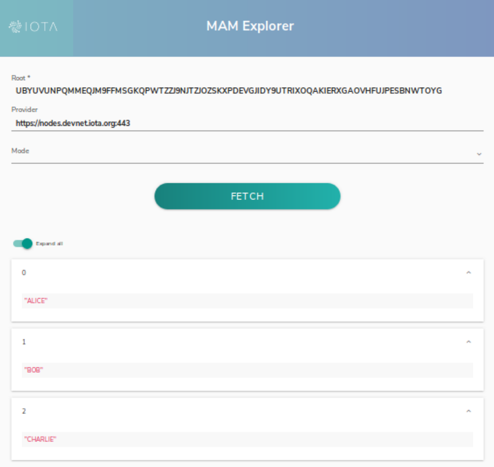

# MAMを使用してWebページに公開する
<!-- # Publishing to a webpage with MAM -->

**Webページを作成して、MAMメッセージを発行および取得できます。**
<!-- **You can build a webpage to publish and fetch MAM messages.** -->

3つのメッセージを公開します。
<!-- Publish three messages -->

```js
Published: ALICE
Published: BOB
Published: CHARLIE
```

3つのメッセージを取得してデコードします。
<!-- Fetch and decode three messages -->

```js
Fetched and parsed ALICE
Fetched and parsed BOB
Fetched and parsed CHARLIE
```

MAMエクスプローラーを使用して確認します。
<!-- Use the MAM Explorer to verify -->



## HTMLにMAMを追加する
<!-- ## Adding MAM in HTML -->

`&lt;html&gt;`タグを使用してHTMLページを作成します。文字セットを`utf-8`に設定します。`&lt;head&gt;`セクションで、ページにタイトルを付けます。`&lt;body&gt;`タグを使用してWebページの本文を開始します。`&lt;div&gt;`タグを使用して本文内に分割を設定し、`ID = "output"`を指定して、スクリプトが出力の送信先を認識できるようにします。
<!-- Use the `<html>` tag to create your HTML page.  Set the character set to "utf-8".  In the `<head>` section, give your page a title.  Start the body of your webpage using the `<body>` tag.  Set a division within the body using the `<div>` tag and give it an ID="output" so your script knows where to send the output. -->

```html
<html>
<meta charset="utf-8" />

<head>
    <title>MAM Example Publish and Fetch</title>
</head>

<body>
    <div id="output"></div>
```

スクリプトに`mam.web.min.js`の検索場所を伝えます。
<!-- Tell the script where to find mam.web.min.js -->

```html
    <script src="../lib/mam.web.min.js"></script>
```

トリテアルファベットを定義します。ASCII文字をトライトに変換し、トライトをASCIIに変換する関数を追加します。
<!-- Define the tryte alphabet.  Add functions to convert ascii characters to trytes and trytes to ascii -->

```js
    <script>
        const TRYTE_ALPHABET = '9ABCDEFGHIJKLMNOPQRSTUVWXYZ';

        const asciiToTrytes = (input) => {
            let trytes = '';
            for (let i = 0; i < input.length; i++) {
                var dec = input[i].charCodeAt(0);
                trytes += TRYTE_ALPHABET[dec % 27];
                trytes += TRYTE_ALPHABET[(dec - dec % 27) / 27];
            }
            return trytes;
        };

        const trytesToAscii = (trytes) => {
            let ascii = '';
            for (let i = 0; i < trytes.length; i += 2) {
                ascii += String.fromCharCode(TRYTE_ALPHABET.indexOf(trytes[i]) + TRYTE_ALPHABET.indexOf(trytes[i + 1]) * 27);
            }
            return ascii;
        };
```

プロバイダーを構成します。この例では、`Devnet`と呼ばれるIOTAテストネットワークを使用します。mamExplorerLinkを構成します。この例では、IOTA MAMエクスプローラーを使用します。HTML出力を`output`に設定します。
<!-- Configure the provider.  This example uses the IOTA testbed, called "Devnet".  Configure the mamExplorerLink.  This example uses the IOTA MAM explorer.  Set the HTML output to `output` -->

```js
        (async function () {
            const mode = 'public'
            const provider = 'https://nodes.devnet.iota.org'

            const mamExplorerLink = `https://mam-explorer.firebaseapp.com/?provider=${encodeURIComponent(provider)}&mode=${mode}&root=`

            const outputHtml = document.querySelector("#output");

```

MAMにプロバイダーを使用するように指示します。
<!-- Tell MAM to use the provider -->

```js
            // Initialise MAM State
            let mamState = Mam.init(provider)
```

メッセージごとに、トライトに変換して送信します。このMAMストリームのMAMチャネルIDであるメッセージルートを取得します。
<!-- For each message, convert to trytes, then send it.  You will get the message root which is the MAM channel ID for this MAM stream -->

```js
            // Publish to tangle
            const publish = async packet => {
                // Create MAM Payload - STRING OF TRYTES
                const trytes = asciiToTrytes(JSON.stringify(packet))
                const message = Mam.create(mamState, trytes)

                // Save new mamState
                mamState = message.state

                // Attach the payload
                await Mam.attach(message.payload, message.address, 3, 9)

                outputHtml.innerHTML += `Published: ${packet}<br/>`;
                return message.root
            }
```

3つのメッセージを公開します。
<!-- Publish three messages -->

```js
            const publishAll = async () => {
                const root = await publish('ALICE')

                await publish('BOB')

                await publish('CHARLIE')

                return root
            }

```

3つのメッセージを取得します。
<!-- Fetch three messages -->

```js
            // Callback used to pass data out of the fetch
            const logData = data => outputHtml.innerHTML += `Fetched and parsed ${JSON.parse(trytesToAscii(data))}<br/>`;

            const root = await publishAll();

            // Output asyncronously using "logData" callback function
            await Mam.fetch(root, mode, null, logData)

            // Output synchronously once fetch is completed
            const result = await Mam.fetch(root, mode)
            result.messages.forEach(message => {
                outputHtml.innerHTML += `Fetched and parsed ${JSON.parse(trytesToAscii(message))}<br/>`
            });
```

MAMエクスプローラーを使用してこれらのトランザクションを検証できるようにリンクを提供します。
<!-- Provide a link so these transactions can be verified using the MAM Explorer -->

```html
            outputHtml.innerHTML += `Verify with MAM Explorer:<br/><a target="_blank" href="${mamExplorerLink}${root}">${mamExplorerLink}${root}</a>`;
        })();
    </script>
```

本文とHTMLタグを閉じてスクリプトを終了します。
<!-- End the script by close the body and the HTML tags -->

```html
</body>

</html>
```
