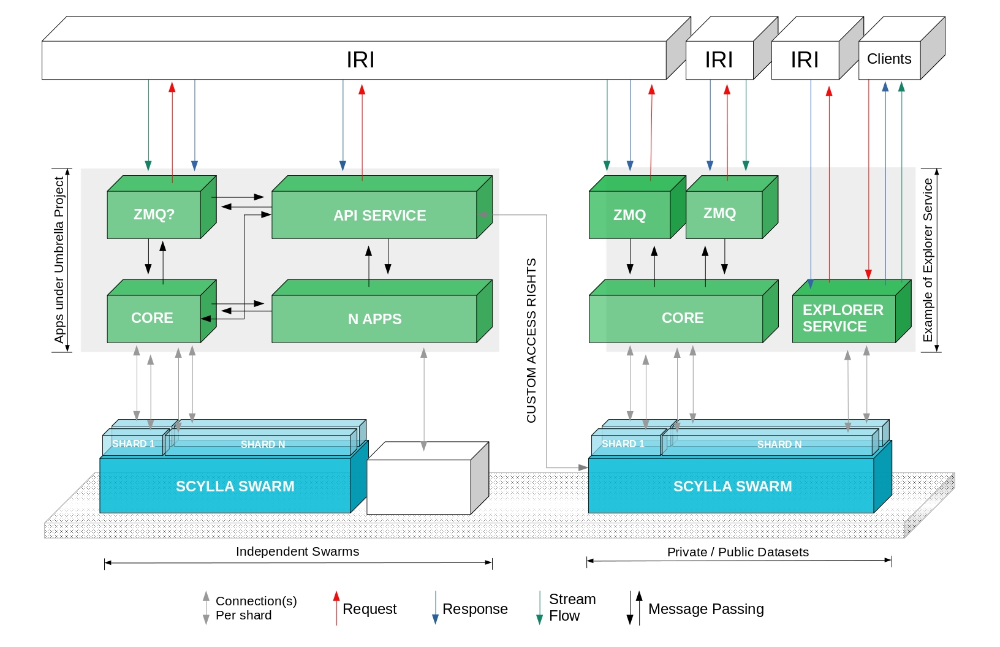
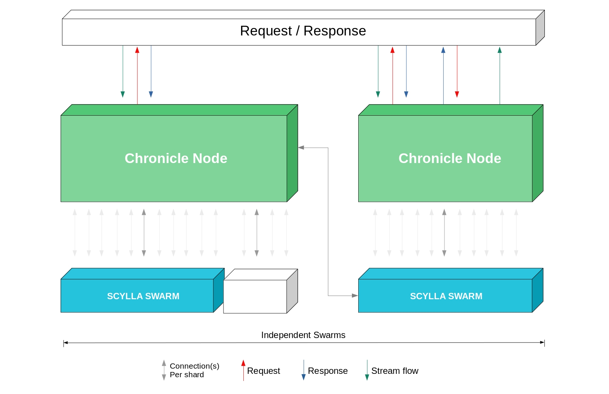

# クロニクル概要
<!-- # Chronicle overview -->

**クロニクルは、[IRIノード](root://node-software/0.1/iri/introduction/overview.md)に到達するすべてのトランザクションを安全で拡張性の高い分散データベースに保存できるパーマノードソリューションです。**
<!-- **Chronicle is a permanode solution that allows you to store all transactions that reach an [IRI node](root://node-software/0.1/iri/introduction/overview.md) in a distributed database that's secure and that scales well.** -->

## ハーマノードとは？
<!-- ## What is a permanode? -->

パーマノードはタングルの完全な履歴を保存し、アプリケーションが拡張APIを介してデータを検索できるようにします。
<!-- A permanode stores the full history of the Tangle and enables applications to search the data through an extended API. -->

## クロニクルを実行する理由
<!-- ## Why run Chronicle? -->

IOTAはパーミッションレスネットワークです。誰でも自由に任意の量のデータをタングルに保存できます（トランザクションごとに少量の[プルーフオブワーク](root://dev-essentials/0.1/concepts/minimum-weight-magnitude.md)は必要です）。
<!-- IOTA is a permissionless network. Anyone can store any amount of data on the Tangle for free (just a small amount of [proof of work](root://dev-essentials/0.1/concepts/minimum-weight-magnitude.md) per transaction). -->

時間が経つにつれて、IRIノードの台帳は多くのトランザクションを蓄積します。これにより、ノードの利用可能なメモリよりも大きくなることがよくあります。台帳が大きくなりすぎるのを防ぐために、これらのノードは古いトランザクションを整理する[ローカルスナップショット](root://node-software/0.1/iri/concepts/local-snapshot.md)を頻繁に実行します。
<!-- Over time, the ledger of an IRI node accumulates many transactions, which often cause it to become larger than the node's available memory. To stop the ledger from becoming too large, these nodes often do [local snapshots](root://node-software/0.1/iri/concepts/local-snapshot.md) that prune old transactions. -->

多くのビジネスユースケースでは、IOTAタングルのデータを長期間保存する必要があります。たとえば、場合によっては財務データを10年間保存する必要があり、IDの有効期間中はIDデータを保持する必要があります。
<!-- For many business use cases, data in the IOTA Tangle needs to be stored for longer periods of time. For example, financial data must be stored for 10 years in some cases, and identity data needs to be kept for the lifetime of the identity. -->

クロニクルを使用すると、ノード所有者はすべてのIOTAトランザクションを安全でスケーラブルな分散Scyllaデータベースに簡単に保存できます。
<!-- Chronicle makes it easy for node owners to store all the IOTA transactions in a secure, scalable, and distributed Scylla database. -->

:::info:
クロニクルは、IOTAテクノロジースタックの将来の戦略に合わせてRustに移植されます。
:::
<!-- :::info: -->
<!-- Chronicle will be ported to Rust to align with the future strategy of the IOTA technology stack. -->
<!-- ::: -->

:::info:
[クロニクルの実行の仕方](../how-to-guides/get-started.md)
:::
<!-- :::info: -->
<!-- [Ready to run Chronicle](../how-to-guides/get-started.md)? -->
<!-- ::: -->

## クロニクルの仕組み
<!-- ## How Chronicle works -->

クロニクルは、`tx_trytes`[ZMQイベント](root://node-software/0.1/iri/references/zmq-events.md)を介してIRIノードからトランザクションを受け取ります。クロニクルがトランザクションを受信すると、[Elixir](https://elixir-lang.org/)アンブレラプロジェクトを介してトランザクションを処理し、[ScyllaDB](https://www.scylladb.com/)に格納します。
<!-- Chronicle receives transactions from IRI nodes through the `tx_trytes` [ZMQ event](root://node-software/0.1/iri/references/zmq-events.md). When Chronicle receives transactions, it processes them through an [Elixir](https://elixir-lang.org/) umbrella project, then it stores them in [ScyllaDB](https://www.scylladb.com/). -->

ScyllaDBは、パーティション分割、レプリケーション、メモリ内処理、一貫性などのビッグデータの問題を処理します。
<!-- ScyllaDB takes care of the big data concerns such as partitioning, replication, in-memory processing, and consistency. -->

Elixirは、Web開発ツールと組み込みソフトウェア開発ツールに加えて、マイクロサービスを構築することで拡張できるネットワークを提供します。
<!-- Elixir provides web development tools and embedded software development tools plus a network that can be extended by building microservices. -->

クロニクルノードにデータリクエストを送信すると、ScyllaDBからデータがリクエストされ、レスポンスがフォーマットされて返されます。
<!-- When you send a data request to a Chronicle node, it requests the data from the ScyllaDB, then formats and returns you the response. -->

## ScyllaDBの仕組み
<!-- ## How ScyllaDB works -->

[ScyllaDB](https://docs.scylladb.com/using-scylla/)は、高スループットと低遅延を特徴とするリアルタイムのビッグデータデータベースです。
<!-- [ScyllaDB](https://docs.scylladb.com/using-scylla/) is a real-time, big data database featuring high throughput and low latency. -->

データは、[プライマリキー、パーティションキー、およびクラスタリングキー](http://sudotutorials.com/tutorials/cassandra/cassandra-primary-key-cluster-key-partition-key.html)を使用して、テーブル内の行と列に編成されます。
<!-- Data is organized into rows and columns in a table, using the [primary key, the partition key, and the clustering key](http://sudotutorials.com/tutorials/cassandra/cassandra-primary-key-cluster-key-partition-key.html). -->

プライマリキーは、テーブル内の各行の一意の識別子です。パーティションキーは、データの行を保存するノードを示します。クラスタリングキーは、データをパーティションにソートし、列の順序付けに影響します。
<!-- The primary key is a unique identifier for each row in a table. A partition key indicates which nodes store a row of data. Clustering keys sort data into a partition and affect how columns are ordered. -->

データがシャードと呼ばれる別個のコレクションに編成されると、データの保存と取得が高速になります。Scyllaパーティションは、パーティションキーで識別される行を保持する論理ストレージユニットです。シャードは、同じパーティションキーを持つデータのグループです。
<!-- Storing and retrieving data is faster when the data is organized into distinct collections called shards. A Scylla partition is a logical storage unit that holds the rows identified by a partition key. A shard is a group of data with the same partition key. -->

信頼性と耐障害性を確保するために、Scyllaはデータレプリカを複数のノードに保存します。これらのノードはレプリカノードと呼ばれます。パーティションはレプリカノードで繰り返されます。複製係数（RF）を設定することにより、レプリカの数を設定できます。
<!-- To ensure reliability and fault tolerance, Scylla stores data replicas on multiple nodes. These nodes are called replica nodes. Partitions are repeated on replica nodes. You can set the number of replicas by setting the replication factor (RF). -->

:::info:
[Scyllaのフォールトトレランスの詳細](https://docs.scylladb.com/architecture/architecture-fault-tolerance/)をご覧ください。
:::
<!-- :::info: -->
<!-- [Learn more about fault tolerance in Scylla](https://docs.scylladb.com/architecture/architecture-fault-tolerance/). -->
<!-- ::: -->

## 次のステップ
<!-- ## Next steps -->

[クロニクルを実行](../how-to-guides/get-started.md)して、トランザクションの保存を開始します。
<!-- [Run Chronicle](../how-to-guides/get-started.md) to get started with storing transactions. -->
