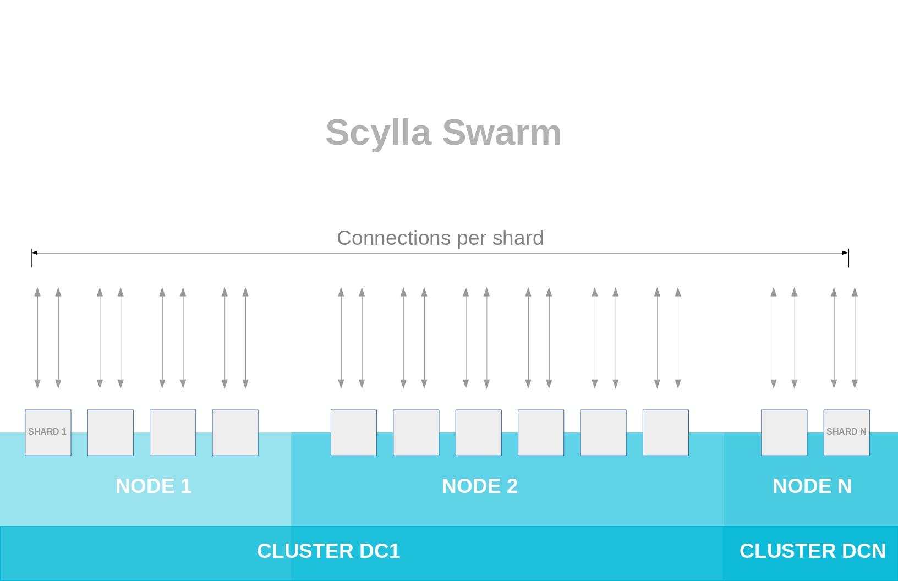
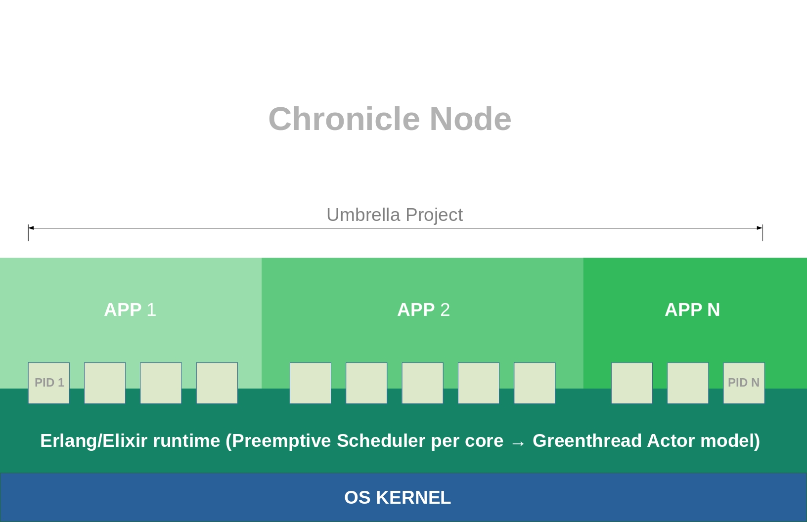
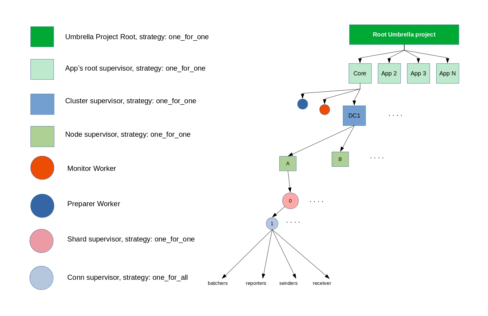

# クロニクルアーキテクチャー
<!-- # Chronicle architecture -->

**1つのクロニクルノードがScyllaスウォームのすべてのシャードを管理および監督します。これは、各シャードへの少なくとも1つの独立した接続を確立することによって行われます。これは、アンブレラプロジェクトのコアアプリによって監視されます。**
<!-- **One Chronicle node manages and supervises all the shards in a Scylla swarm. It does this by establishing at least one independent connection to each shard, which is supervised by the core app in the umbrella project.** -->

この図では、クロニクルノードはIRIノードとScyllaスウォームの間の緑のコンポーネントで構成されています。このノードには、アンブレラプロジェクト、APIサービス、コアアプリ、ZMQメッセンジャー、エクスプローラーサービスが含まれています。
<!-- In this diagram, the Chronicle node consists of the green components between the IRI node and the Scylla swarm. The node contains the umbrella project, API services, the core app, the ZMQ messenger, and the explorer service. -->

## アンブレラブロジェクト
<!-- ## Umbrella project -->

アンブレラプロジェクトは、独立したアプリが共存し、プロセス間通信（IPC）を介して通信するスペースです。各アプリは独自の監視ツリーの下で実行されるため、成長して独自のラック（独自のアンブレラプロジェクトを持つクラスター）に簡単に移行できます。
<!-- An Umbrella project is a space where independent apps coexist and communicate through Inter-Process Communication (IPC). Each app runs under its own supervision tree, which allows it to grow and easily migrate to its own rack (a cluster with its own umbrella project). -->

クロニクルのスケールアップを可能にするため、Elixirの[アンブレラプロジェクト](https://elixir-lang.org/getting-started/mix-otp/dependencies-and-umbrella-projects.html#umbrella-projects)を使用してコードを複数のアプリに分割し、アンブレラプロジェクトの下に配置します。
<!-- To allow Chronicle to scale up, it uses Elixir [umbrella projects](https://elixir-lang.org/getting-started/mix-otp/dependencies-and-umbrella-projects.html#umbrella-projects) to split code into multiple apps and arrange them under an umbrella project. -->

クロニクルアンブレラプロジェクトには、Scyllaスウォームと通信して次のことを行うコアアプリが含まれています。
<!-- The Chronicle umbrella project includes a core app that communicates with the Scylla swarm to do the following: -->

- データベースの変更を管理する。
<!-- - Manage database changes -->
- 変更をスウォームに転送する。
<!-- - Forward the changes to the swarm -->
- クラスタースーパーバイザーを監視する。
<!-- - Monitor cluster supervisors -->

他のアプリはコアアプリを使用して、IPCを介してScyllaスウォームと通信します。これらのアプリは、コアアプリと対話する必要があるビジネスルールを保持できます。
<!-- Other apps use the core app to communicate with the Scylla swarm through IPC. These apps can hold the business rules that need to interact with the core app. -->

ラウンドロビンアルゴリズムに基づくプリエンプティブスケジューリングプロセスを使用して、アプリを順番に実行します。
<!-- Apps take turns to run by using a preemptive scheduling process that's based on a round-robin algorithm. -->

## コアアプリ
<!-- ## Core app -->

クロニクルコアアプリは、独立したマイクロサービスの場合もあれば、他のアプリに依存している場合もあります。たとえば、クロニクルアプリは、共有コアアプリに依存してタングルにアクセスする場合があります。
<!-- The Chronicle core app may be an independent microservice or it may be dependent on other apps. For example, a Chronicle app may depend on the shared core app to access the Tangle. -->
