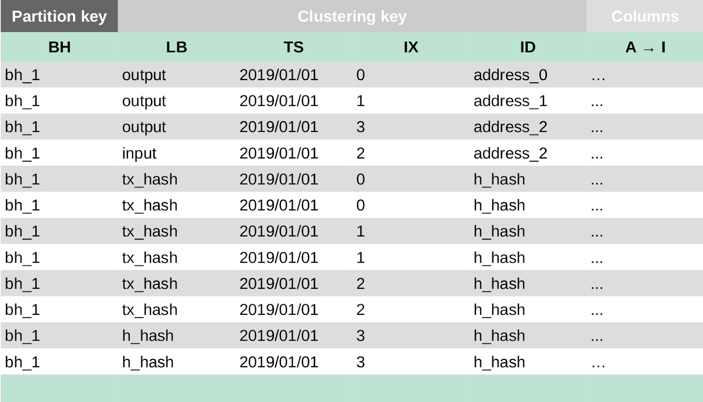
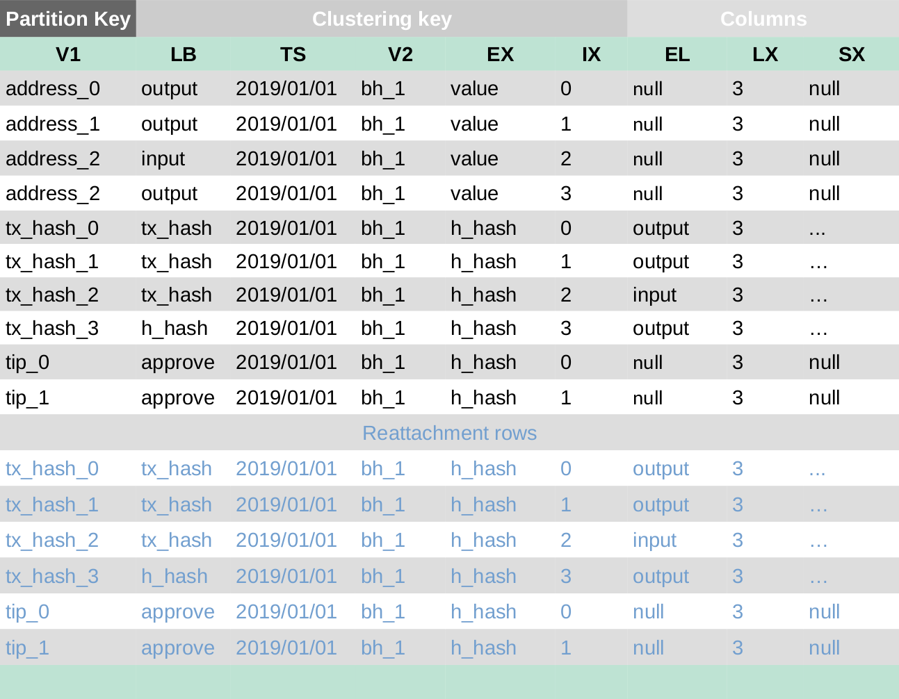

# Scyllaデータモデル
<!-- # Scylla data model -->

**このセクションでは、クロニクルのScyllaデータベースのデータモデルについて説明します。**
<!-- **This section describes the data model of the Scylla database for Chronicle.** -->

ScyllaDBデータモデルには、次のテーブルが含まれます。
<!-- The ScyllaDB data model includes the following tables: -->

- **バンドル：**トランザクションバンドルを保存します。
<!-- - **Bundle:** Stores transaction bundles -->

- **エッジ：**セカンダリインデックスを提供します。
<!-- - **Edge:** Provides secondary indexes -->

- **タグ：**タグで検索できる時間を制限します。
<!-- - **Tag:** Limits the amount of time you can search by tag -->

- **ゼロトークン：**スパムおよびデータトランザクションを月ごとに保存します。
<!-- - **Zero-value:** Stores spam and data transactions by month -->

以下の略語を使用して、これらのテーブルのデータを説明します。
<!-- We use the following abbreviations to describe the data in these tables: -->

| **略語** | **説明** |
| :--- | :--- |
| BH | バンドルハッシュ |
| H_hash | 先頭トランザクションのハッシュ値（IX == LX） |
| TS | タイムスタンプ |
| TX_HASH | トランザクションハッシュ |
| TTL | 有効期間 |
| EL | 追加ラベル |
| EX | 追加頂点 |
| LB | ラベル |
| V1 | 頂点1 |
| V2 | 頂点2 |
| IX | 現在のインデックス |
| LX | ラストインデックス |
| SX | スナップショットインデックス |

<!-- |**Abbreviation**|**Description**| -->
<!-- |:------------|:------------| -->
<!-- |BH|Bundle hash| -->
<!-- |H_hash|Head hash (IX == LX)| -->
<!-- |TS|Timestamp| -->
<!-- |TX_HASH|Transaction hash| -->
<!-- |TTL|Time to live| -->
<!-- |EL|Extra Label| -->
<!-- |EX|Extra Vertex| -->
<!-- |LB|Label| -->
<!-- |V1|Vertex One| -->
<!-- |V2|Vertex Two| -->
<!-- |IX|Current Index| -->
<!-- |LX|Last Index| -->
<!-- |SX|Snapshot Index| -->

## バンドルテーブル
<!-- ## Bundle table -->

バンドルテーブルは、すべてのバンドルデータを次のフィールドに保存します。
<!-- The bundle tables stores all bundle data in the following fields: -->

- `bundle_hash`：メインパーティションキー。同じバンドルハッシュを持つすべてのバンドルは、同じパーティションに保存され、同じレプリカに複製されます。
<!-- - `bundle_hash`: Main partition key. All bundles with same bundle hash are stored in the same partition and replicated on the same replicas. -->

- `outputs`：0以上の値を持つトランザクションで使用されるアドレス
<!-- - `outputs`: Address used in a transaction with a value that is equal to or greater than 0 -->

- `inputs`：値が0未満のトランザクションで使用されるアドレス
<!-- - `inputs`: Address used in a transaction with a value that is less than 0 -->

- `transactions_hashes`：バンドル内のトランザクションハッシュ
<!-- - `transactions_hashes`: Transaction hashes in the bundle -->

## エッジテーブル
<!-- ## Edge table -->

エッジテーブルにはトランザクションデータが保存されます。パーティションキーには、次のフィールドのいずれかを指定できます。
<!-- The edge tables stores transaction data, where the partion key can be any of the following fields: -->

- `address`：バンドルで使用されたアドレス
<!-- - `address`: Address that was used in a bundle -->

- `transaction_hash`：トランザクションハッシュ
<!-- - `transaction_hash`: Transaction hash -->

- `tip`：バンドルの先頭トランザクションのトランクトランザクションまたはブランチトランザクション
<!-- - `tip`: Trunk or branch transactions of the head transaction of the bundle -->

同じパーティションキーを持つすべての行は、同じパーティションに保存され、同じレプリカに複製されます。これにより、任意のパーティションキーでデータを検索できます。
<!-- All the rows with the same partition key are stored in the same partition and replicated across the same replicas. This allows you to look up data by any partition key. -->

## タグテーブル
<!-- ## Tag table -->

タグテーブルは、次の2つのタイプのいずれかです。
<!-- A tag table can be one of two types: -->

- 完全なタグ（27トライト）
<!-- - Full tag (27 trytes) -->

- 完全なタグとIOTAエリアコード
<!-- - Full tag and IOTA area code -->

任意の数のトランザクションが同じタグを持つことができます。その結果、このテーブルは、ノードが保存するには大きすぎる可能性があります。1つの解決策は、一定期間後にトランザクションを削除することです。たとえば、タグテーブルには、リアルタイムインデックスとして機能する定義済みのTTLがあります。TTLが1000秒に設定されている場合、行はその時間後に削除されます。タグによる検索は、TTLより前に保存されたトランザクションに対してのみ機能します。
<!-- Any number of transactions can have the same tag. As a result, this table can become too large for any node to store. One solution is to remove transactions after a given period of time. For example, the tag table has a predefined TTL which acts as a real-time index. When the TTL is set to 1000 seconds, the row will be deleted after that time. Searches by tag only work for transactions that were saved before the TTL. -->

## ゼロトークンテーブル
<!-- ## Zero_value table -->

このテーブルには、パーティションキーがアドレス、年、月で構成される複合パーティションキーであることを除いて、エッジテーブルと同じデータが保存されます。これは、そのアドレスの月次アクティビティのみが同じシャードに存在することを意味します。
<!-- This table stores the same data as the edge table, except the partition key is a composite partition key composed of address, year, month. This means only the monthly activities for that address will exist in the same shard. -->
