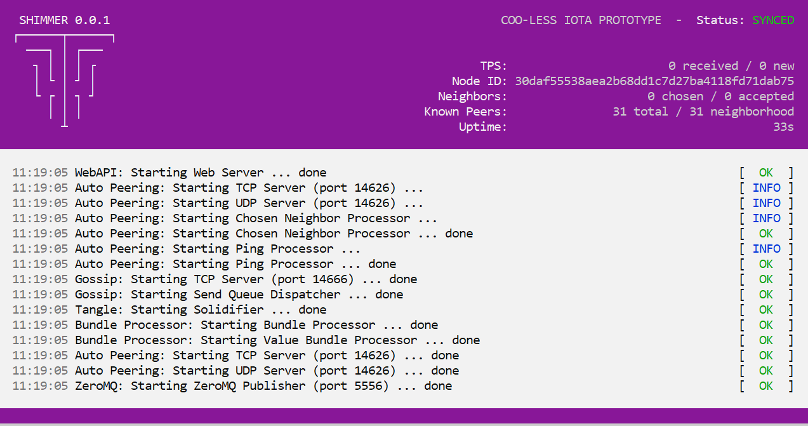

# GoShimmerノードを実行する
<!-- # Run a GoShimmer node -->

**GoShimmerソフトウェアを実行すると、デバイスはネットワーク内のノードになります。ノードを実行することで、ネットワークをテストし、定期的な変更で最新の状態に保つことができます。すべてのモジュールが利用可能になると、このネットワークはCoordicide testnetになります。これは、次のIOTAプロトコルのリリース候補です。**
<!-- **When you run the GoShimmer software, your device becomes a node in the network. By running a node, you can test the network and keep up to date with regular changes. When all the modules become available, this network will become the Coordicide testnet, which is a release candidate for the next IOTA protocol.** -->

ノードを実行する方法は2つあります。Dockerコンテナ内でサービスとしてノードを実行することも、ソースからノードをビルドすることもできます。
<!-- You have two options for running a node. You either can run the node as a service in a Docker container, or you can build the node from source. -->

## Dockerコンテナ内でノードを実行する
<!-- ## Run a node in a Docker container -->

Dockerコンテナでノードを実行すると、軽量の仮想マシンでノードを実行するのと同じようになります。
<!-- When you run a node in a Docker container, it's similar to running it in a lightweight virtual machine. -->

Dockerコンテナ内でノードを実行することには、次のような利点があります。
<!-- Some of the advantages of running a node in a Docker container include the following: -->

* コンパイラやGoプログラミング言語など、ノードに必要なすべてのツールや依存関係をインストールする必要がありません。
<!-- * You don't need to install all the tools and dependencies that the node needs such as a compiler and the Go programming language -->
* ノードは、サポートされているシステムアーキテクチャ上で同じように動作します。
<!-- * The node runs in the same way on any supported system architecture -->
* ノードをバックグラウンドで実行し、停止し、ログを確認する方が簡単です。
<!-- * It's easier to run the node in the background, to stop it, and to see the logs -->

### 前提条件
<!-- ### Prerequisites -->

このガイドを完成するには、次のものが必要です。
<!-- To complete this guide, you need the following: -->

* [Git](https://git-scm.com/downloads)
* インターネット接続
<!-- * An Internet connection -->
* ノードを実行しているデバイスに[ポート14626（TCP/UDP）と14666（TCP）を転送します](root://general/0.1/how-to-guides/expose-your-local-device.md)。
<!-- * [Forward the ports](root://general/0.1/how-to-guides/expose-your-local-device.md) 14626(TCP/UDP) and 14666 (TCP) to the device that's running the node -->
* パブリックIPアドレス
<!-- * A public IP address -->
* [Dockerがサポートするシステムアーキテクチャ](https://docs.docker.com/install/#supported-platforms)
<!-- * [A system architecture that Docker supports](https://docs.docker.com/install/#supported-platforms) -->

Dockerコンテナは、以下のオペレーティングシステムに適しています。
<!-- The Docker container is suitable for the following operating systems: -->
* Linux
* macOS
* Windows

:::info:
Debianベースのオペレーティングシステムを使用している場合は、以下のタスクのすべてのコマンドの前に`sudo`を追加します。
:::
<!-- :::info: -->
<!-- If you're using a Debian-based operating system, add `sudo` before all the commands in the following tasks. -->
<!-- ::: -->

### 手順1. Dockerをインストールする
<!-- ### Step 1. Install Docker -->

Dockerコンテナをビルドするには、Docker 17.05（マルチステージビルドサポート用）をデバイスにインストールする必要があります。
<!-- To build the Docker container, you must install Docker 17.05+ (for multi-stage build support) on your device. -->

1. [Dockerをインストールします](https://docs.docker.com/install/#supported-platforms)。システム要件よりも古いバージョンのmacOSまたはWindowsを実行している場合は、代わりに[Dockerツールボックス](https://docs.docker.com/toolbox/overview/)をインストールします。
  <!-- 1. [Install Docker](https://docs.docker.com/install/#supported-platforms). If you're running a version of macOS or Windows that's older than the system requirements, install the [Docker toolbox](https://docs.docker.com/toolbox/overview/) instead. -->

2. Dockerがインストールされていることを確認します。
  <!-- 2. Make sure that Docker is installed -->

    ```bash
    docker run hello-world
    ```

    以下のようなDocker情報が表示されるはずです。
    <!-- You should see some Docker information like the following: -->

    ```bash
    Unable to find image 'hello-world:latest' locally
    latest: Pulling from library/hello-world
    1b930d010525: Pull complete
    Digest: sha256:2557e3c07ed1e38f26e389462d03ed943586f744621577a99efb77324b0fe535
    Status: Downloaded newer image for hello-world:latest

    Hello from Docker!
    This message shows that your installation appears to be working correctly.

    To generate this message, Docker took the following steps:
    1. The Docker client contacted the Docker daemon.
    2. The Docker daemon pulled the "hello-world" image from the Docker Hub.
        (amd64)
    3. The Docker daemon created a new container from that image which runs the
        executable that produces the output you are currently reading.
    4. The Docker daemon streamed that output to the Docker client, which sent it
        to your terminal.

    To try something more ambitious, you can run an Ubuntu container with:
    docker run -it ubuntu bash

    Share images, automate workflows, and more with a free Docker ID:
    https://hub.docker.com/

    For more examples and ideas, visit:
    https://docs.docker.com/get-started/
    ```

### 手順2. ノードを実行する
<!-- ### Step 2. Run the node -->

ノードを実行すると、IOTA財団が実行しているエントリノードとの自動ピアリングによってネットワークに参加します。IOTA財団のエントリノードと自動ピアするには、自動ピアリングポートとゴシップポートがノードに転送されていることを確認する必要があります。デフォルトでは、これらのポートは14666と14626です。これらのポートを転送しなくても、ノードにトランザクションを送信することはできますが、どの隣接ノードとも接続できません。
<!-- When you run the node, it joins the network by autopeering with the entry node that's run by us at the IOTA Foundation. To autopeer with this entry node, you must make sure that the autopeering and gossip ports are forwarded to your node. By default, these ports are 14666 and 14626. If you don't forward these ports, you can still send transaction to your node, but it won't be able to connect to any neighbors. -->

1. `goshimmer`リポジトリをクローンします。
  <!-- 1. Clone the `goshimmer` repository -->

    ```bash
    git clone https://github.com/iotaledger/goshimmer.git
    ```

2. `goshimmer`ディレクトリに移動します。
  <!-- 2. Change into the `goshimmer` directory -->

    ```bash
    cd goshimmer
    ```

3. Dockerイメージをビルドします。
  <!-- 3. Build the Docker image -->

    ```bash
    docker build -t goshimmer .
    ```

4. Dockerイメージを実行します。
  <!-- 4. Run the Docker image -->

    ここでは、Dockerイメージをバックグラウンドで実行し、ホストデバイスからDockerコンテナにポートを転送し、[コマンドラインフラグ](../references/command-line-flags.md)を使用してスパマー、ZMQ、およびダッシュボードプラグインを有効にします。これらのプラグインを使用すると、スパムトランザクションを自分のノードに送信したり、着信トランザクションを監視したり、Webダッシュボードで処理中のトランザクションの総数を表示したりできます。
    <!-- Here, we run the Docker image in the background, forward the ports from your host device to the Docker container, and and use the [command-line flags](../references/command-line-flags.md) to enable the spammer, ZMQ, and dashboard plugins. These plugins allow you to send spam transactions to your node, monitor it for incoming transactions, and view the total number of transactions that it's processing in a web dashboard. -->

    :::info:
    [Docker Compose](https://docs.docker.com/compose/)があれば、`docker-compose up -d`コマンドを使うこともできます。
    :::
    <!-- :::info: -->
    <!-- If you have [Docker Compose](https://docs.docker.com/compose/), you can also use the `docker-compose up -d` command. -->
    <!-- ::: -->

    ```bash
    sudo docker run -d --rm -p 14666:14666 -p 14626:14626 -p 14626:14626/udp -p 8080:8080 -p 8081:8081 -it -v mainnetdb:/root/mainnetdb goshimmer --node-enable-plugins "spammer zeromq dashboard"
    ```

    コンテナIDがコンソールに表示されます。
    <!-- The container ID is displayed in the console. -->

    :::info:
    再起動のたびにDockerコンテナを再起動するには、`run`コマンドに`--restart=always`フラグを追加します。
    :::
    <!--  :::info: -->
    <!-- To have the Docker container restart on every reboot, add the `--restart=always` flag to the `run` command. -->
    <!-- ::: -->

5. コンテナIDをコピーし、それを使ってノードのログを読み取ります。`$ContainerID`プレースホルダをあなたのコンテナIDに置き換えます。
  <!-- 5. Copy the container ID, and use it to read the node's logs. Replace the `$ContainerID` placeholder with your container ID. -->

    ```bash
    docker logs -f $ContainerID
    ```

6. ステータス画面を表示するには、以下の操作を行ってDockerコンテナに接続します。`$ContainerID`プレースホルダをあなたのコンテナIDに置き換えます。
  <!-- 6. To see the status screen, attach the Docker container by doing the following. Replace the `$ContainerID` placeholder with your container ID. -->

    ```bash
    docker attack $ContainerID
    ```

:::success:おめでとうございます:tada:
GoShimmerノードを実行しています。
:::
<!-- :::success:Congratulations :tada: -->
<!-- You're now running a GoShimmer node. -->
<!-- ::: -->



ステータススクリーンの右上隅に次の統計情報が表示されます。
<!-- The status screen displays the following statistics in the top-right corner: -->

* **TPS：** 1秒あたりのトランザクション数。2つのカテゴリに分けられます。**received**トランザクションは、ノードがその台帳に追加したばかりのトランザクションです。 **new**トランザクションは凝固トランザクションです。
<!-- * **TPS:** The number of transactions per second, which are separated into two categories. The **received** transactions are those that the node has just appended to its ledger. The **new** transactions are solid transactions. -->
* **Node ID：** 固有のIDを付与するノードの公開鍵。
<!-- * **Node ID:** The node's public key that gives it a unique identity -->
* **Neighbors：** ノードが接続している隣接ノードの数。すべてのノードは最大8つの隣接ノードを持つことができます。各ノードは接続する4つの隣接ノードを選択し、自分を選択した他の4つの隣接ノードからの着信接続を受け入れます。
<!-- * **Neighbors:** The number of neighbors that the node is connected to. All nodes can have a maximum of 8 neighbors. Each node chooses 4 neighbors to connect to and accepts incoming connections from 4 other neighbors that chose it. -->
* **Known peers：** ネットワーク内のノードの総数。現時点では、**neighbor**ノードの数は**total**ノードの数と同じです。ネットワークがシャーディングを許可すると、**neighbor**ノードはシャード内にあるノードになります。
<!-- * **Known peers:** The total number of nodes in the network. At the moment, the number of **neighborhood** nodes is the same as the number of **total** nodes. When the network allows sharding, the **neighborhood** nodes will be those that are in the node's shard. -->
* **Uptime：** ノードが稼働していた合計時間。
<!-- * **Uptime:** The total amount of time during which the node has been running -->

:::info:
`accepted`隣接ノードがない場合は、`autopeering`TCP/UDPポート（14626）をデバイスに転送していることを確認します。
:::
<!-- :::info: -->
<!-- If you don't have any accepted neighbors, make sure that you've forwarded your `autopeering` TCP/UDP port (14626) to your device. -->
<!-- ::: -->

## ソースからノードをビルドする
<!-- ## Build a node from source -->

ソースコードからノードをビルドするときは、GCCやGoプログラミング言語などの依存関係が前提条件にあることを確認する必要があります。
<!-- When you build the node from the source code, you need to make sure that you have the dependencies in the prerequisites such as GCC, and the Go programming language. -->

### 前提条件
<!-- ### Prerequisites -->

このガイドを完成するには、次のものが必要です。
<!-- To complete this guide, you need the following: -->

* Goプログラミング言語の少なくともバージョン1.12（最新バージョンをお勧めします）
<!-- * At least version 1.12 of the Go programming language (we recommend the latest version) -->
* GCC：macOSの場合は、[Homebrew](https://brew.sh/)（`brew install gcc`）を使ってGCCをインストールすることができます。Windowsの場合は、[TDM-GCCでインストールできます](http://tdm-gcc.tdragon.net/download)。Linux（Ubuntu 18.04）の場合は、[`build-essential`パッケージ](https://linuxize.com/post/how-to-install-gcc-compiler-on-ubuntu-18-04/)からGCCをインストールできます。
<!-- * GCC: For macOS, you can install GCC using [Homebrew](https://brew.sh/) (`brew install gcc`). For Windows, you can [install TDM-GCC](http://tdm-gcc.tdragon.net/download). For Linux (Ubuntu 18.04), you can [install GCC from the `build-essential` package](https://linuxize.com/post/how-to-install-gcc-compiler-on-ubuntu-18-04/). -->
* [Git](https://git-scm.com/downloads)
* インターネット接続
<!-- * An Internet connection -->
* ノードを実行しているデバイスに[ポート14626（TCP/UDP）と14666（TCP）を転送します](root://general/0.1/how-to-guides/expose-your-local-device.md)。
<!-- * [Forward the ports](root://general/0.1/how-to-guides/expose-your-local-device.md) 14626(TCP/UDP) and 14666 (TCP) to the device that's running the node -->
# パブリックIPアドレス
<!-- * A public IP address -->

### 手順1. コードをダウンロードする
<!-- ### Step 1. Download the code -->

1. コマンドプロンプトで、`GOPATH`環境変数を確認します。
  <!-- 1. In the command prompt, check your `GOPATH` environment variable -->

    ```bash
    go env GOPATH
    ```

    :::info:
    このディレクトリは`$GOPATH`と呼ばれています。
    :::
    <!-- :::info: -->
    <!-- This directory is called `$GOPATH`. -->
    <!-- ::: -->

2. `$GOPATH`ではない場所に`goshimmer`リポジトリをクローンします。
  <!-- 2. Clone the `goshimmer` repository anywhere outside of `$GOPATH` -->

    ```bash
    git clone https://github.com/iotaledger/goshimmer.git
    ```

### 手順2. ノードを実行する
<!-- ### Step 2. Run the node -->

ノードを実行すると、IOTA財団が実行しているエントリノードとの自動ピアリングによってネットワークに参加します。IOTA財団のエントリノードと自動ピアするには、自動ピアリングポートとゴシップポートがノードに転送されていることを確認する必要があります。デフォルトでは、これらのポートは14666と14626です。これらのポートを転送しなくても、ノードにトランザクションを送信することはできますが、どの隣接ノードとも接続できません。
<!-- When you run the node, it joins the network by autopeering with the entry node that's run by us at the IOTA Foundation. To autopeer with this entry node, you must make sure that the autopeering and gossip ports are forwarded to your node. By default, these ports are 14666 and 14626. If you don't forward these ports, you can still send transaction to your node, but it won't be able to connect to any neighbors. -->

1. `goshimmer`ディレクトリに移動します。
  <!-- 1. Change into the `goshimmer` directory -->

    ```bash
    cd goshimmer
    ```

2. 実行ファイルをビルドします。
  <!-- 2. Build the executable file -->

    ```bash
    go build -o shimmer
    ```

    これで実行する必要がある`shimmer`と呼ばれるファイルができました。
    <!-- Now, you have a file called `shimmer` that you need to execute. -->

3. オペレーティングシステムに応じて、`shimmer`ファイルを実行します。
  <!-- 3. Execute the `shimmer` file, according to your operating system: -->

  * **LinuxとmacOS：** `./shimmer --enable-node-plugins "spammer zeromq dashboard"`
  <!-- * **Linux and macOS:** `./shimmer --enable-node-plugins "spammer zeromq dashboard"` -->
  * **Windows：** ファイルの名前を`shimmer.exe`に変更してから、コマンドプロンプトで`.\shimmer --node-enable-plugins "spammer zeromq dashboard"`を実行します。
  <!-- * **Windows:** Rename the file to `shimmer.exe`, then execute it by doing `.\shimmer --node-enable-plugins "spammer zeromq dashboard"` in the command prompt -->

  ここでは、ノードをバックグラウンドで実行し、[コマンドラインフラグ](../references/command-line-flags.md)を使用してスパマー、ZMQ、およびダッシュボードプラグインを有効にします。これらのプラグインを使用すると、スパムトランザクションを自分のノードに送信したり、着信トランザクションを監視したり、Webダッシュボードで処理中のトランザクションの総数を表示したりできます。
  <!-- Here, we run the run the node in the background, and use the [command-line flags](../references/command-line-flags.md) to enable the spammer, ZMQ, and dashboard plugins. These plugins allow you to send spam transactions to your node, monitor it for incoming transactions, and view the total number of transactions that it's processing in a web dashboard. -->

    :::info:
    `permission denied`というエラーが表示された場合は、管理者としてファイルを実行します。
    :::
    <!-- :::info: -->
    <!-- If you see a `permission denied` error, try executing the file as an administrator. -->
    <!-- ::: -->

:::success:おめでとうございます:tada:
GoShimmerノードを実行しています。
:::
<!-- :::success:Congratulations :tada: -->
<!-- You're now running a GoShimmer node. -->
<!-- ::: -->


ステータススクリーンの右上隅に次の統計情報が表示されます。
<!-- The status screen displays the following statistics in the top-right corner: -->

* **TPS：** 1秒あたりのトランザクション数。2つのカテゴリに分けられます。**received**トランザクションは、ノードがその台帳に追加したばかりのトランザクションです。 **new**トランザクションは凝固トランザクションです。
<!-- * **TPS:** The number of transactions per second, which are separated into two categories. The **received** transactions are those that the node has just appended to its ledger. The **new** transactions are solid transactions. -->
* **Node ID：** 固有のIDを付与するノードの公開鍵。
<!-- * **Node ID:** The node's public key that gives it a unique identity -->
* **Neighbors：** ノードが接続している隣接ノードの数。すべてのノードは最大8つの隣接ノードを持つことができます。各ノードは接続する4つの隣接ノードを選択し、自分を選択した他の4つの隣接ノードからの着信接続を受け入れます。
<!-- * **Neighbors:** The number of neighbors that the node is connected to. All nodes can have a maximum of 8 neighbors. Each node chooses 4 neighbors to connect to and accepts incoming connections from 4 other neighbors that chose it. -->
* **Known peers：** ネットワーク内のノードの総数。現時点では、**neighbor**ノードの数は**total**ノードの数と同じです。ネットワークがシャーディングを許可すると、**neighbor**ノードはシャード内にあるノードになります。
<!-- * **Known peers:** The total number of nodes in the network. At the moment, the number of **neighborhood** nodes is the same as the number of **total** nodes. When the network allows sharding, the **neighborhood** nodes will be those that are in the node's shard. -->
* **Uptime：** ノードが稼働していた合計時間。
<!-- * **Uptime:** The total amount of time during which the node has been running -->

:::info:
受け入れた隣接ノードがない場合は、`autopeering`TCP/UDPポート（14626）をデバイスに転送していることを確認します。
:::
<!-- :::info: -->
<!-- If you don't have any accepted neighbors, make sure that you've forwarded your `autopeering` TCP/UDP port (14626) to your device. -->
<!-- ::: -->

## 次のステップ
<!-- ## Next steps -->

ノードが稼働しているので、[ノードにスパムトランザクションを送信し](../how-to-guides/send-spam.md)、ノードが毎秒何トランザクションを処理できるかテストすることができます。
<!-- Now that your node is running, you can [send it spam transactions](../how-to-guides/send-spam.md) to test how many transactions per second your node can process. -->
