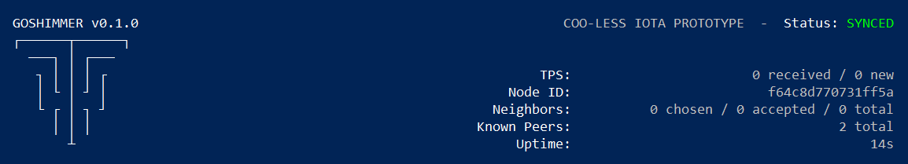

# GoShimmer ノードを実行する
<!-- # Run a GoShimmer node -->

**このガイドでは、GoShimmer ネットワークにノードをインストールして実行し、ネットワークをテストして、定期的な変更を最新の状態に保ちます。**
<!-- **In this guide, you install and run a node on the GoShimmer network to test the network and keep up to date with regular changes.** -->

ノードを実行するには、次のオプションがあります。
<!-- You have the following options for running a node: -->

- [クイックスタート](#quickstart)
<!-- - Quickstart -->
- [ネイティブインストール](#native-start)
<!-- - Native install -->

## 前提条件
<!-- ## Prerequisites -->

ノードを実行するには、次のものが必要です。
<!-- To run a node, you need the following: -->

- [Git](https://git-scm.com/downloads)
- Goshimmer ノードを実行しているデバイスにポート14626（TCP/UDP）およびポート14666（TCP）を[ポート転送](root://general/0.1/how-to-guides/expose-your-local-device.md)する
<!-- - [Forward ports](root://general/0.1/how-to-guides/expose-your-local-device.md) 14626(TCP/UDP) and 14666 (TCP) to the device that's running the node -->
- パブリックな IP アドレス
<!-- - A public IP address -->

<a name="quickstart"></a>
## クイックスタート
<!-- ## Quickstart -->

このセクションでは、GoShimmer GitHub リポジトリにあるビルド済みの実行可能ファイルを使用して、ネイティブファイルシステムでノードを実行します。
<!-- In this section, you run a node on your native filesystem, using the pre-built executable file on the GoShimmer GitHub repository. -->

1. [GoShimmer リリースページ](https://github.com/iotaledger/goshimmer/releases)に移動します．
<!-- 1. Go to the [GoShimmer release page](https://github.com/iotaledger/goshimmer/releases) -->

2. ご使用のオペレーティングシステム用の GoShimmer ファイルをダウンロードします．
<!-- 2. Download the GoShimmer file for your operating system -->

3. オペレーティングシステムに応じて、以下のコマンドのいずれかを使用して、ビルド済みの `goshimmer` ファイルを実行します。
  <!-- 3. Use one of the following commands to execute the pre-built `goshimmer` file, depending on your operating system: -->

    ```bash
    # Linux and macOS
    ./goshimmer --node.enablePlugins "spammer","graph"
    # Windows
    .\goshimmer --node.enablePlugins "spammer","graph"
    ```

    :::info:
    `-h` または `--help` フラグを付けてファイルを実行すると、すべての構成オプションのリストを表示できます。
    :::
    <!-- :::info: -->
    <!-- You can run the file with the `-h` or `--help` flag to see a list of all configuration options. -->
    <!-- ::: -->

:::success:おめでとうございます:tada:
GoShimmer ノードを実行しています。
:::
<!-- :::success:Congratulations :tada: -->
<!-- You're now running a GoShimmer node. -->
<!-- ::: -->



ステータススクリーンの右上隅に次の統計情報が表示されます．
<!-- The status screen displays the following statistics in the top-right corner: -->

- **TPS：**1秒あたりのトランザクション数．2つのカテゴリに分けられます．**received** トランザクションは，ノードがその台帳に追加したばかりのトランザクションです．**new** トランザクションは凝固トランザクションです．
<!-- - **TPS:** The number of transactions per second, which are separated into two categories. The **received** transactions are those that the node has just appended to its ledger. The **new** transactions are solid transactions. -->
- **Node ID：**固有の ID を付与するノードの公開鍵．
<!-- - **Node ID:** The node's public key that gives it a unique identity -->
- **Neighbors：**ノードが接続している隣接ノードの数．すべてのノードは最大8つの隣接ノードを持つことができます．各ノードは接続する4つの隣接ノードを選択し，自分を選択した他の4つの隣接ノードからの着信接続を受け入れます．
<!-- - **Neighbors:** The number of neighbors that the node is connected to. All nodes can have a maximum of 8 neighbors. Each node chooses 4 neighbors to connect to and accepts incoming connections from 4 other neighbors that chose it. -->
- **Known peers：**ネットワーク内のノードの総数．現時点では，**neighbor** ノードの数は **total** ノードの数と同じです．ネットワークがシャーディングを許可すると，**neighbor** ノードはシャード内にあるノードになります．
<!-- - **Known peers:** The total number of nodes in the network. At the moment, the number of **neighborhood** nodes is the same as the number of **total** nodes. When the network allows sharding, the **neighborhood** nodes will be those that are in the node's shard. -->
- **Uptime：**ノードが稼働していた合計時間．
<!-- - **Uptime:** The total amount of time during which the node has been running -->

:::info:
`accepted` 隣接ノードがない場合は，`autopeering` TCP/UDP ポート（14626）をデバイスに転送していることを確認します．
:::
<!-- :::info: -->
<!-- If you don't have any accepted neighbors, make sure that you've forwarded your `autopeering` TCP/UDP port (14626) to your device. -->
<!-- ::: -->

<a name="native-install"></a>
## ネイティブインストール
<!-- ## Native install -->

このセクションでは、GoShimmer 実行可能ファイルをソースからビルドして実行します。
<!-- In this section, you build the GoShimmer executable file from source and run it. -->

### 前提条件
<!-- ### Prerequisites -->

このガイドを完成するには，次のものが必要です．
<!-- To complete this guide, you need the following: -->

- 少なくとも Go プログラミング言語のバージョン1.13（最新バージョンを推奨）
<!-- - At least version 1.13 of the Go programming language (we recommend the latest version) -->
- GCC：macOS の場合、[Homebrew](https://brew.sh/)を使用して GCC をインストールできます（`brew install gcc`）。Windows の場合、[TDM-GCC をインストール](http://tdm-gcc.tdragon.net/download)できます。Linux（Ubuntu 18.04）の場合、[build-essential](https://linuxize.com/post/how-to-install-gcc-compiler-on-ubuntu-18-04/) パッケージから GCC をインストールできます。
<!-- - GCC: For macOS, you can install GCC using [Homebrew](https://brew.sh/) (`brew install gcc`). For Windows, you can [install TDM-GCC](http://tdm-gcc.tdragon.net/download). For Linux (Ubuntu 18.04), you can [install GCC from the `build-essential` package](https://linuxize.com/post/how-to-install-gcc-compiler-on-ubuntu-18-04/). -->

### GoShimmer 実行可能ファイルをビルドして実行する
<!-- ### Build and run the GoShimmer executable -->

1. コマンドラインインターフェイスで、`GOPATH` 環境変数を確認します．
  <!-- 1. In the command-line interface, check your `GOPATH` environment variable -->

    ```bash
    go env GOPATH
    ```

    :::info:
    このディレクトリは `$GOPATH` と呼ばれています．
    :::
    <!-- :::info: -->
    <!-- This directory is called `$GOPATH`. -->
    <!-- ::: -->

2. `$GOPATH` ではない場所に `goshimmer` リポジトリをクローンします．
  <!-- 2. Clone the `goshimmer` repository anywhere outside of `$GOPATH` -->

    ```bash
    git clone https://github.com/iotaledger/goshimmer.git
    ```

3. `goshimmer` ディレクトリに移動し、サブモジュールをダウンロードします。
  <!-- 3. Change into the `goshimmer` directory and download the submodules -->

    ```bash
    cd goshimmer
    git submodule init
    git submodule update
    ```

4. オペレーティングシステムに応じて、次のコマンドのいずれかを使用して実行可能ファイルをビルドします。
  <!-- 4. Use one of the following commands to build your executable file, depending on your operating system -->

    ```bash
    # Linux and macOS
    go build -o goshimmer
    # Windows
    go build -o  goshimmer.exe
    ```

    これで、実行する必要がある `goshimmer` というファイルが作成されました。
    <!-- Now, you have a file called `goshimmer` that you need to execute. -->

5. `config.json` ファイルを開き、`enablePlugins` フィールドを次のものに置き換えて、スパマー API エンドポイントとタングルビジュアライザーを有効にします。
  <!-- 5. Open the `config.json` file and replace the `enablePlugins` field with the following to enable the spammer API endpoint and the Tangle visualizer -->

    ```bash
    "enablePlugins":["spammer", "graph"]
    ```

    :::info:
    `-h` または `--help` フラグを付けてファイルを実行すると、すべての構成オプションのリストを表示できます。
    :::
    <!-- :::info: -->
    <!-- You can run the file with the `-h` or `--help` flag to see a list of all configuration options. -->
    <!-- ::: -->

6. オペレーティングシステムに応じて、次のコマンドのいずれかを使用して `goshimmer` ファイルを実行します。
  <!-- 6. Use one of the following commands to execute the `goshimmer` file, depending on your operating system: -->

    ```bash
    # Linux and macOS
    ./goshimmer
    # Windows
    goshimmer
    ```

    :::info:
    `permission denied` エラーが表示された場合は、管理者としてファイルを実行してみてください。
    :::
    <!-- :::info: -->
    <!-- If you see a `permission denied` error, try executing the file as an administrator. -->
    <!-- ::: -->

:::success:おめでとうございます:tada:
GoShimmer ノードを実行しています．
:::
<!-- :::success:Congratulations :tada: -->
<!-- You're now running a GoShimmer node. -->
<!-- ::: -->


ステータススクリーンの右上隅に次の統計情報が表示されます．
<!-- The status screen displays the following statistics in the top-right corner: -->

- **TPS：**1秒あたりのトランザクション数．2つのカテゴリに分けられます．**received** トランザクションは，ノードがその台帳に追加したばかりのトランザクションです．**new** トランザクションは凝固トランザクションです．
<!-- - **TPS:** The number of transactions per second, which are separated into two categories. The **received** transactions are those that the node has just appended to its ledger. The **new** transactions are solid transactions. -->
- **Node ID：**固有の ID を付与するノードの公開鍵．
<!-- - **Node ID:** The node's public key that gives it a unique identity -->
- **Neighbors：**ノードが接続している隣接ノードの数．すべてのノードは最大8つの隣接ノードを持つことができます．各ノードは接続する4つの隣接ノードを選択し，自分を選択した他の4つの隣接ノードからの着信接続を受け入れます．
<!-- - **Neighbors:** The number of neighbors that the node is connected to. All nodes can have a maximum of 8 neighbors. Each node chooses 4 neighbors to connect to and accepts incoming connections from 4 other neighbors that chose it. -->
- **Known peers：**ネットワーク内のノードの総数．現時点では，**neighbor** ノードの数は **total** ノードの数と同じです．ネットワークがシャーディングを許可すると，**neighbor** ノードはシャード内にあるノードになります．
<!-- - **Known peers:** The total number of nodes in the network. At the moment, the number of **neighborhood** nodes is the same as the number of **total** nodes. When the network allows sharding, the **neighborhood** nodes will be those that are in the node's shard. -->
- **Uptime：**ノードが稼働していた合計時間．
<!-- - **Uptime:** The total amount of time during which the node has been running -->

:::info:
受け入れた隣接ノードがない場合は，`autopeering` TCP/UDP ポート（14626）をデバイスに転送していることを確認します．
:::
<!-- :::info: -->
<!-- If you don't have any accepted neighbors, make sure that you've forwarded your `autopeering` TCP/UDP port (14626) to your device. -->
<!-- ::: -->

## 次のステップ
<!-- ## Next steps -->

ノードが稼働しているので，[ノードにスパムトランザクションを送信し](../how-to-guides/send-spam.md)，ノードが毎秒何トランザクションを処理できるかテストすることができます．
<!-- Now that your node is running, you can [send it spam transactions](../how-to-guides/send-spam.md) to test how many transactions per second your node can process. -->

GoShimmer ネットワークのタングルでトランザクションを確認するには、Web ブラウザで `http://127.0.0.1:8082` にアクセスしてビジュアライザーを開きます。
<!-- To see the transactions in the GoShimmer network's Tangle, open the visualizer by going to `http://127.0.0.1:8082` in a web browser. -->


