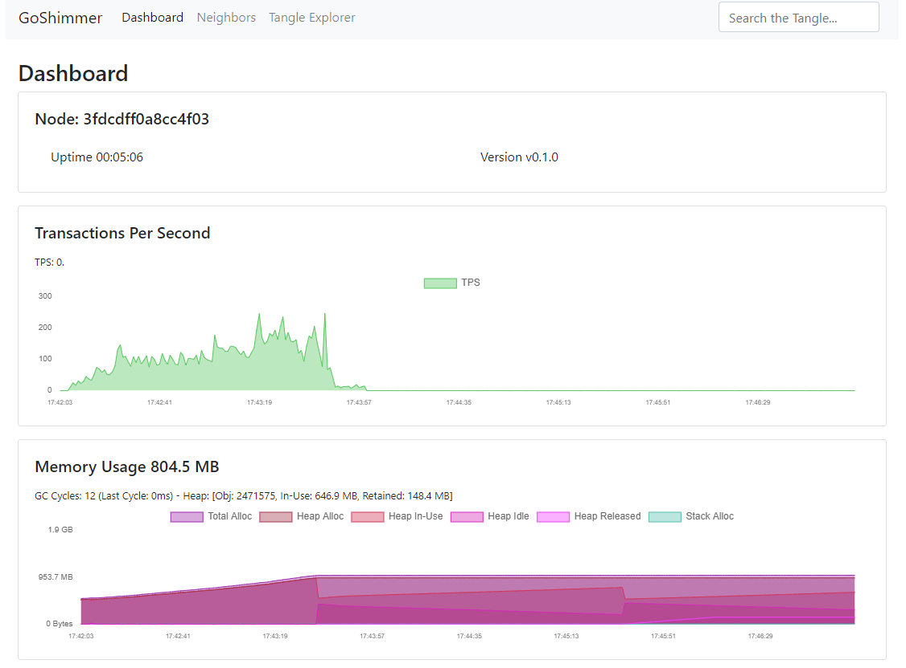

# ノードにスパムトランザクションを送信する
<!-- # Send spam transactions to your node -->

**このガイドでは、`spammer` API エンドポイントを使用してスパムトランザクションを送信することにより、ノードが1秒間に処理できるトランザクション数をテストします。**
<!-- **In this guide, you test how many transactions per second your node can process by using the `spammer` API endpoint to send it spam transactions.** -->

自分のノードにスパムトランザクションを送信すると，ノードはスパムトランザクションを処理し，自身の台帳にスパムトランザクションを追加し，そして処理のためにスパムトランザクションを隣接ノードに転送します．
<!-- When you send your node spam transactions, it processes them, adds them to its ledger, and forwards them to its neighbors for processing. -->

## 前提条件
<!-- ## Prerequisites -->

このガイドを完了するには、次のものが必要です。
<!-- To complete this guide, you need the following: -->
- `spammer` が有効になっている [GoShimmer ノード](../how-to-guides/run-the-node.md)
<!-- - [A GoShimmer node](../how-to-guides/run-the-node.md) with the `spammer` and enabled -->
- [cURL](https://curl.haxx.se/) がインストールされているデバイス
<!-- - [cURL](https://curl.haxx.se/) installed on your device -->

---

1. コマンドプロンプトを開き、次のリクエストを入力します。インターネット経由でノードにアクセスする場合は、`localhost` をパブリック IP アドレスに置き換えます。
<!-- 1. Open a command prompt and enter the following request. If you want to access your node over the Internet, replace `localhost` with your public IP address. -->

    ```bash
    curl -X GET -H 'Content-Type:application/json' -H 'X-IOTA-API-Version:1' http://127.0.0.1:8080/spammer?cmd=start&tps=1000
    ```

    :::info:
    この例では、ノードに1,000トランザクション/秒（TPS）を送信します。TPS を変更する場合は、`tps` フィールドの値を変更できます。
    :::
    <!-- :::info: -->
    <!-- This example sends your node 1,000 transactions per second (TPS). If you want to change the TPS, you can change the value of the `tps` field. -->
    <!-- ::: -->

2. ノードがトランザクションを受信していることを確認するには、Web ブラウザ `http://127.0.0.1:8081` に移動してダッシュボードを開きます。
  <!-- 2. To check that your node is receiving transactions, open the dashboard by going to `http://127.0.0.1:8081` in a web browser -->

    

    :::info:
    表示された TPS は設定した `tps` パラメータの値より低いかもしれません．この違いの理由は使用しているコンピュータハードウェアの限界によるものかもしれません．
    :::
    <!-- :::info: -->
    <!-- The displayed TPS may be lower than the value of the `tps` parameter you used. The reason for this difference may be due to limits with your computer hardware. -->
    <!-- ::: -->

## 次のステップ
<!-- ## Next steps -->

[GoShimmer GitHub リポジトリ](https://github.com/iotaledger/goshimmer)にアクセスして、詳細を確認するか、開発に参加してください。
<!-- Go to the [GoShimmer GitHub repository](https://github.com/iotaledger/goshimmer) to learn more or to get involved in development. -->

[API リファレンス](../references/api-reference.md)を参照して、利用可能な他のエンドポイントを確認してください。
<!-- See the [API reference](../references/api-reference.md) to find out which other endpoints are available. -->
