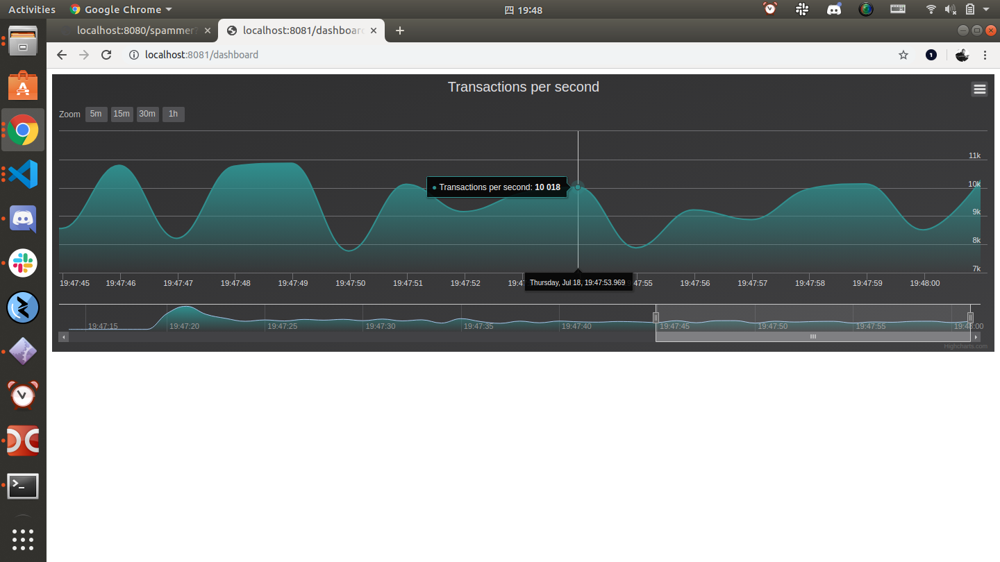

# ノードにスパムトランザクションを送信する
<!-- # Send spam transactions to your node -->

**ノードが1秒間に処理できるトランザクション数をテストするには、`spammer`APIエンドポイントを使用してスパムトランザクションを送信します。**
<!-- **To test how many transactions per second your node can process, you can use a `spammer` API endpoint to send it spam transactions.** -->

自分のノードにスパムトランザクションを送信すると、ノードはスパムトランザクションを処理し、自身の台帳にスパムトランザクションを追加し、そして処理のためにスパムトランザクションを隣接ノードに転送します。
<!-- When you send your node spam transactions, it processes them, adds them to its ledger, and forwards them to its neighbors for processing. -->

1. Webブラウザを開き、アドレスバーに以下のように入力します。インターネットを通して自分のノードにアクセスしたいならば、`localhost`を自分のIPアドレスに置き換えます。
  <!-- 1. Open a web browser and enter the following into the address bar. If you want to access your node through the Internet, replace `localhost` with your IP address. -->

    ```bash
    http://localhost:8080/spammer?cmd=start
    ```

    :::info:
    デフォルトでは、このエンドポイントは毎秒1,000トランザクション（TPS）を送信します。TPSを変更したい場合は、`tps`クエリパラメータを追加することができます。たとえば、10,000TPSを送信するには、次のようにエンドポイントにリクエストを送信します。`http://localhost:8080/spammer?cmd=start&tps=10000`
    :::
    <!-- :::info: -->
    <!-- By default, this endpoint sends 1,000 transactions per second (TPS). If you want to change the TPS, you can add the `tps` query parameter. For example, to send 10,000 TPS, send a request to the following endpoint `http://localhost:8080/spammer?cmd=start&tps=10000` -->
    <!-- ::: -->

2. ノードがトランザクションを受信していることを確認するには、ウェブブラウザで`http://localhost:8081/dashboard`に行き、ダッシュボードを開きます。
  <!-- 2. To check that your node is receiving transactions, open the dashboard by going to `http://localhost:8081/dashboard` in a web browser -->

    

    :::info:
    表示されたTPSは設定した`tps`パラメータの値より低いかもしれません。この違いの理由は使用しているコンピュータハードウェアの限界によるものかもしれません。
    :::
    <!-- :::info: -->
    <!-- The displayed TPS may be lower than the value of the `tps` parameter you used. The reason for this difference may be due to limits with your computer hardware. -->
    <!-- ::: -->

## 次のステップ
<!-- ## Next steps -->

ノードがトランザクションを受信しているので、[ノードの着信トランザクションを監視する](../how-to-guides/subscribe-to-events.md)ことができます。
<!-- Now that your node is receiving transactions, you can [monitor it for incoming transaction](../how-to-guides/subscribe-to-events.md) to see the transaction data. -->
