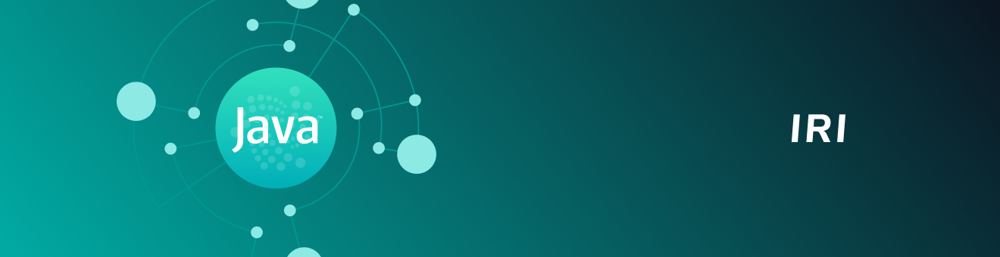

# ノードソフトウェア
<!-- # Node software -->

**IOTAネットワークは、相互に接続されたノードから構成されています。これらのノードは、同じノードソフトウェアを実行するコンピュータです。このソフトウェアは、ノードにタングルへの読み取り/書き込みアクセス権を付与し、ノードがトランザクションを検証してトランザクションを台帳に保存できるようにします。**
<!-- **IOTA networks consist of interconnected nodes, which are computers that run the same node software. This software gives nodes read/write access to the Tangle and allows them to validate transactions and store them in their ledgers.** -->

-------------------------

## [IRI](../iri/introduction/overview.md)
IRI（IOTAリファレンス実装）は、IOTA Mainnet上で動作するオープンソースのJavaソフトウェアです。このソフトウェアは現在のIOTAプロトコルを定義しています。IRIはクライアントがお互いの間でIOTAトークンを転送することを可能にします。
-------------------------

-------------------------

## [Chronicle](../chronicle/introduction/overview.md)
ChronicleはIRIノードソフトウェアに追加されたもので、すべてのトランザクションを安全で拡張性の高い個別の分散データベースに保存できます。
-------------------------

-------------------------

## [GoShimmer](../goshimmer/introduction/overview.md)
GoShimmerは、コーディネーターなしでIOTAネットワークのプロトタイプを実装しているオープンソースのGoソフトウェアです。このネットワークはまだ開発中なので、すべてのモジュールが存在するわけではありませんが、準備ができたら新しいモジュールが追加されます。
-------------------------
