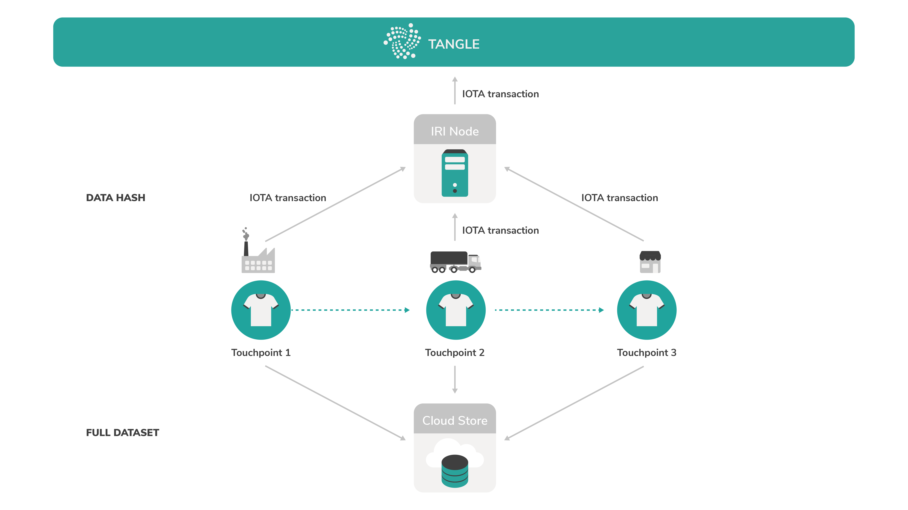
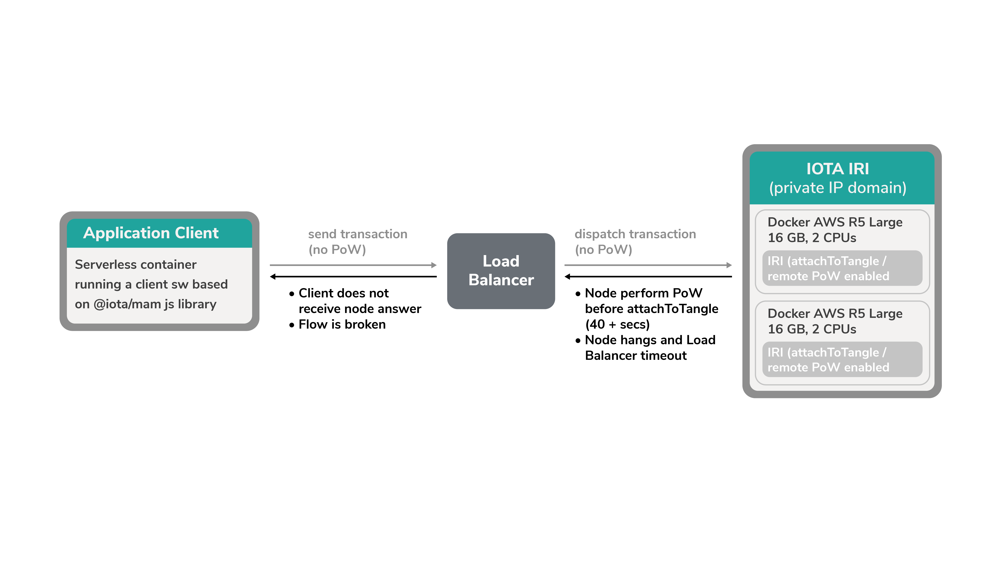
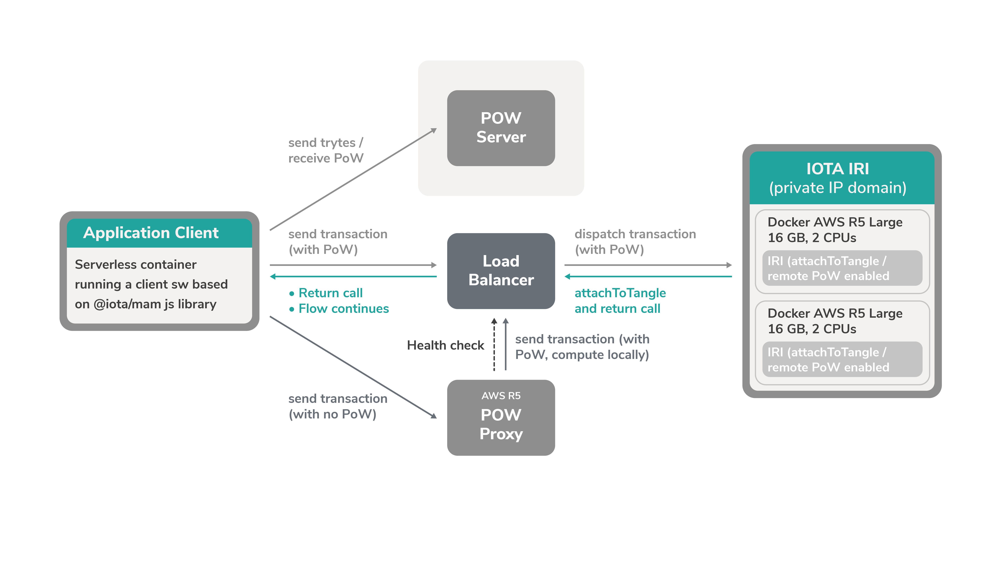

# ノードを実行するためのベストプラクティス
<!-- # Best practices for running a node -->

**ノードを実行すると、信頼性の高いアーキテクチャを設定するためのさまざまなオプションがあります。この記事はIOTA財団がIOTA財団のパートナーにしばしば与えるいくつかのアドバイスを与えます。**
<!-- **When you run a node, you have lots of different options for setting up a reliable architecture. This article gives you some advice that we often give to our partners.** -->

多くの場合、パートナーはタングルを利用して検証目的でデータのハッシュ値を保存および配布します。
<!-- Often, our partners leverage the Tangle to store and distribute a hash of their data for verification purposes. -->

サプライチェーンの各段階で、重要なデータはクラウドサーバに保存され、ハッシュ化されてタングルに添付されます。タングル上のハッシュ値を使用すると、クラウドへのアクセス権を持つユーザーは、データをハッシュ化してタングル上のイミュータブルなハッシュ値と比較することによって、クラウドデータの整合性を検証できます。
<!-- At each point along the supply chain, any important data is stored on a cloud server then hashed and attached to the Tangle. With the hash on the Tangle, anyone with access to the cloud can verify the integrity of the cloud data by hashing it and comparing it to the immutable hash on the Tangle. -->

:::info:
[EVRYTHNGがIOTAをどのように使用しているかについての詳細を調べるにはIOTA財団のブログ記事を参照します](https://blog.iota.org/iota-evrythng-2a9b4b9d922d)。
:::
<!-- :::info: -->
<!-- [Read our blog post to find out more about how EVRYTHNG uses IOTA](https://blog.iota.org/iota-evrythng-2a9b4b9d922d). -->
<!-- ::: -->

## ノード
<!-- ## Nodes -->

アプリケーションが利用可能なノードに接続する可能性を高めるために、1つ以上のローカルノードを実行することをお勧めします。
<!-- To increase the chances of your application connecting to an available node, it's often best practice to run one or more local nodes. -->

これらのノードをホストするには、ホストデバイスが確実に動作するのに十分な計算能力を持っていることを確認するのが最善です。たとえば、16GBのRAMと2つの仮想CPUを備えた[Amazon Webサービス（AWS）R5ラージサーバ](https://aws.amazon.com/ec2/instance-types/r5/)などの仮想プライベートサーバのインスタンスで各ノードを実行することをお勧めします。
<!-- To host these nodes it's best to make sure that the host device has enough computational power to run reliably. For example, a good benchmark is to run each node on an instance of a virtual private server such as an [Amazon Web Services (AWS) R5 Large server](https://aws.amazon.com/ec2/instance-types/r5/) with 16 GB RAM and two virtual CPUs. -->

:::info:
[Linuxでノードを実行する](../how-to-guides/run-an-iri-node-on-linux.md)、または[Dockerコンテナでノードを実行する](../how-to-guides/run-an-iri-node-in-docker.md)ガイドを参照する。
:::
<!-- :::info: -->
<!-- Read our guide on [running a node on Linux](../how-to-guides/run-an-iri-node-on-linux.md), or on [running a node in a Docker container](../how-to-guides/run-an-iri-node-in-docker.md). -->
<!-- ::: -->

### プルーフオブワーク
<!-- ### Proof of work -->

ノードを構築すると、ノードが[プルーフオブワーク](root://getting-started/0.1/transactions/proof-of-work.md)をすることを可能にするオプションがあります。この機能が有効になっているとき、クライアントアプリケーションは`attachToTangle`APIエンドポイントを呼び出すことによって、ノードにプルーフオブワークをするように頼むことができます。このオプションはリモートプルーフオブワークと呼ばれます。
<!-- When you're setting up your nodes, you have the option to allow them to do [proof of work](root://getting-started/0.1/transactions/proof-of-work.md). When this feature is enabled, client applications can ask your node to do proof of work by calling the `attachToTangle` API endpoint. This option is called remote proof of work. -->

プルーフオブワークには時間がかかり、ノードの計算能力を使用します。そのため、ノードにトランザクションを送信する頻度によっては、[remote-limit-api](../references/iri-configuration-options.md#remote-limit-api)設定オプションでこの機能をデフォルトで無効にしておくことをお勧めします。
<!-- Proof of work takes time and uses your node's computational power. So, depending on how often you send transactions to your nodes, you may want to keep this feature disabled by default in the [remote-limit-api](../references/iri-configuration-options.md#remote-limit-api) configuration option. -->

このように、クライアントアプリケーションは自分自身でプルーフオブワークを実行（ローカルPoW）したり、PoWプロキシサーバにアウトソーシングするといった[プルーフオブワークのためのその他のオプション](root://getting-started/0.1/transactions/proof-of-work.md#minimum-weight-magnitude#options-for-doing-proof-of-work)を使用できます。
<!-- This way, client applications can use [other options for proof of work](root://getting-started/0.1/transactions/proof-of-work.md#minimum-weight-magnitude#options-for-doing-proof-of-work) such as doing it themselves (local PoW) or outsourcing it to a PoW proxy server. -->

:::info:
[PoWプロキシサーバの設定](../how-to-guides/install-a-pow-proxy.md)ガイドを参照する。

[Node.jsでローカルPoWを行う](https://github.com/iotaledger/ccurl.interface.js)方法を学ぶ。
:::
<!-- :::info: -->
<!-- Read our guide for [setting up a PoW proxy server](../how-to-guides/install-a-pow-proxy.md). -->
<!--  -->
<!-- Learn how to [do local PoW in Node.js](https://github.com/iotaledger/ccurl.interface.js). -->
<!-- ::: -->

## クライアントアプリケーション
<!-- ## Client applications -->

APIエンドポイントを介してノードと通信するクライアントアプリケーションの場合、[AWS Lambda](https://aws.amazon.com/lambda/)などのサーバレスアーキテクチャのインスタンスで、IOTAクライアントライブラリの1つを使用するのが最善です。このようにして、アプリケーションはハードウェアに制限されず、高い可用性を持ちます。
<!-- For a client application that will communicate with your nodes through API endpoints, it's best to use one of the IOTA client libraries on an instance of a serverless architecture such as [AWS Lambda](https://aws.amazon.com/lambda/). This way, your application is not restricted by hardware and has a high availability. -->

:::info:
[IOTAクライアントライブラリを始める](root://getting-started/0.1/how-to-guides/get-started.md)。
:::
<!-- :::info: -->
<!-- [Get started with the IOTA client libraries](root://getting-started/0.1/how-to-guides/get-started.md). -->
<!-- ::: -->

## ロードバランサ
<!-- ## Load balancer -->

クライアントアプリケーションといくつかのノードがある場合は、クライアントのAPI呼び出しがすべてのノードに分散され、単一のノードが過負荷にならないようにすることをお勧めします。
<!-- When you have a client application and some nodes, it's best practice to make sure that the client's API calls are distributed among all nodes so that no single one is overloaded. -->

すべてのノードにAPI呼び出しを均等に分散させるために、ロードバランサとして機能するリバースプロキシサーバを実行できます。
<!-- To evenly distribute the API calls among all your nodes, you can run a reverse proxy server that will act as a load balancer. -->

このようにして、すべてのノードがそのAPI呼び出しを送信するリバースプロキシサーバのドメイン名を1つにすることができます。ただし、バックエンドでは、最も余裕のある計算能力を持つノードがリクエストを処理し、レスポンスをリバースプロキシサーバに返します。
<!-- This way, you can even have one domain name for your reverse proxy server that all nodes will send their API calls to. But, on the backend, the nodes with the most spare computational power will process the request and return the response to the reverse proxy server. -->

:::info:
ノード用の[リバースプロキシサーバの設定](../how-to-guides/set-up-a-reverse-proxy.md)に関するガイドを参照する。
:::
<!-- :::info: -->
<!-- Read our guide on [setting up a reverse proxy server](../how-to-guides/set-up-a-reverse-proxy.md) for your node. -->
<!-- ::: -->

## 統合サポート
<!-- ## Integrations support -->

自身の長所を共有したい場合、またはIOTAを自身のアーキテクチャーに統合するのを手伝って欲しい場合は、IOTA財団のチーム（`integrations@iota.org`）にご連絡ください。
<!-- If you want to share your own recommendations, or if you want help integrating IOTA into your own architecture, get in touch with our team at: integrations@iota.org -->
