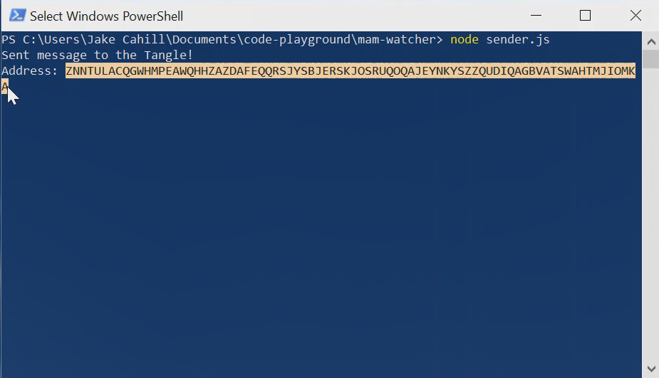
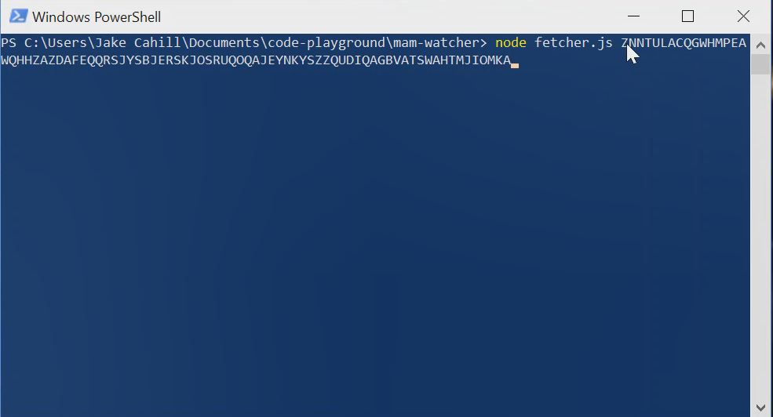

# MAM ウォッチャー
<!-- # MAM watcher -->

**モノのインターネット上のデバイスは，多くの場合，環境をモニタリングしてデータを作成しています．このガイドでは，データを暗号化し，Masked Authenticated Messaging（MAM）チャネルを介してタングルでストリーミングします．このようにして，他のデバイスがチャネルを介してデータストリームにサブスクライブできるようにすることができます．**
<!-- **Devices on the Internet of Things are often monitoring their environment and creating data. In this guide, you encrypt data and stream it on the Tangle through a Masked Authenticated Messaging (MAM) channel. This way, you can allow other devices to subscribe to your data stream through the channel.** -->

:::info:GitHub にアクセスする
クイックスタートの手順やソースコードを読むには，[GitHub リポジトリ](https://github.com/iota-community/mam-watcher)にアクセスしてください．
:::
<!-- :::info:Go to GitHub -->
<!-- For quickstart instructions or to read the source code, [go to the GitHub repository](https://github.com/iota-community/mam-watcher). -->
<!-- ::: -->

:::warning:
このアプリケーションは，まだベータ開発中の[IOTA MAM ライブラリ](https://www.npmjs.com/package/@iota/mam)を使用します．本番環境ではこのコードを使用しないでください．
:::
<!-- :::warning: -->
<!-- This application uses the [IOTA MAM library](https://www.npmjs.com/package/@iota/mam), which is still in beta development. Do not use this code in production environments. -->
<!-- ::: -->

## 前提条件
<!-- ## Prerequisites -->

このアプリケーションを使用するには，以下が必要です．
<!-- To use this application, you need the following: -->

- [LTS バージョンまたは最新バージョンの Node.js と NPM](https://nodejs.org/en/download/)
<!-- - [An LTS version or the latest version of Node.js and NPM](https://nodejs.org/en/download/) -->

- [Git](https://git-scm.com/download/linux)

## アプリケーションを実行する
<!-- ## Run the application -->

1. `mam-watcher` リポジトリをクローンします．
  <!-- 1. Clone this repository -->

    ```bash
    git clone https://github.com/iota-community/mam-watcher
    ```

2. `mam-watcher` ディレクトリに移動します．
  <!-- 2. Change into the `mam-watcher` directory -->

    ```bash
    cd mam-watcher
    ```

3. 依存関係をインストールします．
  <!-- 3. Install the dependencies -->

    ```bash
    npm install
    ```

4. MAM ストリームへのメッセージ送信を開始します．
  <!-- 4. Start sending messages to a MAM stream -->

    ```bash
    node sender.js
    ```

5. コンソールに表示されている最初のアドレスをコピーします．
  <!-- 5. Copy the first address that appears in the console -->

    

6. 新しいコマンドプロンプトウィンドウを開きます．
  <!-- 6. Open a new command-prompt window -->

7. コピーしたアドレスを使用して MAM ストリームを購読します．
  <!-- 7. Subscribe to the MAM stream by using the address you just copied -->

    ```bash
    node fetcher.js <address (also called the MAM root)>
    ```

    

コンソールでは，`sender.js` ウィンドウがトランザクションを送信し，`fetcher.js` ウィンドウがチャネルを購読してタングルからメッセージを取得していることがわかります．
<!-- In the console, you should see that the `sender.js` window sends transactions and the `fetcher.js` window subscribes to the channel and retrieves the messages from the Tangle. -->


## メッセージをよりプライベートにする
<!-- ## Make your message more private -->

今までは，タングルでトランザクションを見つけられた人は誰でも，アドレスをキーとして使って，メッセージを解読することができました．
<!-- Until now, anyone who was able to find your transactions on the Tangle could decrypt the message using the address as the key. -->

メッセージをよりプライベートにし，誰がメッセージを解読できるのかをもっとコントロールするために，チャネルを制限することができます．
<!-- To make your message more private and to have more control over who can decrypt it, you can make your channel restricted. -->

1. `sender.js` ファイルを開きます．
  <!-- 1. Open the `sender.js` file -->

2. 上部の最初の2行の下に秘密の81トライトのサイドキーを作成します．
  <!-- 2. Create a secret 81-tryte side key under the first two lines at the top -->

    ```js
    var sideKey = asciiToTrytes('mySuperSecretSideKey');

    while(sideKey.length % 81 !== 0){
    sideKey += '9';
    }
    ```

    :::info:
    これはほんの一例です．あなた自身のアプリケーションのために，あなた自身の81トライトのサイドキーを作成してください．
    :::
    <!-- :::info: -->
    <!-- This is only an example. For your own applications, create your own 81-tryte side key. -->
    <!-- ::: -->

3. `public` メソッドの代わりに `restricted` メソッドを使用するように `mamState` 変数を変更します．
  <!-- 3. Change the `mamState` variable to use the `restricted` method instead of the `public` one -->

    ```js
    mamState = Mam.changeMode(mamState, 'restricted', sideKey);
    ```

4. メッセージを変更して，秘密になったことを確認します．
  <!-- 4. Change the message, so we know that now it's secret -->

    ```js
    publish('Super secret message' + count++);
    ```

5. `fetcher.js` ファイルを開きます．
  <!-- 5. Open the `fetcher.js` file -->

6. `fetcher.js` ファイルに，`sender.js` ファイルで作成したものと同じサイドキーを付けます．
  <!-- 6. Give this file the same side key as the one you created in the `sender.js` file -->

    ```js
    const { asciiToTrytes } = require('@iota/converter')

    var sideKey = asciiToTrytes('mySuperSecretSideKey');

    while(sideKey.length % 81 !== 0){
    sideKey += '9';
    }
    ```

7. サイドキーを使用してメッセージを復号化するように取得方法を変更します．
  <!-- 7. Change the fetch method so that it decrypts the message using the side key -->

    ```js
    await Mam.fetch(root, 'restricted', sideKey, showData)
    ```

:::success:おめでとうございます:tada:
これで，誰かがタングルでこのトランザクションを見つけたとしても，サイドキーを持っている人だけがメッセージを解読することができます．
:::
<!-- :::success:Congratulations! -->
<!-- Now, only those with the side key can decrypt your message, even if they find your transactions on the Tangle. -->
<!-- ::: -->

## 次のステップ
<!-- ## Next steps -->

自分自身の[プライベートタングルを実行し](../one-command-tangle/overview.md)，プライベートタングルに MAM メッセージを送信する．
<!-- Try [running your own private Tangle](../one-command-tangle/overview.md) and sending the sending the MAM messages to it. -->

:::info:
`sender.js` ファイルと `fetcher.js` ファイルの両方で，ノードの URL（`https://nodes.devnet.thetangle.org:443`）を必ず自分のノードの URL（`http:127.0.0.1:14265`）に変更します．
:::
<!-- :::info: -->
<!-- Make sure to change the node URL `https://nodes.devnet.thetangle.org:443` to the URL of your node (`http:127.0.0.1:14265`) in both the `sender.js` file and the `fetcher.js` file. -->
<!-- ::: -->
