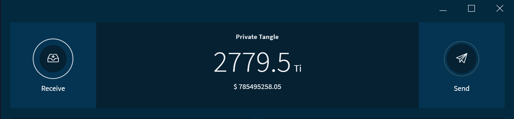

# ワンコマンドプライベートタングル
<!-- # One-command private Tangle -->

**テストのために，パブリックネットワークのいずれかでテストデータを公開したくない場合があります．このガイドでは，単一の [Docker](https://www.docker.com/why-docker) コマンドを使用して，自分自身の IOTA ネットワークをセットアップします．このコマンドを実行すると，自分自身の IOTA テストネットワークと2.7Pi（最大量）のテスト [IOTA トークン](root://getting-started/0.1/clients/token.md)が作成されます．このアプリケーションを使用すると，金銭的な価値を危険にさらすことなく，アイデアやアプリケーションをテストできます．**
<!-- **For testing, you may not want to publish test data on one of the public networks. In this guide, you set up your own IOTA network by using a single [Docker](https://www.docker.com/why-docker) command. When you run this command, you'll have your own IOTA test network and 2.7Pi (the maximum amount) of test [IOTA tokens](root://getting-started/0.1/clients/token.md). You can use this application to test your ideas and applications without risking any monetary value.** -->

:::info:GitHub にアクセスする
クイックスタートの手順やソースコードを読むには，[GitHub リポジトリ](https://github.com/iota-community/one-command-tangle)にアクセスしてください．
:::
<!-- :::info:Go to GitHub -->
<!-- For quickstart instructions or to read the source code, [go to the GitHub repository](https://github.com/iota-community/one-command-tangle). -->
<!-- ::: -->

:::warning:
このコードはまだベータ開発中です．本番環境ではこのコードを使用しないでください．
:::
<!-- :::warning: -->
<!-- This code still in beta development. Do not use this code in production environments. -->
<!-- ::: -->

## ワンコマンドタングルの仕組み
<!-- ## How the one-command Tangle works -->

テストネットワークは，（インターネットに接続されていない）ローカルホスト上で1つの [IRI ノード](root://node-software/0.1/iri/introduction/overview.md)と1つの[コンパス](root://compass/0.1/introduction/overview.md)インスタンスを実行します．
<!-- The test network runs one [IRI node](root://node-software/0.1/iri/introduction/overview.md) and an instance of [Compass](root://compass/0.1/introduction/overview.md) on your localhost (not connected to the Internet). -->

IRI ノードはトランザクションを受け取り，トランザクションを検証し，そしてユーザーの残高の最新の記録を保持します．
<!-- The IRI node receives transactions, validates them, and keeps an up-to-date record of users' balances. -->

一定の間隔で，コンパスは IRI ノードへ他のトランザクションを参照する[マイルストーン](root://getting-started/0.1/network/the-tangle.md#milestones)と呼ばれるゼロトークントランザクションを送信します．マイルストーンによって参照されるトランザクションはすべて確定済みと見なされます．この時点で，ノードは確定済みトランザクションの影響を受けた残高をすべて更新します．
<!-- At regular intervals, Compass sends the IRI node zero-value transactions called [milestones](root://getting-started/0.1/network/the-tangle.md#milestones) that reference other transactions. Any transaction that's referenced by a milestone is considered confirmed. At this point, the node updates any balances that were affected by the confirmed transaction. -->

トークンの総供給量は，次のシードの最初のアドレスに格納されています．
```bash
SEED99999999999999999999999999999999999999999999999999999999999999999999999999999
```
<!-- The total supply of tokens are stored on the first address of this seed: `SEED99999999999999999999999999999999999999999999999999999999999999999999999999999`. -->

:::warning:このプライベートタングルをインターネットに公開しないでください
このアプリケーションの目的は，テスト IOTA ネットワークをすばやく設定できるようにすることです．そのために，このアプリケーションは事前に計算されたマークル木を使用しています．結果として，テストのためだけにこのアプリケーションを使うべきです．
:::
<!-- :::warning:Do not expose your private Tangle to the Internet -->
<!-- The purpose of this application is to allow you to quickly set up a test IOTA network. To do so, this application uses a pre-calculated Merkle tree. As a result, you should use this application only for testing. -->
<!-- ::: -->

## 前提条件
<!-- ## Prerequisites -->

このアプリケーションを使用するには，以下が必要です．
<!-- To use this application, you need the following: -->

- 4GB 以上の空き RAM
<!-- - At least 4GB of free RAM -->
- [Docker と Docker Compose](https://docs.docker.com/compose/install/)
<!-- - [Docker and Docker Compose](https://docs.docker.com/compose/install/) -->
- [Git](https://git-scm.com/downloads)

## 手順1. アプリケーションを実行する
<!-- ## Step 1. Run the application -->

1. `one-command-trangle` リポジトリをクリーンします．
  <!-- 1. Clone this repository -->

    ```bash
    git clone https://github.com/iota-community/one-command-tangle.git
    ```

2. `one-command-tangle` ディレクトリで，`docker-compose up` コマンドを実行します．
  <!-- 2. In the `one-command-tangle` directory, execute the `docker-compose up` command -->

  :::info:
  Debian ベースのオペレーティングシステムを使用している場合は，このコマンドの前に `sudo` を追加する必要があります．
  :::
  <!-- :::info: -->
  <!-- If you're using a Debian-based operating system, you may need to add `sudo` before this command. -->
  <!-- ::: -->

  コンソールで，IRI ノードが実行されており，コンパスからマイルストーンを受信していることがわかります．
  <!--  In the console, you should see that the IRI node is running and receiving milestones from Compass. -->

  

  :::info:
  コンパスは，深さ20の事前にビルドされた（`layer` ディレクトリ内の）マークル木を使用します．このマークル木は，コンパスが1年以上30秒間隔でマイルストーンを送信するのに十分な大きさです．
  :::
<!--  :::info: -->
<!--  Compass uses a pre-built Merkle tree (in the `layers` directory) with a depth of 20. This Merkle tree is large enough for Compass to send milestones for over a year at 30-second intervals. -->
<!--  ::: -->

### プライベートタングル用のオプションのユーティリティ Web サイトをホストする
<!-- ### Host an optional utilities website for your private Tangle -->

[utils.iota.org Web サイト](https://utils.iota.org/)には，IOTA ネットワークを使いやすくするためのユーティリティがあります．たとえば，Web サイトを使用して IOTA ネットワークと対話したり，トランザクショントライトを圧縮したり，IOTA トークンの値をさまざまな通貨に変換したりできます．
<!-- The [utils.iota.org website](https://utils.iota.org/) has utilities that make it easier to use an IOTA network. For example, you can use the website to interact with an IOTA network, compress transaction trytes, and convert the value of IOTA tokens into different currencies. -->

プライベートタングルを使いやすくするために自分自身のユーティリティWebサイトをホストすることができます．
<!-- You can host your own utilites website that makes it easier to use your private Tangle. -->

#### 前提条件
<!-- #### Prerequisites -->

ユーティリティ Web サイトのすべての機能を使用する場合は，次の設定認証情報が必要です．
<!-- If you want to use all the functionalities of the utilities website, you need the following configuration credentials: -->

- [タングルエクスプローラ](https://utils.iota.org/)には，[Amazon DynamoDB 認証情報](https://aws.amazon.com/dynamodb/)が必要です．
<!-- - For the [Tangle explorer](https://utils.iota.org/), you need [Amazon DynamoDB credentials](https://aws.amazon.com/dynamodb/) -->

- [通貨換算](https://utils.iota.org/currency-conversion)には，[Fixer API キー](https://rapidapi.com/fixer/api/fixer-currency)と [CoinMarketCap API キー](https://coinmarketcap.com/api/)が必要です．
<!-- - For the [currency converter](https://utils.iota.org/currency-conversion), you need a [Fixer API key](https://rapidapi.com/fixer/api/fixer-currency) and a [CoinMarketCap API key](https://coinmarketcap.com/api/) -->

- [IOTA エリアコードマップ](https://utils.iota.org/area-codes)には，[Google Maps API キー](https://developers.google.com/maps/documentation/javascript/get-api-key)が必要です．
<!-- - For the [IOTA area codes map](https://utils.iota.org/area-codes), you need a [Google Maps API key](https://developers.google.com/maps/documentation/javascript/get-api-key) -->

---

1. `/config/tools/` ディレクトリ内のファイルに設定情報を追加します．`Amazon Dynamo DB の認証情報`，`Fixer API キー`，および `CoinMarketCap API キー`は `/config/tools/tools-api-config.json` ファイルに設定されています．`Google Maps API キー`は `/config/tools/tools-config.json` ファイルに設定されています．
  <!-- 1. Add any configuration credentials to the files in the `/config/tools/` directory. The Amazon Dynamo DB credentials, the Fixer API key, and the CoinMarketCap API key are set in the `/config/tools/tools-api-config.json` file. The Google Maps API key is set in the `/config/tools/tools-config.json` file. -->

2. 設定情報を使って `docker-compose up` コマンドを実行します．
  <!-- 2. Execute the `docker-compose up` command with your configuration credentials -->

    ```bash
    docker-compose -f docker-compose.yml -f docker-compose-tools.yml up
    ```

3. Web ブラウザで，`http://localhost:4001` にアクセスしてタングルユーティリティ Web サイトを開きます．
  <!-- 3. In a web browser, go to `http://localhost:4001` to open your Tangle utilities website. -->

## 手順2. ネットワークと対話する
<!-- ## Step 2. Interact with the network -->

アプリケーションを実行しているときは，アドレス `http://localhost:14265` にある IRI ノードの API ポートを介してネットワークと対話できます．
<!-- When the application is running, you can interact with the network through the IRI node's API port at the following address `http://localhost:14265`. -->

[API エンドポイント](root://node-software/0.1/iri/references/api-reference.md)の一覧を参照します．
<!-- See a list of [API endpoints](root://node-software/0.1/iri/references/api-reference.md). -->

--------------------
### GetBalances
Node.js で [JavaScript クライアントライブラリ](root://client-libraries/0.1/introduction/overview.md)を使用すると，[`getBalances`](root://node-software/0.1/iri/references/api-reference.md#getbalances) エンドポイントを呼び出してシードの合計残高を取得できます．

 ```js
 var request = require('request');

 const iota = require('@iota/core');

 Iota = iota.composeAPI({
     provider: 'http://localhost:14265'
 });

 var address = iota.generateAddress('SEED99999999999999999999999999999999999999999999999999999999999999999999999999999',0);

 getBalance(address);

 function getBalance(address) {

     var command = {
     'command': 'getBalances',
     'addresses': [
     address
     ],
     'threshold':100
     }

     var options = {
     url: 'http://localhost:14265',
     method: 'POST',
     headers: {
     'Content-Type': 'application/json',
     'X-IOTA-API-Version': '1',
     'Content-Length': Buffer.byteLength(JSON.stringify(command))
     },
     json: command
     };

     request(options, function (error, response, data) {
         if (!error && response.statusCode == 200) {
         console.log(JSON.stringify(data,null,1));
         }
     });
 }
 ```
---
### レスポンス
```json
{
 "balances": [
  "2779530283277761"
 ],
 "references": [
  "BDZPAONKWQTVCXFFO9GBTJ9GGWPRLITXZ9BMYALTCVWNOLFYPNHFJHPDWICRPGCZWUNDQHV9UDEXGW999"
 ],
 "milestoneIndex": 7,
 "duration": 1
}
```
--------------------

## 手順3. ウォレットを通してプライベートタングルに接続する
<!-- ## Step 3. Connect to your private Tangle through a wallet -->

ユーザーインターフェースを介してトランザクションを送受信したい場合は，以下のいずれかの IOTA ウォレットを介してプライベートタングルに接続できます．
<!-- If you want to send and receive transactions through a user interface, you can connect to your private Tangle through one of the IOTA wallets. -->

使用できるウォレットは2つあります．
<!-- We have two wallets that you can use: -->

- **ライトウォレット：**IRI ノードをインターネットに公開せずにプライベートタングルに接続できます．
<!-- - **Light wallet:** You can connect to your private Tangle without exposing your IRI node to the Internet -->
- **トリニティ：**HTTPS 接続を介して IRI ノードをインターネットに公開する必要があります．
<!-- - **Trinity:** You must expose your IRI node to the Internet through an HTTPS connection -->

### ライトウォレットに接続する
<!-- ### Connect to the light wallet -->

[IOTA ライトウォレット](https://github.com/iotaledger/wallet/releases)は，`http://localhost:14265` で IRI ノードに接続することを可能にする基本的なユーザーインターフェースです．
<!-- The [IOTA Light Wallet](https://github.com/iotaledger/wallet/releases) is a basic user interface that allows you to connect to your IRI node at `http://localhost:14265`. -->

1. 以下のシードでライトウォレットにログインします．
  <!-- 1. Log into the wallet with your seed: `SEED99999999999999999999999999999999999999999999999999999999999999999999999999999` -->
    ```bash
    SEED99999999999999999999999999999999999999999999999999999999999999999999999999999
    ```

2. ノードに接続するには，**Tools** > **Edit Node Configuration** に移動して，ノードの URL `http://localhost:14265` を入力します．
  <!-- 2. To connect to your node, go to **Tools** > **Edit Node Configuration**, and enter the URL of your node (`http://localhost:14265`) -->

    

3. 完全な残高を見るために **RECEIVE** > **ATTACH TO TANGLE** を行います．
  <!-- 3. Go to **RECEIVE** > **ATTACH TO TANGLE** to see your full balance -->

    

### トリニティに接続する
<!-- ### Connect to Trinity -->

[トリニティ](root://wallets/0.1/trinity/introduction/overview.md)は，macOS，Windows，Linux，iOS，および Android 用の公式 IOTA ウォレットです．トリニティを使用すると，HTTPS をサポートしているノードにのみ接続できます．
<!-- [Trinity](root://wallets/0.1/trinity/introduction/overview.md) is the official IOTA  wallet for macOS, Windows, Linux, iOS, and Android. This wallet allows you to connect only to nodes that support the HTTPS. -->

トリニティに接続するには，Let's Encrypt SSL 証明書を使用する安全な Caddy プロキシサーバを起動するようにワンコマンドタングルの Docker コンテナを構築します．
<!-- To connect to Trinity, you can configure the one-command Tangle's Docker container to start a secure Caddy proxy server that uses Let's Encrypt SSL certificates. -->

:::warning:
このアプリケーションは `docker-compose.yml` ファイルにあるシードでマークル木を事前に計算します．その結果，誰かがこのノードの URL を持った場合，`docker-compose.yml` ファイルにあるコンパスシードを使って，このプライベートタングルを乗っ取ることができます．
:::
<!-- :::warning: -->
<!-- This application uses a pre-computed Merkle tree with a seed that's in the `docker-compose.yml` file. As a result, if anyone has the URL of your node, they can use the Compass seed to take over your private Tangle. -->
<!-- ::: -->

#### 前提条件
<!-- #### Prerequisites -->

以下のものが必要です．
<!-- You need the following: -->

- [A-record](https://support.dnsimple.com/articles/a-record/) がパブリック IP アドレスを指しているドメイン名．
<!-- - A domain name whose [A-record](https://support.dnsimple.com/articles/a-record/) points to your public IP address -->

- ポート80と443をインターネットに公開しているワンコマンドタングルを実行しているデバイス（ポートを転送する必要があるかもしれません）．
<!-- - A device that's running the one-command Tangle, which is exposed to the Internet on ports 80 and 443 (you may need to forward ports) -->

---

1. `/config/tools/ssl/Caddyfile` ファイルの，`your-domain.com` と `your@email.com` のプレースホルダーをあなたが選んだドメイン名と E メールアドレスに変更します．
  <!-- 1. In the `/config/tools/ssl/Caddyfile` file, change the `your-domain.com` and `your@email.com` placeholders to your chosen domain name and email address -->

2. Caddy の設定オプションで `docker-compose up` コマンドを実行します．
  <!-- 2. Execute the `docker-compose up` command with your Caddy configuration options -->

    ```bash
    docker-compose -f docker-compose.yml -f docker-compose-ssl.yml up
    ```

3. Web ブラウザで，IRI ノードの URL にアクセスします．たとえば，作成したノードのドメイン名が `privatetangle.com` の場合，`https://privatetangle.com` にアクセスします．
  <!-- 3. In a web browser, go to the URL of your IRI node. For example, if your domain name is `privatetangle.com`, go to `https://privatetangle.com` -->

    Web ブラウザに次のように表示されます．つまり，IRI ノードはポート443でインターネットに接続されています．
    <!-- The web browser will display the following, which means that your IRI node is exposed to the Internet on port 443: -->

    ```bash
    {
    "error": "Invalid API Version",
    "duration": 0
    }
    ```

    これで，IRI ノードに接続できます．
    <!-- Now, you can connect to the IRI node. -->

4. トリニティで，以下のシードで[アカウントを作成します](root://wallets/0.1/trinity/how-to-guides/create-an-account.md)．
  <!-- 4. In Trinity, [create an account](root://wallets/0.1/trinity/how-to-guides/create-an-account.md) with your seed -->

    ```bash
    SEED99999999999999999999999999999999999999999999999999999999999999999999999999999
    ```

5. **設定** > **ノード** > **カスタムノードの追加**に行き，作成した IRI ノードのURLを入力します．
  <!-- 5. Go to **Settings** > **Node** > **Add custom nodes**,  and enter the URL of your IRI node -->

6. **自動ノード管理**オプション，**主要ノードの自動切替え**オプション，**リモートリストの使用**オプションを無効にします．
  <!-- 6. Disable the **Automatic node management** option, the **Primary node autoswitching** option, and the **Use remote list** option -->

7. ドロップダウンメニューから自分のノードを選択します．
  <!-- 7. Select your node from the dropdown menu -->

8. **保存**をクリックします．
  <!-- 8. Click **Save** -->

:::success:おめでとうございます:tada:
トリニティがタングルに関して表示するすべての情報は，プライベートタングルの IRI ノードから送信されます．
:::
<!-- :::success:Congratulations! :tada: -->
<!-- All the information that Trinity displays about the Tangle is now sent from the IRI node in your private Tangle. -->
<!-- ::: -->



:::info:
プライベートタングルをオフラインにして HTTPS サポートを維持したい場合は，[自分の証明書とキーを使用するために Caddy の指示に従います](https://caddyserver.com/docs/tls)．それから，証明書とキーファイルのボリュームを `proxy` オブジェクトの `volumes` の下の `docker-compose-ssl.yml` ファイルに追加します．

これを行うと，トリニティでプライベートタングルにアクセスできなくなります．
:::
<!-- :::info: -->
<!-- If you want to keep your private Tangle offline, but keep the HTTPS support, [follow the Caddy instructions for using your own certificate and key](https://caddyserver.com/docs/tls). Then, add the volumes for the certificate and key files to the `docker-compose-ssl.yml` file under `volumes` in the `proxy` object. -->

<!-- If you do this, you will not be able to access your private Tangle in Trinity. -->
<!-- ::: -->

## ネットワークを再起動する
<!-- ## Restart the network -->

ネットワークを再起動したい場合は，**Ctrl + C** を押します．それから，コマンドを再実行する前に，`.env` ファイルの `EXTRA_COMPASS_FLAGS` 変数から `-bootstrap` フラグを削除します．
<!-- If you want to restart the network, press **Ctrl + C**. Then, in the `.env` file, remove the `-bootstrap` flag from the `EXTRA_COMPASS_FLAGS` variable before running the command again. -->

## 次のステップ
<!-- ## Next steps -->

自身のネットワークで他のツールやユーティリティを使う．
<!-- Use one of our other tools and utilities with your new network. -->

ネットワークを通して暗号化されたメッセージを送るために [MAM ウォッチャー](../mam-watcher/overview.md)を試す．
<!-- Try out the [MAM watcher](../mam-watcher/overview.md) to send encrypted messages through your network. -->

:::info:
`sender.js` ファイルと `fetcher.js` ファイルの両方で，ノードの URL `https://nodes.devnet.thetangle.org:443` を必ず自分のノードの URL に変更します．
:::
<!-- :::info: -->
<!-- Make sure to change the node URL `https://nodes.devnet.thetangle.org:443` to the URL of your node in both the `sender.js` file and the `fetcher.js` file. -->
<!-- ::: -->
