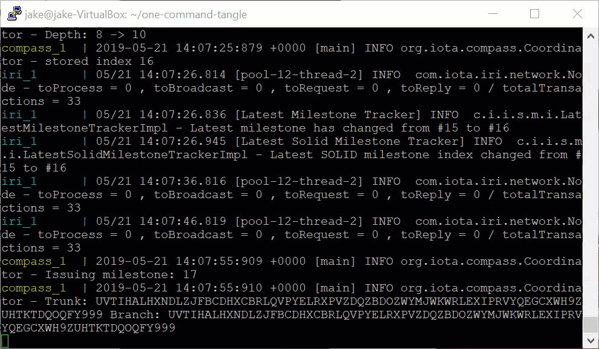
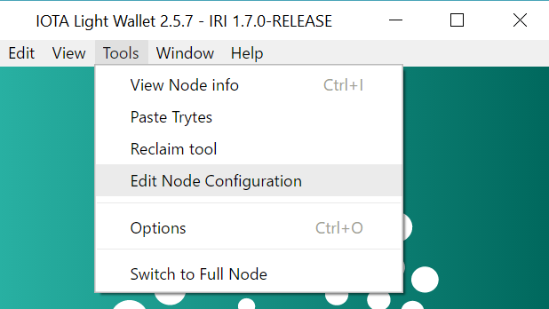
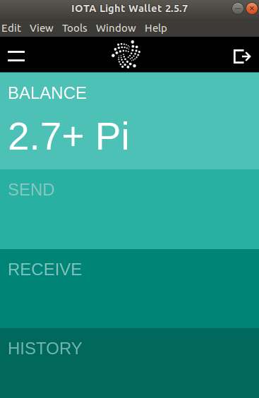

# ワンコマンドプライベートテストタングル
<!-- # One-command private test Tangle -->

**このアプリケーションを使用すると、単一の[Docker](https://www.docker.com/why-docker)コマンドを使用して独自のIOTAネットワークを設定できます。このコマンドを実行すると、独自のIOTAテストネットワークと[2.7Pi](root://iota-basics/0.1/references/units-of-iota-tokens.md)（最大量）のテストIOTAトークンを使用できます。いかなる金銭的価値も危険にさらすことなく自分のアイデアやアプリケーションをテストするためにこのアプリケーションを使うことができます。**
<!-- **This application allows you to set up your own IOTA network by using a single [Docker](https://www.docker.com/why-docker) command. When you run this command, you'll have your own IOTA test network and [2.7Pi](root://iota-basics/0.1/references/units-of-iota-tokens.md) (the maximum amount) of test IOTA tokens to use. You can use this application to test your ideas and applications without risking any monetary value.** -->

:::info:GitHubにアクセスする
クイックスタートの手順やソースコードを読むには、[GitHubリポジトリ](https://github.com/iota-community/one-command-tangle)にアクセスしてください。
:::
<!-- :::info:Go to GitHub -->
<!-- For quickstart instructions or to read the source code, [go to the GitHub repository](https://github.com/iota-community/one-command-tangle). -->
<!-- ::: -->

:::warning:
このコードはまだベータ開発中です。本番環境ではこのコードを使用しないでください。
:::
<!-- :::warning: -->
<!-- This code still in beta development. Do not use this code in production environments. -->
<!-- ::: -->

## なぜこのアプリケーションを使うのか？
<!-- ## Why use this application? -->

テストを行うために、パブリックネットワークの1つにテストデータを公開したくないかもしれません。代わりに、[IOTA Mainnet](root://getting-started/0.1/references/iota-networks.md#mainnet)と同じテストトークンの総供給量で独自のプライベートネットワークを運営することができます。このようにして、ネットワーク外の誰かがテストデータのトランザクションを見ることなくデータとIOTAトークンを転送するアプリケーションを作成できます。
<!-- For testing, you may not want to publish test data on one of the public networks. Instead, you can run your own private network with the same total supply of test tokens as those in the [IOTA Mainnet](root://getting-started/0.1/references/iota-networks.md#mainnet). This way, you can create applications that transfer data and value without anyone outside of your network seeing those transactions. -->

Mainnet上でアプリケーションを使用する準備が整ったら、アプリケーションをプライベートIRIノードから切断して、Mainnetに接続することができます。
<!-- When you're ready to use your application on the Mainnet, you can disconnect it from your private IRI node and connect it to one on the Mainnet. -->

## 使い方
<!-- ## How it works -->

テストネットワークは、（インターネットに接続されていない）ローカルホスト上で1つの[IRIノード](root://node-software/0.1/iri/introduction/overview.md)と1つの[コンパス](root://compass/0.1/introduction/overview.md)インスタンスを実行します。
<!-- The test network runs one [IRI node](root://node-software/0.1/iri/introduction/overview.md) and an instance of [Compass](root://compass/0.1/introduction/overview.md) on your localhost (not connected to the Internet). -->

IRIノードはトランザクションを受け取り、トランザクションを検証し、そしてユーザーの残高の最新の記録を保持します。
<!-- The IRI node receives transactions, validates them, and keeps an up-to-date record of users' balances. -->

一定の間隔で、コンパスはIRIノードへ他のトランザクションを参照する[マイルストーン](root://the-tangle/0.1/concepts/the-coordinator.md#milestones)と呼ばれるゼロトークントランザクションを送信します。マイルストーンによって参照されるトランザクションはすべて確定済みと見なされます。この時点で、ノードは確定済みトランザクションの影響を受けた残高をすべて更新します。
<!-- At regular intervals, Compass sends the IRI node zero-value transactions called [milestones](root://the-tangle/0.1/concepts/the-coordinator.md#milestones) that reference other transactions. Any transaction that's referenced by a milestone is considered confirmed. At this point, the node updates any balances that were affected by the confirmed transaction. -->

トークンの総供給量は、次のシードの最初のアドレスに格納されています。
```bash
SEED99999999999999999999999999999999999999999999999999999999999999999999999999999
```
<!-- The total supply of tokens are stored on the first address of this seed: `SEED99999999999999999999999999999999999999999999999999999999999999999999999999999`. -->

:::warning:このネットワークをインターネットに公開しないでください
このアプリケーションの目的は、テストIOTAネットワークをすばやく設定できるようにすることです。そのために、このアプリケーションは事前に計算されたマークル木を使用します。その結果、あなた自身のローカルネットワーク上でテストするためだけにこのアプリケーションを使用してください。
:::
<!-- :::warning:Do not expose this network to the Internet -->
<!-- The purpose of this application is to allow you to quickly set up a test IOTA network. To do so, this application uses a pre-calculated Merkle tree. As a result, you should use this application only for testing on your own local network. -->
<!-- ::: -->

## 前提条件
<!-- ## Prerequisites -->

このアプリケーションを使用するには、以下が必要です。
<!-- To use this application, you need the following: -->

* [Docker](https://docs.docker.com/install/linux/docker-ce/ubuntu/)と[Docker Compose](https://docs.docker.com/compose/install/)
<!-- * [Docker and Docker Compose](https://docs.docker.com/compose/install/) -->
* 4GB以上の空きRAM
<!-- * At least 4GB of free RAM -->

## 手順1. アプリケーションを実行する
<!-- ## Step 1. Run the application -->

1. `one-command-trangle`リポジトリをクリーンします。
  <!-- 1. Clone this repository -->

    ```bash
    git clone https://github.com/iota-community/one-command-tangle.git
    ```

2. `one-command-tangle`ディレクトリで、`docker-compose up`コマンドを実行します。
  <!-- 2. In the `one-command-tangle` directory, execute the `docker-compose up` command -->

  :::info:
  Linuxオペレーティングシステムを使用している場合は、このコマンドの前に`sudo`を追加する必要があります。
  :::
  <!-- :::info: -->
  <!-- If you're using a Linux operating system, you may need to add `sudo` before this command. -->
  <!-- ::: -->

  コンソールで、IRIノードが実行されており、コンパスからマイルストーンを受信していることがわかります。
<!--  In the console, you should see that the IRI node is running and receiving milestones from Compass. -->

  

  :::info:
  コンパスは、深さ20の事前にビルドされた（`layer`ディレクトリ内の）[マークル木](root://the-tangle/0.1/concepts/the-coordinator.md#milestones)を使用します。このマークル木は、コンパスが1年以上30秒間隔でマイルストーンを送信するのに十分な大きさです。
  :::
  <!-- :::info: -->
  <!-- Compass uses a pre-built [Merkle tree](root://the-tangle/0.1/concepts/the-coordinator.md#milestones) (in the `layers` directory) with a depth of 20. This Merkle tree is large enough for Compass to send milestones for over a year at 30-second intervals. -->
  <!-- ::: -->

## 手順2. ネットワークと対話する
<!-- ## Step 2. Interact with the network -->

アプリケーションを実行しているときは、アドレス`http://localhost:14265`にあるIRIノードのAPIポートを介してネットワークと対話できます。
<!-- When the application is running, you can interact with the network through the IRI node's API port at the following address http://localhost:14265. -->

[APIエンドポイント](root://node-software/0.1/iri/references/api-reference.md)の一覧を参照してください。
<!-- See a list of [API endpoints](root://node-software/0.1/iri/references/api-reference.md). -->

--------------------
### GetBalances
Node.jsで[JavaScriptクライアントライブラリ](root://client-libraries/0.1/introduction/overview.md)を使用すると、[`getBalances`](root://node-software/0.1/iri/references/api-reference.md#getbalances)エンドポイントを呼び出してシードの合計残高を取得できます。

これまでにIOTAクライアントライブラリを使用したことがない場合は、[このチュートリアル](root://getting-started/0.1/tutorials/send-a-zero-value-transaction-with-nodejs.md)を完了することをお勧めします。

 ```js
 var request = require('request');

 const iota = require('@iota/core');

 Iota = iota.composeAPI({
     provider: 'http://localhost:14265'
 });

 var address = iota.generateAddress('SEED99999999999999999999999999999999999999999999999999999999999999999999999999999',0);

 getBalance(address);

 function getBalance(address) {

     var command = {
     'command': 'getBalances',
     'addresses': [
     address
     ],
     'threshold':100
     }

     var options = {
     url: 'http://localhost:14265',
     method: 'POST',
     headers: {
     'Content-Type': 'application/json',
     'X-IOTA-API-Version': '1',
     'Content-Length': Buffer.byteLength(JSON.stringify(command))
     },
     json: command
     };

     request(options, function (error, response, data) {
         if (!error && response.statusCode == 200) {
         console.log(JSON.stringify(data,null,1));
         }
     });
 }
 ```
---
### レスポンス
```json
{
 "balances": [
  "2779530283277761"
 ],
 "references": [
  "BDZPAONKWQTVCXFFO9GBTJ9GGWPRLITXZ9BMYALTCVWNOLFYPNHFJHPDWICRPGCZWUNDQHV9UDEXGW999"
 ],
 "milestoneIndex": 7,
 "duration": 1
}
```
--------------------

## 手順3. ウォレットからネットワークに接続する
<!-- ## Step 3. Connect to the network through a wallet -->

GUIを介してネットワーク上でトランザクションを送受信する場合は、`http://localhost:14265`で自分のノードに接続して、以下のシードでログインするように[IOTAライトウォレット](https://github.com/iotaledger/wallet/releases)を設定します。
```bash
SEED99999999999999999999999999999999999999999999999999999999999999999999999999999
```
<!-- If you want to send and receive transactions on the network through a user interface, you can configure the [IOTA Light Wallet](https://github.com/iotaledger/wallet/releases) to connect to your node at http://localhost:14265 and log in with your seed: `SEED99999999999999999999999999999999999999999999999999999999999999999999999999999`. -->

1. ノードに接続するには、**Tools** > **Edit Node Configuration**に移動して、ノードのURL`http://localhost:14265`を入力します。
  <!-- 1. To connect to your node, go to **Tools** > **Edit Node Configuration**, and enter the URL of your node (http://localhost:14265) -->

    

2. 完全な残高を見るために**RECEIVE** > **ATTACH TO TANGLE**を行います。
  <!-- 2. Go to **RECEIVE** > **ATTACH TO TANGLE** to see your full balance -->

    

## ネットワークを再起動する
<!-- ## Restart the network -->

ネットワークを再起動したい場合は、**Ctrl + C**キーを押し、`docker-compose.yml`ファイルの`-bootstrap`フラグを削除してからコマンドを再実行します。
<!-- If you want to restart the network, press **Ctrl + C**, and remove the `-bootstrap` flag from the `docker-compose.yml` file before running the command again. -->

## 次のステップ
<!-- ## Next steps -->

ご自身のネットワークで他のツールやユーティリティを使ってみてください。
<!-- Use one of our other tools and utilities with your new network. -->

あなたのネットワークを通して暗号化されたメッセージを送るために[MAMウォッチャー](../mam-watcher/overview.md)を試してみてください。
<!-- Try out the [MAM watcher](../mam-watcher/overview.md) to send encrypted messages through your network. -->

:::info:
`sender.js`ファイルと`fetcher.js`ファイルの両方で、ノードのURL`https://nodes.devnet.thetangle.org:443`を必ず自分のノードのURL（`http:127.0.0.1:14265`）に変更してください。
:::
<!-- :::info: -->
<!-- Make sure to change the node URL `https://nodes.devnet.thetangle.org:443` to the URL of your node (`http:127.0.0.1:14265`) in both the `sender.js` file and the `fetcher.js` file. -->
<!-- ::: -->
