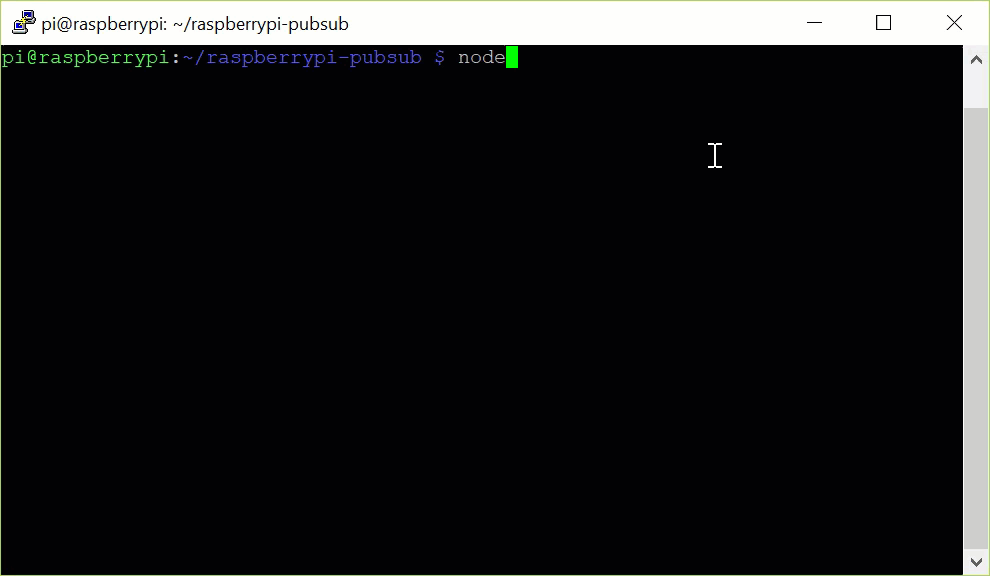
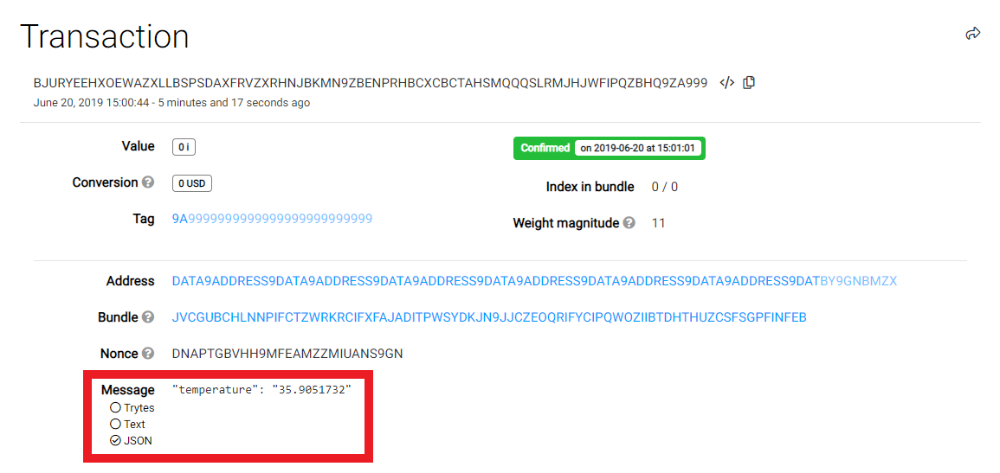

# Raspberry Pi センサーデータパブリッシャー
<!-- # Raspberry Pi sensor data publisher -->

**デバイスは，多くの場合，データを処理してデータを共有する必要があります．このガイドでは，Raspberry Pi を使用して，リアルタイムの温度データ（摂氏での現在の温度）を毎分デブネットタングルに送信します．次に，デブネットノードでイベントストリーム（ZMQ）をサブスクライブするので，データを受信するタイミングがわかります．**
<!-- **Devices often need to share data so they can process and act on it. In this guide, you use a Raspberry Pi to send real-time temperature data (the current temperature in Celsius) to the Devnet Tangle every minute. Then, you subscribe to the event stream (ZMQ) on a Devnet node so know when it receives the data.** -->

:::info:GitHub にアクセスする
クイックスタートの手順やソースコードを読むには，[GitHub リポジトリ](https://github.com/iota-community/raspberrypi-pubsub)にアクセスしてください．
:::
<!-- :::info:Go to GitHub -->
<!-- For quickstart instructions or to read the source code, [go to the GitHub repository](https://github.com/iota-community/raspberrypi-pubsub). -->
<!-- ::: -->

:::warning:
このアプリケーションは，まだベータ開発中の [IOTA JavaScript クライアントライブラリ](root://client-libraries/0.1/introduction/overview.md)を使用します．本番環境ではこのコードを使用しないでください．
:::
<!-- :::warning: -->
<!-- This application uses the [IOTA JavaScript client library](root://client-libraries/0.1/introduction/overview.md), which is still in beta development. Do not use this code in production environments. -->
<!-- ::: -->

## パブリッシャーの仕組み
<!-- ## How the publisher works -->

このアプリケーションは以下のファイルを使用します．
<!-- This application uses the following files: -->

- `index.js`：データを収集し，バンドルを作成して，トランザクションを送信します．
<!-- - `index.js`: Collects data, constructs the bundle, and sends the transaction. -->
- `temp.py`：[`envirophat` ライブラリ](https://learn.pimoroni.com/tutorial/sandyj/getting-started-with-enviro-phat)を使用してセンサーから現在の温度を読み取ります．
<!-- - `temp.py`: Uses the [`envirophat` library](https://learn.pimoroni.com/tutorial/sandyj/getting-started-with-enviro-phat) to read the current temperature from the sensor. -->
- `fetchTemp.js`：現在の温度を取得するために `tempy.py` ファイルを実行します．
<!-- - `fetchTemp.js`: Executes the `tempy.py` file to get the current temperature. -->
- `zmqWatcher.js`：アドレスの確定を監視するために，デブネットノードの [ZMQ `address` イベント](root://node-software/0.1/iri/references/zmq-events.md#address)をサブスクライブします．
<!-- - `zmqWatcher.js`: Subscribes to a Devnet node's [ZMQ `address` event](root://node-software/0.1/iri/references/zmq-events.md#address) to monitor the address for confirmation. -->

`fetchTemp.js` ファイルと `zmqWatcher.js` ファイルはモジュールとしてエクスポートされ，`index.js` ファイルから呼び出されます．
<!-- The `fetchTemp.js` and `zmqWatcher.js` files are exported as modules and called from the `index.js` file. -->

## 前提条件
<!-- ## Prerequisites -->

このアプリケーションを使用するには，以下が必要です．
<!-- To use this application, you need the following: -->

- ラズベリーパイに接続された [Enviro Phat センサーボード](https://shop.pimoroni.com/products/enviro-phat)
<!-- - [An Enviro Phat sensor board](https://shop.pimoroni.com/products/enviro-phat) connected to a Raspberry Pi -->

- [LTS バージョンまたは最新バージョンの Node.js と NPM](https://nodejs.org/en/download/)
<!-- - [An LTS version or the latest version of Node.js and NPM](https://nodejs.org/en/download/) -->

- [Git](https://git-scm.com/download/linux)

ラズベリーパイの設定をするには，[これらの手順](https://medium.com/@lambtho/raspberry-setup-dcb23e8ba88)に従ってください．
<!-- For help setting up a Raspberry Pi, you can follow [these instructions](https://medium.com/@lambtho/raspberry-setup-dcb23e8ba88). -->

Enviro Phat の設定をするには，[このはんだ付けガイド](https://learn.pimoroni.com/tutorial/sandyj/soldering-phats)と[この入門ガイド](https://learn.pimoroni.com/tutorial/sandyj/getting-started-with-enviro-phat)に従ってください．
<!-- For help setting up the Enviro Phat, you can follow [this soldering guide](https://learn.pimoroni.com/tutorial/sandyj/soldering-phats) and [this getting started guide](https://learn.pimoroni.com/tutorial/sandyj/getting-started-with-enviro-phat). -->

## アプリケーションを実行する
<!-- ## Run the application -->

詳細を見始める前に，アプリケーションを実行して，データの送信をどれだけ早く開始できるかを確認します．
<!-- Before we start looking at the details, run the application so you can see how quickly you can start sending data. -->

1. `raspberrypi-pubsub` リポジトリをクローンします．
  <!-- 1. Clone this repository -->

  ```bash
  git clone https://github.com/iota-community/raspberrypi-pubsub
  ```

2. `raspberrypi-pubsub` ディレクトリに移動します．
  <!-- 2. Change into the `raspberrypi-pubsub` directory -->

  ```bash
  cd raspberrypi-pubsub
  ```

3. 依存関係をインストールします．
  <!-- 3. Install the dependencies -->

  ```bash
  npm install
  ```

4. コードを実行します．
  <!-- 4. Run the code -->

  ```bash
  node index.js
  ```

:::success:おめでとうございます:tada:
コンソールでは，現在の摂氏気温がトランザクションとしてデブネット上のノードに送信されていることがわかります．

1分程度待つと，トランザクションが確定されたときに ZMQ イベントトリガーが表示されます．
:::
<!-- :::success:Congratulations! :tada: -->
<!-- In the console, you should see that the current temperature in Celcius is sent as a transaction to a node on the Devnet. -->
<!--  -->
<!-- If you wait for around a minute, you should see the ZMQ event trigger when the transaction is confirmed. -->
<!-- ::: -->



## データを確認する
<!-- ## Check your data -->

IOTA の最も重要な利点の1つは，タングルのトランザクションがイミュータブルであるということです．
<!-- One of the most important benefits of IOTA is that transactions on the Tangle are immutable (can't be changed). -->

トランザクションがデブネットタングル上にあることを確認したい場合は，`hash` フィールドの値をコピーして[デブネットエクスプローラ](https://devnet.thetangle.org/)の検索バーに貼り付けます．
<!-- If you want to check that your transaction is on the Devnet Tangle, you can copy the value of the `hash` field and paste it into the search bar of the [Devnet explorer](https://devnet.thetangle.org/). -->

このページでは，`message` フィールドを確認し，センサーがコンソールに返した値と比較することで，データが変更されていないことを確認できます．
<!-- On this page, you can check that your data is unchanged by checking the `message` field and comparing it to the value that your sensor returned in the console. -->



## 次のステップ
<!-- ## Next steps -->

このチュートリアルを読んだ後は，このアプリケーションを適応させて，必要なあらゆる種類のデバイスからあらゆる種類のデータを送信できるようになります．
<!-- After going through this tutorial, you know enough to adapt this application to send any kind of data from any kind of device that you want. -->

[データを暗号化し，MAM（マスク認証メッセージング）チャネルを介して送信する](../mam-watcher/overview.md)．
<!-- [Start encrypting your data and sending it through a MAM (masked authenticated messaging) channel](../mam-watcher/overview.md). -->

[IOTA クライアントライブラリを知り](root://client-libraries/0.1/introduction/overview.md)，他にできることを調べる．
<!-- [Get to know the IOTA client libraries](root://client-libraries/0.1/introduction/overview.md) and find out what else you can do. -->
