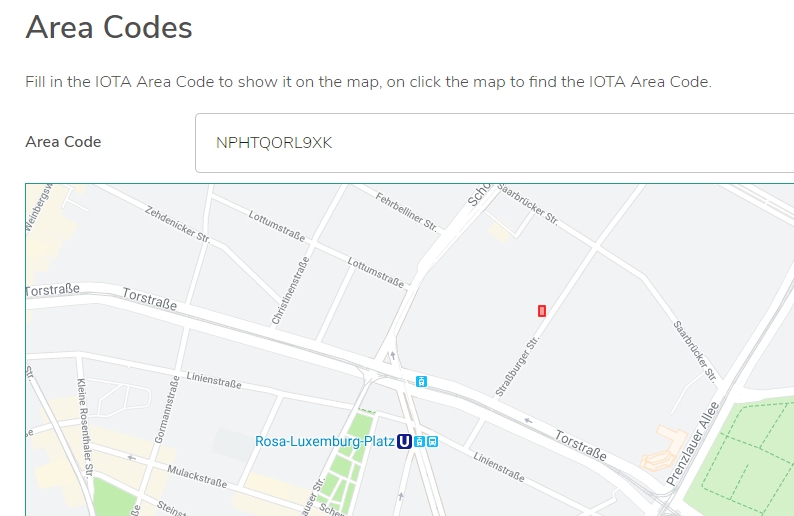

# トランザクションに地理的位置のタグを付ける
<!-- # Tag a transaction with a geo-location -->

**IOTAエリアコード（IAC）は、IOTAトランザクションを地理的位置でタグ付けするための標準規格として提案されています。IAC APIを使用して、緯度と経度から独自のIACにエンコードし、IACをトランザクションの`tag`フィールドに追加することができます。**
<!-- **IOTA area codes (IAC) are a proposed standard for tagging IOTA transactions with a geo-location, which allows you to be filter them by location. You can use the IAC API to encode your own IAC from a latitude and longitude, then add it to the `tag` field of a transaction.** -->

この例では、IOTA JavaScriptライブラリを使用して、IACでタグ付けされたゼロトークントランザクションを作成します。次に、そのトランザクションをDevnetに送信し、タングルエクスプローラを使用してトランザクションがタングルに添付されていることを確認します。
<!-- In this example, we use the IOTA JavaScript library to create a zero-value transaction that's tagged with an IAC. Then, we send it to the Devnet, and use a Tangle explorer to check that the transaction is attached to the Tangle. -->

## 前提条件
<!-- ## Prerequisites -->

このチュートリアルを完了するには、次のものが必要です。
<!-- To complete this tutorial, you need the following: -->

* Node.js 8、またはNode.js 10以上。[最新のLTS](https://nodejs.org/en/download/)をお勧めします。
<!-- * Node.js 8, or Node.js 10 or higher. We recommend the [latest LTS](https://nodejs.org/en/download/). -->
* [Visual Studio Code](https://code.visualstudio.com/Download)などのコードエディタ
<!-- * A code editor such as [Visual Studio Code](https://code.visualstudio.com/Download) -->
* コマンドプロンプトへのアクセス
<!-- * Access to a command prompt -->
* インターネット接続
<!-- * An Internet connection -->
* [`@iota/core`](root://getting-started/0.1/tutorials/get-started.md)ライブラリと[`@iota/area-codes`](https://github.com/iotaledger/iota-area-codes)ライブラリ
<!-- * The [`@iota/core`](root://getting-started/0.1/tutorials/get-started.md) and [`@iota/area-codes`](https://github.com/iotaledger/iota-area-codes) libraries -->

:::info:
これまでにIOTAクライアントライブラリを使用したことがない場合は、[このチュートリアル](root://getting-started/0.1/tutorials/send-a-zero-value-transaction-with-nodejs.md)を完了することをお勧めします。
:::
<!-- :::info: -->
<!-- If you've never used the IOTA client libraries before, we recommend completing [this tutorial](root://getting-started/0.1/tutorials/send-a-zero-value-transaction-with-nodejs.md) -->
<!-- ::: -->

## 手順1. 座標を探す
<!-- ## Step 1. Find some coordinates -->

地理的位置をIACにエンコードするには、緯度と経度の座標が必要です。この例では、Googleマップを使って座標を見つけます。
<!-- To encode a geo-location into an IAC, you need some latitude and longitude coordinates. In this example, we use Google Maps to find the coordinates. -->

1. [Googleマップ](https://www.google.co.jp/maps)を開いて住所を検索します。
  <!-- 1. [Open Google Maps](https://www.google.co.uk/maps) and search for an address -->

2. ロケーションピンの近くを右クリックし、**この場所について**をクリックします。
  <!-- 2. Right click near the location pin and click **What's here?** -->

3. 座標をコピーします。
  <!-- 3. Copy the coordinates -->

    

    ここでは、IOTA財団の住所を検索しました。
    <!-- Here, we searched for the address of the IOTA Foundation -->

## 手順2. 座標でトランザクションにタグを付ける
<!-- ## Step 2. Tag a transaction with the coordinates -->

トランザクションをいくつかの座標でタグ付けするには、座標をIACとしてエンコードする必要があります。
<!-- To tag a transaction with some coordinates, you need to encode them as an IAC. -->

そのために、[IAC API](https://github.com/iotaledger/iota-area-codes/blob/master/docs/api.md)を使用できます。
<!-- To do so, you can use the [IAC API](https://github.com/iotaledger/iota-area-codes/blob/master/docs/api.md). -->

この例では、[Devnet](root://getting-started/0.1/references/iota-networks.md#devnet)上のトランザクションにタグを付けます。Devnetは、トークンが無料であること以外はMainnetとほぼ同じです。Devnetに送信したトランザクションは、Mainnetのような他のネットワークには存在しません。
<!-- In this example, we tag a transaction on the [Devnet](root://getting-started/0.1/references/iota-networks.md#devnet). The Devnet is similar to the Mainnet, except the tokens are free. Any transactions that you send to the Devnet do not exist on other networks such as the Mainnet. -->

1. IOTAクライアントライブラリを必要とします。
  <!-- 1. Require the IOTA client libraries -->

    ```js
    const Iota = require('@iota/core');
    const iotaAreaCodes = require('@iota/area-codes');
    ```

2. IOTAオブジェクトのインスタンスを作成し、`provider`フィールドを使用してDevnetノードに接続します。
  <!-- 2. Create an instance of the IOTA object and use the `provider` field to connect to a Devnet node -->

    ```js
    const iota = Iota.composeAPI({
        provider: 'https://nodes.devnet.iota.org:443'
    });
    ```

3. シードを保存するための変数を作成します。
  <!-- 3. Create a variable to store your seed -->

    ```js
    const seed =
    'PUEOTSEITFEVEWCWBTSIZM9NKRGJEIMXTULBACGFRQK9IMGICLBKW9TTEVSDQMGWKBXPVCBMMCXWMNPDX';
    ```

    :::info:
    このシードはIOTAトークンを持つアドレスを含む必要はありません。81文字未満のシードを入力した場合、ライブラリは末尾に9を追加して81文字にします。
    :::
    <!-- :::info: -->
    <!-- This seed doesn't have to contain any addresses with IOTA tokens. If you enter a seed that consists of less than 81 characters, the library will append 9s to the end of it to make 81 characters. -->
    <!-- ::: -->

4. 座標をIACにエンコードします。
  <!-- 4. Encode the coordinates into an IAC -->

    ```js
    var iac = iotaAreaCodes.encode(52.529510, 13.413018, iotaAreaCodes.CodePrecision.EXTRA);
    ```

    :::info:
    ここでは、より小さなエリアを定義するために[特別な精度](https://github.com/iotaledger/iota-area-codes/blob/master/docs/api.md#CodePrecision)を使います。
    :::
    <!-- :::info: -->
    <!-- Here, we use [extra precision](https://github.com/iotaledger/iota-area-codes/blob/master/docs/api.md#CodePrecision) to define a smaller area. -->
    <!-- ::: -->

5. ゼロトークントランザクションの`tag`フィールドにIACを追加してバンドルで送信します。
  <!-- 5. Add the IAC to the `tag` field of a zero-value transaction and send it in a bundle -->

    ```js
    const transfers = [
    {
        value: 0,
        address: "HELLOWORLDHELLOWORLDHELLOWORLDHELLOWORLDHELLOWORLDHELLOWORLDHELLOWORLDHELLOWORLDD",
        tag: iac
    }
    ];

    iota.prepareTransfers(seed, transfers)
    .then(trytes => {
        return iota.sendTrytes(trytes, 3/*depth*/, 9/*MWM*/)
    })
    .then(bundle => {
        console.log("Bundle sent with the tagged transaction");
    })
    .catch(err => {
        // Catch any errors
        console.log(err);
    });
    ```

6. 同じIACでタグ付けされているトランザクションを見つけて、IACを座標にデコードします。
  <!-- 6. Find any transactions that are tagged with the same IAC and decode it back into coordinates -->

    ```js
    var locations =[];

    iota.findTransactions({tags:[iac]})
    .then(trytes => {
        iota.getTransactionObjects(trytes)
        .then(array => {
            for(i=0; i<array.length; i++){
                let areaCode = iotaAreaCodes.extract(array[i].tag);
                let data = iotaAreaCodes.decode(areaCode);
                locations.push({"lat": data.latitude, "lng":data.longitude});
            }
            console.log(`${locations[i]} transactions found with the ${iac} tag`)
        })
    })
    .catch(err => {
        // Catch any errors
        console.log(err);
    });
    ```

:::success:おめでとうございます:tada:
IAC APIを使用してトランザクションに地理的位置をタグ付けし、同じタグを持つトランザクションをすべて見つけました。
:::
<!-- :::success:Congratulations :tada: -->
<!-- You've just used the IAC API to tag a transaction with a geo-location, and find any transactions with the same tag. -->
<!-- ::: -->

## コードを実行する
<!-- ## Run the code -->

このガイドのサンプルコードを実行してWebブラウザに結果を表示するには、緑色のボタンをクリックします。
<!-- Click the green button to run the sample code in this guide and see the results in the web browser. -->

<iframe height="600px" width="100%" src="https://repl.it/@jake91/IOTA-area-codes?lite=true" scrolling="no" frameborder="no" allowtransparency="true" allowfullscreen="true" sandbox="allow-forms allow-pointer-lock allow-popups allow-same-origin allow-scripts allow-modals"></iframe>

## 次のステップ
<!-- ## Next steps -->

[IACファインダユーティリティ](https://utils.iota.org/area-codes)を使用して、新しいIACの場所を見つける。
<!-- Use the [IAC finder utility](https://utils.iota.org/area-codes) to find the location of a new IAC. -->



:::info:
[Devnetタングルエクスプローラ](https://devnet.thetangle.org/)はIAC APIを使用してIACをデコードします。
トランザクションを検索して下にスクロールするだけです。
:::
<!-- :::info: -->
<!-- The [Devnet Tangle explorer](https://devnet.thetangle.org/) also uses the IAC API to decode IACs for you. -->
<!-- Just search for your transaction and scroll down. -->
<!-- ::: -->

エリアを拡大するためにIACの右側からトライトを削除する。
<!-- Try removing trytes from the right of an IAC to expand the area. -->
