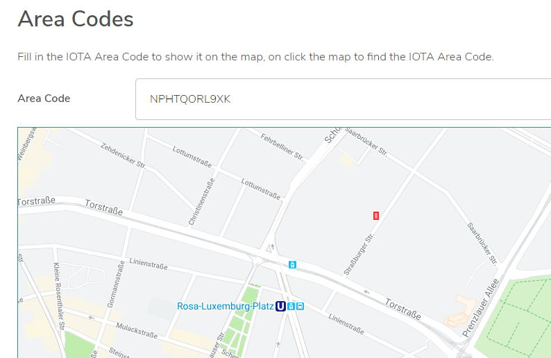

# IOTA エリアコード
<!-- # IOTA area codes -->

**IOTA エリアコード（IAC）は，IOTA トランザクションを地理的位置でタグ付けするための標準規格として提案されています．**
<!-- **IOTA area codes (IAC) are a proposed standard for tagging IOTA transactions with a geo-location, which allows you to be filter them by location.** -->

タングル上のトランザクションには，サービス広告やセンサー情報など，特定の分野に固有の情報が含まれていることがあります．
<!-- Transactions on the Tangle can sometimes contain information that's specific to a certain area such as service advertisements or sensor information. -->

IAC を使用することで，トランザクションにエリアをタグ付けし，他の人が同じようなIACを持つトランザクションを照会することによってトランザクションを見つけることができます．
<!-- By using IACs, you can tag a transaction with an area and allow someone else to find it by querying for transactions with a similar IAC. -->

## IACについて
<!-- ## About IACs -->

IAC は [Open Location Code](https://en.wikipedia.org/wiki/Open_Location_Code)（OLC）のクローンです．IAC には，[トライエンコーディング](root://getting-started/0.1/introduction/ternary.md)との互換性を持たせるためのいくつかの小さな変更が含まれています．
<!-- IACs are a clone of [Open Location Codes](https://en.wikipedia.org/wiki/Open_Location_Code) (OLC), which includes some minor changes to make them compatible with [tryte encoding](root://getting-started/0.1/introduction/ternary.md): -->

- コードを構成する数字と文字は_トライト_と呼ばれ，`FGHJKLMNOPQRSTUVXWYZ` が含まれます．
<!-- - The numbers and letters that make up a code are called _trytes_, which include the following: `FGHJKLMNOPQRSTUVXWYZ` -->
- IAC の8番目のトライトの後に来る区切り文字は，`+` ではなく `9` です．
<!-- - The separator that comes after the eighth tryte in an IAC is a `9` instead of a `+` -->
- IAC をパディングするために `0` の代わりに `A` トライトが使用されます．
<!-- - The `A` tryte is used for padding IACs instead of a `0` -->

## IAC を読む
<!-- ## Reading IACs -->

IAC は，通常の緯度と経度の形式の座標よりも短くて使いやすい形式で場所をエンコードする方法です．
<!-- IACs are a way of encoding locations into a form that is shorter and easier to use than coordinates in the usual form of latitude and longitude. -->

たとえば，IOTA 財団の住所の緯度と経度の座標は`52.529510`，`13.413018`です．これらの座標の IAC は，`NPHTQORL9XK` です．
<!-- For example, the latitude and longitude coordinates of the address of the IOTA Foundation are 52.529510, 13.413018. The IAC for these coordinates is : `NPHTQORL9XK`. -->

IAC はトライトで構成されているため，IAC をトランザクションの `tag` フィールドに簡単に追加して場所をタグ付けすることができます．
<!-- Because an IAC consists of trytes, you can easily add them to the `tag` field of a transaction to tag it with a location. -->

IAC は以下の3つの部分で構成されています（区切り文字 `9` を除く）．
<!-- An IAC consists of three parts (excluding the `9` separator): -->

- 最初の4つのトライトはエリアコードで，およそ`100 km x 100 km`の地域を表しています．たとえば，`NPHT`はベルリンとポツダムの一部を含む地域を表します．
<!-- - The first four trytes are the area code, describing a region of roughly 100 km x 100 km. For example, `NPHT` represents an area that includes Berlin and parts of Potsdam -->
- 次の6つのトライトはローカルコードで，`14 m x 14 m`という小さな領域を表しています．
<!-- - The next six trytes are the local code, describing an area as small as 14 m x 14 m -->
- 最後の2つのトライトは特別な精度のためのものです．
<!-- - The final two trytes are for extra precision -->

| **IAC の長さ（トライト）** | **おおよそのエリア** |
| :------------------------ | :------------------- |
| 2 | 2200 km |
| 4 | 110 km |
| 6 | 5.5 km |
| 8 | 275 m |
| 10 | 14 m |
| 11 | 3.5 m |
| 12 | 3 m未満 |

<!-- | **IAC length (trytes)**   | **Approximate area**| -->
<!-- |:--------------|:---------------------| -->
<!-- |2       |2200 km | -->
<!-- |4      | 110 km | -->
<!-- |6          | 5.5 km     | -->
<!-- |8            | 275 m        | -->
<!-- |10  | 14 m              | -->
<!-- |11    |3.5 m | -->
<!-- |12 |Less than 3 m| -->

:::info:
IAC の詳細については，[ブログの投稿](https://blog.iota.org/iota-area-codes-a-proposal-to-geo-tag-iota-transactions-d3c457d1df1b)をご覧ください．
:::
<!-- :::info: -->
<!-- For more information about IACs, [read our blog post](https://blog.iota.org/iota-area-codes-a-proposal-to-geo-tag-iota-transactions-d3c457d1df1b). -->
<!-- ::: -->

## トランザクションに地理的位置のタグを付ける
<!-- ## Tag a transaction with a geo-location -->

**IAC API を使用して，緯度と経度から自分自身の IAC にエンコードし，IAC をトランザクションの `tag` フィールドに追加することができます．**
<!-- **You can use the IAC API to encode your own IAC from a latitude and longitude, then add it to the `tag` field of a transaction.** -->

この例では，IOTA JavaScript ライブラリを使用して，IAC でタグ付けされたゼロトークントランザクションを作成します．次に，そのトランザクションをデブネットに送信し，タングルエクスプローラーを使用してトランザクションがタングルに添付されていることを確認します．
<!-- In this example, we use the IOTA JavaScript library to create a zero-value transaction that's tagged with an IAC. Then, we send it to the Devnet, and use a Tangle explorer to check that the transaction is attached to the Tangle. -->

### 前提条件
<!-- ### Prerequisites -->

このガイドを完了するには，次のものが必要です．
<!-- To complete this guide, you need the following: -->

- Node.js 8，または Node.js 10以上．[最新の LTS](https://nodejs.org/en/download/) をお勧めします．
<!-- - Node.js 8, or Node.js 10 or higher. We recommend the [latest LTS](https://nodejs.org/en/download/). -->
- [Visual Studio Code](https://code.visualstudio.com/Download) などのコードエディタ
<!-- - A code editor such as [Visual Studio Code](https://code.visualstudio.com/Download) -->
- コマンドラインインターフェイスへのアクセス
<!-- - Access to a command-line interface -->
- `@iota/core` パッケージと `@iota/area-codes` パッケージ
<!-- - The `@iota/core` and `@iota/area-codes` packages -->

### パッケージ
<!-- ### Packages -->

このガイドを完了するには，次のパッケージをインストールする必要があります．
<!-- To complete this guide, you need to install the following packages: -->

--------------------
### npm
```bash
npm install @iota/core @iota/area-codes
```
---
### Yarn
```bash
yarn add @iota/core @iota/area-codes
```
--------------------

### 手順1. 座標を探す
<!-- ### Step 1. Find some coordinates -->

地理的位置を IAC にエンコードするには，緯度と経度の座標が必要です．この例では，Google マップを使って座標を見つけます．
<!-- To encode a geo-location into an IAC, you need some latitude and longitude coordinates. In this example, we use Google Maps to find the coordinates. -->

1. [Google マップ](https://www.google.co.jp/maps)を開いて住所を検索します．
  <!-- 1. [Open Google Maps](https://www.google.co.uk/maps) and search for an address -->

2. ロケーションピンの近くを右クリックし，**この場所について**をクリックします．
  <!-- 2. Right click near the location pin and click **What's here?** -->

3. 座標をコピーします．
  <!-- 3. Copy the coordinates -->

    

    ここでは，IOTA 財団の住所を検索しました．
    <!-- Here, we searched for the address of the IOTA Foundation -->

### 手順2. 座標でトランザクションにタグを付ける
<!-- ### Step 2. Tag a transaction with the coordinates -->

トランザクションをいくつかの座標でタグ付けするには，座標を IAC としてエンコードする必要があります．
<!-- To tag a transaction with some coordinates, you need to encode them as an IAC. -->

この例では，[IAC API](https://github.com/iotaledger/iota-area-codes/blob/master/docs/api.md) を使用して座標から IAC を作成し，トランザクションの `tag` フィールドに IACを 追加して[デブネット](root://getting-started/0.1/network/iota-networks.md#devnet)に送信します．デブネットは，トークンが無料であること以外は，メインネットほとんど同じです．デブネットに送信するトランザクションは，メインネットなどの他のネットワークには存在しません．
<!-- In this example, we use the [IAC API](https://github.com/iotaledger/iota-area-codes/blob/master/docs/api.md) to create an IAC from coordinates, then we add the IAC to the `tag` field of a transaction and send it to the [Devnet](root://getting-started/0.1/network/iota-networks.md#devnet). The Devnet is similar to the Mainnet, except the tokens are free. Any transactions that you send to the Devnet do not exist on other networks such as the Mainnet. -->

1. IOTA クライアントライブラリを `require` します．
  <!-- 1. Require the IOTA client libraries -->

    ```js
    const Iota = require('@iota/core');
    const iotaAreaCodes = require('@iota/area-codes');
    ```

2. IOTA オブジェクトのインスタンスを作成し，`provider` フィールドを使用してデブネットノードに接続します．
  <!-- 2. Create an instance of the IOTA object and use the `provider` field to connect to a Devnet node -->

    ```js
    const iota = Iota.composeAPI({
        provider: 'https://nodes.devnet.iota.org:443'
    });
    ```

3. シードを保存するための変数を作成します．
  <!-- 3. Create a variable to store your seed -->

    ```js
    const seed =
    'PUEOTSEITFEVEWCWBTSIZM9NKRGJEIMXTULBACGFRQK9IMGICLBKW9TTEVSDQMGWKBXPVCBMMCXWMNPDX';
    ```

    :::info:
    このシードは IOTA トークンを持つアドレスを含む必要はありません．81文字未満のシードを入力した場合，ライブラリは末尾に9を追加して81文字にします．
    :::
    <!-- :::info: -->
    <!-- This seed doesn't have to contain any addresses with IOTA tokens. If you enter a seed that consists of less than 81 characters, the library will append 9s to the end of it to make 81 characters. -->
    <!-- ::: -->

4. 座標を IAC にエンコードします．
  <!-- 4. Encode the coordinates into an IAC -->

    ```js
    var iac = iotaAreaCodes.encode(52.529510, 13.413018, iotaAreaCodes.CodePrecision.EXTRA);
    ```

    :::info:
    ここでは，より小さなエリアを定義するために[特別な精度](https://github.com/iotaledger/iota-area-codes/blob/master/docs/api.md#CodePrecision)を使います．
    :::
    <!-- :::info: -->
    <!-- Here, we use [extra precision](https://github.com/iotaledger/iota-area-codes/blob/master/docs/api.md#CodePrecision) to define a smaller area. -->
    <!-- ::: -->

5. ゼロトークントランザクションの `tag` フィールドに IAC を追加してバンドルで送信します．
  <!-- 5. Add the IAC to the `tag` field of a zero-value transaction and send it in a bundle -->

    ```js
    const transfers = [
    {
        value: 0,
        address: "HELLOWORLDHELLOWORLDHELLOWORLDHELLOWORLDHELLOWORLDHELLOWORLDHELLOWORLDHELLOWORLDD",
        tag: iac
    }
    ];

    iota.prepareTransfers(seed, transfers)
    .then(trytes => {
        return iota.sendTrytes(trytes, 3/*depth*/, 9/*MWM*/)
    })
    .then(bundle => {
        console.log("Bundle sent with the tagged transaction");
    })
    .catch(err => {
        // エラーを処理します
        console.log(err);
    });
    ```

6. 同じ IAC でタグ付けされているトランザクションを見つけて，IAC を座標にデコードします．
  <!-- 6. Find any transactions that are tagged with the same IAC and decode it back into coordinates -->

    ```js
    var locations =[];

    iota.findTransactions({tags:[iac]})
    .then(trytes => {
        iota.getTransactionObjects(trytes)
        .then(array => {
            for(i=0; i<array.length; i++){
                let areaCode = iotaAreaCodes.extract(array[i].tag);
                let data = iotaAreaCodes.decode(areaCode);
                locations.push({"lat": data.latitude, "lng":data.longitude});
            }
            console.log(`${locations[i]} transactions found with the ${iac} tag`)
        })
    })
    .catch(err => {
        // エラーを処理します
        console.log(err);
    });
    ```

:::success:おめでとうございます:tada:
IAC API を使用してトランザクションに地理的位置をタグ付けし，同じタグを持つトランザクションをすべて見つけました．
:::
<!-- :::success:Congratulations :tada: -->
<!-- You've just used the IAC API to tag a transaction with a geo-location, and find any transactions with the same tag. -->
<!-- ::: -->

### コードを実行する
<!-- ### Run the code -->

このガイドのサンプルコードを実行して Web ブラウザに結果を表示するには，緑色のボタンをクリックします．
<!-- Click the green button to run the sample code in this guide and see the results in the web browser. -->

<iframe height="600px" width="100%" src="https://repl.it/@jake91/IOTA-area-codes?lite=true" scrolling="no" frameborder="no" allowtransparency="true" allowfullscreen="true" sandbox="allow-forms allow-pointer-lock allow-popups allow-same-origin allow-scripts allow-modals"></iframe>

次のコマンドを使用して，自分自身のデバイスでサンプルコードを実行することもできます．
<!-- You can also run the sample code on your own device by using the following command -->

```bash
node index.js
```

次のようなものが表示されるはずです．
<!-- You should see something like the following: -->

```bash
IOTA Area Code NPHTQORL9XKF
index.js:15
Object {lat: 52.52951250000001, lng: 13.413015624999982}
index.js:51
Object {lat: 52.52951250000001, lng: 13.413015624999982}
index.js:51
Object {lat: 52.52951250000001, lng: 13.413015624999982}
index.js:51
Object {lat: 52.52951250000001, lng: 13.413015624999982}
index.js:51
Object {lat: 52.52951250000001, lng: 13.413015624999982}
index.js:51
Object {lat: 52.52951250000001, lng: 13.413015624999982}
index.js:51
Object {lat: 52.52951250000001, lng: 13.413015624999982}
Bundle sent with tagged transaction
```

## 次のステップ
<!-- ## Next steps -->

[IAC ファインダーユーティリティ](https://utils.iota.org/area-codes)を使用して，新しい IAC の場所を見つける．
<!-- Use the [IAC finder utility](https://utils.iota.org/area-codes) to find the location of a new IAC. -->



:::info:
[デブネットタングルエクスプローラー](https://devnet.thetangle.org/)は IAC API を使用して IAC をデコードします．
トランザクションを検索して下にスクロールするだけです．
:::
<!-- :::info: -->
<!-- The [Devnet Tangle explorer](https://devnet.thetangle.org/) also uses the IAC API to decode IACs for you. -->
<!-- Just search for your transaction and scroll down. -->
<!-- ::: -->

エリアを拡大するために IAC の右側からトライトを削除する．
<!-- Try removing trytes from the right of an IAC to expand the area. -->
