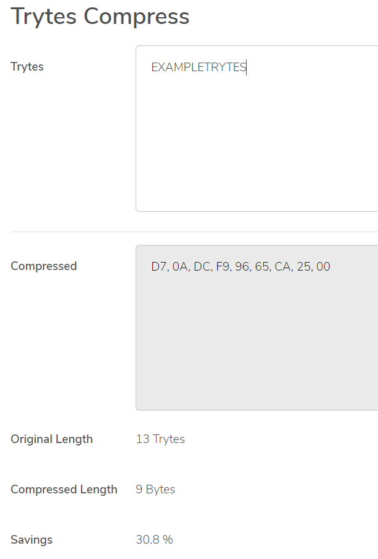

# トライトコンプレッサー概要
<!-- # Trytes compressor overview -->

**トランザクションのバンドルをノードに送信すると、送信したトランザクションがネットワークの残りの部分に届かない場合があり、トランザクションが確定されないことがあります。たとえば、ノードは、トランザクションを隣接ノードに転送する前にオフラインになる場合があります。そのため、後でトランザクションを再ブロードキャストまたは再添付できるように、トランザクションのトライトを保存することをお勧めします。トランザクショントライトをより小さいメモリスペースに保存するには、トライトコンプレッサーツールを使用して、トライトをバイトに圧縮します。**
<!-- **When you send a bundle of transactions to a node, sometimes those transactions don't reach the rest of the network, so they will never be confirmed. For example, a node may go offline before it can forward your transactions to its neighbors. As a result, we recommend that you store the transaction trytes so that you can later rebroadcast or reattach them. To store transaction trytes in a smaller memory space, use the trytes compressor tool to compress the trytes into bytes.** -->

トライトを圧縮するアルゴリズムは、連長圧縮と静的ハフマン木に基づくハフマン符号化の組み合わせを使用して、トライトが占有するメモリ領域の量を最大75％削減します。
<!-- The algorithm that compresses the trytes uses a combination of run-length encoding and huffman encoding based on a static huffman tree to reduce the amount of memory space that they occupy by up to 75%. -->

このアルゴリズムは、組み込みデバイスで使用できるほど軽量でもあります。
<!-- This algorithm is also lightweight enough to be used by embedded devices. -->

## ゼロトークントランザクションを圧縮して保存する
<!-- ## Compress and store a zero-value transaction -->

この例では、[Devnet](root://getting-started/0.1/references/iota-networks.md#devnet)でトランザクションを作成して送信します。Devnetは、トークンが無料であること以外は、ほとんどMainnetと同じです。Devnetに送信するトランザクションは、Mainnetなどの他のネットワークには存在しません。
<!-- In this example, we create and send a transaction on the [Devnet](root://getting-started/0.1/references/iota-networks.md#devnet). The Devnet is similar to the Mainnet, except the tokens are free. Any transactions that you send to the Devnet do not exist on other networks such as the Mainnet. -->

次に、[トライトコンプレッサーAPI](https://github.com/iotaledger/tryte-compress-js/blob/master/docs/api.md)を使用して、トランザクションのトライトを圧縮し、ローカルデバイスのバイナリファイルに保存します。
<!-- Then, we use the [trytes compressor API](https://github.com/iotaledger/tryte-compress-js/blob/master/docs/api.md) to compress the transaction trytes and store them in a binary file on the local device. -->

### 前提条件
<!-- ### Prerequisites -->

このチュートリアルを完了するには、次のものが必要です。
<!-- To complete this tutorial, you need the following: -->

* Node.js 8、またはNode.js 10以上。 [最新のLTS](https://nodejs.org/en/download/)をお勧めします。
<!-- * Node.js 8, or Node.js 10 or higher. We recommend the [latest LTS](https://nodejs.org/en/download/). -->
* [Visual Studio Code](https://code.visualstudio.com/Download)などのコードエディタ
<!-- * A code editor such as [Visual Studio Code](https://code.visualstudio.com/Download) -->
* コマンドラインへのアクセス
<!-- * Access to a command prompt -->
* [`@iota/core`](root://getting-started/0.1/tutorials/get-started.md)、[`@iota/converter`](https://github.com/iotaledger/iota.js/tree/next/packages/converter)、および[`@iota/tryte-compress`](https://github.com/iotaledger/tryte-compress-js)パッケージ
<!-- * The [`@iota/core`](root://getting-started/0.1/tutorials/get-started.md), [`@iota/converter`](https://github.com/iotaledger/iota.js/tree/next/packages/converter), and [`@iota/tryte-compress`](https://github.com/iotaledger/tryte-compress-js) packages -->

:::info:
IOTAクライアントライブラリを使用したことがない場合は、[入門チュートリアル](root://getting-started/0.1/tutorials/send-a-zero-value-transaction-with-nodejs.md)を完了することをお勧めします。
:::
<!-- :::info: -->
<!-- If you've never used the IOTA client libraries before, we recommend completing [the getting started tutorial](root://getting-started/0.1/tutorials/send-a-zero-value-transaction-with-nodejs.md) -->
<!-- ::: -->

### 手順1. サンプルをセットアップする
<!-- ### Step 1. Set up the sample -->

1. 作業ディレクトリに`index.js`という新しいファイルを作成し、ライブラリが必要です。
  <!-- 1. Create a new file called `index.js` in your working directory, then require the libraries -->

    ```js
    const Iota = require('@iota/core');
    const Compressor = require('@iota/tryte-compress');
    const Converter = require('@iota/converter');
    const fs = require('fs');
    ```

2. IOTAオブジェクトのインスタンスを作成し、`provider`フィールドを使用してDevnetノードに接続します。
  <!-- 2. Create an instance of the IOTA object and use the `provider` field to connect to a Devnet node -->

    ```js
    const iota = Iota.composeAPI({
    provider: 'https://nodes.devnet.iota.org:443'
    });
    ```

3. シードと、トランザクションで使用するアドレスを保存する変数を作成します。
  <!-- 3. Create variables to store your seed and an address to use in the transaction -->

    ```js
    const seed =
    'PUEOTSEITFEVEWCWBTSIZM9NKRGJEIMXTULBACGFRQK9IMGICLBKW9TTEVSDQMGWKBXPVCBMMCXWMNPDX';

    const address = 'HELLOWORLDHELLOWORLDHELLOWORLDHELLOWORLDHELLOWORLDHELLOWORLDHELLOWORLDHELLOWORLDD';
    ```

    :::info:
    このシードには、IOTAトークンを持つアドレスを含める必要はありません。

    81文字未満で構成されるシードを入力すると、ライブラリはそのシードの末尾に9を追加して81文字のシードを作成します。
    :::
    <!-- :::info: -->
    <!-- This seed doesn't have to contain any addresses with IOTA tokens. -->
    <!--  -->
    <!-- If you enter a seed that consists of less than 81 characters, the library will append 9s to the end of it to make 81 characters. -->
    <!-- ::: -->

4. 送信するIOTAトークンの量、送信するメッセージ、および送信先のアドレスを指定する`transfers`オブジェクトを作成します。
  <!-- 4. Create a transfers object that specifies the amount of IOTA tokens you want to send, the message that you want to send, and the address to send it to -->

    ```js
    const message = Converter.asciiToTrytes('Hello World!');
    const transfers = [
    {
        value: 0,
        address: address,
        message: message
    }
    ];
    ```

5. `transfers`オブジェクトからバンドルを作成し、返されたトライトをグローバル変数に保存して、ノードに送信します。
  <!-- 5. Create a bundle from the `transfers` object, store the returned trytes in a global variable, then send them to the node -->

    ```js

    let bundleTrytes;

    iota.prepareTransfers(seed, transfers)
    .then(trytes => {
        // グローバル変数にトライトを保存します
        bundleTrytes = trytes[0];
        return iota.sendTrytes(trytes, 3/*depth*/, 9/*MWM*/)
    })
    .then(bundle => {
        // 末尾トランザクションハッシュとトランザクションのトライトを保存します
        storeTailTransaction(bundle[0].hash, bundleTrytes);
    })
    .catch(error => {
        // エラーを処理します
        console.log(error);
    });
    ```

6. トライトを圧縮してバイナリファイルに保存する`storeTailTransaction`関数を作成します。
  <!-- 6. Create the `storeTailTransaction` function that compresses the trytes and saves them to a binary file -->

    ```js
    function storeTailTransaction (transactionHash, bundleTrytes) {

    let compressed = Compressor.compressTrytes(bundleTrytes);

    let wstream = fs.createWriteStream(transactionHash);

    wstream.on('finish', function () {
        console.log(`Compressed tail transaction trytes were saved to: ${transactionHash}`);
      });

    wstream.write(compressed);

    wstream.end();

    }
    ```

    :::info:
    ここでは、トランザクションハッシュを使用してファイルに名前を付けます。
    :::
    <!-- :::info: -->
    <!-- Here, we use the transaction hash to name the file. -->
    <!-- ::: -->

:::success:おめでとうございます:tada:
トランザクションを送信するたびに、トランザクショントライトを圧縮し、ローカルデバイスに保存します。
:::
<!-- :::success:Congratulations :tada: -->
<!-- Whenever you send a transaction, you are now compressing the transaction trytes and storing them on your local device. -->
<!-- ::: -->

### 手順2. コードを実行する
<!-- ### Step 2. Run the code -->

次のコマンドを使用して、サンプルコードを実行できます。
<!-- You can run the sample code by using the following command -->

```bash
node index.js
```

次のようなものが表示されるはずです。
<!-- You should see something like the following: -->

```bash
Compressed tail transaction trytes were saved to: MZGKBEXTDCVNBRZYFLFPWWQKWT9OB9ULHKQDHTCMQGITEIXKUDJJU9KVOW9UEIKJAMQAOJU9OITXEV999
```

## サンプルコード
<!-- ## Sample code -->

```js
// パッケージを Require します
const Iota = require('@iota/core');
const Compressor = require('@iota/tryte-compress');
const Converter = require('@iota/converter');
const fs = require('fs');

// IOTAオブジェクトの新しいインスタンスを作成します
// `provider`フィールドを使用して、接続するIRIノードを指定します
const iota = Iota.composeAPI({
  provider: 'https://nodes.devnet.iota.org:443'
});

const address = 'HELLOWORLDHELLOWORLDHELLOWORLDHELLOWORLDHELLOWORLDHELLOWORLDHELLOWORLDHELLOWORLDD';

const seed = 'PUEOTSEITFEVEWCWBTSIZM9NKRGJEIMXTULBACGFRQK9IMGICLBKW9TTEVSDQMGWKBXPVCBMMCXWMNPDX';

const message = Converter.asciiToTrytes('Compress transaction trytes tutorial');

const transfers = [
    {
    value: 0,
    address: address,
    message: message
    }
];

let bundleTrytes;

iota.prepareTransfers(seed, transfers)
  .then(trytes => {
    // グローバル変数にトライトを保存します
    bundleTrytes = trytes[0];
    return iota.sendTrytes(trytes, 3/*depth*/, 9/*MWM*/)
  })
  .then(bundle => {
    // 末尾トランザクションハッシュとトランザクションのトライトを保存します
    storeTailTransaction(bundle[0].hash, bundleTrytes);
    var JSONBundle = JSON.stringify(bundle,null,1);
    console.log(`Sent bundle: ${JSONBundle}`);
  })
  .catch(error => {
    // エラーを処理します
    console.log(error);
});


function storeTailTransaction (transactionHash, bundleTrytes) {

    let compressed = Compressor.compressTrytes(bundleTrytes);

    let wstream = fs.createWriteStream(transactionHash);

    wstream.on('finish', function () {
        console.log(`Compressed tail transaction trytes were saved to: ${transactionHash}`);
      });

    wstream.write(compressed);

    wstream.end();
}
```

## 次のステップ
<!-- ## Next steps -->

[トライトコンプレッサーユーティリティ](https://utils.iota.org/compress)を使用して、ユーザーインターフェイスでトライトを圧縮し、どのようなメモリ節約が行われるかを確認します。
<!-- Use the [trytes compressor utility](https://utils.iota.org/compress) to compress trytes in a user interface and see what memory savings you make. -->

  

トライトコンプレッサーAPIを使用して、トライトをノードに再送信する前に解凍します。たとえば、次のことができます。
<!-- Use the trytes compressor API to decompress the trytes before resending them to a node. For example, you could do the following: -->

  ```js
  function readCompressedTailTransaction (file){

      let transactionBytes = fs.readFileSync(file);

      let transactionTrytes = Compressor.decompressTrytes(transactionBytes);

      console.log(transactionTrytes);

  }
  ```
