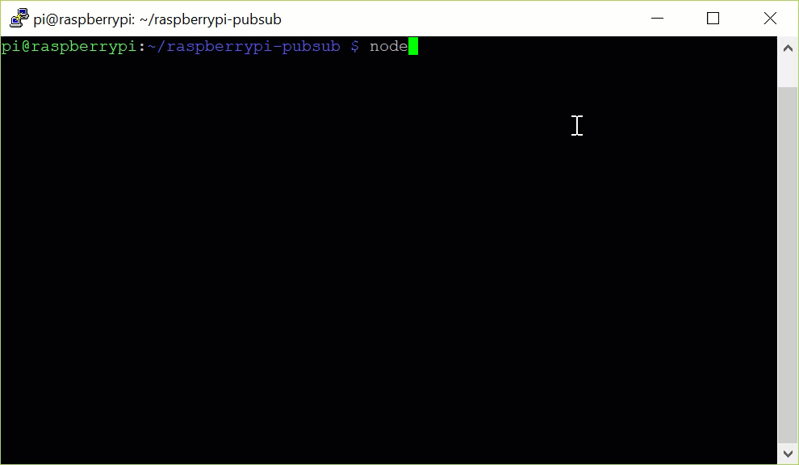

# Raspberry Piセンサーデータパブリッシャー
<!-- # Raspberry Pi sensor data publisher -->

**このアプリケーションは、Raspberry PiからDevnetタングルに毎分リアルタイムの温度データ（現在の摂氏温度）を送信します。その後、別のDevnetノードでイベントストリーム（ZMQ）を購読し、データを受信したときに知らせるメッセージを表示します。**
<!-- **This application sends real-time temperature data (the current temperature in Celsius) from a Raspberry Pi to the Devnet Tangle every minute. Then, it subscribes to the event stream (ZMQ) on another Devnet node and triggers a message to let you know when it receives the data.** -->

:::info:GitHubにアクセスする
クイックスタートの手順やソースコードを読むには、[GitHubリポジトリ](https://github.com/iota-community/raspberrypi-pubsub)にアクセスしてください。
:::
<!-- :::info:Go to GitHub -->
<!-- For quickstart instructions or to read the source code, [go to the GitHub repository](https://github.com/iota-community/raspberrypi-pubsub). -->
<!-- ::: -->

:::warning:
このアプリケーションは、まだベータ開発中の[IOTA JavaScriptクライアントライブラリ](root://client-libraries/0.1/introduction/overview.md)を使用します。本番環境ではこのコードを使用しないでください。
:::
<!-- :::warning: -->
<!-- This application uses the [IOTA JavaScript client library](root://client-libraries/0.1/introduction/overview.md), which is still in beta development. Do not use this code in production environments. -->
<!-- ::: -->

## なぜこのアプリケーションを使うのか？
<!-- ## Why use this application? -->

デバイスは、データを処理して行動できるようにデータを共有する必要があります。IOTAを使用すると、このデータをタングル上のトランザクションで送信することで、簡単に互いにデータを共有するデバイスを設定できます。
<!-- Devices often need to share data so they can process and act on it. With IOTA, you can set up your own devices to easily share this data with each other on the Tangle by sending it in a transaction. -->

このアプリケーションは、温度センサーのデータをタングルに送信する、すぐに使えるテンプレートです。
<!-- This application is a ready-to-use template that sends temperature sensor data to the Tangle. -->

## 使い方
<!-- ## How it works -->

`raspberrypi-pubsub`ディレクトリには、次のファイルがあります。
<!-- In the `raspberrypi-pubsub` directory, you have the following files: -->

* `index.js`： データを収集し、バンドルを作成して、トランザクションを送信します。
<!-- * `index.js`: Collects data, constructs the bundle, and sends the transaction. -->
* `temp.py`： [`envirophat`ライブラリ](https://learn.pimoroni.com/tutorial/sandyj/getting-started-with-enviro-phat)を使用してセンサーから現在の温度を読み取ります。
<!-- * `temp.py`: Uses the [`envirophat` library](https://learn.pimoroni.com/tutorial/sandyj/getting-started-with-enviro-phat) to read the current temperature from the sensor. -->
* `fetchTemp.js`： 現在の温度を取得するために`tempy.py`ファイルを実行します。
<!-- * `fetchTemp.js`: Executes the `tempy.py` file to get the current temperature. -->
* `zmqWatcher.js`： アドレスの確定を監視するために、Devnetノードの[ZMQ`address`イベント](root://iri/0.1/references/zmq-events.md#address)を購読します。
<!-- * `zmqWatcher.js`: Subscribes to a Devnet node's [ZMQ `address` event](root://iri/0.1/references/zmq-events.md#address) to monitor the address for confirmation. -->

`fetchTemp.js`ファイルと`zmqWatcher.js`ファイルはモジュールとしてエクスポートされ、`index.js`ファイルから呼び出されます。
<!-- The `fetchTemp.js` and `zmqWatcher.js` files are exported as modules and called from the `index.js` file. -->

## 前提条件
<!-- ## Prerequisites -->

このアプリケーションを使用するには、以下が必要です。
<!-- To use this application, you need the following: -->

* ラズベリーパイに接続された[Enviro Phatセンサーボード](https://shop.pimoroni.com/products/enviro-phat)
<!-- * [An Enviro Phat sensor board](https://shop.pimoroni.com/products/enviro-phat) connected to a Raspberry Pi -->

* [LTSバージョンまたは最新バージョンのNode.jsとNPM](https://nodejs.org/en/download/)
<!-- * [An LTS version or the latest version of Node.js and NPM](https://nodejs.org/en/download/) -->

* [Git](https://git-scm.com/download/linux)

ラズベリーパイの設定をするには、[これらの手順](https://medium.com/@lambtho/raspberry-setup-dcb23e8ba88)に従ってください。
<!-- For help setting up a Raspberry Pi, you can follow [these instructions](https://medium.com/@lambtho/raspberry-setup-dcb23e8ba88). -->

Enviro Phatの設定をするには、[このはんだ付けガイド](https://learn.pimoroni.com/tutorial/sandyj/soldering-phats)と[この入門ガイド](https://learn.pimoroni.com/tutorial/sandyj/getting-started-with-enviro-phat)に従ってください。
<!-- For help setting up the Enviro Phat, you can follow [this soldering guide](https://learn.pimoroni.com/tutorial/sandyj/soldering-phats) and [this getting started guide](https://learn.pimoroni.com/tutorial/sandyj/getting-started-with-enviro-phat). -->

## アプリケーションを実行する
<!-- ## Run the application -->

詳細を見始める前に、アプリケーションを実行して、データの送信をどれだけ早く開始できるかを確認します。
<!-- Before we start looking at the details, run the application so you can see how quickly you can start sending data. -->

1. `raspberrypi-pubsub`リポジトリをクローンします。
  <!-- 1. Clone this repository -->

  ```bash
  git clone https://github.com/iota-community/raspberrypi-pubsub
  ```

2. `raspberrypi-pubsub`ディレクトリに移動します。
  <!-- 2. Change into the `raspberrypi-pubsub` directory -->

  ```bash
  cd raspberrypi-pubsub
  ```

3. 依存関係をインストールします。
  <!-- 3. Install the dependencies -->

  ```bash
  npm install
  ```

4. コードを実行します。
  <!-- 4. Run the code -->

  ```bash
  node index.js
  ```

:::success:おめでとうございます！:tada:
コンソールでは、現在の摂氏気温がトランザクションとしてDevnet上のノードに送信されていることがわかります。

1分程度待つと、トランザクションが確定されたときにZMQイベントトリガーが表示されます。
:::
<!-- :::success:Congratulations! :tada: -->
<!-- In the console, you should see that the current temperature in Celcius is sent as a transaction to a node on the Devnet. -->
<!--  -->
<!-- If you wait for around a minute, you should see the ZMQ event trigger when the transaction is confirmed. -->
<!-- ::: -->



## データを確認する
<!-- ## Check your data -->

IOTAの最も重要な利点の1つは、タングルのトランザクションがイミュータブルであるということです。
<!-- One of the most important benefits of IOTA is that transactions on the Tangle are immutable (can't be changed). -->

トランザクションがDevnetタングル上にあることを確認したい場合は、`hash`フィールドの値をコピーして[Devnetエクスプローラ](https://devnet.thetangle.org/)の検索バーに貼り付けます。
<!-- If you want to check that your transaction is on the Devnet Tangle, you can copy the value of the `hash` field and paste it into the search bar of the [Devnet explorer](https://devnet.thetangle.org/). -->

このページでは、`message`フィールドを確認し、センサーがコンソールに返した値と比較することで、データが変更されていないことを確認できます。
<!-- On this page, you can check that your data is unchanged by checking the `message` field and comparing it to the value that your sensor returned in the console. -->


## 次のステップ
<!-- ## Next steps -->

このチュートリアルを読んだ後は、このアプリケーションを適応させて、必要なあらゆる種類のデバイスからあらゆる種類のデータを送信できるようになります。
<!-- After going through this tutorial, you know enough to adapt this application to send any kind of data from any kind of device that you want. -->

[データを暗号化し、MAM（マスク認証メッセージング）チャネルを介して送信します](../mam-watcher/overview.md)。
<!-- [Start encrypting your data and sending it through a MAM (masked authenticated messaging) channel](../mam-watcher/overview.md). -->

[IOTAクライアントライブラリを知り](root://client-libraries/0.1/introduction/overview.md)、他にできることを調べてみましょう。
<!-- [Get to know the IOTA client libraries](root://client-libraries/0.1/introduction/overview.md) and find out what else you can do. -->
