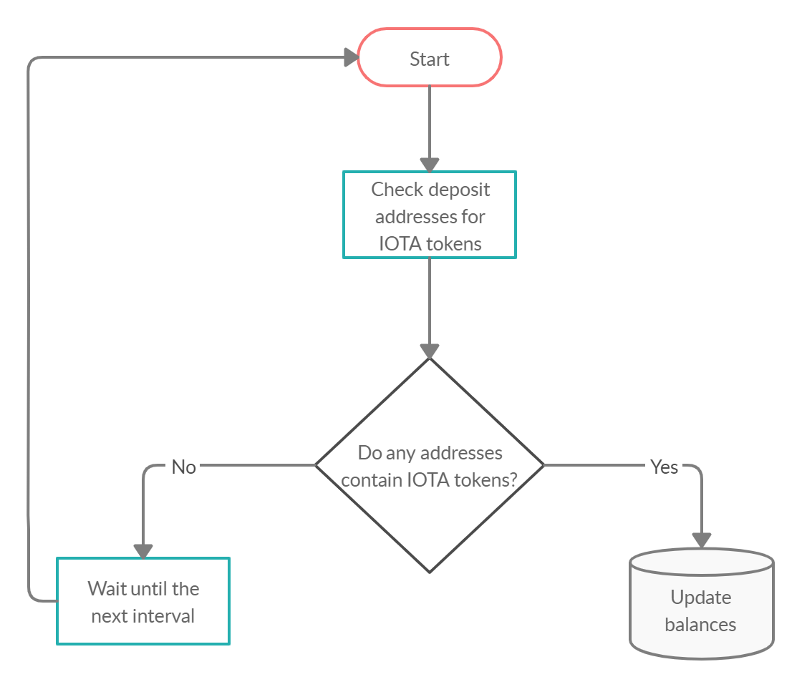
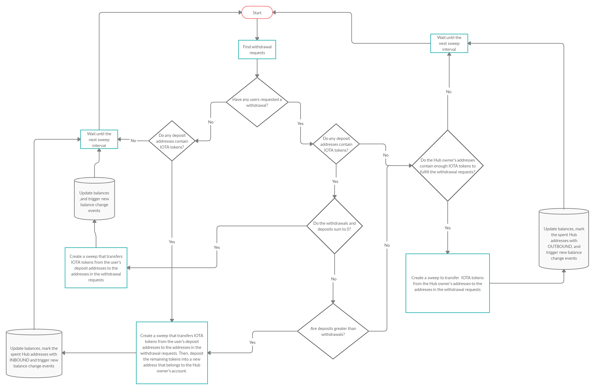
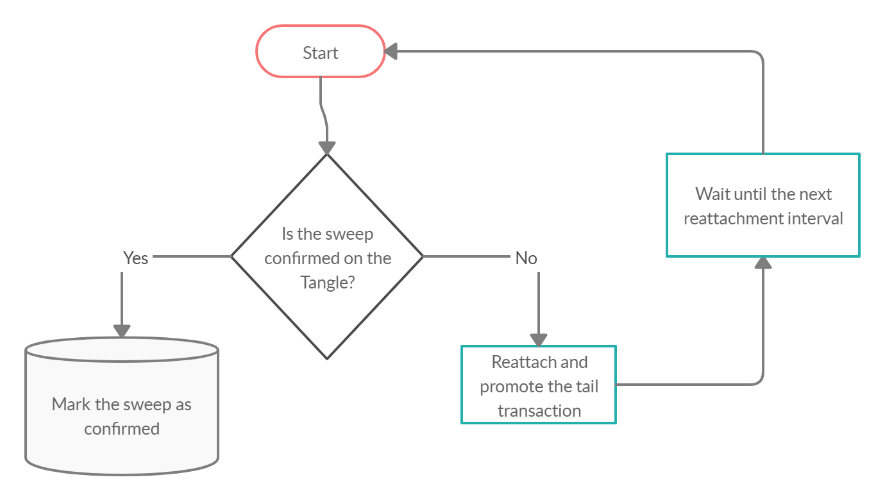

# スウィープ
<!-- # Sweeps -->

**スウィープは、ユーザーの取り出しと預け入れの残高の[バンドル](root://getting-started/0.1/transactions/bundles.md)です。ユーザーがIOTAトークンをアドレスに預け入れると、ハブはそれらのIOTAトークンを使用して取り出しリクエストを処理しようとします。**
<!-- **A sweep is a [bundle](root://getting-started/0.1/transactions/bundles.md) that balances users' withdrawals and deposits. When a user deposits IOTA tokens into an address, Hub tries to use those IOTA tokens to fulfill withdrawal requests.** -->

## スウィープの理由
<!-- ## The reason for sweeps -->

ハブは、定期的にユーザーの預け入れアドレスからハブ所有者のアドレスにIOTAトークンを転送することにより、ユーザーが[使用済みアドレス](root://getting-started/0.1/clients/addresses.md#spent-addresses)から取り出すリスクを減らします。
<!-- Hub reduces the risk of a user withdrawing from a [spent address](root://getting-started/0.1/clients/addresses.md#spent-addresses) by transferring IOTA tokens from users' deposit addresses to a Hub owner's address at regular intervals. -->

## スウィープの仕組み
<!-- ## How sweeps work -->

ハブは、残高がゼロではなく、ペンディング中のスウィープに含まれていないすべての預け入れアドレスを検索します。
<!-- Hub finds all deposit address that have a non-zero balance and that are not included in any pending sweeps. -->

次に、ハブはペンディング中の取り出しリクエストをチェックします。
<!-- Then, Hub checks for pending withdrawal requests. -->

この情報を使用して、ハブはすべての預け入れられたIOTAトークンを選択された取り出しアドレスに転送するスウィープを作成します。
<!-- Using this information, Hub creates a sweep that transfers any deposited IOTA tokens to the chosen withdrawal addresses. -->

取り出しリクエストのIOTAトークンの合計量が、預け入れられたIOTAトークンの合計量よりも少ない場合、ハブは出力[トランザクション](root://getting-started/0.1/transactions/transactions.md)を作成し、残りの残高を安全に保管するためにハブ所有者に属する新しいアドレスに預けます。
<!-- If the total amount of IOTA tokens in withdrawal requests is less than the total amount of deposited IOTA tokens, Hub creates an output [transaction](root://getting-started/0.1/transactions/transactions.md) to deposit the remaining balance into a new address that belongs to the Hub owner for safe keeping. -->

預け入れられたIOTAトークンの合計量が取り出しの合計量よりも少ない場合、ハブはハブ所有者のアドレスから十分なIOTAトークンを取り出し、残りの取り出し残高を満たす入力トランザクションを作成します。
<!-- If the total amount of deposited IOTA tokens is less than the total amount of withdrawals, Hub creates an input transaction to withdraw enough IOTA tokens from the Hub owner's addresses to fulfill the remaining withdrawal balance. -->

ハブがスウィープをノードに送信した後、ハブは確定のために末尾トランザクションを監視し、確定されるまで[再添付および促進](root://getting-started/0.1/transactions/reattach-rebroadcast-promote.md)を行います。
<!-- After Hub sends the sweep to a node, Hub monitors the tail transaction for confirmation and [reattaches and promotes](root://getting-started/0.1/transactions/reattach-rebroadcast-promote.md) it until it's confirmed. -->

