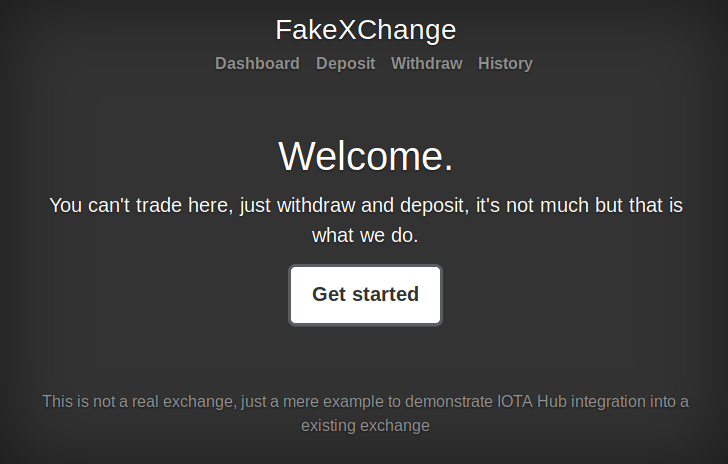
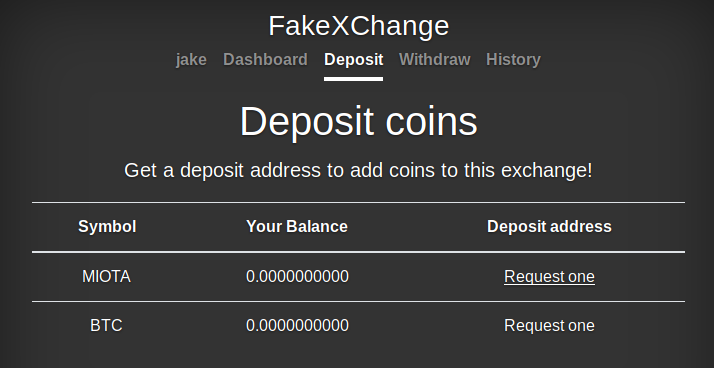
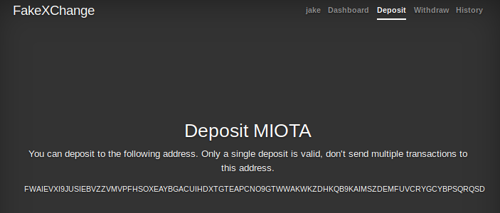
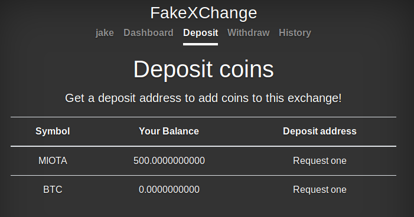
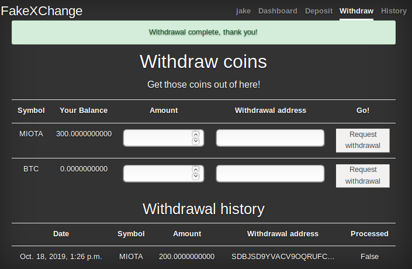

# デモ取引所を作成する
<!-- # Create a demo exchange -->

**ハブをアプリケーションに統合する方法を理解できるように、このガイドでは、偽の取引所のサーバー側でハブAPI呼び出しを行うプロセスを説明します。このガイドの最後には、IOTAトークンを預け入れてから取り出すことが可能なデモ取引所があります。**
<!-- **To help you understand how Hub can be integrated into an application, this guide walks you through the process of making Hub API calls on the server side of a fake exchange. At the end of this guide, you will have a demo exchange into which you can deposit IOTA tokens and then withdraw them.** -->

ハブはさまざまな方法でアプリケーションに統合できます。このガイドでは統合オプション2を使用します。これは、すべてのユーザーのIOTAトークンをハブの外側に保存する最も簡単な方法です。
<!-- You can integrate Hub into an application in many ways. This guide uses integration option 2, which is the easiest way to store all users' IOTA tokens outside of Hub. -->

ハブ統合オプションの詳細については、[統合ガイド](../how-to-guides/integrate-hub.md)を参照してください。
<!-- For details about Hub integration options, see [our integrations guide](../how-to-guides/integrate-hub.md). -->

[このガイドのソースコード](https://github.com/fijter/fakexchange)はGitHubで入手できます。`master`ブランチは、ハブと統合されていないブランチです。
<!-- The [source code for this guide](https://github.com/fijter/fakexchange) is available on GitHub. The `master` branch is the one without the Hub integration. -->

このガイドを補完するために、以下のビデオチュートリアルを作成しました。このチュートリアルでは、ハブのセットアッププロセスとデモ取引所について説明しています。
<!-- To complement this guide, we created this video tutorial, which guides you through the process of setting up Hub and the demo exchange. -->

<iframe width="560" height="315" src="https://www.youtube.com/embed/O2ukIXqJTls" frameborder="0" allow="accelerometer; autoplay; encrypted-media; gyroscope; picture-in-picture" allowfullscreen></iframe>

## 前提条件
<!-- ## Prerequisites -->

このガイドを完了するには、次のものが必要です。
<!-- To complete this guide, you need the following: -->

* Devnetノードに接続され、公開されたRESTful APIサーバーを持つハブのインスタンス
<!-- * An instance of Hub that's connected to a Devnet node and that has an exposed RESTful API server -->
* Linux [Ubuntu 18.04 LTS](https://www.ubuntu.com/download/server)サーバー。WindowsまたはMacオペレーティングシステムを使用している場合は、[仮想マシンでLinuxサーバーを作成](root://general/0.1/how-to-guides/set-up-virtual-machine.md)できます。
<!-- * A Linux [Ubuntu 18.04 LTS](https://www.ubuntu.com/download/server) server. If you are on a Windows or Mac operating system, you can [create a Linux server in a virtual machine](root://general/0.1/how-to-guides/set-up-virtual-machine.md). -->

## 手順1. 取引所サーバーをセットアップする
<!-- ## Step 1. Set up the exchange server -->

ハブをデモ取引所に統合する前に、デバイスでサーバーとして実行するようにデモ取引所を設定する必要があります。
<!-- Before you can start integrating Hub into the demo exchange, you need to set it up to run as a server on your device. -->

1. Python 3をインストールします。
  <!-- 1. Install Python 3 -->

    ```bash
    sudo apt-get install -y python3-all
    ```

2. LinuxディストリビューションにPython 2がプリインストールされている場合は、デフォルトでPython 3を使用していることを確認してください。
  <!-- 2. If your Linux distribution has Python 2 pre-installed, make sure that it uses Python 3 by default -->

    ```bash
    echo "alias python=python3" >> ~/.bashrc
    ```

3. `python-dev`パッケージをインストールします。
  <!-- 3. Install the `python-dev` package -->

    ```bash
    sudo apt-get install python-dev
    ```

4. GitHubからデモ取引所のコードをダウンロードします。
  <!-- 4. Download the demo exchange code from GitHub -->

    ```bash
    cd ~
    git clone https://github.com/fijter/fakexchange.git \
    cd fakexchange
    ```

5. グローバルPython環境に依存関係がインストールされないようにするには、仮想環境を作成します。
  <!-- 5. To avoid installing the dependencies in your global Python environment, create a virtual environment -->

    ```bash
    sudo apt-add-repository multiverse && sudo apt update
    sudo apt install -y python3-venv
    python3 -m venv env
    ```

6. シェルセッションで仮想環境をアクティブ化します。
  <!-- 6. Activate the virtual environment in a shell session -->

    ```bash
    . env/bin/activate
    ```

    :::info:
    仮想環境を終了するには、`deactivate`コマンドを使用します。
    :::
    <!-- :::info: -->
    <!-- To exit the virtual environment, use the `deactivate` command. -->
    <!-- ::: -->

7. 依存関係をインストールします。
  <!-- 7. Install the dependencies -->

    ```bash
    pip install -r requirements.txt
    ```

8. データベースを準備します。
  <!-- 8. Prepare the database -->

    ```bash
    python manage.py migrate
    ```

9. 為替レートデータを読み込みます。
  <!-- 9. Load the exchange rate data -->

    ```bash
    python manage.py loaddata coins
    ```

10. サーバーを実行します。
  <!-- 10. Run the server -->

    ```bash
    python manage.py runserver
    ```

サーバーが起動すると、次のようなものが表示されるはずです。
<!-- When the server starts, you should see something like the following: -->

```bash
Watching for file changes with StatReloader
Performing system checks...

System check identified no issues (0 silenced).
October 15, 2019 - 14:08:42
Django version 2.2.4, using settings 'exchange.settings'
Starting development server at http://127.0.0.1:8000/
Quit the server with CONTROL-C.
```

取引所サーバーが実行されているので、Webブラウザーに移動して`127.0.0.1:8000`にアクセスし、デモ取引所のユーザーインターフェイスを確認します。
<!-- Now that the exchange server is running, go to a web browser and visit 127.0.0.1:8000 to see the user interface for the demo exchange. -->



## 手順2. 取引所ユーザーアカウントを作成する
<!-- ## Step 2. Create an exchange user account -->

IOTAトークンの預け入れと取り出しを行う前に、取引所のユーザーアカウントが必要です。
<!-- Before you can deposit and withdraw IOTA tokens, you need a user account on the exchange. -->

1. 取引所サーバーがまだ実行されている場合は、**Ctrl** + **C**を押して取引所サーバーを停止します。
<!-- 1. If the exchange server is still running, press **Ctrl**+**C** to stop it -->

2. スーパーユーザーを作成し、プロンプトが表示されたら資格情報を入力します。
  <!-- 2. Create a super user and enter your credentials when prompted -->

    ```bash
    python manage.py createsuperuser
    ```

3. サーバーを起動します。
  <!-- 3. Start the server -->

    ```bash
    python manage.py runserver
    ```

4. `127.0.0.1:8000/admin`の管理ページに移動し、ログインするためのユーザー資格情報を入力します。
<!-- 4. Go to the admin page at 127.0.0.1:8000/admin and enter your user credentials to log in -->

5. **Deposit**をクリックします。
  <!-- 5. Click **Deposit** -->

    

    このページには、アカウントの残高が表示されます。
    <!-- This page shows the balance of your account. -->

6. MIOTA行で、**Request one**をクリックして、IOTAトークンを預け入れることができる新しいIOTA預け入れアドレスをリクエストします。
<!-- 6. In the MIOTA row, click **Request one** to request a new IOTA deposit address into which you can deposit tokens -->

この機能はまだ利用できないことがわかります。
<!-- You'll see that this feature isn't available yet. -->

## 手順3. 預け入れアドレスを統合する
<!-- ## Step 3. Integrate deposit addresses -->

現時点では、取引所ではIOTAトークンを預け入れまたは取り出すことはできません。この機能を追加するには、ハブRESTful APIエンドポイントを呼び出すことです。
<!-- At the moment, the exchange doesn't allow you to deposit or withdraw IOTA tokens. To add this functionality, you can make calls to the Hub RESTful API endpoints. -->

ユーザーがIOTAトークンを預け入れるたびに、[`GetDepositAddress`](../references/restful-api-reference.md#GetDepositAddress)エンドポイントを使用して新しい預け入れアドレスを作成することをお勧めします。
<!-- Each time users wants to deposit IOTA tokens, it's best practice to create a new deposit address for them with the [`GetDepositAddress`](../references/restful-api-reference.md#GetDepositAddress) endpoint. -->

1. `exchange`ディレクトリで、`iota.py`ファイルを作成します。
  <!-- 1. In the `exchange` directory, create an `iota.py` file -->

    ```bash
    cd exchange
    sudo nano iota.py
    ```

2. このファイルで、API呼び出しをハブに送信するためのテンプレートを作成します。`'http://127.0.0.1:8888'`URLを、ハブのセットアップ時に使用した`--listenAddress`フラグの値に置き換えます。これは、ハブがAPIリクエストをリッスンするURLです。
  <!-- 2. In this file, create a template for sending API calls to Hub. Replace the `'http://127.0.0.1:8888'` URL with value of the `--listenAddress` flag that you used when you set up Hub. This is the URL on which Hub listens for API requests. -->
  <!-- 2. In this file, create a template for sending API calls to Hub. Replace the `'http://127.0.0.1:8888'` URL with value of the `--listenAddress` flag that you used when you set up Hub. This is the URL on which Hub listens for API requests. -->

    ```py
    import requests
    import datetime

    class IOTA(object):

        def __init__(self):
            self.api_address = 'http://127.0.0.1:8888'

        def request(self, payload):
            headers = {'Content-Type': 'application/json', 'X-IOTA-API-Version': '1'}
            response = requests.post(self.api_address, json=payload, headers=headers)

            print(payload)

            if not response.ok:
                raise ValueError('Invalid response', '%s: %s' % (response.status_code, response))

            return response.json()
    ```

3. [`CreateUser`](../references/restful-api-reference.md#CreateUser)エンドポイントを呼び出して、新しいハブユーザーを作成する関数を作成します。
  <!-- 3. Create a function that creates a new Hub user by calling the [`CreateUser`](../references/restful-api-reference.md#CreateUser) endpoint -->

    ```py
    def create_user(self, user_id):
        ret = self.request({'command': 'CreateUser', 'userId': 'user-%s' % user_id})
        if 'error' in ret:
            return False
        else:
            return True
    ```

4. [`GetDepositAddress`](../references/restful-api-reference.md#GetDepositAddress)エンドポイントを呼び出して、指定されたハブユーザーの新しい預け入れアドレスを返す関数を作成します。
  <!-- 4. Create a function that returns a new deposit address for the given Hub user by calling the [`GetDepositAddress`](../references/restful-api-reference.md#GetDepositAddress) endpoint -->

    ```py
    def get_deposit_address(self, user_id):
        self.create_user(user_id)
        ret = self.request({'command': 'GetDepositAddress', 'userId': 'user-%s' % user_id})
        if 'address' in ret:
            return ret['address']

        return False
	```

    ハブユーザーが存在しない場合、この関数は新しいユーザーを作成します。それ以外の場合、ハブは重複したユーザーIDを持つユーザーを作成できないため、この呼び出しは試行および失敗します。
    <!-- If the Hub user doesn't exist, this function creates a new one. Otherwise, this call tries and fails because Hub can't create users with duplicate user IDs. -->

5. ファイルを保存します。
<!-- 5. Save the file -->

6. 対話型のシェルセッションを開きます。
  <!-- 6. Open an interactive shell session -->

    ```py
    python manage.py shell
    ```

7. `get_deposit_address()`関数を呼び出して、機能していることを確認します。
  <!-- 7. Call the `get_deposit_address()` function to make sure that it's working -->

    ```bash
    >>> from exchange.iota import IOTA
    >>> api = IOTA()
    >>> api.get_deposit_address('000')
    ```

    コンソールにIOTAアドレスが表示されるはずです。これはユーザーの預け入れアドレスです。
    <!-- You should see an IOTA address in the console. This is the user's deposit address. -->

    ```bash
    {'command': 'CreateUser', 'userId': 'user-000'}
    {'command': 'GetDepositAddress', 'userId': 'user-000'}
    'GACPCTSIYHK9XXNZUEHGAQEZUCDKJTSH9SMYYIIPYQZSERWZQDNIIUASYTCG9OQJENWSKIWLOELNOYWRC'
    >>>
    ```

    :::info:
    `Connection refused`エラーが表示された場合は、ハブが実行されていることと、ステップ2で正しいハブAPI URLを入力したことを確認してください。
    :::
    <!-- :::info: -->
    <!-- If you see a 'Connection refused' error, make sure that Hub is running and that you entered the correct Hub API URL in step 2. -->
    <!-- ::: -->

8. **Ctrl** + **D**を押してシェルセッションを終了し、`users`ディレクトリの`models.py`ファイルを開きます。
  <!-- 8. Exit the shell session by pressing **Ctrl**+**D**, and open the `models.py` file in the 'users' directory -->

    ```bash
    nano users/models.py
    ```

9. `deposit_address()`関数を見つけて、その内容を以下で置き換えます：
  <!-- 9. Find the `deposit_address()` function and replace its contents with the following: -->

    ```py
    '''
    Returns a new deposit address for our given symbol
    '''

    if symbol in ('IOTA', 'MIOTA'):
        from exchange.iota import IOTA
        api = IOTA()
        addr = api.get_deposit_address(self.id)
        if not addr:
            return 'Unable to generate'
        else:
            return addr

    if symbol == 'BTC':
        return '1CFBdvaiZgZPTZERqnezAtDQJuGHKoHSzg'
    ```

10. ファイルを保存して、サーバーを再度実行します。
  <!-- 10.  Save the file and run the server again -->

ユーザーインターフェイスで[**Deposit**] > [**Request**]をクリックすると、新しい預け入れアドレスが表示されます。
<!-- Now, when you click **Deposit** > **Request one** in the user interface, a new deposit address should appear. -->



IOTAトークンを取引所アカウントに預け入れるには、このアドレスにIOTAトークンを送信します。ただし、取引所は更新された残高をまだ認識しません。
<!-- To deposit IOTA tokens into your exchange account, you can send IOTA tokens to this address. But, the exchange will not recognize your updated balance yet. -->

## 手順4. 残高の変更についてユーザーアカウントを監視する
<!-- ## Step 4. Monitor user accounts for balance changes -->

現時点では、預け入れアドレスにIOTAトークンを送信しても、ユーザーの取引所アカウントの残高は更新されません。
<!-- At the moment, if you send IOTA tokens to the deposit address, the balance in the user's exchange account doesn't update. -->

この残高が最新であることを確認するために、[`BalanceSubscription`](../references/restful-api-reference.md#BalanceSubscription)エンドポイントで残高の変更についてハブユーザーアドレスを監視できます。
<!-- To make sure this balance is kept up to date, you can monitor Hub user addresses for balance changes with the [`BalanceSubscription`](../references/restful-api-reference.md#BalanceSubscription) endpoint -->

1. `exchange`ディレクトリで、`models.py`ファイルを開きます。
  <!-- 1. In the `exchange` directory, open the `models.py` file -->

    ```bash
    cd exchange
    nano models.py
    ```

2. `Coin`クラスの`price_in_usd`変数の下に、ユーザーの残高が最後に更新された時刻を含む新しい変数を追加します。
  <!-- 2. In the `Coin` class, under the `price_in_usd` variable, add a new variable to contain the last time the user balances were updated -->

    ```py
    last_hub_check = models.DateTimeField(null=True, blank=True)
    ```

3. ファイルを保存し、`iota.py`ファイルに、[`BalanceSubscription`](../references/restful-api-reference.md#BalanceSubscription)エンドポイントを呼び出して、残高の変更を購読する関数を作成します
  <!-- 3. Save the file, then in the `iota.py` file, create a function that subscribes to balance changes by calling the [`BalanceSubscription`](../references/restful-api-reference.md#BalanceSubscription) endpoint -->

    ```py
    def get_balance_changes(self, since=None):
        if since:
            since = since.strftime('%s000')
        else:
            since = 0

        ret = self.request({'command': 'BalanceSubscription', 'newerThan': since})
        return ret
    ```

4. さらに2つの関数を作成します。1つはアクティブユーザーを取得し、もう1つは残高を取得します。
  <!-- 4. Create two more functions: One to get active users and another to get their balances -->

    ```py
    def active_users(self, since=None):
        balance_changes = self.get_balance_changes(since=since)
        active_users = set()
        for event in balance_changes.values():
            u = event.get('userId')
            if u:
                active_users.add(u)
        return active_users

    def get_active_balances(self, since=None):
        users = self.active_users(since=since)
        ubalance = {}
        for user in users:
            ubalance[user] = self.check_balance(user.split('-', 1)[1])

        return ubalance
    ```

5. `exchange/management`ディレクトリで、`commands`という名前の新しいディレクトリを作成し、`commands`ディレクトリに移動します。
  <!-- 5. In the `exchange/management` directory, create a new directory called `commands` and change into it -->

    ```bash
    cd exchange/management
    mkdir commands
    cd commands
    ```

6. `check_changes.py`という新しいファイルを作成し、`check_changes.py`ファイルに以下を追加します。
  <!-- 6. Create a new file called `check_changes.py` and add the following to it: -->

    ```py
    from django.core.management.base import BaseCommand, CommandError
    from django.utils import timezone
    from exchange.iota import IOTA
    from exchange.models import Coin, WithdrawalsRequest
    from user.models import User

    class Command(BaseCommand):

        help = "Check if there's anything in Hub that needs to be processed"

        def handle(self, *args, **options):

            api = IOTA()
            coin = Coin.objects.by_symbol('MIOTA')
            since = coin.last_hub_check

            print(since)

            data = api.get_active_balances(since)

            if data:
                print(data)
                for user_id, balance in data.items():
                    user = User.objects.get(id=user_id.split('-')[1])
                    user.alter_balance('MIOTA', int(balance), modification_type='DEPOSIT')
                    print("Gave %d iota to user %s after deposit" % (int(balance), user_id))
            coin.last_hub_check = timezone.now()
            coin.save()
    ```

7. 新しい`last_hub_check`フィールドをデータベースにロードします。
  <!-- 7. Load the new `last_hub_check` field into the database -->

    ```bash
    python manage.py makemigrations
    python manage.py migrate
    ```

8. サーバーを起動し、新しい預け入れアドレスをリクエストします。
  <!-- 8. Start the server, and request a new deposit address -->

9. Devnetの蛇口を使用して[預け入れアドレスにテストIOTAトークンを送信](root://getting-started/0.1/tutorials/send-iota-tokens.md)します。
  <!-- 9. Use the Devnet faucet to [send some test IOTA tokens to your deposit address](root://getting-started/0.1/tutorials/send-iota-tokens.md) -->

    :::info:
    このガイドで、`receiveAddress`変数を預け入れアドレスに置き換えます。
    :::
    <!-- :::info: -->
    <!-- In the guide, replace the `receivingAddress` variable with your deposit address. -->
    <!-- ::: -->

10. トランザクション時間が確定されるまで5分間待ってから、`check_changes`コマンドを呼び出します。
  <!-- 10.  Wait for 5 minutes to give the transaction time to be confirmed, then call the `check_changes` command -->

    ```bash
    python manage.py check_changes
    ```

コンソールに、ユーザーの預け入れイベントが表示されるはずです。
<!-- In the console, you should see a deposit event for the user. -->

```bash
2019-10-18 09:34:35.587317+00:00
{'command': 'BalanceSubscription', 'newerThan': '1571391275000'}
{'command': 'CreateUser', 'userId': 'user-1'}
{'command': 'GetBalance', 'userId': 'user-1'}
{'user-1': '500'}
Gave 500 iota to user user-1 after deposit
```

サーバーを再度実行して**Deposit**に移動すると、更新された残高が表示されます。
<!-- If you run the server again and go to **Deposit**, you should see an updated balance. -->



この残高はハブから取得され、取引所データベースに保存されます。
<!-- This balance is taken from Hub and saved in the exchange database. -->

:::info:
ハブが定期的に変更を確認するために、毎分実行される cron ジョブでこのコマンドを呼び出すことができます。これにより、ユーザーの残高は常に自動的に最新の状態に保たれます。
:::
<!-- :::info: -->
<!-- To make sure that Hub regularly checks for changes, you can call this command in a cron job that runs every minute. This way user balances are always automatically kept up to date. -->
<!-- ::: -->

## 手順5. ホットウォレットとしてハブユーザーを作成する
<!-- ## Step 5. Create a Hub user as a hot wallet -->

デフォルトでは、ハブはユーザーの残高の記録を保持し、スウィープ中にIOTAトークンをハブ所有者のアカウントに転送します。
<!-- By default, Hub keeps a record of user balances and it transfers any tokens to the Hub owner's account during a sweep. -->

しかし、取引を行うために、取引所はしばしば自身のデータベースで残高を追跡する必要があり、セキュリティを強化するためにコールドウォレット（オフラインウォレット）にIOTAトークンを保存することがよくあります。
<!-- But, to action trades, exchanges often need to keep track of balances in their own database and they often want to store the tokens in a cold wallet (an offline wallet) for increased security. -->

これを行うには、通常のハブユーザーを作成し、残高変更イベントが発生したときにすべてのIOTAトークンをそのハブユーザーに転送します。
<!-- To do this, you can create a normal Hub user and transfer all IOTA tokens to that user when a balance change event occurs. -->

1. `iota.py`ファイルで、ハブデータベースを更新する関数を作成し、すべての預け入れが取引所所有者の`hot-wallet`ユーザーに追加されるようにします。
  <!-- 1. In the `iota.py` file, create a function to update the Hub database so that all incoming deposits are added to the exchange owner's `hot-wallet` user -->

    ```py
    def batch_to_exchange(self, batch):
        self.create_user('hot-wallet')
        newbatch = []
        to_exchange = 0

        for user_id, amount in batch.items():
            newbatch.append({'userId': user_id, 'amount': 0-int(amount)})
            to_exchange += int(amount)

        newbatch.append({'userId': 'user-hot-wallet', 'amount': to_exchange})

        ret = self.request({'command': 'ProcessTransferBatch', 'transfers': newbatch})

        if not 'error' in ret:
            return True
        else:
            print(ret['error'])
            return False
    ```

    この関数は、ハブデータベースを更新する[`ProcessTransferBatch`](../references/restful-api-reference.md#ProcessTransferBatch)エンドポイントを呼び出します。このようにして、`hot-wallet`ユーザーはすべてのユーザーのIOTAトークンにアクセスできるため、取引所は保管のためにハブからコールドウォレットにIOTAトークンを取り出すことができます。
    <!-- This function calls the [`ProcessTransferBatch`](../references/restful-api-reference.md#ProcessTransferBatch) endpoint, which updates the Hub database. This way, the `hot-wallet` user has access to all users' IOTA tokens, allowing the exchange to withdraw them from Hub into a cold wallet for storage. -->

    :::warning:警告！
    IOTAトークンをハブ外に転送する場合、取り出しリクエストを処理するのに十分な資金がないリスクがあります。
    :::
    <!-- :::warning:Warning -->
    <!-- When you transfer tokens outside of Hub, you're at risk of not having enough funds to be able to process withdrawal requests. -->
    <!-- ::: -->

2. ファイルを保存し、`check_changes.py`ファイルを開きます。
  <!-- 2. Save the file and open the `check_changes.py` file -->

    ```bash
    sudo nano exchange/management/commands/check_changes.py
    ```

3. `if data`ステートメントで、`batch_to_exchange()`関数を呼び出して、ユーザーの預け入れをホットウォレットに転送します。
  <!-- 3. In the `if data` statement, call the `batch_to_exchange()` function to transfer any user deposits to the hot wallet -->

    ```py
    if data and api.batch_to_exchange(data):
    ```

4. フィアルを保存します。
  <!-- 4. Save the file -->

これで、ユーザーが預け入れを行うたびに、取引所で残高が更新され、ハブデータベースでその残高が`hot-wallet`ユーザーに転送されます。
<!-- Now, whenever users makes a deposit, their balance will be updated on the exchange, and in the Hub database, that balance will be transferred to the `hot-wallet` user. -->

## 手順6. 取り出しを統合する
<!-- ## Step 6. Integrate withdrawals -->

アカウントからIOTAトークンを取り出すには、ユーザーはハブからの取り出すをリクエストする必要があります。
<!-- To withdraw IOTA tokens from their accounts, users need to request a withdrawal from Hub. -->

1. `iota.py`ファイルで、`UserWithdraw`エンドポイントでIOTAトークンを取り出す関数を作成します。
  <!-- 1. In the `iota.py` file, create a function to withdraw IOTA tokens with the `UserWithdraw` endpoint -->

    ```py
    def withdraw(self, user_id, amount, address, validate_checksum=True, tag='FAKEXCHANGE'):
        self.create_user(user_id)
        ret = self.request({
            'command': 'UserWithdraw',
            'userId': 'user-%s' % user_id,
            'amount': amount,
            'payoutAddress': address,
            'validateChecksum': validate_checksum,
            'tag': tag
        })

        if 'uuid' in ret:
            return ret['uuid']
        else:
            return False
    ```

2. ファイルを保存し、`check_changes.py`ファイルを開きます。
  <!-- 2. Save the file and open the `check_changes.py` file -->

    ```bash
    sudo nano exchange/management/commands/check_changes.py
    ```

3. 以下を追加します。
  <!-- 3. Add the following: -->

    ```py
    for wr in WithdrawalRequest.objects.filter(processed=False, coin=coin):
            status = api.withdraw('hot-wallet', int(wr.amount), wr.address, validate_checksum=True, tag='FAKEXCHANGE')

            if not status:
                print("Failed to withdraw")
                wr.failed = True
                wr.save()
            else:
                wr.processed = True
                wr.processed_at = timezone.now()
                wr.comment = status
                wr.save()
    ```

    このコードは、ユーザーの取り出しリクエストを繰り返し処理し、ホットユーザーアカウントからアクションを実行します。
    <!-- This code iterates through any user withdrawal requests and actions them from the hot user account. -->

これで、別の預け入れアドレスをリクエストして、その預け入れアドレスへIOTAトークンを送信した場合、**Withdraw **に移動してフィールドに入力することで、それらのIOTAトークンを取り出すことができます。
<!-- Now, if you request another deposit address and send IOTA tokens to it, you can withdraw those token by going to **Withdraw** and completing the fields. -->



## 次のステップ
<!-- ## Next steps -->

このガイドでは、統合オプション2を使用してIOTAをデモ取引所に統合する方法を示しました。
<!-- This guide has shown you how to integrate IOTA into a demo exchange using integration option 2. -->

さらに機能を追加することにより、このデモ統合を改善し続けることができます。
<!-- You can continue to improve this demo integration by adding more functionality. -->
