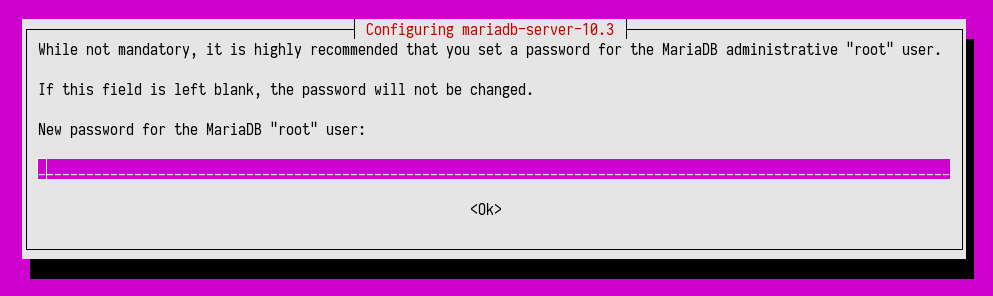

# ハブを実行する
<!-- # Run Hub -->

**ハブを実行することにより、アプリケーションがユーザーのアカウントを管理するために使用できるAPIを公開します。このガイドでは、ハブのインスタンスをインストールして実行します。**
<!-- **By running Hub, you expose an API that your application can use to manage users' accounts. In this guide, you install and run an instance of Hub.** -->

ハブを実行するには、2つのオプションがあります。
<!-- You have two options for running Hub: -->

- Dockerコンテナでハブを実行する
<!-- - Run Hub in a Docker container -->
- Linux Ubuntuサーバーでハブをビルドして実行する
<!-- - Build and run Hub on a Linux Ubuntu server -->

## Dockerコンテナでハブを実行する
<!-- ## Run Hub in a Docker container -->

このガイドでは、Hub Dockerイメージをダウンロードし、Dockerコンテナで実行します。
<!-- In this guide, you download the Hub Docker image and run it in a Docker container. -->

### 前提条件
<!-- ### Prerequisites -->

このガイドを完了するには、次のものが必要です。
<!-- To complete this guide, you need the following: -->

- [Git](https://git-scm.com/downloads)
- [Docker](https://docs.docker.com/install/#supported-platforms)

:::info:
Debianベースのオペレーティングシステムを使用している場合は、次のタスクのすべてのコマンドの前に`sudo`を追加します。
:::
<!-- :::info: -->
<!-- If you're using a Debian-based operating system, add `sudo` before all the commands in the following tasks. -->
<!-- ::: -->

### 手順1. データベースサーバーを実行する
<!-- ### Step 1. Run the database server -->

デフォルトでは、Hubは[MariaDB 10.2.1+](https://mariadb.com/)を使用します。これは、テーブルに追加できるデータを制限するCHECK制約をサポートしているためです。
<!-- By default, Hub uses [MariaDB 10.2.1+](https://mariadb.com/) because it supports CHECK constraints, which restrict the data you can add to the tables. -->

DockerでMariaDBを使用する最も簡単な方法は、MariaDBイメージを選択し、コンテナを作成することです。
<!-- The easiest way to use MariaDB on Docker is choosing a MariaDB image and creating a container. -->

1. ハブとデータベースサーバーのDockerネットワークを作成します。
  <!-- 1. Create a Docker network for Hub and the database server -->

    ```bash
    docker network create hub
    ```

2. MariaDB Dockerイメージをダウンロードし、コンテナで実行します。
  <!-- 2. Download the MariaDB Docker image and run it in a container -->

    ```bash
    docker run \
    -d \
    --name mariadb \
    --rm \
    --hostname mariadb.local \
    --net=hub \
    -e MYSQL_ROOT_PASSWORD=myrootpassword \
    -e MYSQL_USER=hubuser \
    -e MYSQL_PASSWORD=hubpassword \
    -e MYSQL_DATABASE=hubdb \
    -v ~/db-conf:/conf \
    -v ~/db-data:/var/lib/mysql \
    mariadb/server:10.3
    ```

    :::info:
    詳細については、[MariaDBのインストールとDockerの使用](https://mariadb.com/kb/en/library/installing-and-using-mariadb-via-docker/)を参照してください。
    :::
    <!-- :::info: -->
    <!-- For more details, see [Installing and using MariaDB with Docker](https://mariadb.com/kb/en/library/installing-and-using-mariadb-via-docker/). -->
    <!-- ::: -->

### 手順2. データベーステーブルを作成する
<!-- ### Step 2. Create the database tables -->

ハブのインストール後、ハブのデータを保存するデータベーステーブルを作成できます。
<!-- After Hub is installed, you can create the database tables that store Hub's data. -->

:::info:
これらのコマンドで、`myrootpassword`プレースホルダーをMariaDBコンテナの起動時に選択したパスワードに置き換えてください。
:::
<!-- :::info: -->
<!-- In these commands, make sure to replace the `myrootpassword` placeholder with the password you chose when you started the MariaDB container. -->
<!-- ::: -->

1. ハブのGitHubリポジトリをクローンします。
  <!-- 1. Clone the Hub GitHub repository -->

    ```bash
    git clone https://github.com/iotaledger/hub.git
    ```

2. Copy the `schema.sql` and `triggers.mariadb.sql` files from the `hub/schema` directory to the `db-conf` directory

3. Open a shell session inside the MariaDB Docker container

	```bash
	docker exec -it mariadb /bin/bash
	```

4. Load the database schema into the database

	```bash
	mysql -h127.0.0.1 -uroot -pmyrootpassword hubdb < conf/schema.sql
	```

5. Import the database triggers

	```bash
	mysql -h127.0.0.1 -uroot -pmyrootpassword hubdb < conf/triggers.mariadb.sql
	```

### Step 3. Run Hub

To run Hub, you download and run the Hub Docker image and connect it to MariaDB.

1\. [Plan your Hub configuration](../how-to-guides/configure-hub.md)

2\. Download the Hub Docker image and run it with the [command line options](../references/command-line-options.md) that you want to use

These are some example configurations.

--------------------
### gRPC API

This command connects to a local Mainnet node on port 14265, and exposes the gRPC API server on port 50051 of the local host.

```bash
docker run \
-d \
--rm \
--name hub \
--net hub \
--hostname hub.local \
-p 50051:50051 \
--expose 50051 \
iotacafe/hub:9ccb094 \
--salt REPLACEWITHYOURSAFESALT \
--apiAddress 127.0.0.1:14265  \
--db hubdb \
--dbHost mariadb \
--dbPort 3306 \
--dbUser hubuser \
--dbPassword hubpassword \
--minWeightMagnitude 14 \
--listenAddress 0.0.0.0:50051 \
```
---

### RESTful API

This command connects to a local Mainnet node on port 14265, and exposes the RESTful API server on port 50051 of the localhost.

```shell
docker run \
-d \
--rm \
--name hub \
--net hub \
--hostname hub.local \
-p 50051:50051 \
--expose 50051 \
iotacafe/hub:9ccb094 \
--salt REPLACEWITHYOURSAFESALT \
--apiAddress 127.0.0.1:14265  \
--db hubdb \
--dbHost mariadb \
--dbPort 3306 \
--dbUser hubuser \
--dbPassword hubpassword \
--minWeightMagnitude 14 \
--listenAddress 0.0.0.0:50051 \
--serverType http
```
---

### HTTPS Devnet node

For testing purposes, you may want to connect to a remote [Devnet](root://getting-started/0.1/network/iota-networks.md#devnet) node. Most remote nodes use an HTTPS connection, so this command has the [`--useHttpsIRI` flag](../references/command-line-options.md#useHttpsIRI) set to `true`.

```shell
docker run \
-d \
--rm \
--name hub \
--net hub \
--hostname hub.local \
-p 50051:50051 \
--expose 50051 \
iotacafe/hub:9ccb094 \
--salt REPLACEWITHYOURSAFESALT \
--apiAddress nodes.devnet.iota.org:443  \
--db hubdb \
--dbHost mariadb \
--dbPort 3306 \
--dbUser hubuser \
--dbPassword hubpassword \
--listenAddress 0.0.0.0:50051 \
--useHttpsIRI true
```
--------------------

:::warning:Warning
Replace the value of the `salt` flag with a string of at least 20 characters. This value is used by Hub to create seeds, so keep it secret.
:::

3\. Check that Hub and MariaDB are running

```bash
docker ps
```

You should see something like the following in the output:

```
CONTAINER ID        IMAGE                  COMMAND                  CREATED             STATUS              PORTS                      NAMES
0a7fe9d77bfb        iotacafe/hub:9ccb094   "/app/hub/hub --salt…"   18 minutes ago      Up 18 minutes       0.0.0.0:50051->50051/tcp   hub
cdd1be234729        mariadb/server:10.3    "docker-entrypoint.s…"   25 minutes ago      Up 25 minutes       3306/tcp                   mariadb
```

When the **STATUS** column shows a status of **Up**, the containers are running and listening on the port specified in the **PORTS** column.

:::success:Congratulations :tada:
Hub is running in the background! Now, you can use its API to start creating user accounts.
:::

## Install and run Hub on a Linux Ubuntu server

In this guide, you install Hub on Ubuntu 18.04 and manage it in a supervisor process.

### Prerequisites

To complete this guide, you need an [Ubuntu 18.04 LTS](https://www.ubuntu.com/download/server) server. If you are on a Windows or Mac operating system, you can [create a Linux server in a virtual machine](root://general/0.1/how-to-guides/set-up-virtual-machine.md).

### Step 1. Install the dependencies

To build and run Hub, you need to install a compiler, Python, and Git.

1. ローカルの`apt`リポジトリが最新であることを確認します。
  <!-- 1. Make sure that your local `apt` repository is up to date -->

    ```bash
    sudo apt update
    sudo apt upgrade
    ```

2. GCC、Clang、または[@iota_toolchains](https://github.com/iotaledger/toolchains)のツールチェーンなどのコンパイラをインストールします。
  <!-- 2. Install a compiler, such as GCC, Clang, or a toolchain from [@iota_toolchains](https://github.com/iotaledger/toolchains) -->

    ```bash
    sudo apt install -y gcc-7
    ```

3. Bazelバイナリインストーラ用の依存関係をインストールします。
  <!-- 3. Install the dependencies for the Bazel binary installer -->

    ```bash
    sudo apt install -y pkg-config zip g++ zlib1g-dev unzip python
    ```

4. [最新バージョンのBazel](https://github.com/bazelbuild/bazel/releases)用のバイナリインストーラをダウンロードします。
  <!-- 4. Download the binary installer for the [latest version of Bazel](https://github.com/bazelbuild/bazel/releases) -->

    ```bash
    wget https://github.com/bazelbuild/bazel/releases/download/0.18.0/bazel-0.18.0-installer-linux-x86_64.sh
    ```
    ダウンロードにはしばらく時間がかかります。
    <!-- The download may take some time. -->

    すべてうまくいけば、標準出力に次のように表示されます。
    <!-- If everything went well, you should see the following in the output: -->

    ```bash
    HTTP request sent, awaiting response ... 200 OK
    ```

5. スクリプトを実行する権限を自分に与えます。
  <!-- 5. Give yourself permission to execute the script -->

    ```bash
    chmod +x bazel-0.29.1-installer-linux-x86_64.sh
    ```

6. Bazelをインストールします。
  <!-- 6. Install Bazel -->

    ```bash
    ./bazel-0.29.1-installer-linux-x86_64.sh --user
    ```

    `--user`フラグは、Bazelをシステムの`$HOME/bin`ディレクトリにインストールします。
    <!-- The `--user` flag installs Bazel in the `$HOME/bin` directory on your system. -->

7. `$HOME/bin`ディレクトリを`$PATH`変数に追加します。
  <!-- 7. Add the `$HOME/bin` directory to your `$PATH` variable -->

    ```BASH
    PATH="$PATH:$HOME/bin"
    ```

8. Python用の`pyparsing`パッケージをインストールします。
  <!-- 8. Install the `pyparsing` package for Python -->

    ```bash
    sudo apt install -y python-pyparsing
    ```

9. Gitをインストールします。
  <!-- 9. Install Git -->

    ```bash
    sudo apt install -y git
    ```

### 手順2. データベースサーバーをインストールする
<!-- ### Step 2. Install the database server -->

デフォルトでは、Hubは[MariaDB 10.2.1+](https://mariadb.com/)を使用します。これは、テーブルに追加できるデータを制限するCHECK制約をサポートしているためです。
<!-- By default, Hub uses [MariaDB 10.2.1+](https://mariadb.com/) because it supports CHECK constraints, which restrict the data you can add to the tables. -->

Ubuntu 18.04 LTS用のデフォルトリポジトリはデータベースに使用できるパッケージを提供していません。代わりに、公式のMariaDBリポジトリ用にカスタムのPersonal Package Archive（PPA）をインストールすることができます。
<!-- The default repositories for Ubuntu 18.04 LTS don't provide a package that can be used for the database. Instead, you can install a custom Personal Package Archive (PPA) for the official MariaDB repository. -->

1. PPAをダウンロードするためにGNU Privacy Guard（GPG）キーをリクエストします。
  <!-- 1. Request a GNU Privacy Guard (GPG) key to download the PPA -->

    ```bash
    sudo apt-key adv --recv-keys --keyserver hkp://keyserver.ubuntu.com:80 0xF1656F24C74CD1D8
    ```

2. MariaDBリポジトリを追加します。
  <!-- 2. Add the MariaDB repository -->

    ```bash
    sudo add-apt-repository 'deb [arch=amd64,arm64,ppc64el] http://ftp.utexas.edu/mariadb/repo/10.3/ubuntu bionic main'
    ```

3. ローカルの`apt`リポジトリが最新であることを確認します。
  <!-- 3. Make sure that your local `apt` repository is up to date -->

    ```bash
    sudo apt update
    ```

4. MariaDBサーバをインストールします。
  <!-- 4. Install the MariaDB server -->

    ```bash
    sudo apt install mariadb-server
    ```

    インストール中に、MariaDBのrootパスワードを入力するように求められます。安全なパスワードを入力してください。後で必要になります。
    <!-- During the installation, you'll be prompted to enter a root password for MariaDB. Enter a secure password and remember it. You will need it later on. -->

    

5. MySQLがインストールされていることを確認します。
  <!-- 5. Make sure that MySQL is installed -->

    ```bash
    mysql --version
    ```

出力は次のようになります。
<!-- The output should display something like the following: -->

```shell
mysql  Ver 15.1 Distrib 10.3.10-MariaDB, for debian-linux-gnu (x86_64) using readline 5.2
```

これで、MariaDB 10.3.10がインストールされていることがわかります。これは、最小の10.2.1より新しいバージョンです。
<!-- Here, you can see that MariaDB 10.3.10 is installed, which is a later version than the minimum of 10.2.1. -->

### 手順3. ハブをビルドする
<!-- ### Step 3. Build Hub -->

これらすべての依存関係をセットアップしたら、Hubをインストールしてビルドできます。
<!-- After setting up all these dependencies, you can install and build Hub. -->

1. GitHubリポジトリをクローンします。
  <!-- 1. Clone the GitHub repository -->

    ```bash
    git clone https://github.com/iotaledger/hub.git
    ```

2. `hub`ディレクトリに移動します。
  <!-- 2. Change into the `hub` directory -->

    ```bash
    cd hub
    ```

3. ソースコードからHubをビルドします。
  <!-- 3. Build Hub from the source code -->

    ```bash
    bazel build -c opt //hub:hub
    ```

    ハードウェアまたは仮想マシンの設定によっては、このプロセスに時間がかかる場合があります。
    <!-- This process can take a while, depending on your hardware or your virtual machine settings. -->

    ビルドが完了すると、次のような出力が表示されます。
    <!-- After the build is complete, the output should display something like the following: -->

    ```shell
    Target //hub:hub up-to-date:
        bazel-bin/hub/hub
    INFO: Elapsed time: 1531.342s, Critical Path: 208.27s
    INFO: 1377 processes: 1377 linux-sandbox.
    INFO: Build completed successfully, 1811 total actions
    ```

### 手順4. データベースを作成する
<!-- ### Step 4. Create the database -->

ハブのインストール後、ハブのデータを保存するデータベーステーブルを作成できます。
<!-- After Hub is installed, you can create the database tables that store Hub's data. -->

:::info:
これらのコマンドで、`myrootpassword`プレースホルダーをMariaDBデータベースのインストール時に選択したパスワードに置き換えてください。
:::
<!-- :::info: -->
<!-- In these commands, make sure to replace the `myrootpassword` placeholder with the password you chose when you installed the MariaDB database. -->
<!-- ::: -->

1. `hub`と言う名のデータベースを作成します。
  <!-- 1. Create a database called hub -->

    ```bash
    echo "CREATE DATABASE hub" | mysql -uroot -pmyrootpassword
    ```

2. ハブのソースコードからデータベースにデータベーススキーマをロードします。
  <!-- 2. Load the database schema from the Hub source code into the database -->

    ```bash
    mysql -h127.0.0.1 -uroot -pmyrootpassword hub < schema/schema.sql
    ```

3. データベーストリガをインポートします。
  <!-- 3. Import the database triggers -->

    ```bash
    mysql -h127.0.0.1 -uroot -pmyrootpassword hub < schema/triggers.mariadb.sql
    ```

### 手順5. ハブを実行する
<!-- ### Step 5. Run Hub -->

ハブを実行するには、ビルドプロセス中に作成されたバイナリファイルを実行します。
<!-- To run Hub, you execute the binary file that was created during the build process. -->

1\. [ハブ構成を計画します](../how-to-guides/configure-hub.md)。
<!-- 1\. [Plan your Hub configuration](../how-to-guides/configure-hub.md) -->

2\. `start.sh`というシェルスクリプトファイルを作成します。
  <!-- 2\. Create a shell script file called `start.sh` -->

```bash
nano start.sh
```

3\. `start.sh`ファイルに、使用する[コマンドラインオプション](../references/command-line-options.md)を付けてハブを実行するためのコマンドを追加します。
  <!-- 3\. In the start.sh file, add the command for running hub with the [command line options](../references/command-line-options.md) that you want to use -->

:::info:
コンソールでログを表示するには、Googleログライブラリを使用します。たとえば、次のコマンドを使用できます：`GLOG_logtostderr=1 GLOG_v=7`。
:::
<!-- :::info: -->
<!-- To see the logs in the console, use the Google logging library. For example, you could use the following command: `GLOG_logtostderr=1 GLOG_v=7`. -->
<!-- ::: -->

これらはいくつかの設定例です。
<!-- These are some example configurations. -->

--------------------
### gRPC API

このコマンドは、ポート14265でローカルMainnetノードに接続し、localhostのポート50051でgRPC APIサーバーを公開します。

```shell
#!/bin/bash

./bazel-bin/hub/hub \
	--salt CHANGETHISTOSOMETHINGMORESECURE \
	--db hub \
	--dbUser root \
	--dbPassword myrootpassword \
	--apiAddress 127.0.0.1:14265 \
	--minWeightMagnitude 14 \
	--listenAddress 127.0.0.1:50051
```
---

### RESTful API

このコマンドは、ポート14265でローカルMainnetノードに接続し、ローカルホストのポート50051でRESTful APIサーバーを公開します。

```shell
#!/bin/bash

./bazel-bin/hub/hub \
	--salt CHANGETHISTOSOMETHINGMORESECURE \
	--db hub \
	--dbUser root \
	--dbPassword myrootpassword \
	--apiAddress 127.0.0.1:14265 \
	--minWeightMagnitude 14 \
	--listenAddress 127.0.0.1:50051
	--serverType http
```
---

### HTTPSのDevnetノード

テストの目的で、リモート[Devnet](root://getting-started/0.1/network/iota-networks.md#devnet)ノードに接続することができます。ほとんどのリモートノードはHTTPS接続を使用するため、このコマンドの[`--useHttpsIRI`フラグ](../references/command-line-options.md#useHttpsIRI)は`true`に設定されています。

```shell
#!/bin/bash

./bazel-bin/hub/hub \
	--salt CHANGETHISTOSOMETHINGMORESECURE \
	--db hub \
	--dbUser root \
	--dbPassword myrootpassword \
	--apiAddress nodes.devnet.iota.org:443 \
	--listenAddress 127.0.0.1:50051 \
	--useHttpsIRI true
```
--------------------

:::warning:警告！
`salt`フラグの値を少なくとも20文字の文字列で置き換えます。この値は、ハブがシードを作成するために使用するため、秘密にしてください。
:::
<!-- :::warning:Warning -->
<!-- Replace the value of the `salt` flag with a string of at least 20 characters. This value is used by Hub to create seeds, so keep it secret. -->
<!-- ::: -->

4\. スクリプトを実行する許可を自分に与えます。
<!-- 4\. Give yourself permission to execute the script -->

```bash
chmod a+x start.sh
```

5\. シェルスクリプトを実行してハブを起動します。
<!-- 5\. Run the shell script to start Hub -->

```bash
./start.sh
```

シェルセッションでハブを実行しています。このセッションを閉じると、ハブは停止します。ハブをバックグラウンドで実行し続けるには、screen/tmuxセッション、システム全体のサービス、または監視プロセスを使用できます。
<!-- You're running Hub in your shell session. If you close this session, Hub will stop. To keep Hub running in the background, you can use a screen/tmux session, a system-wide service, or a supervised process. -->

このガイドでは、スーパーバイザープロセスを使用して、ハブが常に実行され、再起動またはクラッシュ後に自動的に再起動するようにします。
<!-- In this guide, you use a supervisor process to make sure that Hub always runs and automatically restarts after a reboot or a crash. -->

6\. `supervisor`パッケージをインストールします（`CTRL+C`を押して現在のシェルセッションを終了します）。
  <!-- 6\. Install the `supervisor` package (press `CTRL+C` to exit the current shell session): -->

```bash
sudo apt install -y supervisor
```

7\. スーパーバイザープロセス用の設定ファイルを作成します。
  <!-- 7\. Create a configuration file for the supervised process -->

```bash
sudo nano /etc/supervisor/conf.d/hub.conf
```

8\. `hub.conf`ファイルに次の行を追加します。`user`フィールドの値をユーザー名に置き換え、`command`、`directory`、`stderr_logfile`、`stdout_logfile`フィールドのパスがユーザーに対して正しいことを確認します。
<!-- 8\. Add the following lines to the `hub.conf` file. Replace the value of the `user` field with your username, and make sure that the paths in the `command`, `directory`, `stderr_logfile`, and `stdout_logfile` fields are correct for your user. -->

```shell
[program:hub]
command=/home/dave/hub/start.sh
directory=/home/dave/hub/
user=dave
autostart=true
autorestart=true
stderr_logfile=/home/dave/hub/err.log
stdout_logfile=/home/dave/hub/info.log
```

9\. hub.confファイルを保存してスーパーバイザーをリロードします。
  <!-- 9\. Save the hub.conf file and reload supervisor -->

```bash
sudo supervisorctl reload
```

ハブはバックグラウンドで実行され、サーバの再起動後またはクラッシュ後に自動的に再起動します。
<!-- Hub should now be running in the background and should automatically start again after a server reboot or a crash. -->

10\. スーパーバイザーステータスを確認します。
  <!-- 10\. Check the supervisor status -->

```bash
sudo supervisorctl status
```

出力には、次のようなものが表示されるはずです。
<!-- The output should display something like the following: -->

```shell
hub RUNNING pid 9983, uptime 0:01:22
```

:::success:成功です！
ハブはバックグラウンドで実行されています！これで、そのAPIを使用してユーザーアカウントの作成を開始できます。
:::
<!-- :::success:Congratulations :tada: -->
<!-- Hub is running in the background! Now, you can use its API to start creating user accounts. -->
<!-- ::: -->

## 次のステップ
<!-- ## Next steps -->

ハブの起動方法に応じて、gRPC APIサーバーまたはRESTful APIサーバーのいずれかを公開して、ユーザーと対話できるようにします。
<!-- Depending on how you started Hub, it exposes either a gRPC API server or a RESTful API server for you to interact with: -->

- [gRPC API入門](../how-to-guides/get-started-with-the-grpc-api.md)
<!-- - [Get started with the gRPC API](../how-to-guides/get-started-with-the-grpc-api.md) -->
- [RESTful API入門](../how-to-guides/get-started-with-the-grpc-api.md)
<!-- - [Get started with the RESTful API](../how-to-guides/get-started-with-the-grpc-api.md) -->

[APIを保護する](../how-to-guides/secure-hub-api.md)ために、SSLプロトコルを使用できます。
<!-- To [secure the API](../how-to-guides/secure-hub-api.md), you can use the SSL protocol. -->

ハブのセキュリティを向上させるには、ハブを[署名サーバー](../how-to-guides/install-the-signing-server.md)に接続する。
<!-- To improve the security of Hub, connect it to a [signing server](../how-to-guides/install-the-signing-server.md). -->

[Hubサーバーが安全であることを確認してください](https://hostadvice.com/how-to/how-to-harden-your-ubuntu-18-04-server/)。
<!-- [Make sure that your Hub server is secure](https://hostadvice.com/how-to/how-to-harden-your-ubuntu-18-04-server/). -->
