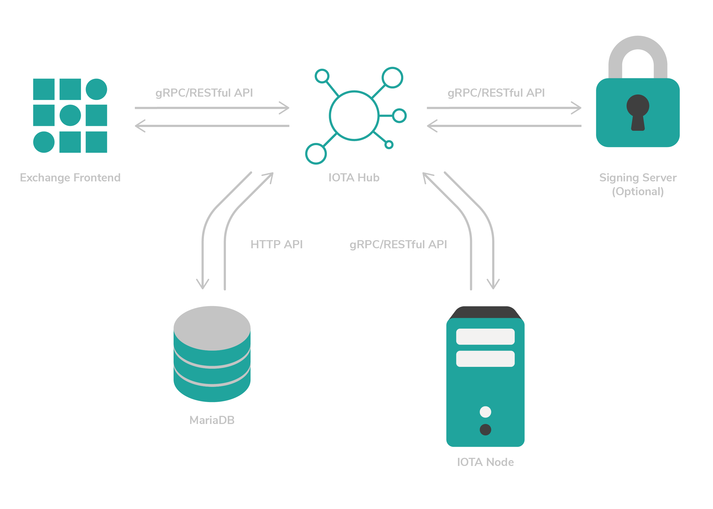

# 署名サーバをインストールする
<!-- # Install the signing server -->

**ハブのセキュリティを向上させるために、バンドル署名操作とソルト（シードの作成に使用）をハブだけが接続できる署名サーバに移動できます。このガイドでは、SSL暗号化接続を介してハブに接続する署名サーバをインストールして実行します。**
<!-- **To improve the security of Hub, you can move the bundle signing operation and the salt (used to create seeds) to a signing server that only Hub can connect to. In this guide, you'll install and run a signing server that connects to Hub over an SSL encrypted connection.** -->

このガイドでは、[Ubuntu 18.04 LTS](https://www.ubuntu.com/download/server)の新規インストールが必要です。
<!-- For this guide, you'll need a new installation of [Ubuntu 18.04 LTS](https://www.ubuntu.com/download/server). -->



ハブを使い始めるには、以下のタスクを順番に実行してください。
<!-- To get started with Hub, complete the following tasks in order. -->

## 依存関係をインストールする
<!-- ## Install the dependencies -->

署名サーバは依存関係を使用してソースからコンパイルする必要があります。
<!-- The signing server needs to be compiled from source using the dependencies. -->

1. ローカルの`apt`リポジトリが最新でマルチバースリポジトリを含んでいることを確認します。
  <!-- 1. Make sure that the local apt repository is up to date and contains the multiverse repository -->

    ```bash
    sudo apt update \
    sudo apt upgrade
    ```

2. GCC、Clang、または[@iota_toolchains](https://github.com/iotaledger/toolchains)のツールチェーンなどのコンパイラをインストールします。
  <!-- 2. Install a compiler, such as GCC, Clang, or a toolchain from [@iota_toolchains](https://github.com/iotaledger/toolchains) -->

    ```bash
    sudo apt install -y gcc-7
    ```

3. Bazelバイナリインストーラ用の依存関係をインストールします。
  <!-- 3. Install the dependencies for the Bazel binary installer -->

    ```bash
    sudo apt install -y pkg-config zip g++ zlib1g-dev unzip python
    ```

4. [最新バージョンのBazel](https://github.com/bazelbuild/bazel/releases)用のバイナリインストーラをダウンロードします。
  <!-- 4. Download the binary installer for the [latest version of Bazel](https://github.com/bazelbuild/bazel/releases) -->

    ```bash
    wget https://github.com/bazelbuild/bazel/releases/download/0.18.0/bazel-0.18.0-installer-linux-x86_64.sh
    ```

5. インストーラスクリプトを実行できることを確認します。
  <!-- 5. Make sure that you can execute the installer script -->

    ```bash
    chmod +x bazel-0.18.0-installer-linux-x86_64.sh
    ```

6. アクティブなユーザーの下に`--user`フラグを使用してBazelをインストールします。
  <!-- 6. Install Bazel under your active user using the `--user` flag: -->

    ```bash
    ./bazel-0.18.0-installer-linux-x86_64.sh --user
    ```

7. Python用の`pyparsing`パッケージをインストールします。
  <!-- 7. Install the `pyparsing` package for Python -->

    ```bash
    sudo apt install -y python-pyparsing
    ```

8. Gitをインストールします。
  <!-- 8. Install Git -->

    ```bash
    sudo apt install -y git
    ```

## 署名サーバをビルドする
<!-- ## Build the signing server -->

1. GitHubリポジトリをクローンします。
  <!-- 1. Clone the GitHub repository -->

    ```bash
    git clone https://github.com/iotaledger/rpchub.git
    ```

2. rpchubディレクトリに移動します。
  <!-- 2. Change into the `rpchub` directory -->

    ```bash
    cd rpchub
    ```

3. ソースコードから署名サーバをビルドします。
  <!-- 3. Build Hub from the source code: -->

    ```bash
    bazel build -c opt //signing_server
    ```

ハードウェアまたは仮想マシンによっては、このプロセスにはしばらく時間がかかります。
<!-- This process can take a while, depending on the hardware or virtual machine. -->

ビルドが完了すると、標準出力に次のように表示されます。
<!-- After the build is complete, the output should display something like the following: -->

```shell
Target //signing_server:signing_server up-to-date:
    bazel-bin/signing_server/signing_server
INFO: Elapsed time: 1250.848s, Critical Path: 19.29s
INFO: 1283 processes: 1283 linux-sandbox.
INFO: Build completed successfully, 1412 total actions
```

## 自己署名SSL証明書を生成する
<!-- ## Generate self-signed SSL certificates -->

SSL証明書は、ハブと署名サーバ間の安全な通信に使用されます。ハブリポジトリには証明書を生成するためのスクリプトがいくつか含まれています。
<!-- SSL certificates are used for secure communication between your Hub and the signing server. The Hub repository includes some scripts to generate the certificates. -->

1. generate_ca.shファイルを開きます。
  <!-- 1. Open the generate_ca.sh file -->

    ```bash
    nano docs/ssl/01_generate_ca.sh
    ```

    CA証明書の有効期間は365日に設定されています。すぐ期限切れにならないように、9999日にアップグレードしましょう。
    <!-- The validity for the CA certificate is set to 365 days. Let's upgrade that to 9999 days so it won't expire anytime soon: -->

2. 証明書の有効期限を長くするには、`-days 365`を`-days 9999`に置き換え、ファイルを保存します。
  <!-- 2. To increase the expiry date of the certificate, replace `-days 365` with `-days 9999`. Save the file -->

3. 署名サーバのホスト名を確認します。この例では、ホスト名は`signer`です。シェルで`hostname`コマンドを実行して、自分のホスト名が何であるかを確認します。
  <!-- 3. Check the hostname for the signing server. In the example the hostname is `signer`. You can check what your hostname is by executing the `hostname` command in your shell. -->

4. generate_server.shファイルを開きます。
  <!-- 4. Open the generate-server file -->

    ```bash
    nano docs/ssl/02_generate_server.sh
    ```

5. `-days 365`を`-days 9999`に置き換えます。
  <!-- 5. Replace `-days 365` with `-days 9999` -->

6. `CN=localhost`部分に署名サーバのホスト名が含まれるように`-subj`パラメーターを変更し（例えば、`CN=signer`）、ファイルを保存します。
  <!-- 6. Change the `-subj` parameter so that the `CN=localhost` part contains the hostname of the signing server, for example `CN=signer`. Save the file. -->

    `openssl req`コマンドは次のような出力をするはずです。
    <!-- The `openssl req` command should output something like the following: -->

    ```bash
    openssl req -passin pass:1234 -new -key server.key -out server.csr -subj "/C=DE/ST=Berlin/L=Berlin/O=HUB/OU=Server/CN=signer"
    ```

7. generate_client.shファイルを開きます。
  <!-- 7. Open the generate_client file -->

    ```bash
    nano docs/ssl/03_generate_client.sh
    ```

8. `-days 365`を`-days 9999`に置き換えます。
  <!-- 8. Replace `-days 365` with `-days 9999` -->

9. `CN=localhost`の部分に署名サーバのホスト名が含まれるように`-subj`パラメーターを変更し（例えば、`CN=signer`）、ファイルを保存します。
  <!-- 9. Change the `-subj` parameter so that the `CN=localhost` part contains the hostname of the signing server, for example `CN=signer`. Save the file. -->

10. 3つすべてのスクリプトを実行します。
  <!-- 10. Execute all three scripts -->

    ```bash
    ./docs/ssl/01_generate_ca.sh
    ./docs/ssl/02_generate_server.sh
    ./docs/ssl/03_generate_client.sh
    ```

これでSSLサーバとクライアントの証明書を使用する準備が整いました！
<!-- You should now have some SSL server and client certificates ready to use! -->

## 署名サーバを実行する
<!-- ## Run the signing server -->

署名サーバを実行するには、ビルドプロセス中に作成されたバイナリファイルを実行する必要があります。このバイナリファイルは`./bazel-bin/signing_server/signing_server`ディレクトリにあります。
<!-- To run the signing server, you need to execute the binary file that was created during the build process. This binary file is located in the `./bazel-bin/signing_server/signing_server` directory. -->

バイナリファイルを実行する前に、バイナリファイルを設定する必要があります。
<!-- Before you can run the binary file, you need to configure it. -->

1. start.shというシェルスクリプトを作成します。
  <!-- 1. Create a shell script called start.sh -->

    ```bash
    nano start.sh
    ```

2. start.shファイルに、署名サーバを実行するためのコマンドを、使用したい[コマンドラインフラグ](../references/command-line-flags.md)とともに追加します。
  <!-- 2. In the start.sh file, add the command for running the signing server with any [command line flags](../references/command-line-flags.md) that you want to use: -->

    ```shell
    #!/bin/bash

    ./bazel-bin/signing_server/signing_server \
    --salt CHANGETHIS \
    --authMode ssl \
    --sslKey docs/ssl/server.key \
    --sslCert docs/ssl/server.crt \
    --sslCA docs/ssl/ca.crt \
    --listenAddress 0.0.0.0:50051
    ```

    :::warning:警告
    [ハブ設定](../how-to-guides/install-hub.md#run-hub)で使用したものと同じソルトを使用してください。
    :::
    <!-- :::warning:Warning -->
    <!-- Use the same salt as the one you used in the [Hub configuration](../how-to-guides/install-hub.md#run-hub). -->
    <!-- ::: -->

3. start.shファイルを実行可能にします。
  <!-- 3. Make the start.sh file executable -->

    ```bash
    chmod a+x start.sh
    ```

4. 署名サーバを起動します。
  <!-- 4. Start the signing server -->

    ```bash
    ./start.sh
    ```

    :::success:おめでとうございます:tada:
    これで、署名サーバがコンピューター上で稼働しています！ハブがスウィープを作成するたびに、ハブは署名サーバがバンドルに署名して署名を返すように依頼します。
    :::
    <!-- :::success:Congratulations:tada: -->
    <!-- The signing server is now running on your computer! -->
    <!-- Whenever Hub creates a sweep, it will ask the signing server to sign the bundle and return the signature. -->
    <!-- ::: -->

    シェルセッションで署名サーバを実行しています。このセッションを閉じると、署名サーバは停止します。したがって、署名サーバをscreen/tmuxセッション、system-wideサービス、またはスーパーバイザープロセスで実行することを検討する必要があります。
    <!-- You're running the signing server in your shell session. If you close this session, the server will stop. Therefore, you might want to consider running the signing server in a screen/tmux session, a system-wide service, or a supervised process. -->

    このチュートリアルでは、スーパーバイザーを使用して、署名サーバが常に実行され、再起動またはクラッシュ後に自動的に再起動するようにします。
    <!-- For this tutorial, you'll use supervisor to make sure the signing server always runs and automatically restarts after a reboot or a crash. -->

5. スーパーバイザーをインストールします（`CTRL+C`を押して現在のシェルセッションを終了します）。
  <!-- 5. Install supervisor (press `CTRL+C` to exit the current shell session): -->

    ```bash
    sudo apt install -y supervisor
    ```

6. スーパーバイザー用の設定ファイルを作成します。
  <!-- 6. Create a configuration file for supervisor -->

    ```bash
    sudo nano /etc/supervisor/conf.d/signing.conf
    ```

7. signing.confファイルに次の行を追加します。`user`フィールドの値を変更して、`command`、`directory`、`stderr_logfile`、および`stdout_logfile`フィールドのパスが正しいことを確認します。
  <!-- 7. Add the following lines to the signing.conf file. Change the value of the `user` field, and make sure that the paths in the `command`, `directory`, `stderr_logfile`, and `stdout_logfile` field are correct. -->

    ```shell
    [program:hub]
    command=/home/dave/rpchub/start.sh
    directory=/home/dave/rpchub/
    user=dave
    autostart=true
    autorestart=true
    stderr_logfile=/home/dave/rpchub/err.log
    stdout_logfile=/home/dave/rpchub/info.log
    ```

8. signing.confファイルを保存してスーパーバイザーをリロードします。
  <!-- 8. Save the signing.conf file and reload supervisor -->

    ```bash
    sudo supervisorctl reload
    ```

    これで署名サーバはバックグラウンドで実行され、サーバの再起動後またはクラッシュ後に自動的に再起動するはずです。
    <!-- The signing server should now be running in the background and should automatically start again after a server reboot or a crash. -->

9. スーパーバイザーの状況を確認します。
  <!-- 9. Check the supervisor status -->

    ```bash
    sudo supervisorctl status
    ```

出力は次のようになります。
<!-- The output should display something like this: -->

```shell
signing RUNNING pid 11740, uptime 0:00:02
```

次に、ハブを署名サーバに接続する必要があります。
<!-- Now, you need to connect Hub to the signing server. -->

### ハブを署名サーバに接続する
<!-- ### Connect Hub to the signing server -->

ハブサーバに生成されたSSL証明書をインポートし、SSL証明書を使用するようにstart.shスクリプトを編集する必要があります。
<!-- In the Hub server, you need to import the generated SSL certificates and edit the start.sh script to use them. -->

1. 証明書ファイル（client.crt、client.key、およびca.crt）をハブサーバにコピーします。この例では、`scp`コマンドを使用してSSH経由で送信します。192.168.2.212をハブサーバのURLまたはIPアドレスに変更します。`/home/dave/rpchub/`ディレクトリをハブがインストールされているパスに変更します。
  <!-- 1. Copy the certificate files ( client.crt, client.key, and ca.crt) to the hub server. You can do this in any way you prefer. For this example, send them over SSH, using the `scp` command. Change 192.168.2.212 to the URL or IP address of your Hub server. Change the `/home/dave/rpchub/` directory to the path where your Hub is installed. -->

    ```bash
    scp client.crt client.key ca.crt 192.168.2.212:/home/dave/rpchub/
    ```

    出力は次のようになります。
    <!-- The output should display something like the following: -->

    ```shell
    client.crt      100% 1887     1.6MB/s   00:00
    client.key      100% 3243     3.0MB/s   00:00
    ca.crt          100% 2029     1.9MB/s   00:00
    ```

2. 新しいファイルを作成します。
  <!-- 2. Create a new file -->

    ```bash
    sudo nano /etc/hosts
    ```

3. このファイルで、署名サーバのホスト名を署名サーバのIPアドレスにマップします。192.168.2.210を署名サーバのIPアドレスに変更します。`signer`を署名サーバのホスト名に変更します。
  <!-- 3. In this file, map the hostname of the signing server to its IP address. Change 192.168.2.210 to the IP address of your signing server. Change `signer` to the hostname of your signing server. -->

    ```shell
    192.168.2.210   signer
    ```

4. `start.sh`ファイルを開きます。
  <!-- 4. Open the  `start.sh` file -->

    ```bash
    nano start.sh
    ```

5. `--salt`パラメーターを削除します。署名サーバが持っているので、`--salt`パラメーターはもう必要ありません。署名サーバ（`signer:50051`）と使用するSSL証明書も参照する必要があります。
  <!-- 5. Remove the `--salt` parameter. This parameter is not needed here anymore because the signing server has it. You should also reference the signing server (`signer:50051`) and the SSL certificates to use. -->

    ```shell
    #!/bin/bash

    ./bazel-bin/hub/hub \
    --db hub \
    --dbUser root \
    --dbPassword myrootpassword \
    --apiAddress 127.0.0.1:14265 \
    --minWeightMagnitude 14 \
    --listenAddress 127.0.0.1:50051 \
    --signingMode remote \
    --signingProviderAddress signer:50051 \
    --signingServerChainCert client.crt \
    --signingServerKeyCert client.key \
    --signingServerSslCert ca.crt
    ```

6. start.shファイルを保存してハブを再起動します。
  <!-- 6. Save the start.sh file and restart Hub -->

    ```bash
    sudo supervisorctl restart hub
    ```

:::success:成功
すべてうまくいけば、ハブは署名サーバに接続されます。ソルトはハブと同じサーバにはもう存在しません！
:::
<!-- :::success:Success -->
<!-- If everything went well, Hub will be connected to your signing server. The salt is no longer on the same server as your Hub! -->
<!-- ::: -->

## 次のステップ
<!-- ## Next steps -->

署名サーバにファイアウォールホワイトリストがあることを確認します。公開する外部サービスが少ないほど、署名サーバの脆弱性は少なくなります。
<!-- Make sure that your signing server has a firewall whitelist. The fewer external services you expose, the less vulnerable the signing server is. -->
